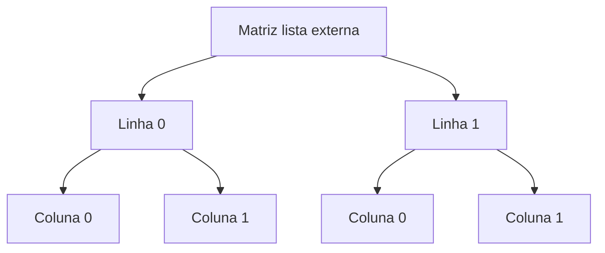

## Visão Geral do Conceito

A sétima aula avança de listas simples para listas aninhadas, usadas para representar matrizes. Depois introduz tuplas, destacando imutabilidade, empacotamento, desempacotamento, concatenação, repetição, presença, count e index.

> **Ideia central:** listas aninhadas representam dimensões; tuplas representam grupos ordenados que não devem mudar.

**Não coberto no material:** a aula menciona produto de matrizes como exercício, mas não desenvolve o algoritmo completo.

## Modelo Mental

Uma matriz é uma tabela: primeiro selecione a linha, depois a coluna. Uma tupla é um pacote fixo de valores.



## Mecânica Central

```python
matriz = [
    [3, 2],
    [6, 1],
]
print(matriz[0][0])
print(matriz[1][1])
```

O primeiro índice acessa linha; o segundo, coluna. Para imprimir por linhas, a aula usa laços aninhados e o parâmetro <mark style="background-color: #242424; padding: 2px 4px; border-radius: 3px; color: inherit;">`end`</mark> do <mark style="background-color: #242424; padding: 2px 4px; border-radius: 3px; color: inherit;">`print()`</mark>.

```python
for linha in matriz:
    for valor in linha:
        print(valor, end=" ")
    print()
```

Tuplas podem ser criadas com vírgula, mesmo sem parênteses.

## Uso Prático

```python
metricas = [
    ("api", 120, 3),
    ("etl", 90, 8),
    ("dashboard", 200, 1),
]

for nome, acessos, erros in metricas:
    status = "critico" if erros > 5 else "ok"
    print(f"{nome}: {acessos} acessos, {erros} erros, status={status}")
```

## Erros Comuns

- Trocar linha por coluna ao acessar <mark style="background-color: #242424; padding: 2px 4px; border-radius: 3px; color: inherit;">`matriz[i][j]`</mark>.
- Tentar alterar uma tupla, o que gera <mark style="background-color: #242424; padding: 2px 4px; border-radius: 3px; color: inherit;">`TypeError`</mark>.
- Criar tupla sem perceber por causa de uma vírgula, como <mark style="background-color: #242424; padding: 2px 4px; border-radius: 3px; color: inherit;">`valor = 10,`</mark>.

## Visão Geral de Debugging

1. Imprima <mark style="background-color: #242424; padding: 2px 4px; border-radius: 3px; color: inherit;">`len(matriz)`</mark> para linhas.
2. Imprima <mark style="background-color: #242424; padding: 2px 4px; border-radius: 3px; color: inherit;">`len(matriz[0])`</mark> para colunas da primeira linha.
3. Use <mark style="background-color: #242424; padding: 2px 4px; border-radius: 3px; color: inherit;">`type(valor)`</mark> para confirmar se uma vírgula criou tupla.
4. Se precisa alterar valores, use lista; se precisa preservar, use tupla.

## Principais Pontos

- Matrizes podem ser listas de listas.
- O primeiro índice é linha; o segundo é coluna.
- Laços aninhados percorrem dimensões aninhadas.
- Tuplas são ordenadas e imutáveis.
- Vírgulas podem empacotar valores em tuplas.
- Tuplas aceitam concatenação, repetição, count e index.

## Preparação para Prática

Pratique criar matrizes pequenas, percorrer linhas e colunas, imprimir em formato tabular e desempacotar tuplas de métricas.

## Laboratório de Prática

### Easy — Acessar célula da matriz

Acesse um valor usando linha e coluna.

```python
matriz = [
    [3, 2],
    [6, 1],
]

# TODO: acessar segunda linha e primeira coluna
valor = None
print(valor)
```

Critérios:

- usar dois índices

- lembrar índice zero


### Medium — Imprimir matriz por linhas

Mostre uma matriz em formato tabular.

```python
matriz = [
    [1, 2, 3],
    [4, 5, 6],
]

for linha in matriz:
    for valor in linha:
        # TODO: imprimir sem quebrar linha por coluna
        pass
    # TODO: quebrar linha ao final da linha
```

Critérios:

- usar laços aninhados

- usar print com end


### Hard — Classificar métricas com tupla e ternário

Desempacote tuplas e classifique status.

```python
metricas = [
    ("api", 120, 3),
    ("etl", 90, 8),
    ("dashboard", 200, 1),
]

for nome, acessos, erros in metricas:
    # TODO: status = "critico" se erros > 5, senao "ok"
    status = ""
    print(f"{nome}: {acessos} acessos, {erros} erros, status={status}")
```

Critérios:

- desempacotar tuplas

- usar expressão condicional

- imprimir relatório


<!-- CONCEPT_EXTRACTION
concepts:
  - listas aninhadas
  - matrizes
  - linhas e colunas
  - laços aninhados
  - range
  - len
  - print end
  - tuplas
  - imutabilidade
  - empacotamento
  - desempacotamento
  - operador ternário
skills:
  - Representar matrizes como listas de listas
  - Percorrer linhas e colunas
  - Acessar elementos por dois índices
  - Usar tuplas para valores fixos
  - Desempacotar tuplas em variáveis
examples:
  - matriz-2x2-listas-aninhadas
  - impressao-matriz-print-end
  - tupla-coordenada-desempacotamento
-->

<!-- EXERCISES_JSON
[
  {
    "id": "matrizes-acessar-celula-da-matriz",
    "slug": "matrizes-acessar-celula-da-matriz",
    "difficulty": "easy",
    "title": "Acessar célula da matriz",
    "discipline": "python-processamento-dados",
    "editorLanguage": "python",
    "tags": [
      "python",
      "matrizes",
      "tuplas"
    ],
    "summary": "Acesse um valor usando linha e coluna."
  },
  {
    "id": "matrizes-imprimir-matriz-por-linhas",
    "slug": "matrizes-imprimir-matriz-por-linhas",
    "difficulty": "medium",
    "title": "Imprimir matriz por linhas",
    "discipline": "python-processamento-dados",
    "editorLanguage": "python",
    "tags": [
      "python",
      "matrizes",
      "tuplas"
    ],
    "summary": "Mostre uma matriz em formato tabular."
  },
  {
    "id": "matrizes-classificar-metricas-com-tupla-e-ternario",
    "slug": "matrizes-classificar-metricas-com-tupla-e-ternario",
    "difficulty": "hard",
    "title": "Classificar métricas com tupla e ternário",
    "discipline": "python-processamento-dados",
    "editorLanguage": "python",
    "tags": [
      "python",
      "matrizes",
      "tuplas"
    ],
    "summary": "Desempacote tuplas e classifique status."
  }
]
-->

<!-- LESSON_METADATA
suggested_lesson_entry:
  discipline: python-processamento-dados
  slug: matrizes-listas-aninhadas-tuplas-imutaveis
  title: "Matrizes com listas aninhadas e tuplas imutáveis"
  order: 7
  file: python-processamento-dados/aula-07-matrizes-listas-aninhadas-tuplas-imutaveis.md
-->

<!-- SOURCE_CONTEXT
source_transcript_vtt: downloads/Python_para_Processamento_de_Dados/Aula_07_-_04052026.vtt
source_transcript_vtt_sha256: 2c6542857200eb38f79e3fcdecd8840a6c770dc825b8960356f447c9c3872614
source_transcript_wrapper: downloads/Python_para_Processamento_de_Dados/Aula_07_-_04052026.md
source_transcript_wrapper_sha256: 8df49f4077ace754540ebeddc004ca310a434d90bdb22dcc31d79c1db04f9546
notes:
  - O wrapper Markdown contém apenas metadados; o VTT foi usado como fonte primária.
  - Contexto auxiliar limitado ao wrapper claramente correspondente à mesma sessão.
-->
