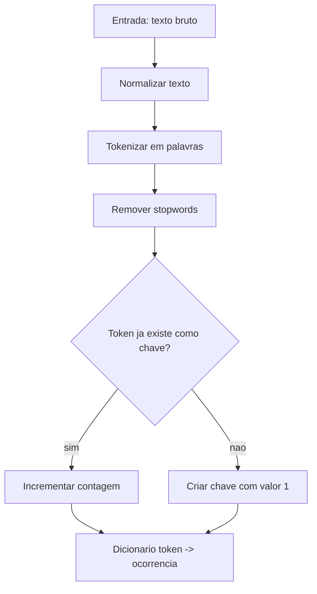

## Visão Geral do Conceito

Dicionários em Python são coleções de pares **chave-valor**. Eles resolvem um problema comum em processamento de dados: representar informação não apenas por posição, mas por significado.

Em uma lista, o primeiro elemento está no índice <mark style="background-color: #242424; padding: 2px 4px; border-radius: 3px; color: inherit;">`0`</mark>, o segundo no índice <mark style="background-color: #242424; padding: 2px 4px; border-radius: 3px; color: inherit;">`1`</mark> e assim por diante. Isso funciona para sequências, mas fica frágil quando cada valor tem um papel específico. Em um dicionário, você acessa o dado por uma chave como <mark style="background-color: #242424; padding: 2px 4px; border-radius: 3px; color: inherit;">`"nome"`</mark>, <mark style="background-color: #242424; padding: 2px 4px; border-radius: 3px; color: inherit;">`"idade"`</mark> ou <mark style="background-color: #242424; padding: 2px 4px; border-radius: 3px; color: inherit;">`"token"`</mark>.

> **Ideia central:** dicionários transformam posição em significado: em vez de perguntar "qual é o elemento 2?", você pergunta "qual é o valor associado a esta chave?".

Na aula, o conceito aparece em dois níveis:

- representação de registros simples, como uma pessoa com nome, profissão e idade;
- processamento de texto, usando tokens como chaves e quantidades como valores.

**Não coberto no material:** a aula não aprofundou estruturas como <mark style="background-color: #242424; padding: 2px 4px; border-radius: 3px; color: inherit;">`collections.Counter`</mark>, serialização com <mark style="background-color: #242424; padding: 2px 4px; border-radius: 3px; color: inherit;">`json`</mark> ou complexidade interna de tabelas hash. A lição mantém o foco no que foi trabalhado: criação, acesso, atualização, iteração e contagem manual com dicionários.

## Modelo Mental

Pense em um dicionário como uma tabela de consulta de duas colunas:

| Chave | Valor |
|------|-------|
| `"nome"` | `"Gesiel Lopes"` |
| `"profissao"` | `"Professor"` |
| `"idade"` | `46` |

A chave é o identificador. O valor é o conteúdo associado.

Essa diferença muda a forma de pensar:

- em uma lista, você depende da ordem: <mark style="background-color: #242424; padding: 2px 4px; border-radius: 3px; color: inherit;">`pessoa[0]`</mark>;
- em um dicionário, você depende do nome da informação: <mark style="background-color: #242424; padding: 2px 4px; border-radius: 3px; color: inherit;">`pessoa["nome"]`</mark>.

Para processamento de dados, esse modelo é especialmente útil porque muitos problemas são naturalmente pares chave-valor:

- coluna -> lista de valores;
- token -> quantidade de ocorrências;
- código de produto -> dados do produto;
- identificador de usuário -> métricas do usuário;
- campo de formulário -> valor digitado.



O diagrama resume a aplicação principal da aula: usar o dicionário como acumulador de frequências.

## Mecânica Central

### Criando dicionários

A sintaxe literal usa chaves <mark style="background-color: #242424; padding: 2px 4px; border-radius: 3px; color: inherit;">`{}`</mark>, dois-pontos entre chave e valor, e vírgulas entre pares:

```python
pessoa = {
    "nome": "Gesiel Lopes",
    "profissao": "Professor",
    "idade": 46,
}

conceitos = {
    1: "DML",
    2: "DL",
    3: "D",
    4: "ND",
}

variado = {
    "chave": 123.26,
    2: "valor",
    "lista": [1, 2, 3],
}

vazio = {}
outro_vazio = dict()
```

O PDF de apoio reforça quatro propriedades:

- dicionários armazenam pares chave-valor;
- são mutáveis;
- não aceitam chaves duplicadas;
- preservam ordem de inserção nas versões modernas do Python, a partir do Python 3.7.

### Chaves precisam ser únicas

A chave identifica o valor. Se duas entradas usassem a mesma chave, o Python não teria duas posições independentes para a mesma chave; a atribuição mais recente substituiria o valor anterior.

```python
pessoa = {"nome": "Ana"}
pessoa["nome"] = "Bruno"

print(pessoa)
# {'nome': 'Bruno'}
```

Valores podem se repetir. Chaves, não.

### Criando com dict()

A função <mark style="background-color: #242424; padding: 2px 4px; border-radius: 3px; color: inherit;">`dict()`</mark> permite criar dicionários com argumentos nomeados:

```python
pessoa = dict(nome="Gesiel Lopes", profissao="Professor", idade=46)
print(pessoa)
# {'nome': 'Gesiel Lopes', 'profissao': 'Professor', 'idade': 46}
```

Um erro mostrado no material é tentar passar dois argumentos soltos para <mark style="background-color: #242424; padding: 2px 4px; border-radius: 3px; color: inherit;">`dict()`</mark>:

```python
nome = input("Digite seu nome: ")
profissao = input("Digite sua profissao: ")

pessoa = dict(nome, profissao)
print(pessoa)
```

Esse código gera <mark style="background-color: #242424; padding: 2px 4px; border-radius: 3px; color: inherit;">`TypeError`</mark>, porque <mark style="background-color: #242424; padding: 2px 4px; border-radius: 3px; color: inherit;">`dict()`</mark> não interpreta duas strings soltas como dois pares chave-valor. Para criar dinamicamente, primeiro capture os valores e depois atribua explicitamente as chaves.

### Acessando valores

Para acessar um valor, use o nome do dicionário e a chave entre colchetes:

```python
pessoa = {"nome": "Gesiel Lopes", "profissao": "Professor", "idade": 46}

nome = pessoa["nome"]
print(nome)
# Gesiel Lopes
```

Se a chave não existir, o Python lança <mark style="background-color: #242424; padding: 2px 4px; border-radius: 3px; color: inherit;">`KeyError`</mark>:

```python
pessoa = {"nome": "Gesiel Lopes", "profissao": "Professor", "idade": 46}

passa_tempo = pessoa["passa_tempo"]
print(passa_tempo)
```

Essa falha é útil: ela mostra que o programa tentou ler uma informação que não foi criada.

### Modificando e adicionando valores

Dicionários são mutáveis. Você pode alterar uma chave existente:

```python
pessoa = {"nome": "Gesiel Lopes", "profissao": "Professor", "idade": 46}
pessoa["nome"] = "John Doe"

print(pessoa)
# {'nome': 'John Doe', 'profissao': 'Professor', 'idade': 46}
```

Também pode criar uma chave nova usando a mesma sintaxe:

```python
pessoa["passa_tempo"] = "Jogar retro games"

print(pessoa)
# {'nome': 'John Doe', 'profissao': 'Professor', 'idade': 46, 'passa_tempo': 'Jogar retro games'}
```

Essa foi a resposta prática para a dúvida levantada na aula: sim, é possível montar um dicionário dinamicamente a partir de entradas, desde que você atribua cada chave e valor de forma explícita.

```python
cadastro = dict()

for _ in range(3):
    chave = input("Digite uma chave: ")
    valor = int(input("Digite um numero: "))
    cadastro[chave] = valor

print(cadastro)
```

### Métodos keys(), values() e items()

O método <mark style="background-color: #242424; padding: 2px 4px; border-radius: 3px; color: inherit;">`keys()`</mark> retorna as chaves:

```python
pessoa = {"nome": "Gesiel Lopes", "profissao": "Professor", "idade": 46}

chaves = pessoa.keys()
print(chaves)
print(type(chaves))

chaves_como_lista = list(chaves)
print(chaves_como_lista)
```

O método <mark style="background-color: #242424; padding: 2px 4px; border-radius: 3px; color: inherit;">`values()`</mark> retorna os valores:

```python
valores = pessoa.values()
print(valores)
print(type(valores))

valores_como_lista = list(valores)
print(valores_como_lista)
```

O método <mark style="background-color: #242424; padding: 2px 4px; border-radius: 3px; color: inherit;">`items()`</mark> retorna pares chave-valor:

```python
itens = pessoa.items()
print(itens)
print(type(itens))

itens_como_lista = list(itens)
print(itens_como_lista)
```

Esses retornos são objetos iteráveis, não listas comuns. Se você precisa de operações específicas de lista, converta com <mark style="background-color: #242424; padding: 2px 4px; border-radius: 3px; color: inherit;">`list()`</mark>.

### update() e pop()

O método <mark style="background-color: #242424; padding: 2px 4px; border-radius: 3px; color: inherit;">`update()`</mark> mescla outro dicionário:

```python
pessoa = {"nome": "Gesiel Lopes", "profissao": "Professor", "idade": 46}

pessoa.update({
    "email": "gesiel.lopes@prof.infnet.edu.br",
    "linkedin": "@gesielrios",
})

print(pessoa)
```

Se a chave já existir, <mark style="background-color: #242424; padding: 2px 4px; border-radius: 3px; color: inherit;">`update()`</mark> atualiza o valor:

```python
pessoa.update({
    "nome": "John Doe",
    "passa_tempo": "xadrez",
})

print(pessoa)
```

O método <mark style="background-color: #242424; padding: 2px 4px; border-radius: 3px; color: inherit;">`pop()`</mark> remove uma chave e devolve o valor removido. Ele também pode receber um valor padrão para quando a chave não existir:

```python
hobbie = pessoa.pop("hobbie", "Nao informado")
print(hobbie)

email = pessoa.pop("email", "Nao informado")
print(email)
print(pessoa)
```

### Iterando sobre dicionários

Iterar diretamente sobre um dicionário percorre as chaves:

```python
pessoa = {"nome": "Gesiel Lopes", "profissao": "Professor", "idade": 46}

for chave in pessoa:
    print(chave, pessoa[chave])
```

Você pode ser explícito com <mark style="background-color: #242424; padding: 2px 4px; border-radius: 3px; color: inherit;">`keys()`</mark>:

```python
for chave in pessoa.keys():
    print(chave, pessoa[chave])
```

Para percorrer valores:

```python
for valor in pessoa.values():
    print(valor)
```

Para percorrer pares chave-valor, use <mark style="background-color: #242424; padding: 2px 4px; border-radius: 3px; color: inherit;">`items()`</mark>:

```python
for chave, valor in pessoa.items():
    print(f"{chave}: {valor}")
```

Esse último padrão é o mais comum quando você precisa usar a chave e o valor ao mesmo tempo.

## Uso Prático

### Contagem de tokens com dicionário

A aplicação mais importante da aula é contar tokens de um texto. O fluxo é:

1. normalizar o texto;
2. quebrar em tokens;
3. remover stopwords;
4. usar um dicionário para acumular quantas vezes cada token aparece.

```python
stopwords_br = {
    "a", "o", "as", "os", "um", "uma", "de", "da", "do",
    "em", "para", "com", "e", "ou", "mas", "que", "se",
    "como", "quando", "é", "tem", "ser", "estar",
}

texto_ata = """
Atualização da conjuntura econômica do cenário do Copom.
O ambiente externo se mantém adverso, mas houve atenuação.
Copom avalia inflação, metas e cenário econômico.
"""

def pre_processar(texto, stopwords):
    texto = texto.lower()
    tokens = texto.replace(".", "").replace(",", "").split()
    tokens = [token for token in tokens if token not in stopwords]
    return tokens

tokens = pre_processar(texto_ata, stopwords_br)

contagem_tokens = {}

for token in tokens:
    if token in contagem_tokens.keys():
        contagem_tokens[token] += 1
    else:
        contagem_tokens[token] = 1

print(contagem_tokens)
print(contagem_tokens["copom"])
```

O dicionário final tem este modelo:

```python
{
    "copom": 2,
    "conjuntura": 1,
    "econômica": 1,
    "cenário": 2,
    "externo": 1,
    "mantém": 1,
}
```

Cada token único vira uma chave. Cada ocorrência acumulada vira o valor.

### Encontrando o token mais frequente

A transcrição mostra a tentativa de encontrar o token com maior ocorrência, mas o professor interrompe a correção no fim da aula e informa que retomaria a lógica depois. Portanto, a parte exata de correção final ficou **não coberta no material**.

Ainda assim, a própria lógica construída na aula permite formular o passo necessário: ao percorrer <mark style="background-color: #242424; padding: 2px 4px; border-radius: 3px; color: inherit;">`contagem_tokens.items()`</mark>, mantenha a maior ocorrência vista até agora.

```python
maior_token = None
maior_ocorrencia = 0

for token, ocorrencia in contagem_tokens.items():
    if ocorrencia > maior_ocorrencia:
        maior_token = token
        maior_ocorrencia = ocorrencia

print(maior_token, maior_ocorrencia)
```

Essa versão evita o problema observado no final da aula: acumular vários tokens candidatos quando a intenção era manter apenas o maior encontrado até o momento.

## Erros Comuns

### Usar vírgula no lugar de dois-pontos

Em dicionários literais, chave e valor são separados por <mark style="background-color: #242424; padding: 2px 4px; border-radius: 3px; color: inherit;">`:`</mark>, não por vírgula.

```python
# Errado
pessoa = {"nome", "Ana"}

# Certo
pessoa = {"nome": "Ana"}
```

### Acessar chave inexistente

```python
pessoa = {"nome": "Ana"}
print(pessoa["idade"])
```

Esse código gera <mark style="background-color: #242424; padding: 2px 4px; border-radius: 3px; color: inherit;">`KeyError`</mark>. Antes de acessar uma chave que pode não existir, verifique a presença:

```python
if "idade" in pessoa:
    print(pessoa["idade"])
else:
    print("idade nao informada")
```

### Confundir iterar no dicionário com iterar em pares

```python
for chave, valor in pessoa:
    print(chave, valor)
```

Esse padrão está errado para dicionários simples, porque iterar diretamente percorre apenas as chaves. Para receber chave e valor, use <mark style="background-color: #242424; padding: 2px 4px; border-radius: 3px; color: inherit;">`items()`</mark>:

```python
for chave, valor in pessoa.items():
    print(chave, valor)
```

### Tentar usar lista como chave

Na discussão da aula, aparece a dúvida sobre usar uma lista como chave. A resposta prática: chave precisa ser um tipo apropriado para identificação estável. Listas são mutáveis e não servem como chave de dicionário.

```python
# Errado: lista nao pode ser chave
dados = {[1, 2, 3]: "valores"}
```

### Sobrescrever valores sem perceber

```python
metricas = {"copom": 1}
metricas["copom"] = 2
```

Depois da segunda linha, o valor antigo foi substituído. Isso é correto quando a intenção é atualizar; é bug quando você esperava guardar histórico.

## Visão Geral de Debugging

Quando um dicionário não se comportar como esperado, investigue nesta ordem:

1. **A chave existe?**  
   Use <mark style="background-color: #242424; padding: 2px 4px; border-radius: 3px; color: inherit;">`print(dicionario.keys())`</mark> para ver quais chaves estão disponíveis.

2. **A chave tem o mesmo tipo?**  
   <mark style="background-color: #242424; padding: 2px 4px; border-radius: 3px; color: inherit;">`1`</mark> e <mark style="background-color: #242424; padding: 2px 4px; border-radius: 3px; color: inherit;">`"1"`</mark> são chaves diferentes.

3. **Você está iterando no objeto certo?**  
   Use <mark style="background-color: #242424; padding: 2px 4px; border-radius: 3px; color: inherit;">`for chave in dicionario`</mark> para chaves, <mark style="background-color: #242424; padding: 2px 4px; border-radius: 3px; color: inherit;">`values()`</mark> para valores e <mark style="background-color: #242424; padding: 2px 4px; border-radius: 3px; color: inherit;">`items()`</mark> para pares.

4. **O valor foi atualizado ou acumulado?**  
   Na contagem de tokens, usar <mark style="background-color: #242424; padding: 2px 4px; border-radius: 3px; color: inherit;">`contagem[token] = 1`</mark> sempre reinicia a contagem. O correto é inicializar uma vez e depois incrementar.

5. **A conversão de entrada foi feita?**  
   Valores recebidos por <mark style="background-color: #242424; padding: 2px 4px; border-radius: 3px; color: inherit;">`input()`</mark> chegam como string. Se o valor representa número, converta antes de armazenar quando a lógica exigir cálculo.

<details>
<summary>Exemplo de depuração: KeyError em contagem de tokens</summary>

Se este código falha:

```python
contagem = {}

for token in ["copom", "meta", "copom"]:
    contagem[token] += 1
```

O problema é que a primeira ocorrência de cada token ainda não tem chave no dicionário. Corrija inicializando quando a chave não existir:

```python
contagem = {}

for token in ["copom", "meta", "copom"]:
    if token in contagem:
        contagem[token] += 1
    else:
        contagem[token] = 1
```

</details>

## Principais Pontos

- Dicionários armazenam pares chave-valor.
- Chaves são únicas; valores podem se repetir.
- Acesso por chave torna o código mais semântico do que acesso por índice.
- Dicionários são mutáveis: você pode alterar, adicionar e remover pares.
- <mark style="background-color: #242424; padding: 2px 4px; border-radius: 3px; color: inherit;">`keys()`</mark>, <mark style="background-color: #242424; padding: 2px 4px; border-radius: 3px; color: inherit;">`values()`</mark> e <mark style="background-color: #242424; padding: 2px 4px; border-radius: 3px; color: inherit;">`items()`</mark> retornam objetos iteráveis.
- Iterar diretamente em um dicionário percorre chaves.
- Contagem de tokens é um caso clássico de dicionário como acumulador.
- O acesso com colchetes a chave inexistente gera <mark style="background-color: #242424; padding: 2px 4px; border-radius: 3px; color: inherit;">`KeyError`</mark>.

## Preparação para Prática

Depois desta lição, você deve conseguir:

- escolher entre lista e dicionário com base na semântica do dado;
- construir um dicionário manualmente e dinamicamente;
- atualizar registros com novas chaves;
- remover valores com segurança;
- percorrer chaves, valores e pares;
- usar dicionário para contar ocorrências em texto pré-processado;
- explicar por que a chave deve ser única.

Para praticar, concentre-se em problemas de dados: registros, métricas, logs, tokens e agregações simples.

## Laboratório de Prática

### Easy — Cadastro semântico de registros

Você recebeu dados de um usuário em variáveis separadas. Complete a função para retornar um dicionário com chaves semânticas.

```python
def montar_cadastro(nome, profissao, idade):
    cadastro = {}

    # TODO: adicionar a chave "nome"
    # TODO: adicionar a chave "profissao"
    # TODO: adicionar a chave "idade"

    return cadastro


resultado = montar_cadastro("Ana Souza", "Analista de Dados", 29)
print(resultado)
```

Critérios:

- usar as chaves <mark style="background-color: #242424; padding: 2px 4px; border-radius: 3px; color: inherit;">`"nome"`</mark>, <mark style="background-color: #242424; padding: 2px 4px; border-radius: 3px; color: inherit;">`"profissao"`</mark> e <mark style="background-color: #242424; padding: 2px 4px; border-radius: 3px; color: inherit;">`"idade"`</mark>;
- não depender de posição numérica;
- retornar o dicionário completo.

### Medium — Contagem de status em eventos

Você recebeu eventos de um pipeline de dados. Complete a contagem de quantas vezes cada status aparece.

```python
eventos = [
    {"id": 1, "status": "ok"},
    {"id": 2, "status": "erro"},
    {"id": 3, "status": "ok"},
    {"id": 4, "status": "pendente"},
    {"id": 5, "status": "erro"},
    {"id": 6, "status": "ok"},
]

contagem_status = {}

for evento in eventos:
    status = evento["status"]

    # TODO: se o status ja existir como chave, incrementar
    # TODO: se o status ainda nao existir, iniciar com 1
    pass

print(contagem_status)
```

Critérios:

- usar o status como chave;
- usar a quantidade como valor;
- não criar listas auxiliares desnecessárias.

### Hard — Token mais frequente em texto pré-processado

Complete o código para identificar o token mais frequente depois da contagem.

```python
tokens = [
    "copom", "inflacao", "meta", "copom", "cenario",
    "inflacao", "inflacao", "juros", "copom", "inflacao",
]

contagem_tokens = {}

for token in tokens:
    if token in contagem_tokens:
        contagem_tokens[token] += 1
    else:
        contagem_tokens[token] = 1

maior_token = None
maior_ocorrencia = 0

for token, ocorrencia in contagem_tokens.items():
    # TODO: atualizar maior_token e maior_ocorrencia quando encontrar ocorrencia maior
    pass

print(maior_token, maior_ocorrencia)
```

Critérios:

- usar <mark style="background-color: #242424; padding: 2px 4px; border-radius: 3px; color: inherit;">`items()`</mark> para percorrer token e ocorrência;
- manter apenas o maior candidato;
- não ordenar a lista inteira;
- preservar o comportamento para dicionário com um único token.

<!-- CONCEPT_EXTRACTION
concepts:
  - dicionários
  - pares chave-valor
  - chaves únicas
  - mutabilidade
  - métodos keys values items
  - update e pop
  - iteração em dicionários
  - contagem de tokens
  - KeyError
skills:
  - Criar dicionários literais e com dict
  - Acessar valores por chave
  - Atualizar e adicionar pares chave-valor
  - Remover valores com pop e valor padrão
  - Iterar sobre chaves, valores e pares
  - Contar tokens únicos com dicionário acumulador
  - Depurar KeyError em acesso por chave
examples:
  - cadastro-pessoa-chave-valor
  - update-pop-dicionario
  - iteracao-items-chave-valor
  - contagem-tokens-dicionario
-->

<!-- EXERCISES_JSON
[
  {
    "id": "dicionarios-cadastro-semantico",
    "slug": "dicionarios-cadastro-semantico",
    "difficulty": "easy",
    "title": "Cadastro semântico de registros",
    "discipline": "python-processamento-dados",
    "editorLanguage": "python",
    "tags": ["python", "dicionarios", "chave-valor"],
    "summary": "Montar um dicionário de cadastro usando chaves semânticas em vez de posições numéricas."
  },
  {
    "id": "dicionarios-contagem-status-eventos",
    "slug": "dicionarios-contagem-status-eventos",
    "difficulty": "medium",
    "title": "Contagem de status em eventos",
    "discipline": "python-processamento-dados",
    "editorLanguage": "python",
    "tags": ["python", "dicionarios", "contagem", "eventos"],
    "summary": "Contar ocorrências de status em uma lista de eventos usando dicionário acumulador."
  },
  {
    "id": "dicionarios-token-mais-frequente",
    "slug": "dicionarios-token-mais-frequente",
    "difficulty": "hard",
    "title": "Token mais frequente em texto pré-processado",
    "discipline": "python-processamento-dados",
    "editorLanguage": "python",
    "tags": ["python", "dicionarios", "tokens", "processamento-texto"],
    "summary": "Identificar o token com maior ocorrência após construir uma contagem de frequências."
  }
]
-->

<!-- SOURCE_CONTEXT
canonical_memory: MEMORIES.md
source_transcript_wrapper: downloads/Python_para_Processamento_de_Dados/Aula_08_-_06052026.md
source_transcript_wrapper_sha256: 4a9f59e338329bb693e82bc8aadc8c442e7470175cb2ac6402f57198573beca4
source_transcript_vtt: downloads/Python_para_Processamento_de_Dados/Aula_08_-_06052026.vtt
source_transcript_vtt_sha256: 19bb436002b359cae380db1e9787b4f3f648b0e7e955d45c3792416899932de9
source_document: downloads/documents/Python_para_Processamento_de_Dados_[26E2_4]/aula-8-06-05-26/aula-8-06-05-26.pdf
source_document_sha256: 4415c0eb98b0b237f0aaf0902e93086bb0cdda166f33b6fcf1aaa75b4f0ccd58
notes:
  - O wrapper Markdown da transcrição contém apenas frontmatter; o conteúdo útil está no VTT referenciado por transcript_file.
  - A etapa de token com maior ocorrência foi iniciada na transcrição, mas a correção final ficou para a aula seguinte; a lição declara essa lacuna explicitamente.
-->
