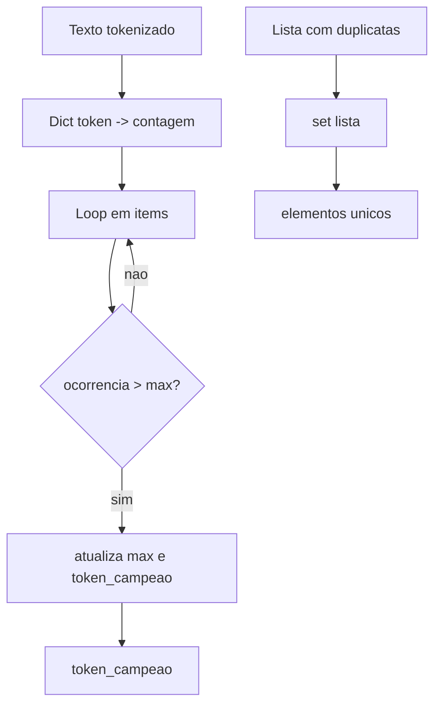

## Visão Geral do Conceito

Esta aula fecha um fio pendente da lição sobre <mark style="background-color: #242424; padding: 2px 4px; border-radius: 3px; color: inherit;">`dicionários`</mark>: encontrar o <mark style="background-color: #242424; padding: 2px 4px; border-radius: 3px; color: inherit;">`token`</mark> com maior contagem depois de montar o mapa token → ocorrência. Em seguida, introduz <mark style="background-color: #242424; padding: 2px 4px; border-radius: 3px; color: inherit;">`set`</mark> como coleção **não ordenada** de elementos **únicos**, ideal para deduplicação e para preparar a aula seguinte (comparação entre listas).

> **Regra:** o texto reconstrói a transcrição; quando um detalhe de implementação não aparece na gravação, marca-se como lacuna em vez de inventar comportamento.

## Modelo Mental

- **Dicionário de contagem:** chave = token, valor = quantidade. O token mais frequente é o par cuja quantidade vence o máximo visto até agora ao percorrer <mark style="background-color: #242424; padding: 2px 4px; border-radius: 3px; color: inherit;">`items()`</mark>.
- **Set:** uma “sacola” em que o Python impede repetir o mesmo elemento. Operações como interseção e união correspondem à intuição de conjuntos da matemática.



## Mecânica Central

### Token mais frequente com dicionário

Depois de acumular contagens, percorra <mark style="background-color: #242424; padding: 2px 4px; border-radius: 3px; color: inherit;">`for token, ocorrencia in contagem.items():`</mark> e mantenha variáveis <mark style="background-color: #242424; padding: 2px 4px; border-radius: 3px; color: inherit;">`maior_ocorrencia`</mark> e <mark style="background-color: #242424; padding: 2px 4px; border-radius: 3px; color: inherit;">`maior_token`</mark>. Há várias formas válidas; a da aula usa controle explícito e comparação no laço.

### Criar e inspecionar sets

```python
frutas = {"maca", "banana", "caju", "maca"}  # maca aparece uma vez
numeros = set([1, 2, 2, 3])
```

Operadores (Python 3): <mark style="background-color: #242424; padding: 2px 4px; border-radius: 3px; color: inherit;">`|`</mark> união, <mark style="background-color: #242424; padding: 2px 4px; border-radius: 3px; color: inherit;">`&`</mark> interseção, <mark style="background-color: #242424; padding: 2px 4px; border-radius: 3px; color: inherit;">`-`</mark> diferença, <mark style="background-color: #242424; padding: 2px 4px; border-radius: 3px; color: inherit;">`^`</mark> diferença simétrica. Métodos equivalentes: <mark style="background-color: #242424; padding: 2px 4px; border-radius: 3px; color: inherit;">`union`</mark>, <mark style="background-color: #242424; padding: 2px 4px; border-radius: 3px; color: inherit;">`intersection`</mark>, <mark style="background-color: #242424; padding: 2px 4px; border-radius: 3px; color: inherit;">`difference`</mark>, <mark style="background-color: #242424; padding: 2px 4px; border-radius: 3px; color: inherit;">`symmetric_difference`</mark>.

**Não coberto na transcrição:** complexidade interna de tabelas hash, <mark style="background-color: #242424; padding: 2px 4px; border-radius: 3px; color: inherit;">`frozenset`</mark> como chave de dicionário, e ordenação determinística de sets (sets são iteráveis mas sem ordem garantida antes do Python 3.7+ em alguns contextos — para ordenação use <mark style="background-color: #242424; padding: 2px 4px; border-radius: 3px; color: inherit;">`sorted()`</mark>).

## Uso Prático

- **Deduplicar IDs** de eventos antes de contar sessões únicas.
- **Comparar tags** de dois feeds convertendo para set e usando interseção.
- **Validar duplicatas** em colunas importadas de CSV: tamanho da lista vs tamanho do set.

```python
ids = ["a1", "b2", "a1", "c3"]
unicos = set(ids)
print(len(ids), len(unicos))
```

## Erros Comuns

- Confundir <mark style="background-color: #242424; padding: 2px 4px; border-radius: 3px; color: inherit;">`{}`</mark> vazio (dicionário vazio) com set vazio: use <mark style="background-color: #242424; padding: 2px 4px; border-radius: 3px; color: inherit;">`set()`</mark>.
- Tentar colocar listas mutáveis dentro de set: apenas elementos **hashable**.
- Assumir ordem de impressão igual à de inserção.

## Visão Geral de Debugging

Se uma operação de conjunto “some” elementos, verifique duplicatas na origem e tipos (misturar <mark style="background-color: #242424; padding: 2px 4px; border-radius: 3px; color: inherit;">`str`</mark> com <mark style="background-color: #242424; padding: 2px 4px; border-radius: 3px; color: inherit;">`int`</mark> para o mesmo conceito cria valores distintos).

## Principais Pontos

- Contagem com dict + busca do máximo via <mark style="background-color: #242424; padding: 2px 4px; border-radius: 3px; color: inherit;">`items()`</mark>.
- Set remove duplicatas implicitamente.
- Operadores de conjunto resolvem comparações entre coleções com código curto.

## Preparação para Prática

Você deve ser capaz de: (1) encontrar o token mais frequente dado um dicionário de contagem; (2) deduplicar uma lista com <mark style="background-color: #242424; padding: 2px 4px; border-radius: 3px; color: inherit;">`set`</mark>; (3) calcular união e interseção entre dois sets.

## Laboratório de Prática

### Easy — Deduplicar IDs de log

```python
linhas = ["user:1", "user:2", "user:1", "user:3", "user:2"]

# TODO: construir um set a partir de linhas e imprimir quantidade unica
unicos = set()
print("placeholder")
```

Critérios: usar <mark style="background-color: #242424; padding: 2px 4px; border-radius: 3px; color: inherit;">`set`</mark>; imprimir contagem de únicos; não alterar a lista original se não for necessário.

### Medium — Interseção de duas listas de códigos de produto

```python
estoque_loja_a = ["SKU1", "SKU9", "SKU4", "SKU9"]
estoque_loja_b = ["SKU4", "SKU7", "SKU1"]

# TODO: converter para sets e imprimir sorted da interseção
comuns = set()
print(sorted(comuns))
```

Critérios: resultado ordenado apenas para leitura humana; usar interseção de sets.

### Hard — Diferença simétrica entre conjuntos de permissões

```python
permissoes_usuario = {"read", "write", "audit"}
permissoes_grupo = {"read", "admin", "audit"}

# TODO: calcular elementos que estao em exatamente um dos dois sets (diferenca simetrica)
apenas_um = set()
print(sorted(apenas_um))
```

Critérios: usar operador <mark style="background-color: #242424; padding: 2px 4px; border-radius: 3px; color: inherit;">`^`</mark> ou método equivalente.

<!-- CONCEPT_EXTRACTION
concepts:
  - dicionario de contagem
  - token mais frequente
  - set
  - unicidade
  - uniao intersecao diferenca
  - conversao lista set
skills:
  - Encontrar maximo em dicionario de frequencias
  - Deduplicar colecoes com set
  - Combinar conjuntos com operadores de conjunto
  - Depurar confusao entre dict vazio e set vazio
examples:
  - contagem-max-items
  - set-literal-dedup
  - intersecao-codigos-produto
-->

<!-- EXERCISES_JSON
[
  {
    "id": "sets-dedup-ids-log",
    "slug": "sets-dedup-ids-log",
    "difficulty": "easy",
    "title": "Deduplicar IDs de log com set",
    "discipline": "python-processamento-dados",
    "editorLanguage": "python",
    "tags": ["python", "set", "deduplicacao"],
    "summary": "Contar quantos valores unicos existem numa lista de identificadores de log."
  },
  {
    "id": "sets-intersecao-estoque",
    "slug": "sets-intersecao-estoque",
    "difficulty": "medium",
    "title": "Interseção de listas de SKU com sets",
    "discipline": "python-processamento-dados",
    "editorLanguage": "python",
    "tags": ["python", "set", "intersecao"],
    "summary": "Obter códigos de produto comuns a duas listas usando conjuntos."
  },
  {
    "id": "sets-symmetric-diff-permissoes",
    "slug": "sets-symmetric-diff-permissoes",
    "difficulty": "hard",
    "title": "Diferença simétrica de permissões",
    "discipline": "python-processamento-dados",
    "editorLanguage": "python",
    "tags": ["python", "set", "symmetric_difference"],
    "summary": "Listar permissões que aparecem só no usuário ou só no grupo."
  }
]
-->

<!-- SOURCE_CONTEXT
source_transcript_vtt: downloads/Python_para_Processamento_de_Dados/Aula_09_-_11052026.vtt
source_transcript_vtt_sha256: 35b9f5557659dedd4b69d55b8240a6329b328b0b061cf3d23207b2b790dc4ad8
context_folder: downloads/Python_para_Processamento_de_Dados/
context_note: "Pasta da disciplina; ficheiros .md auxiliares com mesmo prefixo de data quando existirem."
-->
