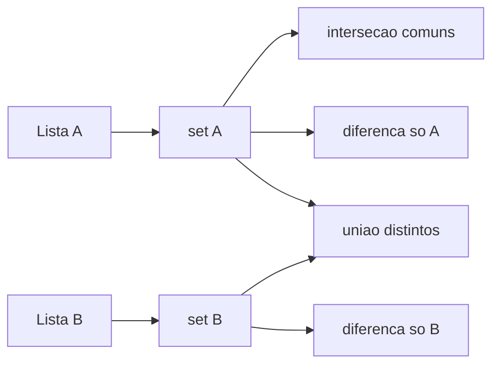

## Visão Geral do Conceito

O professor propôs um problema de consolidação: ler duas listas de tamanhos possivelmente distintos, preenchidas pelo usuário, e produzir quatro visões: **comuns**, **só na primeira**, **só na segunda** e **todos os distintos** (união sem repetição). A transcrição mostra a resolução com laços e correção ao vivo de um detalhe de limite do segundo <mark style="background-color: #242424; padding: 2px 4px; border-radius: 3px; color: inherit;">`for`</mark>; a lição acrescenta a versão idiomática com <mark style="background-color: #242424; padding: 2px 4px; border-radius: 3px; color: inherit;">`set`</mark>.

> **Regra:** reconstrução pedagógica a partir do VTT; a ordem didática prioriza modelo mental e depois refino com conjuntos.

## Modelo Mental

1. **Versão imperativa:** comparar cada elemento de uma lista contra todos da outra — custo quadrático, mas explícito e didático.
2. **Versão declarativa com sets:** transformar cada lista em conjunto e aplicar operações que correspondem às perguntas de negócio.



## Mecânica Central

### Laços (como na aula)

- Ler <mark style="background-color: #242424; padding: 2px 4px; border-radius: 3px; color: inherit;">`tamanho_lista_1`</mark> e <mark style="background-color: #242424; padding: 2px 4px; border-radius: 3px; color: inherit;">`tamanho_lista_2`</mark>.
- Preencher duas listas com <mark style="background-color: #242424; padding: 2px 4px; border-radius: 3px; color: inherit;">`input()`</mark> convertido conforme o tipo desejado (números na demonstração).
- Para comuns: para cada índice em lista1, varrer lista2; se igual, acumular sem repetir (cuidado com duplicatas internas — a aula usou contagem simples).

### Sets

```python
a = {1, 2, 3}
b = {2, 4, 6}
comuns = a & b
so_a = a - b
so_b = b - a
todos_distintos = a | b
```

**Não coberto no VTT:** generalização para registros não hashable (dicts aninhados) — aí permanece a abordagem por laços ou chaves normalizadas.

## Uso Prático

- Comparar duas listas de IDs de transação de sistemas diferentes.
- Descobrir usuários ativos em um serviço mas não em outro.
- Montar vocabulário único de dois corpus de texto já tokenizados.

## Erros Comuns

- Usar o tamanho errado no laço interno (bug corrigido em aula com ajuda do chat).
- Esquecer de converter <mark style="background-color: #242424; padding: 2px 4px; border-radius: 3px; color: inherit;">`input()`</mark> para número quando a lista é numérica.
- Usar `+` entre listas quando o requisito é “sem repetidos entre as duas”.

## Visão Geral de Debugging

Se “comuns” vier vazio mas existir interseção visual, confira tipos (<mark style="background-color: #242424; padding: 2px 4px; border-radius: 3px; color: inherit;">`"2"`</mark> vs <mark style="background-color: #242424; padding: 2px 4px; border-radius: 3px; color: inherit;">`2`</mark>) e limites dos <mark style="background-color: #242424; padding: 2px 4px; border-radius: 3px; color: inherit;">`range`</mark>.

## Principais Pontos

- Laços explicitam comparações; sets compactam intenção.
- <mark style="background-color: #242424; padding: 2px 4px; border-radius: 3px; color: inherit;">`&`</mark>, <mark style="background-color: #242424; padding: 2px 4px; border-radius: 3px; color: inherit;">`-`</mark>, <mark style="background-color: #242424; padding: 2px 4px; border-radius: 3px; color: inherit;">`|`</mark> cobrem o enunciado.
- Corrigir limites de índice é parte de engenharia de laço.

## Preparação para Prática

Você deve implementar as quatro saídas por dois caminhos: imperativo mínimo e com sets, e comparar legibilidade.

## Laboratório de Prática

### Easy — Detectar se há interseção não vazia

```python
a = [10, 20, 30]
b = [40, 20, 50]

# TODO: usar sets para definir ha_intersecao como True se a intersecao nao for vazia
ha_intersecao = False
print(ha_intersecao)
```

Critérios: usar interseção de sets; funcionar se listas forem grandes.

### Medium — Elementos só na primeira lista

```python
tags_feed_a = ["ml", "sql", "python", "sql"]
tags_feed_b = ["bi", "sql"]

# TODO: conjunto de tags que aparecem em A mas nao em B
so_a = set()
print(sorted(so_a))
```

Critérios: diferença de conjuntos; resultado ordenado só para exibição.

### Hard — Quatro conjuntos a partir de duas listas

```python
lista_um = [1, 2, 3, 2]
lista_dois = [3, 4, 5]

s1 = set(lista_um)
s2 = set(lista_dois)

# TODO: definir comuns, so_um, so_dois, uniao_distinta usando apenas operacoes de set
comuns = set()
so_um = set()
so_dois = set()
uniao_distinta = set()

print("comuns", sorted(comuns))
print("so_um", sorted(so_um))
print("so_dois", sorted(so_dois))
print("uniao", sorted(uniao_distinta))
```

Critérios: `comuns == s1 & s2`, `so_um == s1 - s2`, `so_dois == s2 - s1`, `uniao_distinta == s1 | s2`.

<!-- CONCEPT_EXTRACTION
concepts:
  - comparacao de listas
  - for aninhado
  - set intersection union difference
  - limites de range
skills:
  - Ler tamanhos dinamicos e preencher listas
  - Encontrar elementos comuns com laços
  - Reexpressar o problema com operadores de conjunto
  - Depurar tipos e limites de indice
examples:
  - dois fors-comparacao
  - sets-quatro-visoes
-->

<!-- EXERCISES_JSON
[
  {
    "id": "listas-intersecao-vazia-set",
    "slug": "listas-intersecao-vazia-set",
    "difficulty": "easy",
    "title": "Detectar interseção não vazia",
    "discipline": "python-processamento-dados",
    "editorLanguage": "python",
    "tags": ["python", "set", "intersecao"],
    "summary": "Verificar se duas listas compartilham ao menos um elemento usando conjuntos."
  },
  {
    "id": "listas-tags-so-feed-a",
    "slug": "listas-tags-so-feed-a",
    "difficulty": "medium",
    "title": "Tags exclusivas do feed A",
    "discipline": "python-processamento-dados",
    "editorLanguage": "python",
    "tags": ["python", "set", "diferenca"],
    "summary": "Calcular tags presentes no feed A que não aparecem no feed B."
  },
  {
    "id": "listas-quatro-visoes-sets",
    "slug": "listas-quatro-visoes-sets",
    "difficulty": "hard",
    "title": "Quatro visões com conjuntos",
    "discipline": "python-processamento-dados",
    "editorLanguage": "python",
    "tags": ["python", "set", "uniao"],
    "summary": "Obter comuns, exclusivos e união sem repetição entre duas listas numéricas."
  }
]
-->

<!-- SOURCE_CONTEXT
source_transcript_vtt: downloads/Python_para_Processamento_de_Dados/Aula_10_-_13052026.vtt
source_transcript_vtt_sha256: 187ca755e962638f7c3206ffe7ab59f269471e330320bf83adc71d3e20a85fdf
context_folder: downloads/Python_para_Processamento_de_Dados/
context_note: "Mesma pasta da sessão; problema enunciado no início do VTT."
-->
