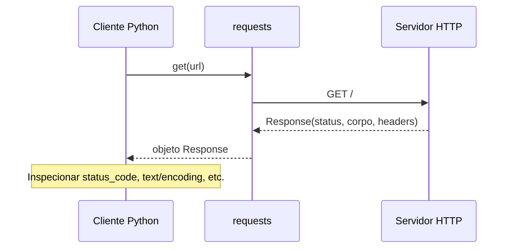

## Visão Geral do Conceito

Quando você compara duas listas “como usuário enxerga” (com repetições, ordem e tamanhos diferentes), muitas perguntas são, na verdade, perguntas sobre **conjuntos de valores** ou sobre **multiconjuntos**. A aula mostra dois caminhos: **iterar e testar pertença** (<mark style="background-color: #242424; padding: 2px 4px; border-radius: 3px; color: inherit;">`in`</mark>) ou **converter para <mark style="background-color: #242424; padding: 2px 4px; border-radius: 3px; color: inherit;">`set`</mark>** e aplicar operações de teoria de conjuntos.

Paralelamente, o ecossistema Python resolve problemas reais combinando **módulos**: arquivos <mark style="background-color: #242424; padding: 2px 4px; border-radius: 3px; color: inherit;">`.py`</mark> com funções e tipos reutilizáveis. A biblioteca **padrão** (<mark style="background-color: #242424; padding: 2px 4px; border-radius: 3px; color: inherit;">`math`</mark>, <mark style="background-color: #242424; padding: 2px 4px; border-radius: 3px; color: inherit;">`datetime`</mark>, <mark style="background-color: #242424; padding: 2px 4px; border-radius: 3px; color: inherit;">`os`</mark>, <mark style="background-color: #242424; padding: 2px 4px; border-radius: 3px; color: inherit;">`sys`</mark>) já acompanha o interpretador; pacotes de terceiros (<mark style="background-color: #242424; padding: 2px 4px; border-radius: 3px; color: inherit;">`requests`</mark>, <mark style="background-color: #242424; padding: 2px 4px; border-radius: 3px; color: inherit;">`pandas`</mark>, <mark style="background-color: #242424; padding: 2px 4px; border-radius: 3px; color: inherit;">`scikit-learn`</mark>) costumam ser **instalados** com <mark style="background-color: #242424; padding: 2px 4px; border-radius: 3px; color: inherit;">`pip`</mark> a partir do catálogo <mark style="background-color: #242424; padding: 2px 4px; border-radius: 3px; color: inherit;">`PyPI`</mark>.

> **Regra:** Se o objetivo é “valores comuns / só na primeira / só na segunda / todos os distintos”, comece definindo se duplicatas importam. Se **não** importam, <mark style="background-color: #242424; padding: 2px 4px; border-radius: 3px; color: inherit;">`set`</mark> é normalmente a ferramenta certa.

## Modelo Mental

Imagine cada lista como um saco de fichas numeradas **com repetição**. O <mark style="background-color: #242424; padding: 2px 4px; border-radius: 3px; color: inherit;">`set`</mark> é o mesmo saco **sem repetir fichas**: só importa “quais números aparecem”.

- **Interseção** (<mark style="background-color: #242424; padding: 2px 4px; border-radius: 3px; color: inherit;">`&`</mark>): fichas que existem nos dois sacos (versão conjunto).
- **Diferença** (<mark style="background-color: #242424; padding: 2px 4px; border-radius: 3px; color: inherit;">`-`</mark>): fichas que estão no primeiro saco e não estão no segundo (também no modelo conjunto).
- **União** (<mark style="background-color: #242424; padding: 2px 4px; border-radius: 3px; color: inherit;">`|`</mark>): todas as fichas distintas considerando os dois sacos.

Para **HTTP**, pense no restaurante da aula: você (cliente) pede; o garçom transporta; a cozinha (servidor) responde. O pedido é uma **requisição**; o prato (ou a recusa) é uma **resposta** com um **código de status** que resume o desfecho.

## Mecânica Central

### Comparação por laço versus conjuntos

No laço clássico da aula, para cada <mark style="background-color: #242424; padding: 2px 4px; border-radius: 3px; color: inherit;">`valor_lista_1`</mark> em <mark style="background-color: #242424; padding: 2px 4px; border-radius: 3px; color: inherit;">`lista_1`</mark>, testa-se <mark style="background-color: #242424; padding: 2px 4px; border-radius: 3px; color: inherit;">`valor_lista_1 in lista_2`</mark>. Para evitar repetir comum na saída, costuma-se guardar o que já entrou (a aula comenta checar <mark style="background-color: #242424; padding: 2px 4px; border-radius: 3px; color: inherit;">`not in numeros_comuns`</mark> antes do <mark style="background-color: #242424; padding: 2px 4px; border-radius: 3px; color: inherit;">`append`</mark>).

Em conjuntos, a mesma pergunta vira álgebra:

| Objetivo (visão “valores distintos”) | Expressão típica |
| --- | --- |
| Comuns | <mark style="background-color: #242424; padding: 2px 4px; border-radius: 3px; color: inherit;">`set(lista_1) & set(lista_2)`</mark> |
| Só na primeira | <mark style="background-color: #242424; padding: 2px 4px; border-radius: 3px; color: inherit;">`set(lista_1) - set(lista_2)`</mark> |
| Só na segunda | <mark style="background-color: #242424; padding: 2px 4px; border-radius: 3px; color: inherit;">`set(lista_2) - set(lista_1)`</mark> |
| Todos os distintos nas duas | <mark style="background-color: #242424; padding: 2px 4px; border-radius: 3px; color: inherit;">`set(lista_1) | set(lista_2)`</mark> |

### Importação e namespaces

Formas recorrentes:

- <mark style="background-color: #242424; padding: 2px 4px; border-radius: 3px; color: inherit;">`import modulo`</mark> — o símbolo fica prefixado: <mark style="background-color: #242424; padding: 2px 4px; border-radius: 3px; color: inherit;">`modulo.funcao()`</mark>.
- <mark style="background-color: #242424; padding: 2px 4px; border-radius: 3px; color: inherit;">`import modulo as apelido`</mark> — padrão didático em <mark style="background-color: #242424; padding: 2px 4px; border-radius: 3px; color: inherit;">`pandas`</mark> como <mark style="background-color: #242424; padding: 2px 4px; border-radius: 3px; color: inherit;">`pd`</mark>.
- <mark style="background-color: #242424; padding: 2px 4px; border-radius: 3px; color: inherit;">`from pacote.modulo import Classe`</mark> — útil para puxar **só** o necessário (<mark style="background-color: #242424; padding: 2px 4px; border-radius: 3px; color: inherit;">`KMeans`</mark> em <mark style="background-color: #242424; padding: 2px 4px; border-radius: 3px; color: inherit;">`sklearn.cluster`</mark>).
- <mark style="background-color: #242424; padding: 2px 4px; border-radius: 3px; color: inherit;">`from modulo import *`</mark> — traz tudo do módulo; **rápido para experimentar**, porém ruim para legibilidade e colisões.

### Instalação

No notebook da aula, <mark style="background-color: #242424; padding: 2px 4px; border-radius: 3px; color: inherit;">`!pip install Pacote`</mark> instala no ambiente corrente. Em terminal, prefira <mark style="background-color: #242424; padding: 2px 4px; border-radius: 3px; color: inherit;">`python -m pip install Pacote`</mark> para amarrar o <mark style="background-color: #242424; padding: 2px 4px; border-radius: 3px; color: inherit;">`pip`</mark> ao Python em uso.

### Fluxo mental da comparação

```mermaid
flowchart TD
    A[Listas lista_1 e lista_2] --> B{Duplicatas importam?}
    B -- Não --> C[Converter para set]
    C --> D[Comuns: A & B]
    C --> E[Só na 1ª: A - B]
    C --> F[Só na 2ª: B - A]
    C --> G[Distintos combinados: A | B]
    B -- Sim / contagem --> H[Laços, Counter ou estruturas específicas]
```

### Cliente, servidor e resposta HTTP (visão síncrona)



## Uso Prático

### 1) Conjuntos para comparar duas listas digitadas

```python
lista_1 = [1, 2, 2, 9]
lista_2 = [2, 4, 6]

s1, s2 = set(lista_1), set(lista_2)

comuns = s1 & s2
so_na_primeira = s1 - s2
so_na_segunda = s2 - s1
nao_repetidos_entre_as_duas = s1 | s2

print("comuns:", comuns)
print("só na primeira:", so_na_primeira)
print("só na segunda:", so_na_segunda)
print("distintos em qualquer uma:", nao_repetidos_entre_as_duas)
```

Se você **precisa** preservar multiplicidade nos “comuns”, o modelo de conjunto puro não basta; aí entram contagens (<mark style="background-color: #242424; padding: 2px 4px; border-radius: 3px; color: inherit;">`collections.Counter`</mark>) ou lógica explícita — *não desenvolvido na profundidade na aula*.

### 2) `requests.get` e inspeção mínima

```python
import requests

response = requests.get("https://www.infnet.edu.br/", timeout=10)
print(type(response))
print(response.status_code)  # 200 => OK na família usual de sucesso
```

A aula usa <mark style="background-color: #242424; padding: 2px 4px; border-radius: 3px; color: inherit;">`requests`</mark> como exemplo de extensão além do núcleo mínimo da linguagem para **obter recursos via HTTP**.

### 3) `pandas` como import com alias

```python
import pandas as pd

df = pd.DataFrame(
    [
        {"nome": "Ana Costa", "idade": 34},
        {"nome": "Bruno Dias", "idade": 41},
    ]
)
print(df)
```

### 4) Biblioteca padrão: amostras úteis

```python
import math
import random
import datetime
import os
import sys

print(math.pi)
print(random.random())
print(datetime.date.today())
print(sys.platform)
print(sys.version.split()[0])
# Cuidado: imprimir os.environ completo polui saída em contextos reais
```

### 5) Instalação e uso de pacote externo (exemplo da aula: PuLP)

```python
# Em notebooks: prefixo !pip install PuLP
# Em scripts/CLI: prefira python -m pip install PuLP

from pulp import LpProblem, LpMinimize, LpVariable, value  # import seletivo, mais seguro que *

prob = LpProblem("exemplo", LpMinimize)
x = LpVariable("x", lowBound=0, upBound=3)
# ... restante omitido: exige domínio de otimização não central nesta lição
```

> **Nota de escopo:** A demonstração com <mark style="background-color: #242424; padding: 2px 4px; border-radius: 3px; color: inherit;">`KMeans`</mark> ilustra **import de submódulo** e leitura de <mark style="background-color: #242424; padding: 2px 4px; border-radius: 3px; color: inherit;">`labels_`</mark>. O **algoritmo** em si é matéria de aprendizado de máquina; aqui ele serve como pano de fundo para `from ... import ...`.

## Erros Comuns

- **Confundir “comuns na lista” com “comuns como conjunto”** — listas com muitas repetições geram saídas longas numa abordagem por laço sem deduplicação; em conjuntos o valor aparece uma vez.
- **Inverter diferença** — <mark style="background-color: #242424; padding: 2px 4px; border-radius: 3px; color: inherit;">`set(a) - set(b)`</mark> não é simétrica; inverta a ordem para “só na segunda”.
- **Esquecer `<mark style="background-color: #242424; padding: 2px 4px; border-radius: 3px; color: inherit;">`timeout`</mark> em `get`** — requisições podem pendurar seu script em rede instável.
- **Import star (`*`) em código de produção** — polui namespace e dificulta saber a origem de cada nome.
- **Assumir `200` sempre que não houve exceção** — erros HTTP podem retornar corpo com mensagem mesmo com status “OK” dependendo do servidor; validar corpo e cabeçalhos quando necessário.

## Visão Geral de Debugging

- **Conjuntos com resultados “estranhos”** — imprima <mark style="background-color: #242424; padding: 2px 4px; border-radius: 3px; color: inherit;">`lista_1`</mark>, <mark style="background-color: #242424; padding: 2px 4px; border-radius: 3px; color: inherit;">`lista_2`</mark> e **depois** <mark style="background-color: #242424; padding: 2px 4px; border-radius: 3px; color: inherit;">`set(...)`</mark> de cada uma para ver duplicatas sumirem.
- **`ModuleNotFoundError`** — pacote não instalado no **mesmo** interpretador que executa o notebook; confirme com <mark style="background-color: #242424; padding: 2px 4px; border-radius: 3px; color: inherit;">`python -m pip show Nome`</mark>.
- **Versão de biblioteca** — `FutureWarning` do <mark style="background-color: #242424; padding: 2px 4px; border-radius: 3px; color: inherit;">`sklearn`</mark> na aula lembra que **parâmetros padrão mudam** entre versões; fixe versões em projetos reais.

<details>
<summary>Checagens rápidas de HTTP com <code>requests</code></summary>

Valide `response.ok`, `response.status_code` e, se for JSON, use `response.json()` dentro de try/except para erros de decodificação — padrão útil quando a API retorna HTML de erro.

</details>

## Principais Pontos

- <mark style="background-color: #242424; padding: 2px 4px; border-radius: 3px; color: inherit;">`&`</mark>, <mark style="background-color: #242424; padding: 2px 4px; border-radius: 3px; color: inherit;">`-`</mark>, <mark style="background-color: #242424; padding: 2px 4px; border-radius: 3px; color: inherit;">`|`</mark> em <mark style="background-color: #242424; padding: 2px 4px; border-radius: 3px; color: inherit;">`set`</mark> resolvem comparações clássicas entre listas quando **valores únicos** bastam.
- Laços continuam válidos quando você precisa **controlled duplicates** ou regras mais ricas que conjunto puro.
- Módulos distribuem responsabilidades: padrão vs terceiros vs instalação via <mark style="background-color: #242424; padding: 2px 4px; border-radius: 3px; color: inherit;">`pip`</mark>.
- Requisições web seguem o modelo **pedido/resposta**; <mark style="background-color: #242424; padding: 2px 4px; border-radius: 3px; color: inherit;">`status_code`</mark> resume o desfecho no protocolo HTTP.

## Preparação para Prática

Você deve ser capaz de: montar um pequeno **pipeline de conjuntos** para relatórios; escolher **imports** legíveis; instalar um pacote e importá-lo sem conflito de nomes; fazer um GET diagnóstico e ler **status** com sentido.

**Não coberto no material com profundidade:** contagem de repetições em interseções (multiset), detalhes de **otimização com PuLP**, teoria de **KMeans**, tratamento robusto de **timeouts**/**retries**, e **virtualenv**/**conda**.

## Laboratório de Prática

### Easy — Auditoria de categorias em duas filiais

Duas filiais enviam listas de códigos de categoria (podem repetir). Entregue **valores comuns** e **união distinta** entre as filiais.

```python
from __future__ import annotations

def relatorio_categorias(filial_a: list[str], filial_b: list[str]) -> dict[str, set[str]]:
    """Retorna chaves 'comuns' e 'uniao_distinta'."""
    # TODO: converter listas em conjuntos e calcular interseção e união
    comuns: set[str] = set()
    uniao_distinta: set[str] = set()
    return {"comuns": comuns, "uniao_distinta": uniao_distinta}


if __name__ == "__main__":
    a = ["eletr", "info", "eletr", "livros"]
    b = ["info", "papel", "info"]
    print(relatorio_categorias(a, b))
```

### Medium — Perfis de importação para script de dados

Um script precisa de **HTTP** com timeouts e **tabela** em <mark style="background-color: #242424; padding: 2px 4px; border-radius: 3px; color: inherit;">`pandas`</mark>. Complete a função sem executar rede pesada: use uma URL de exemplo e trate `status` 200 vs não-200.

```python
from __future__ import annotations

import typing as t

# pip install requests pandas  (se necessário)

def carregar_amostra(url: str) -> tuple[int, list[dict[str, t.Any]]]:
    """
    Faça GET em `url` com timeout.
    Se status for 200, converta um JSON de lista de objetos (use requests).
    Caso contrário, devolva lista vazia.
    Para o laboratório, assuma resposta JSON; se falhar parsing, devolva [].
    """
    import requests  # noqa: WPS433 (import local proposital para o exercício)

    status = 0
    rows: list[dict[str, t.Any]] = []

    # TODO: requests.get com timeout, checar status, json() seguro
    return status, rows


def para_dataframe(rows: list[dict[str, t.Any]]):
    import pandas as pd  # noqa: WPS433

    # TODO: retornar DataFrame a partir de rows; se rows vazio, DF vazio com colunas padrão ["id","valor"]
    pass


if __name__ == "__main__":
    s, r = carregar_amostra("https://httpbin.org/json")
    print(s, len(r))
```

### Hard — Pacote ausente e `import` seletivo

Você recebe um ambiente onde **talvez** falte <mark style="background-color: #242424; padding: 2px 4px; border-radius: 3px; color: inherit;">`pulp`</mark>. Implemente um fluxo que: tenta import seletivo; se falhar, devolve instrução string **sem** instalar nada automaticamente; se existir, constrói um problema **mínimo** factível.

```python
from __future__ import annotations

def resolver_status_pulp() -> str:
    """
    Se PuLP disponível, importe LpProblem, LpMaximize, LpVariable, PULP_CBC_CMD (ou solver padrão)
    e monte um problema trivial: maximizar x com 0 <= x <= 1.
    Retorne string resumindo o status da otimização.

    Se PuLP não estiver instalado, retorne mensagem: 'Instale com python -m pip install pulp'
    """
    # TODO: tentativa de import com try/except ModuleNotFoundError
    return "não implementado"


if __name__ == "__main__":
    print(resolver_status_pulp())
```

<!-- CONCEPT_EXTRACTION
concepts:
  - conjuntos (set)
  - interseção (&)
  - diferença (-)
  - união (|)
  - comparação de listas
  - import / from … import
  - alias (as)
  - import *
  - biblioteca padrão
  - pip / PyPI
  - requests.Response.status_code
  - modelo cliente-servidor HTTP
skills:
  - Calcular interseção, diferenças e união entre coleções com set
  - Escolher entre laços e conjuntos conforme presença de duplicatas relevantes
  - Importar módulos com namespace claro e evitar poluição com import *
  - Instalar pacotes com pip no interpretador correto
  - Diagnosticar ModuleNotFoundError e versões de bibliotecas
examples:
  - conjuntos-comparacao-listas
  - requests-get-status
  - pandas-alias-dataframe
  - import-seletivo-kmeans
  - pulp-install-import
-->

<!-- EXERCISES_JSON
[
  {
    "id": "comparacao-listas-conjuntos-modulos-pip-relatorio-categorias",
    "slug": "relatorio-categorias-conjuntos",
    "difficulty": "easy",
    "title": "Relatório de categorias com interseção e união",
    "discipline": "python-para-processamento-de-dados",
    "editorLanguage": "python",
    "tags": ["python", "conjuntos", "_conjuntos", "operacoes"],
    "summary": "Calcular comuns e união distinta entre duas listas de códigos de categoria."
  },
  {
    "id": "comparacao-listas-conjuntos-modulos-pip-http-pandas",
    "slug": "carregar-amostra-http-pandas",
    "difficulty": "medium",
    "title": "GET com timeout e tabela pandas",
    "discipline": "python-para-processamento-de-dados",
    "editorLanguage": "python",
    "tags": ["python", "requests", "pandas", "http"],
    "summary": "Completar GET JSON com verificação de status e conversão para DataFrame."
  },
  {
    "id": "comparacao-listas-conjuntos-modulos-pip-pulp-opcional",
    "slug": "pulp-import-seletivo",
    "difficulty": "hard",
    "title": "PuLP opcional com problema trivial",
    "discipline": "python-para-processamento-de-dados",
    "editorLanguage": "python",
    "tags": ["python", "pip", "pulp", "import"],
    "summary": "Detectar ausência de PuLP e, se existir, montar otimização trivial com API correta."
  }
]
-->

LESSONS_JSON_HINT
```json
{
  "discipline": "python-para-processamento-de-dados",
  "slug": "comparacao-listas-conjuntos-modulos-pip",
  "title": "Comparação de listas com conjuntos e ecossistema de módulos em Python",
  "order": 10,
  "file": "content/python-para-processamento-de-dados/comparacao-listas-conjuntos-modulos-pip.md"
}
```
