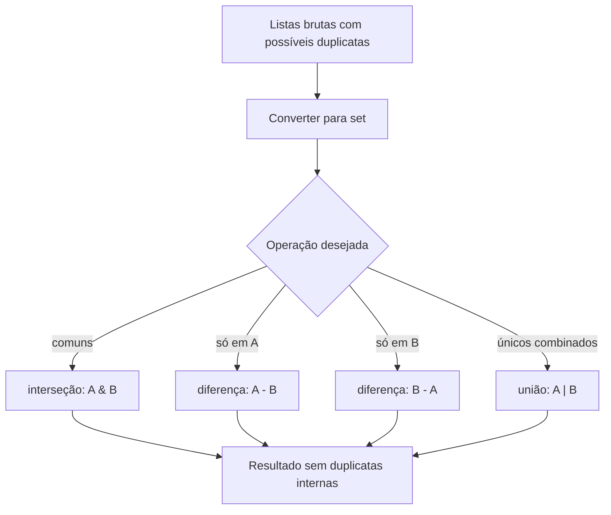
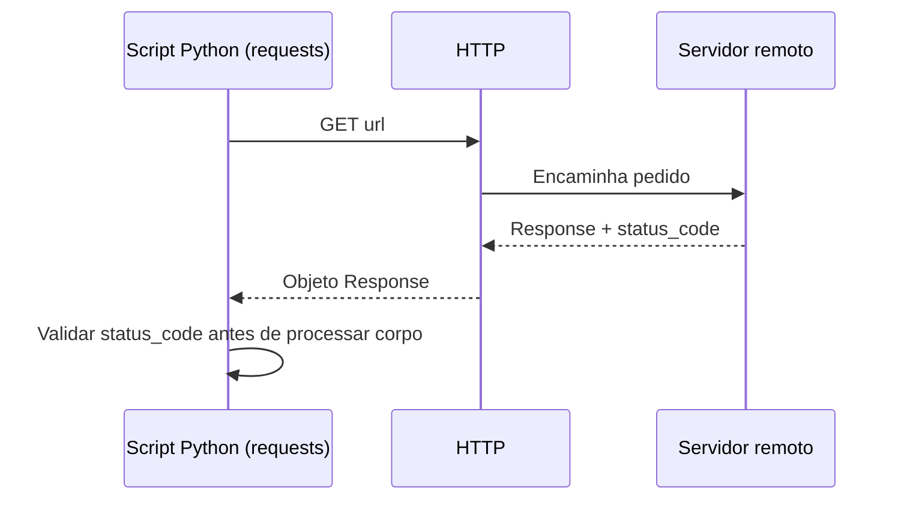

## Visão Geral do Conceito

Quando você precisa responder perguntas do tipo “o que é comum a duas coleções?”, “o que só aparece em A?”, “o que só aparece em B?” ou “quais valores únicos existem considerando as duas?”, listas puras exigem laços e cuidado com repetições. Conjuntos (<mark style="background-color: #242424; padding: 2px 4px; border-radius: 3px; color: inherit;">`set`</mark>) modelam essas perguntas como operações de conjuntos da matemática: interseção (<mark style="background-color: #242424; padding: 2px 4px; border-radius: 3px; color: inherit;">`&`</mark>), diferença (<mark style="background-color: #242424; padding: 2px 4px; border-radius: 3px; color: inherit;">`-`</mark>) e união (<mark style="background-color: #242424; padding: 2px 4px; border-radius: 3px; color: inherit;">`|`</mark>), já deduplicando valores.

Em paralelo, a linguagem organiza código reutilizável em <mark style="background-color: #242424; padding: 2px 4px; border-radius: 3px; color: inherit;">módulos</mark> (ficheiros <mark style="background-color: #242424; padding: 2px 4px; border-radius: 3px; color: inherit;">`.py`</mark>). Parte do que você precisa já vem na <mark style="background-color: #242424; padding: 2px 4px; border-radius: 3px; color: inherit;">biblioteca padrão</mark> (<mark style="background-color: #242424; padding: 2px 4px; border-radius: 3px; color: inherit;">`math`</mark>, <mark style="background-color: #242424; padding: 2px 4px; border-radius: 3px; color: inherit;">`random`</mark>, <mark style="background-color: #242424; padding: 2px 4px; border-radius: 3px; color: inherit;">`datetime`</mark>, <mark style="background-color: #242424; padding: 2px 4px; border-radius: 3px; color: inherit;">`os`</mark>, <mark style="background-color: #242424; padding: 2px 4px; border-radius: 3px; color: inherit;">`sys`</mark>). Outras capacidades chegam como <mark style="background-color: #242424; padding: 2px 4px; border-radius: 3px; color: inherit;">pacotes de terceiros</mark> instalados via <mark style="background-color: #242424; padding: 2px 4px; border-radius: 3px; color: inherit;">`pip`</mark> a partir do catálogo <mark style="background-color: #242424; padding: 2px 4px; border-radius: 3px; color: inherit;">PyPI</mark>. O exemplo discutido na aula para pedidos à Web usa <mark style="background-color: #242424; padding: 2px 4px; border-radius: 3px; color: inherit;">`requests`</mark>, que não faz parte da biblioteca padrão: você importa depois de garantir instalação no ambiente.

> **Regra:** antes de interpretar corpo de resposta ou parsear HTML/JSON, verifique <mark style="background-color: #242424; padding: 2px 4px; border-radius: 3px; color: inherit;">`response.status_code`</mark> e trate códigos da família 4xx/5xx.

## Modelo Mental

Pense em conjuntos como “sacos de valores únicos”. Duas listas podem repetir internamente o mesmo número; ao converter para conjunto, cada valor aparece uma vez. As operações booleanas de conjuntos respondem diretamente às perguntas de comparação entre coleções.

Para módulos, imagine um armário de ferramentas: <mark style="background-color: #242424; padding: 2px 4px; border-radius: 3px; color: inherit;">`import nome`</mark> traz o armário inteiro com etiqueta <mark style="background-color: #242424; padding: 2px 4px; border-radius: 3px; color: inherit;">`nome.`</mark>; <mark style="background-color: #242424; padding: 2px 4px; border-radius: 3px; color: inherit;">`from pacote import ferramenta`</mark> retira só uma peça para a bancada global; <mark style="background-color: #242424; padding: 2px 4px; border-radius: 3px; color: inherit;">`as`</mark> renomeia a etiqueta para caber no seu hábito de leitura (<mark style="background-color: #242424; padding: 2px 4px; border-radius: 3px; color: inherit;">`import pandas as pd`</mark>).

Na Web, o modelo mental é cliente‑servidor: o seu programa (cliente) envia um <mark style="background-color: #242424; padding: 2px 4px; border-radius: 3px; color: inherit;">request</mark>; o servidor devolve uma <mark style="background-color: #242424; padding: 2px 4px; border-radius: 3px; color: inherit;">response</mark> com código de estado que resume o resultado da operação no protocolo HTTP.

## Mecânica Central

### Comparação de listas

Dadas <mark style="background-color: #242424; padding: 2px 4px; border-radius: 3px; color: inherit;">`lista_a`</mark> e <mark style="background-color: #242424; padding: 2px 4px; border-radius: 3px; color: inherit;">`lista_b`</mark>:

- Interseção (valores presentes em ambas): <mark style="background-color: #242424; padding: 2px 4px; border-radius: 3px; color: inherit;">`set(lista_a) & set(lista_b)`</mark>
- Somente na primeira: <mark style="background-color: #242424; padding: 2px 4px; border-radius: 3px; color: inherit;">`set(lista_a) - set(lista_b)`</mark>
- Somente na segunda: <mark style="background-color: #242424; padding: 2px 4px; border-radius: 3px; color: inherit;">`set(lista_b) - set(lista_a)`</mark>
- União de valores únicos em qualquer uma: <mark style="background-color: #242424; padding: 2px 4px; border-radius: 3px; color: inherit;">`set(lista_a) | set(lista_b)`</mark>

Um laço com <mark style="background-color: #242424; padding: 2px 4px; border-radius: 3px; color: inherit;">`in`</mark> também funciona, mas exige lógica extra para não duplicar resultados nos “comuns”.

### Importações

Formas usuais:

- <mark style="background-color: #242424; padding: 2px 4px; border-radius: 3px; color: inherit;">`import modulo`</mark>
- <mark style="background-color: #242424; padding: 2px 4px; border-radius: 3px; color: inherit;">`import modulo as apelido`</mark>
- <mark style="background-color: #242424; padding: 2px 4px; border-radius: 3px; color: inherit;">`from pacote.subpacote import ClasseOuFuncao`</mark>
- <mark style="background-color: #242424; padding: 2px 4px; border-radius: 3px; color: inherit;">`from pacote import *`</mark> importa tudo o que o módulo exporta por defeito — conveniente em protótipos, mas arriscado em código de produção por poluir o namespace e esconder origens dos símbolos.

### Pacotes

<mark style="background-color: #242424; padding: 2px 4px; border-radius: 3px; color: inherit;">`pip install nome-do-pacote`</mark> coloca o pacote no ambiente ativo. Em notebooks, frequentemente usa‑se <mark style="background-color: #242424; padding: 2px 4px; border-radius: 3px; color: inherit;">`!pip install ...`</mark> ou <mark style="background-color: #242424; padding: 2px 4px; border-radius: 3px; color: inherit;">`%pip install ...`</mark> para garantir destino correto no kernel.



### Cliente HTTP com requests

Fluxo típico:

1. <mark style="background-color: #242424; padding: 2px 4px; border-radius: 3px; color: inherit;">`import requests`</mark>
2. <mark style="background-color: #242424; padding: 2px 4px; border-radius: 3px; color: inherit;">`response = requests.get(url)`</mark>
3. inspecionar <mark style="background-color: #242424; padding: 2px 4px; border-radius: 3px; color: inherit;">`type(response)`</mark>, <mark style="background-color: #242424; padding: 2px 4px; border-radius: 3px; color: inherit;">`response.status_code`</mark>

Famílias de códigos mencionadas na aula: <mark style="background-color: #242424; padding: 2px 4px; border-radius: 3px; color: inherit;">200</mark> indica sucesso; <mark style="background-color: #242424; padding: 2px 4px; border-radius: 3px; color: inherit;">4xx</mark> costuma apontar problema no pedido ou recurso ausente (ex.: <mark style="background-color: #242424; padding: 2px 4px; border-radius: 3px; color: inherit;">404</mark>); <mark style="background-color: #242424; padding: 2px 4px; border-radius: 3px; color: inherit;">5xx</mark> sugere falha no servidor.



## Uso Prático

### Comparar listas de IDs de eventos

```python
ids_loja_a = [101, 202, 303, 202]
ids_loja_b = [303, 404, 505]

comuns = set(ids_loja_a) & set(ids_loja_b)
so_a = set(ids_loja_a) - set(ids_loja_b)
so_b = set(ids_loja_b) - set(ids_loja_a)
unicos = set(ids_loja_a) | set(ids_loja_b)

print("comuns:", comuns)
print("somente A:", so_a)
print("somente B:", so_b)
print("catálogo único combinado:", unicos)
```

### Biblioteca padrão: data aleatória e contexto de sistema

```python
import math, random
import datetime as dt
import os, sys

print(math.pi)
print(random.random())
print(dt.date.today())
print(sys.platform)
print(sys.version.split()[0])  # versão major.minor.micro
print("HOME presente?", "HOME" in os.environ)
```

### Requisição GET defensiva

```python
import requests

url = "https://www.python.org/"
response = requests.get(url, timeout=10)

if response.status_code == 200:
    print("OK, bytes recebidos:", len(response.content))
else:
    print("Falha HTTP:", response.status_code)
```

### pandas apenas como exemplo de import com alias

```python
import pandas as pd

df = pd.DataFrame(
    [
        {"sku": "A12", "preco": 19.9},
        {"sku": "B07", "preco": 42.0},
    ]
)
print(df.shape)  # linhas, colunas
```

### Import seletivo de algoritmo (ilustrativo)

```python
import numpy as np
from sklearn.cluster import KMeans

X = np.array([[1, 2], [1, 4], [1, 0], [10, 2], [10, 4], [10, 0]])
modelo = KMeans(n_clusters=2, random_state=0, n_init="auto")
modelo.fit(X)
print(modelo.labels_)
```

> **Nota:** versões antigas do scikit‑learn podem emitir avisos sobre <mark style="background-color: #242424; padding: 2px 4px; border-radius: 3px; color: inherit;">`n_init`</mark>; em ambientes recentes, prefira <mark style="background-color: #242424; padding: 2px 4px; border-radius: 3px; color: inherit;">`n_init="auto"`</mark> quando disponível.

### Instalar pacote externo e usar

```bash
pip install pulp
```

Depois, siga a API oficial do pacote no seu caso de uso — o exemplo da aula apenas demonstra instalação e importação para um problema de otimização já pronto na documentação do próprio PuLP.

## Erros Comuns

- **Esperar preservar duplicatas após conjuntos:** qualquer operação baseada em <mark style="background-color: #242424; padding: 2px 4px; border-radius: 3px; color: inherit;">`set(...)`</mark> perde repetições internas. Se o negócio exige contagem, use <mark style="background-color: #242424; padding: 2px 4px; border-radius: 3px; color: inherit;">`collections.Counter`</mark> (não coberto na transcrição; trate como extensão opcional).
- **Laço ingénuo para “comuns” duplicados:** sem verificar <mark style="background-color: #242424; padding: 2px 4px; border-radius: 3px; color: inherit;">`not in resultado`</mark>, você pode acumular repetições — justamente o problema destacado ao comparar com conjuntos.
- **`ModuleNotFoundError` em terceiros:** esqueceu de instalar no ambiente do kernel ou instalou noutro Python do sistema.
- **Confundir família de status HTTP:** tratar <mark style="background-color: #242424; padding: 2px 4px; border-radius: 3px; color: inherit;">404</mark> como “erro de código Python” — é resposta válida do protocolo; o seu programa deve ramificar pela camada HTTP.
- **`from modulo import *` em módulos grandes:** colisões silenciosas de nomes e autocompleção pobre.

## Visão Geral de Debugging

1. Para operações de conjunto, imprima conjuntos intermédários e compare cardinalidades antes e depois da conversão.
2. Em importações, confirme o interpretador ativo (<mark style="background-color: #242424; padding: 2px 4px; border-radius: 3px; color: inherit;">`sys.executable`</mark>) e reexecute instalação no mesmo ambiente.
3. Em HTTP, comece sempre por <mark style="background-color: #242424; padding: 2px 4px; border-radius: 3px; color: inherit;">`status_code`</mark>, depois cabeçalhos (<mark style="background-color: #242424; padding: 2px 4px; border-radius: 3px; color: inherit;">`response.headers`</mark>) e só então parse do corpo.
4. Se um notebook “não vê” um pacote recém‑instalado, reinicie o kernel após instalar.

<details>
<summary>Expandir checklist rápido de rede</summary>

- Testar URL em navegador só valida caminho humano; APIs podem exigir cabeçalhos ou método diferente de GET.
- Timeouts evitam bloqueio indefinido: use <mark style="background-color: #242424; padding: 2px 4px; border-radius: 3px; color: inherit;">`timeout=`</mark> em <mark style="background-color: #242424; padding: 2px 4px; border-radius: 3px; color: inherit;">`requests.get`</mark>.

</details>

## Principais Pontos

- Interseção/diferença/união em conjuntos resolvem comparações entre listas deduplicando valores automaticamente.
- Laços com <mark style="background-color: #242424; padding: 2px 4px; border-radius: 3px; color: inherit;">`in`</mark> são flexíveis, mas exigem controlo explícito de repetições nos resultados.
- <mark style="background-color: #242424; padding: 2px 4px; border-radius: 3px; color: inherit;">`import`</mark>, <mark style="background-color: #242424; padding: 2px 4px; border-radius: 3px; color: inherit;">`from ... import ...`</mark> e <mark style="background-color: #242424; padding: 2px 4px; border-radius: 3px; color: inherit;">`as`</mark> organizam namespaces e legibilidade.
- Biblioteca padrão cobre matemática, aleatoriedade, tempo, sistema; dados tabulares densos e ML vêm de pacotes populares (<mark style="background-color: #242424; padding: 2px 4px; border-radius: 3px; color: inherit;">`pandas`</mark>, <mark style="background-color: #242424; padding: 2px 4px; border-radius: 3px; color: inherit;">`numpy`</mark>, <mark style="background-color: #242424; padding: 2px 4px; border-radius: 3px; color: inherit;">`sklearn`</mark>) instalados via <mark style="background-color: #242424; padding: 2px 4px; border-radius: 3px; color: inherit;">`pip`</mark>.
- Fluxo HTTP: pedido → `status_code` → processamento condicional do corpo.

## Preparação para Prática

Você deve ser capaz de: (1) derivar os quatro conjuntos pedidos no exercício da aula usando operações de conjunto; (2) explicar por que resultados diferem quando há duplicatas internas; (3) importar módulos com alias e imports pontuais; (4) instalar um pacote e importá‑lo sem erro; (5) fazer um GET e ramificar pelo código HTTP.

Documentação útil: [Python tutorial — modules](https://docs.python.org/3/tutorial/modules.html), [Installing Python Modules](https://docs.python.org/3/installing/index.html), [Requests quickstart](https://requests.readthedocs.io/en/latest/user/quickstart/).

## Laboratório de Prática

### Easy — Normalizar comparadores de catálogo

Complete as operações de conjunto entre SKUs de dois fornecedores. O código deve executar sem alterações (placeholders neutros).

```python
skus_forn_a = ["MX-01", "MX-01", "BR-77", "PT-02"]
skus_forn_b = ["BR-77", "FR-33", "MX-01"]

def conjuntos_catalogo(a, b):
    sa, sb = set(a), set(b)
    comuns = None  # TODO: interseção entre sa e sb
    so_em_a = None  # TODO: elementos só em sa
    so_em_b = None  # TODO: elementos só em sb
    unicos = None  # TODO: união de sa e sb
    return comuns, so_em_a, so_em_b, unicos

print(conjuntos_catalogo(skus_forn_a, skus_forn_b))
```

### Medium — Diagnóstico HTTP mínimo para ingestão

Implemente uma função que faça GET e devolva uma mensagem curta com base no código. Use timeout. Não parseie HTML.

```python
import requests

def health_url(url: str) -> str:
    # TODO: requests.get com timeout=8
    # TODO: se status == 200 → "OK:<tamanho_em_bytes_do_content>"
    # TODO: se status == 404 → "missing"
    # TODO: outros casos → "http:<status>"
    return "TODO"

print(health_url("https://www.python.org/"))
```

### Hard — Ambiente e dependência opcional

Escreva uma função que tenta importar <mark style="background-color: #242424; padding: 2px 4px; border-radius: 3px; color: inherit;">`pandas`</mark> e reporta versão; se falhar, devolve razão. O ficheiro deve continuar executável mesmo sem pandas instalado.

```python
import sys

def relatorio_pandas():
    # TODO: try/except ImportError
    # TODO: se ok → f"pandas {pd.__version__} em {sys.executable}"
    # TODO: se falhar → "pandas indisponível neste kernel"
    return "TODO"

print(relatorio_pandas())
```

<!-- CONCEPT_EXTRACTION
concepts:
  - Operações de conjunto em Python (&, -, |)
  - Comparação lista vs set para deduplicação
  - import / from-import / alias com as
  - Biblioteca padrão (math, random, datetime, os, sys)
  - pip / PyPI para pacotes externos
  - requests.get e response.status_code
  - Modelo cliente-servidor HTTP
skills:
  - Calcular interseção e diferenças entre coleções com sets
  - Escolher estratégia lista+laço versus conjuntos conforme requisito de unicidade
  - Importar módulos completos ou símbolos específicos com namespace claro
  - Instalar pacotes com pip alinhados ao kernel ativo
  - Validar respostas HTTP antes de processar payload
examples:
  - comparacao-skus-lojas
  - diagnostico-get-python-org
  - import-seletivo-kmeans
-->

<!-- EXERCISES_JSON
[
  {
    "id": "conjuntos-importacoes-e-pip-catalogo-easy",
    "slug": "conjuntos-importacoes-e-pip-catalogo-easy",
    "difficulty": "easy",
    "title": "Normalizar comparadores de catálogo com sets",
    "discipline": "python-processamento-dados",
    "editorLanguage": "python",
    "tags": ["python", "conjuntos", "deduplicacao"],
    "summary": "Completar interseção, diferenças e união entre SKUs usando operações de conjunto."
  },
  {
    "id": "conjuntos-importacoes-e-pip-http-medium",
    "slug": "conjuntos-importacoes-e-pip-http-medium",
    "difficulty": "medium",
    "title": "Diagnóstico HTTP mínimo para ingestão",
    "discipline": "python-processamento-dados",
    "editorLanguage": "python",
    "tags": ["python", "requests", "http"],
    "summary": "Implementar GET com timeout e mensagens por faixa de status_code."
  },
  {
    "id": "conjuntos-importacoes-e-pip-pandas-hard",
    "slug": "conjuntos-importacoes-e-pip-pandas-hard",
    "difficulty": "hard",
    "title": "Ambiente e dependência opcional (pandas)",
    "discipline": "python-processamento-dados",
    "editorLanguage": "python",
    "tags": ["python", "import", "ambiente"],
    "summary": "Detectar presença de pandas com try/ImportError e reportar versão ou ausência."
  }
]
-->

LESSONS_JSON_HINT
{
  "discipline": "python-processamento-dados",
  "slug": "conjuntos-importacoes-e-pip",
  "title": "Conjuntos para comparar listas, importações e gestão de pacotes com pip",
  "order": 10,
  "file": "python-processamento-dados/conjuntos-importacoes-e-pip.md"
}
