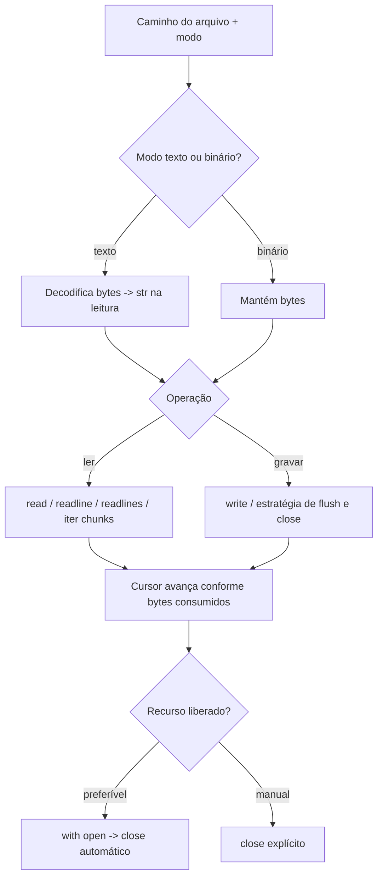

## Visão Geral do Conceito

Programas de processamento de dados raramente operam só na memória volátil: eles precisam **persistir resultados**, **ingerir lotes** e **integrar sistemas**. Em Python, a porta de entrada para isso é o modelo de **arquivos em disco** exposto por <mark style="background-color: #242424; padding: 2px 4px; border-radius: 3px; color: inherit;">`open()`</mark>, combinado com operações de leitura e escrita que respeitam **modo textual ou binário**.

Em paralelo, na transição de sistemas mais antigos baseados em XML verboso para APIs modernas, consolidou-se o <mark style="background-color: #242424; padding: 2px 4px; border-radius: 3px; color: inherit;">JSON</mark> como formato típico de **representação e transporte** de dados em serviços REST e em bancos orientados a documentos. Nesta aula, o foco operacional é arquivo em disco; o JSON aparece como **contexto** de por que arquivos texto estruturados viraram padrão na indústria.

> **Regra:** Persistência é sempre um contrato entre **bytes no disco**, **modo de abertura** e **encoding** (em texto). Escolher o modo errado não é “detalhe”: é causa direta de corrupção, perda de dados ou falhas intermitentes.

**Não coberto neste material de vídeo (combinado para próxima sessão):** uso do módulo <mark style="background-color: #242424; padding: 2px 4px; border-radius: 3px; color: inherit;">`json`</mark> para `loads`/`dumps`, schemas e validação.

## Modelo Mental

Pense no arquivo como um **réguas longas de bytes** com um **cursor** que avança quando você lê ou grava. Em modo texto, Python ajuda a interpretar esses bytes como caracteres (com regras de encoding). Em modo binário, você enxerga o arquivo como ele é: sequência de <mark style="background-color: #242424; padding: 2px 4px; border-radius: 3px; color: inherit;">`bytes`</mark>, adequada para imagens, compressed blobs e protocolos compactos.

Texto legível (`.txt`, `.csv`, `.json` como texto) pode ser aberto como texto; formatos não legíveis “no bloco de notas” pedem binário. O modo define **permissões**: ler só, truncar, acrescentar ou criar exclusivamente se não existir.

Para grandes volumes, leia **fatias** (<mark style="background-color: #242424; padding: 2px 4px; border-radius: 3px; color: inherit;">chunks</mark>) em vez de carregar tudo de uma vez: você troca CPU por **previsibilidade de memória**.



## Mecânica Central

### Abertura e objeto arquivo

<mark style="background-color: #242424; padding: 2px 4px; border-radius: 3px; color: inherit;">`open(file, mode='r', buffering=-1, encoding=None, errors=None, newline=None, closefd=True, opener=None)`</mark> devolve um **objeto arquivo** que encapsula o stream. O parâmetro central é <mark style="background-color: #242424; padding: 2px 4px; border-radius: 3px; color: inherit;">`mode`</mark>, uma string que combina:

- Operação principal: <mark style="background-color: #242424; padding: 2px 4px; border-radius: 3px; color: inherit;">`r`</mark> leitura; <mark style="background-color: #242424; padding: 2px 4px; border-radius: 3px; color: inherit;">`w`</mark> escrita truncando; <mark style="background-color: #242424; padding: 2px 4px; border-radius: 3px; color: inherit;">`a`</mark> acrescentar ao final; <mark style="background-color: #242424; padding: 2px 4px; border-radius: 3px; color: inherit;">`x`</mark> criação exclusiva.
- Tipo: ausência explícita assume texto no Python 3; <mark style="background-color: #242424; padding: 2px 4px; border-radius: 3px; color: inherit;">`b`</mark> binário; <mark style="background-color: #242424; padding: 2px 4px; border-radius: 3px; color: inherit;">`t`</mark> texto explícito.

Combinações como <mark style="background-color: #242424; padding: 2px 4px; border-radius: 3px; color: inherit;">`rb`</mark>, <mark style="background-color: #242424; padding: 2px 4px; border-radius: 3px; color: inherit;">`wb`</mark>, <mark style="background-color: #242424; padding: 2px 4px; border-radius: 3px; color: inherit;">`ab`</mark> são comuns em pipelines de dados binários.

### Escrita: `write()` versus `print()`

- <mark style="background-color: #242424; padding: 2px 4px; border-radius: 3px; color: inherit;">`print(*values, sep=' ', end='\n', file=sys.stdout, flush=False)`</mark> formata para humanos e, por padrão, **insere quebra de linha** em `end`.
- <mark style="background-color: #242424; padding: 2px 4px; border-radius: 3px; color: inherit;">`file.write(s)`</mark> grava **conteúdo bruto** conforme o modo: `str` em texto, `bytes` em binário. Não aplicar conversões mágicas para tipos arbitrários.

### Leitura incremental

- <mark style="background-color: #242424; padding: 2px 4px; border-radius: 3px; color: inherit;">`read(size=-1)`</mark>: com `size` positivo, lê até esse número de **bytes** (binário) ou **caracteres** (texto, dependendo da camada), avançando o cursor; retorna string vazia ou `b''` ao fim.
- <mark style="background-color: #242424; padding: 2px 4px; border-radius: 3px; color: inherit;">`readline()`</mark>: lê até encontrar fim de linha ou EOF.
- <mark style="background-color: #242424; padding: 2px 4px; border-radius: 3px; color: inherit;">`readlines()`</mark>: materializa linhas em lista (cuidado com memória em arquivos enormes).

### Cursor: `tell()` e `seek()`

<mark style="background-color: #242424; padding: 2px 4px; border-radius: 3px; color: inherit;">`tell()`</mark> retorna a posição atual do cursor em bytes a partir do início (comportamento útil especialmente em binário). <mark style="background-color: #242424; padding: 2px 4px; border-radius: 3px; color: inherit;">`seek(offset, whence=0)`</mark> reposiciona: a partir do início (`0`), posição atual (`1`) ou fim (`2`) — este último especialmente em binário.

### `with open(...)`

O protocolo de **context manager** garante fechamento do stream ao sair do bloco, reduzindo **vazamento de descritores** e estados inconsistentes após exceções.

### Utilitários de sistema (`os`, `shutil`)

Para operações além do stream (existência, mover, copiar, renomear), Python costuma usar <mark style="background-color: #242424; padding: 2px 4px; border-radius: 3px; color: inherit;">`os`</mark> e <mark style="background-color: #242424; padding: 2px 4px; border-radius: 3px; color: inherit;">`shutil`</mark>. Em código novo, caminhos costumam ser manipulados com <mark style="background-color: #242424; padding: 2px 4px; border-radius: 3px; color: inherit;">`pathlib.Path`</mark>, mas o princípio permanece: separar **conteúdo** (via `open`) de **metadados do filesystem**.

### JSON no ecossistema (contextualização da aula)

O JSON reduz verbosidade frente ao XML em cenários de APIs e troca de registros. Ele não substitui todos os formatos (há CSV, Parquet, Avro etc.), mas tornou-se **lingua franca** em REST e em document stores. Na prática de dados, você frequentemente **materializa JSON como arquivo texto** ou recebe payloads HTTP para normalizar em pipelines.

## Uso Prático

### Gravar e fechar com segurança

```python
from pathlib import Path

path = Path("relatorio_presenca.txt")

with path.open("w", encoding="utf-8") as stream:
    stream.write("evento=meetup_python\n")
    stream.write("participantes=42\n")
```

### Ler linha a linha (logs)

```python
from pathlib import Path

def contar_errores_em_log(caminho: str, token: str = "ERROR") -> int:
    total = 0
    with Path(caminho).open("r", encoding="utf-8", errors="replace") as stream:
        for linha in stream:
            if token in linha:
                total += 1
    return total
```

Iterar o objeto arquivo é equivalente a ler linhas com saneamento de memória para arquivos grandes.

### Ler em chunks (controle de memória)

```python
from pathlib import Path

def sha256_like_digest_ascii(path: str, chunk: int = 1024 * 1024) -> None:
    """Exemplo pedagógico: ecoar progresso de leitura por blocos (sem hash real)."""
    lidos = 0
    with Path(path).open("rb") as stream:
        while True:
            bloco = stream.read(chunk)
            if not bloco:
                break
            lidos += len(bloco)
    print(f"bytes lidos={lidos}")
```

### Binário com offset e fatia

```python
from pathlib import Path

buf = bytes(range(256))
bin_path = Path("blob_256.bin")

with bin_path.open("wb") as out_stream:
    offset = 0
    chunk = 100
    while offset < len(buf):
        fatia = buf[offset : offset + chunk]
        out_stream.write(fatia)
        offset += len(fatia)

with bin_path.open("rb") as in_stream:
    in_stream.seek(255, 0)
    ultimo = in_stream.read(1)
    print(len(ultimo), ultimo)
```

### Checagens simples com `os.path`

```python
import os

caminho = "blob_256.bin"
print(os.path.exists(caminho))
print(os.path.isfile(caminho))
print(os.path.isdir(caminho))
```

Para cópia/movimentação robusta, prefira <mark style="background-color: #242424; padding: 2px 4px; border-radius: 3px; color: inherit;">`shutil.copy2`</mark> / <mark style="background-color: #242424; padding: 2px 4px; border-radius: 3px; color: inherit;">`shutil.move`</mark> na prática diária.

## Erros Comuns

1. **Abrir com `w` em arquivo importante:** truncamento imediato. Sintoma: arquivo “some” exceto pelo que você acabou de escrever. Mitigação: backups, versionamento, modo `a`, ou fluxos temporários + substituição atômica.
2. **`write()` com tipo inadequado:** tentar gravar `int` direto em modo texto; esperar conversão automática como em `print`. Sintoma: <mark style="background-color: #242424; padding: 2px 4px; border-radius: 3px; color: inherit;">`TypeError`</mark>.
3. **Misturar texto e binário:** abrir com `b` e passar `str`, ou o inverso. Sintoma: `TypeError`/`UnicodeEncodeError` dependendo do caso.
4. **`readlines()` em CSV gigante:** pico de RAM proporcional ao arquivo. Sintoma: lentidão extrema ou swap. Mitigação: iterar linhas ou usar chunks conforme formato.
5. **Esquecer encoding em texto:** caracteres fora do ASCII podem falhar ou corromper silenciosamente dependendo da plataforma. Sintoma: <mark style="background-color: #242424; padding: 2px 4px; border-radius: 3px; color: inherit;">`UnicodeDecodeError`</mark>. Mitigação: `encoding="utf-8"` explícito e política de `errors`.
6. **`seek`/`tell` em modo texto:** reposicionamento arbitrário pode ser problemático devido a codecs multibyte e newline translation. Para saltos arbitrários, prefira binário ou APIs de alto nível conscientes de encoding.
7. **Confundir ausência de `close()` com segurança:** o GC pode encerrar, mas descritores podem permanecer abertos tempo suficiente para falhar em scripts longos ou servidores.

## Visão Geral de Debugging

1. Confirme **caminho efetivo**: execute um `Path(...).resolve()` e liste o diretório atual; paths relativos mudam conforme o **working directory**.
2. Imprima **modo de abertura** e posição com `tell()` após operações suspeitas.
3. Reproduza com arquivo pequeno sintético antes de subir para datasets grandes.
4. Se o sintoma for silêncio após escrita, verifique **flush** (`flush=True` em `print` ou `stream.flush()`), encerramento do contexto e locks externos (antivírus, montagens de rede).
5. Para erros de permissão, valide **umask**, proprietário e se outro processo mantém o arquivo aberto.

<details>
<summary>Expandir checklist rápido de causas por mensagem</summary>

- **`UnicodeDecodeError`:** encoding incorreto ou arquivo binário aberto como texto.
- **`UnicodeEncodeError`:** tentativa de gravar caracteres não representáveis no encoding escolhido.
- **`PermissionError`:** falta de permissão ou arquivo bloqueado.
- **`IsADirectoryError` / `FileNotFoundError`:** confundir arquivo com diretório ou caminho inexistente sem criar diretórios pais.
</details>

## Principais Pontos

- `open()` combina **operação** + **texto/binário**; `w` trunca, `a` acrescenta, `x` protege contra sobrescrita acidental.
- `print()` é para **saída legível**; `write()` persiste **payload bruto** esperado pelo modo.
- Leitura incremental (`read(n)`, iterar linhas) controla **memória** em arquivos grandes.
- `with open(...)` é o padrão para **liberar recursos** de forma determinística.
- `tell()`/`seek()` manipulam o **cursor**, especialmente útil em binário.
- JSON é formato central em **REST** e armazenamentos documentais; parsing profundo com `json` é etapa seguinte.

## Preparação para Prática

Você deve conseguir:

- Escolher modo seguro para **não destruir dados** existentes.
- Implementar leitura por **linhas** e por **chunks** com terminação correta do laço.
- Explicar quando usar **texto** versus **binário** e como isso afeta `write()`/`read()`.
- Navegar cursores com `seek()`/`tell()` em arquivo binário simples.
- Usar checagens `os.path` antes de operações destrutivas.

## Laboratório de Prática

### Easy — Normalizar mini-log em arquivo UTF-8

Você recebe linhas de um serviço fictício misturando espaços extras. Grave um arquivo `logs_limpos.txt` com uma linha por evento, sem espaços à direita, preservando quebras.

```python
from pathlib import Path

LINHAS = [
    "INFO boot ok   ",
    "WARN disco quase cheio ",
    "INFO backup completo",
]


def gravar_log_limpo(destino: str = "logs_limpos.txt") -> int:
    """Retorna número de linhas gravadas."""
    # TODO: abrir destino em modo texto seguro para criar/sobrescrever o arquivo de saída
    # TODO: iterar LINHAS, aplicar strip apenas à direita (rstrip) e gravar linha + "\n"
    return 0


if __name__ == "__main__":
    print(gravar_log_limpo())
```

### Medium — Agregar métricas de CSV compacto sem pandas

Dado um arquivo `vendas.csv` com cabeçalho `sku,qtd,preco`, calcule receita total \( \sum qtd \times preco \). Use leitura streaming linha a linha.

```python
from pathlib import Path

CSV_IN = Path("vendas.csv")


def receita_total_csv(path: Path = CSV_IN) -> float:
    """Soma qtd * preco ignorando cabeçalho."""
    # TODO: validar existência do arquivo (levantar FileNotFoundError claro se ausente)
    # TODO: abrir UTF-8, pular cabeçalho, para cada linha fazer split(',') e acumular float
    return 0.0


if __name__ == "__main__":
    print(receita_total_csv())
```

Para testar localmente, crie antes um `vendas.csv` pequeno com três linhas de dados.

### Hard — Extrair últimos N bytes de blob binário com `seek`

Implemente função que copia os últimos `n` bytes de `entrada.bin` para `tail.bin` usando apenas modo binário e operações de cursor.

```python
from pathlib import Path


def extrair_cauda_binaria(
    origem: str = "entrada.bin",
    destino: str = "tail.bin",
    n: int = 16,
) -> int:
    """Copia os últimos n bytes; retorna quantidade efetivamente escrita."""
    # TODO: abrir origem em rb e destino em wb
    # TODO: usar seek com whence a partir do fim para posicionar no início da cauda
    # TODO: ler n bytes e gravar; lidar com arquivo menor que n (ler o máximo possível)
    return 0


if __name__ == "__main__":
    print(extrair_cauda_binaria())
```

<!-- CONCEPT_EXTRACTION
concepts:
  - open() e modos r/w/a/x/t/b
  - objeto arquivo e cursor
  - read readline readlines e chunks
  - write versus print
  - arquivos texto versus binário
  - with open como context manager
  - tell e seek
  - utilitários os.path e shutil (operações de filesystem)
  - JSON como formato de intercâmbio em REST e document stores
skills:
  - Escolher modo de abertura seguro contra truncamento acidental
  - Ler arquivos grandes em blocos ou linhas sem picos de memória
  - Gravar payloads texto/binário corretamente com write
  - Reposicionar cursor em binário para leituras parciais
  - Diagnosticar erros comuns de encoding e tipo em I/O
examples:
  - gravacao_utf8_pathlib
  - contagem_tokens_log_iter_linhas
  - leitura_chunks_binarios
  - escrita_binaria_com_offset
  - checagens_os_path
-->

<!-- EXERCISES_JSON
[
  {
    "id": "gravar-log-rstrip-utf8",
    "slug": "gravar-log-rstrip-utf8",
    "difficulty": "easy",
    "title": "Gravar log normalizado em UTF-8",
    "discipline": "python-para-processamento-de-dados",
    "editorLanguage": "python",
    "tags": ["python", "arquivos", "utf-8", "pathlib"],
    "summary": "Abrir arquivo texto, limpar espaços à direita das linhas e persistir com quebras explícitas."
  },
  {
    "id": "receita-total-csv-streaming",
    "slug": "receita-total-csv-streaming",
    "difficulty": "medium",
    "title": "Calcular receita total lendo CSV em streaming",
    "discipline": "python-para-processamento-de-dados",
    "editorLanguage": "python",
    "tags": ["python", "csv", "streaming", "numerico"],
    "summary": "Somar qtd * preco linha a linha ignorando cabeçalho e validando existência do arquivo."
  },
  {
    "id": "cauda-binaria-seek-from-end",
    "slug": "cauda-binaria-seek-from-end",
    "difficulty": "hard",
    "title": "Extrair últimos N bytes com seek a partir do fim",
    "discipline": "python-para-processamento-de-dados",
    "editorLanguage": "python",
    "tags": ["python", "binario", "seek", "tell"],
    "summary": "Copiar cauda binária usando rb/wb, seek desde EOF e tratar arquivos menores que N."
  }
]
-->

LESSONS_JSON_HINT
```json
{
  "discipline": "python-para-processamento-de-dados",
  "slug": "manipulacao-arquivos-disco-contexto-json",
  "title": "Manipulação de arquivos em disco e o papel do JSON na troca de dados",
  "order": 11,
  "file": "content/python-para-processamento-de-dados/manipulacao-arquivos-disco-contexto-json.md"
}
```
