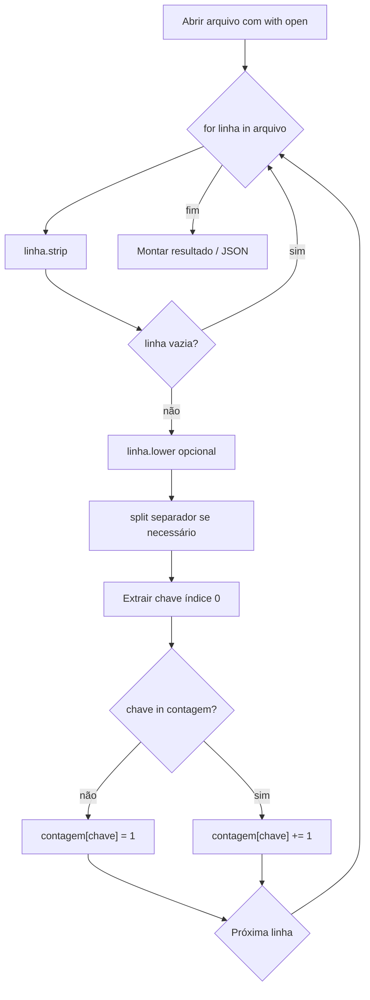
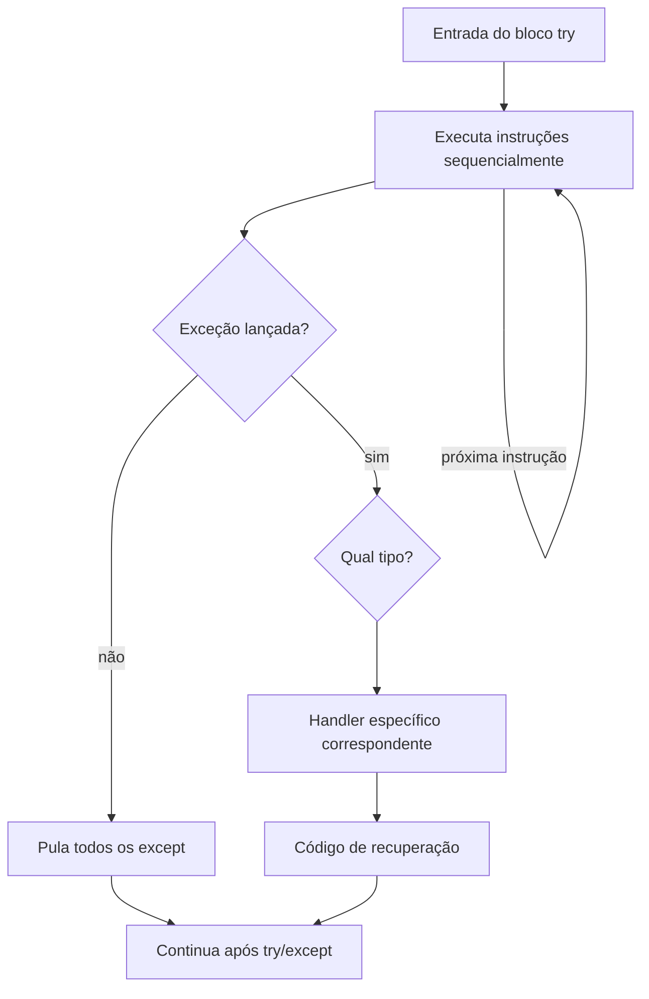

## Visão Geral do Conceito

Em pipelines de processamento de dados — logs de mensagens, listas de e-mails exportadas de planilhas, arquivos `.txt` gerados por sistemas legados — **duas coisas acontecem com frequência**: os dados chegam **sujos** (espaços extras, capitalização inconsistente, linhas vazias) e as operações **falham** (arquivo inexistente, divisão por zero, conversão inválida).

A linguagem Python oferece dois mecanismos complementares para lidar com isso:

1. **Normalização e contagem estruturada** — ler linha a linha, limpar strings, agrupar ocorrências em dicionários.
2. **Tratamento de exceções** — blocos <mark style="background-color: #242424; padding: 2px 4px; border-radius: 3px; color: inherit;">`try`</mark>/<mark style="background-color: #242424; padding: 2px 4px; border-radius: 3px; color: inherit;">`except`</mark> que interceptam erros em tempo de execução e permitem que o programa continue ou falhe de forma controlada.

> **Regra:** Em produção, um script de ETL que trava na primeira linha inválida ou na ausência de um arquivo é inaceitável. Exceções existem para transformar **falhas previsíveis** em **fluxos tratáveis**.

Esta lição reconstrói o modelo mental usado na resolução dos exercícios de mensageria (TP3, exercício 16), deduplicação de e-mails (exercício 13) e na introdução ao <mark style="background-color: #242424; padding: 2px 4px; border-radius: 3px; color: inherit;">`try`</mark>/<mark style="background-color: #242424; padding: 2px 4px; border-radius: 3px; color: inherit;">`except`</mark> da aula.

**Não coberto integralmente no material da transcrição:** blocos <mark style="background-color: #242424; padding: 2px 4px; border-radius: 3px; color: inherit;">`else`</mark> e <mark style="background-color: #242424; padding: 2px 4px; border-radius: 3px; color: inherit;">`finally`</mark> em detalhe, diretiva <mark style="background-color: #242424; padding: 2px 4px; border-radius: 3px; color: inherit;">`pass`</mark> e depuração com <mark style="background-color: #242424; padding: 2px 4px; border-radius: 3px; color: inherit;">`pdb`</mark> (previstos para continuação na próxima aula).

---

## Modelo Mental

Imagine um pipeline de dados como uma **esteira de produção**:

```
Arquivo bruto → Leitura linha a linha → Limpeza → Extração de chave → Contagem → Relatório (JSON ou stdout)
```

Em cada estação, algo pode dar errado:

| Estação | Falha típica | Exceção Python |
|---------|--------------|----------------|
| Abrir arquivo | Caminho errado ou arquivo ausente | <mark style="background-color: #242424; padding: 2px 4px; border-radius: 3px; color: inherit;">`FileNotFoundError`</mark> |
| Converter texto em número | Entrada `"abc"` | <mark style="background-color: #242424; padding: 2px 4px; border-radius: 3px; color: inherit;">`ValueError`</mark> |
| Dividir por divisor zero | `100 / 0` | <mark style="background-color: #242424; padding: 2px 4px; border-radius: 3px; color: inherit;">`ZeroDivisionError`</mark> |
| Qualquer outro erro não previsto | — | <mark style="background-color: #242424; padding: 2px 4px; border-radius: 3px; color: inherit;">`Exception`</mark> (genérico) |

**Exceção** = evento anormal que **interrompe o fluxo normal** da execução. Sem tratamento, o interpretador encerra o programa e exibe traceback. Com <mark style="background-color: #242424; padding: 2px 4px; border-radius: 3px; color: inherit;">`try`</mark>/<mark style="background-color: #242424; padding: 2px 4px; border-radius: 3px; color: inherit;">`except`</mark>, você **desvia** o fluxo para código de recuperação.

Para contagem de ocorrências (remetentes, e-mails), pense no dicionário como **tabela de frequência**:

- **Chave** = identificador normalizado (nome do remetente, e-mail em minúsculas).
- **Valor** = quantas vezes apareceu.
- Na **primeira** ocorrência: criar chave com valor `1`.
- Nas **seguintes**: incrementar o valor existente.

Para **e-mails duplicados distintos** (não total de repetições), a contagem de "quantos endereços únicos se repetem" incrementa **somente na segunda ocorrência** de cada chave — evitando contar João três vezes como três duplicados quando na verdade é **um** endereço repetido.

---

## Mecânica Central

### Pipeline de leitura e normalização



#### Leitura com context manager

```python
linhas = []

with open("mensagens.txt", "r", encoding="utf-8") as arquivo:
    for linha in arquivo:
        linha_limpa = linha.strip()
        if linha_limpa:
            linhas.append(linha_limpa)
```

O <mark style="background-color: #242424; padding: 2px 4px; border-radius: 3px; color: inherit;">`with open(...)`</mark> garante que o arquivo seja **fechado automaticamente** ao sair do bloco, mesmo se ocorrer erro — reduz risco de vazamento de descritores de arquivo em scripts longos.

#### Funções de string essenciais

| Função | Efeito | Uso no pipeline |
|--------|--------|-----------------|
| <mark style="background-color: #242424; padding: 2px 4px; border-radius: 3px; color: inherit;">`strip()`</mark> | Remove espaços no início e fim | Limpar leading/trailing spaces de e-mails |
| <mark style="background-color: #242424; padding: 2px 4px; border-radius: 3px; color: inherit;">`lower()`</mark> | Converte para minúsculas | Unificar `Joao@Empresa` e `joao@empresa` |
| <mark style="background-color: #242424; padding: 2px 4px; border-radius: 3px; color: inherit;">`split(";")`</mark> | Divide string pelo separador | Separar remetente de mensagem em logs |

#### Contagem com dicionário

```python
contagem = {}

for linha in linhas:
    remetente = linha.split(";")[0]
    if remetente in contagem:
        contagem[remetente] += 1
    else:
        contagem[remetente] = 1
```

Padrão equivalente mais idiomático:

```python
contagem = {}
for remetente in remetentes:
    contagem[remetente] = contagem.get(remetente, 0) + 1
```

#### Detecção de duplicados (exercício 13)

```python
contagem = {}
duplicados = 0

for email in emails_normalizados:
    if email in contagem:
        contagem[email] += 1
        if contagem[email] == 2:
            duplicados += 1
    else:
        contagem[email] = 1
```

> **Regra:** Use `== 2`, não `> 1`. Com `> 1`, cada ocorrência extra incrementaria `duplicados` de novo — contando repetições em vez de endereços distintos duplicados.

#### Serialização JSON

- <mark style="background-color: #242424; padding: 2px 4px; border-radius: 3px; color: inherit;">`json.dumps(obj)`</mark> → retorna **string** JSON.
- <mark style="background-color: #242424; padding: 2px 4px; border-radius: 3px; color: inherit;">`json.dump(obj, arquivo)`</mark> → **escreve** diretamente no arquivo.

```python
import json

resultado = {
    "total_remetentes": len(contagem),
    "total_mensagens": len(linhas),
    "contagem": [
        {"remetente": nome, "mensagens": str(qtd)}
        for nome, qtd in contagem.items()
    ],
}

with open("remetentes.json", "w", encoding="utf-8") as saida:
    json.dump(resultado, saida, indent=2, ensure_ascii=False)
```

### Sintaxe try/except



Estrutura básica:

```python
try:
    # código que pode falhar
    numero = int(entrada)
    resultado = 100 / numero
except ValueError:
    print("Entrada não é um número válido.")
except ZeroDivisionError:
    print("Divisão por zero não é permitida.")
except Exception:
    print("Algum problema aconteceu.")
```

**Comportamentos fundamentais:**

1. O bloco <mark style="background-color: #242424; padding: 2px 4px; border-radius: 3px; color: inherit;">`except`</mark> **só executa** se a exceção declarada for lançada no <mark style="background-color: #242424; padding: 2px 4px; border-radius: 3px; color: inherit;">`try`</mark>.
2. Se **nenhuma** exceção ocorrer, todos os <mark style="background-color: #242424; padding: 2px 4px; border-radius: 3px; color: inherit;">`except`</mark> são ignorados.
3. **Apenas um** handler é executado por exceção — o primeiro compatível na ordem de declaração.
4. Quando uma exceção é lançada dentro do <mark style="background-color: #242424; padding: 2px 4px; border-radius: 3px; color: inherit;">`try`</mark>, o restante do bloco <mark style="background-color: #242424; padding: 2px 4px; border-radius: 3px; color: inherit;">`try`</mark> **não executa** (fluxo interrompido).

#### Hierarquia de exceções

Todas as exceções built-in derivam de <mark style="background-color: #242424; padding: 2px 4px; border-radius: 3px; color: inherit;">`BaseException`</mark>; na prática, capture <mark style="background-color: #242424; padding: 2px 4px; border-radius: 3px; color: inherit;">`Exception`</mark> como fallback genérico:

```
BaseException
 └── Exception          ← fallback genérico (use por último)
      ├── ValueError
      ├── ZeroDivisionError
      ├── FileNotFoundError
      └── ... (centenas de tipos específicos)
```

> **Regra de ordem:** Handlers **mais específicos primeiro**, <mark style="background-color: #242424; padding: 2px 4px; border-radius: 3px; color: inherit;">`Exception`</mark> **por último**. Se `Exception` vier antes de `ZeroDivisionError`, divisão por zero será tratada genericamente e a mensagem específica nunca aparecerá.

#### try/except aninhado

É válido colocar um bloco <mark style="background-color: #242424; padding: 2px 4px; border-radius: 3px; color: inherit;">`try`</mark> dentro de outro <mark style="background-color: #242424; padding: 2px 4px; border-radius: 3px; color: inherit;">`except`</mark> ou dentro de outro <mark style="background-color: #242424; padding: 2px 4px; border-radius: 3px; color: inherit;">`try`</mark>. Recomenda-se no máximo **dois níveis** de aninhamento — além disso, refatore em funções menores para manter legibilidade.

---

## Uso Prático

### Cenário 1 — Relatório de mensagens internas (exercício 16)

Arquivo `mensagens.txt`, uma linha por mensagem, formato `Remetente;mensagem`:

```
Ana;Bom dia, pessoal.
Bruno;Alguém viu o relatório?
```

Pipeline completo:

```python
import json

linhas = []

with open("mensagens.txt", "r", encoding="utf-8") as f:
    for linha in f:
        linha_limpa = linha.strip()
        if linha_limpa:
            linhas.append(linha_limpa)

contagem = {}
for linha in linhas:
    remetente = linha.split(";")[0]
    contagem[remetente] = contagem.get(remetente, 0) + 1

remetentes_json = [
    {"remetente": nome, "mensagens": str(qtd)}
    for nome, qtd in contagem.items()
]

resultado = {
    "total_remetentes": len(contagem),
    "total_mensagens": len(linhas),
    "contagem": remetentes_json,
}

with open("remetentes.json", "w", encoding="utf-8") as f:
    json.dump(resultado, f, indent=2, ensure_ascii=False)

print(f"Relatório gerado: {len(contagem)} remetentes, {len(linhas)} mensagens.")
```

Saída esperada em `remetentes.json`:

```json
{
  "total_remetentes": 5,
  "total_mensagens": 20,
  "contagem": [
    {"remetente": "Ana", "mensagens": "7"},
    {"remetente": "Bruno", "mensagens": "5"}
  ]
}
```

Note que <mark style="background-color: #242424; padding: 2px 4px; border-radius: 3px; color: inherit;">`mensagens`</mark> é string no JSON de saída — conforme especificação do exercício.

### Cenário 2 — Deduplicação de e-mails (exercício 13)

Arquivo `cadastros.txt` com inconsistências:

```
  joao@empresa.com
JOAO@EMPRESA.COM
maria@empresa.com
```

```python
emails_normalizados = []

with open("cadastros.txt", "r", encoding="utf-8") as f:
    for linha in f:
        email = linha.strip().lower()
        if email:
            emails_normalizados.append(email)

contagem = {}
duplicados = 0

for email in emails_normalizados:
    if email in contagem:
        contagem[email] += 1
        if contagem[email] == 2:
            duplicados += 1
    else:
        contagem[email] = 1

print(f"Total de e-mails únicos: {len(contagem)}")
print(f"E-mails duplicados: {duplicados}")

for email, qtd in contagem.items():
    if qtd > 1:
        print(email)
```

### Cenário 3 — Leitura robusta de arquivo inexistente

Versão frágil (trava o programa):

```python
with open("dados_inexistentes.txt", "r") as f:
    conteudo = f.read()
print("Processamento concluído.")  # nunca executa se arquivo não existir
```

Versão resiliente:

```python
conteudo = ""

try:
    with open("dados.txt", "r", encoding="utf-8") as f:
        conteudo = f.read()
    print("Arquivo lido com sucesso.")
except FileNotFoundError:
    print("Arquivo não encontrado. Usando dados vazios.")
except Exception:
    print("Erro inesperado na leitura.")

print("Programa continua normalmente.")
```

### Cenário 4 — Validação de entrada numérica em loop

Padrão comum em scripts interativos de relatório:

```python
while True:
    try:
        entrada = input("Digite um divisor inteiro positivo: ")
        numero = int(entrada)
        resultado = 100 / numero
        print(f"Resultado: {resultado}")
        break
    except ValueError:
        print("Entrada inválida. Use apenas dígitos.")
    except ZeroDivisionError:
        print("Zero não é permitido como divisor.")
```

Cada iteração trata um tipo de erro e **força nova tentativa** — padrão útil em ferramentas de linha de comando internas.

---

## Erros Comuns

**Esquecer `strip()` antes de comparar e-mails**

Sintoma: `joao@empresa.com` e ` joao@empresa.com` contam como chaves diferentes.

Correção: sempre normalizar com <mark style="background-color: #242424; padding: 2px 4px; border-radius: 3px; color: inherit;">`strip().lower()`</mark> antes de usar como chave de dicionário.

---

**Confundir `len(linhas)` com soma de contagens**

Sintoma: `total_mensagens` calculado como soma dos valores do dicionário quando deveria ser número de linhas lidas.

Correção: <mark style="background-color: #242424; padding: 2px 4px; border-radius: 3px; color: inherit;">`total_mensagens = len(linhas)`</mark> conta registros; <mark style="background-color: #242424; padding: 2px 4px; border-radius: 3px; color: inherit;">`len(contagem)`</mark> conta remetentes **únicos**.

---

**Incrementar `duplicados` em toda repetição (`> 1` em vez de `== 2`)**

Sintoma: três ocorrências de João incrementam contador de duplicados duas vezes.

Correção: incrementar apenas quando <mark style="background-color: #242424; padding: 2px 4px; border-radius: 3px; color: inherit;">`contagem[email] == 2`</mark>.

---

**`except Exception` antes de handlers específicos**

Sintoma: divisão por zero exibe "entrada inválida" ou mensagem genérica incorreta.

Correção: reordenar — <mark style="background-color: #242424; padding: 2px 4px; border-radius: 3px; color: inherit;">`ValueError`</mark>, <mark style="background-color: #242424; padding: 2px 4px; border-radius: 3px; color: inherit;">`ZeroDivisionError`</mark>, <mark style="background-color: #242424; padding: 2px 4px; border-radius: 3px; color: inherit;">`FileNotFoundError`</mark> primeiro; <mark style="background-color: #242424; padding: 2px 4px; border-radius: 3px; color: inherit;">`Exception`</mark> por último.

---

**Assumir que múltiplos erros no mesmo `try` disparam múltiplos `except`**

Sintoma: esperar tratar `ZeroDivisionError` e `FileNotFoundError` na mesma execução.

Correção: a **primeira** exceção interrompe o `try`; handlers subsequentes no mesmo bloco não executam para essa execução.

---

**Usar `json.dumps` quando precisa gravar arquivo**

Sintoma: JSON gerado mas não persistido.

Correção: <mark style="background-color: #242424; padding: 2px 4px; border-radius: 3px; color: inherit;">`json.dump(resultado, arquivo)`</mark> para escrita; <mark style="background-color: #242424; padding: 2px 4px; border-radius: 3px; color: inherit;">`json.dumps(resultado)`</mark> quando precisa de string (API, log).

---

**Índice errado após `split`**

Sintoma: <mark style="background-color: #242424; padding: 2px 4px; border-radius: 3px; color: inherit;">`IndexError`</mark> ao acessar `[1]` em linha sem separador.

Correção: validar <mark style="background-color: #242424; padding: 2px 4px; border-radius: 3px; color: inherit;">`len(partes) >= 1`</mark> ou usar <mark style="background-color: #242424; padding: 2px 4px; border-radius: 3px; color: inherit;">`try`</mark>/<mark style="background-color: #242424; padding: 2px 4px; border-radius: 3px; color: inherit;">`except IndexError`</mark>.

---

## Visão Geral de Debugging

Quando um pipeline de dados falha, siga esta sequência:

1. **Identifique a linha exata do traceback** — a última entrada em "Traceback" aponta arquivo, linha e tipo de exceção.
2. **Classifique o erro:**
   - <mark style="background-color: #242424; padding: 2px 4px; border-radius: 3px; color: inherit;">`FileNotFoundError`</mark> → caminho, diretório de trabalho, nome do arquivo.
   - <mark style="background-color: #242424; padding: 2px 4px; border-radius: 3px; color: inherit;">`ValueError`</mark> → dado de entrada incompatível com conversão.
   - <mark style="background-color: #242424; padding: 2px 4px; border-radius: 3px; color: inherit;">`KeyError`</mark> → chave ausente no dicionário (prefira `.get()`).
   - <mark style="background-color: #242424; padding: 2px 4px; border-radius: 3px; color: inherit;">`JSONDecodeError`</mark> → arquivo corrompido ou não-JSON.
3. **Isole com prints temporários** ou inspecione variáveis intermediárias (`linhas[:5]`, `contagem`) antes da etapa que falha.
4. **Teste cada estação separadamente** — leitura pura, depois normalização, depois contagem, depois serialização.
5. **Verifique ordem dos `except`** se a mensagem de erro não corresponde ao problema real.

<details>
<summary>Ver checklist rápido para contagem incorreta</summary>

- Arquivo foi gerado/está no diretório correto?
- Linhas vazias foram filtradas com `if linha_limpa`?
- Separador do `split` corresponde ao formato real (`;` vs `,`)?
- Normalização (`lower`) foi aplicada **antes** de inserir no dicionário?
- Para duplicados: condição é `== 2` e não `>= 2`?

</details>

**Não coberto no material:** uso interativo do depurador <mark style="background-color: #242424; padding: 2px 4px; border-radius: 3px; color: inherit;">`pdb`</mark> e breakpoints em IDE — tema da continuação da trilha.

---

## Principais Pontos

- Pipelines de dados em Python combinam **leitura linha a linha**, **normalização de strings** e **agregação em dicionários**.
- <mark style="background-color: #242424; padding: 2px 4px; border-radius: 3px; color: inherit;">`with open(...)`</mark> fecha arquivos automaticamente; prefira sempre a leitura dentro de context manager.
- <mark style="background-color: #242424; padding: 2px 4px; border-radius: 3px; color: inherit;">`strip()`</mark>, <mark style="background-color: #242424; padding: 2px 4px; border-radius: 3px; color: inherit;">`lower()`</mark> e <mark style="background-color: #242424; padding: 2px 4px; border-radius: 3px; color: inherit;">`split()`</mark> são as três operações mais usadas para limpar logs e listas de contato.
- Contagem por chave: verificar existência (`in`) ou usar <mark style="background-color: #242424; padding: 2px 4px; border-radius: 3px; color: inherit;">`.get(chave, 0) + 1`</mark>.
- Duplicados **distintos** contam na **segunda** ocorrência de cada chave (`contagem == 2`).
- <mark style="background-color: #242424; padding: 2px 4px; border-radius: 3px; color: inherit;">`json.dump`</mark> grava em arquivo; <mark style="background-color: #242424; padding: 2px 4px; border-radius: 3px; color: inherit;">`json.dumps`</mark> retorna string.
- Exceções interrompem o fluxo; <mark style="background-color: #242424; padding: 2px 4px; border-radius: 3px; color: inherit;">`try`</mark>/<mark style="background-color: #242424; padding: 2px 4px; border-radius: 3px; color: inherit;">`except`</mark> permite recuperação controlada.
- Handlers específicos **antes**, <mark style="background-color: #242424; padding: 2px 4px; border-radius: 3px; color: inherit;">`Exception`</mark> **depois**; apenas **um** handler por exceção lançada.
- Um erro no `try` impede execução das instruções restantes daquele bloco.

---

## Preparação para Prática

Ao concluir esta lição, você deve conseguir:

- Ler arquivo `.txt` linha a linha, ignorar linhas vazias e normalizar strings.
- Implementar contagem de ocorrências por chave com dicionário Python.
- Detectar itens duplicados contando endereços distintos que se repetem.
- Gerar relatório JSON com totais e listagem estruturada.
- Envolver operações arriscadas (I/O, conversão, divisão) em blocos <mark style="background-color: #242424; padding: 2px 4px; border-radius: 3px; color: inherit;">`try`</mark>/<mark style="background-color: #242424; padding: 2px 4px; border-radius: 3px; color: inherit;">`except`</mark> com handlers na ordem correta.
- Explicar por que um programa continua executando após exceção tratada, mas trava sem tratamento.

---

## Laboratório de Prática

### Easy — Normalizar linhas de log

O setor de operações exportou logs de acesso em texto bruto. Complete a função que remove espaços extras e converte cada linha para minúsculas, ignorando linhas vazias após limpeza.

```python
def normalizar_logs(linhas_brutas: list[str]) -> list[str]:
    resultado = []
    for linha in linhas_brutas:
        # TODO: aplicar strip e lower; adicionar à lista apenas se não for vazia
        pass
    return resultado


if __name__ == "__main__":
    amostra = ["  GET /api/pedidos  ", "", "POST /api/login", "  "]
    print(normalizar_logs(amostra))
    # Esperado: ['get /api/pedidos', 'post /api/login']
```

---

### Medium — Contagem de requisições por endpoint

Dado um arquivo simulado de log HTTP (uma requisição por linha), implemente a contagem de ocorrências por endpoint. Trate arquivo ausente sem derrubar o programa.

```python
LOG_SIMULADO = [
    "GET /api/pedidos",
    "POST /api/login",
    "GET /api/pedidos",
    "GET /api/usuarios",
    "POST /api/login",
]

def contar_endpoints(linhas: list[str]) -> dict[str, int]:
    contagem = {}
    for linha in linhas:
        partes = linha.strip().split()
        if len(partes) >= 2:
            endpoint = partes[1]
            # TODO: incrementar contagem[endpoint]
            pass
    return contagem


def ler_log_ou_vazio(caminho: str) -> list[str]:
    linhas = []
    # TODO: usar try/except FileNotFoundError para ler o arquivo
    #       ou retornar lista vazia com mensagem de aviso
    return linhas


if __name__ == "__main__":
    dados = LOG_SIMULADO  # substitua por ler_log_ou_vazio("access.log") em produção
    print(contar_endpoints(dados))
```

---

### Hard — Pipeline completo: e-mails duplicados com tratamento de erros

Implemente pipeline que lê `cadastros.txt`, normaliza e-mails, conta únicos e duplicados distintos, e grava `relatorio.json`. Trate `FileNotFoundError`, linhas malformadas e erros genéricos.

```python
import json

CADASTROS = [
    "  Ana@Empresa.COM ",
    "ana@empresa.com",
    "pedro@empresa.com",
    "PEDRO@empresa.com",
    "maria@empresa.com",
    "  ",
    "invalido-sem-arroba",
]


def processar_cadastros(linhas: list[str]) -> dict:
    emails = []
    for linha in linhas:
        email = linha.strip().lower()
        if not email:
            continue
        if "@" not in email:
            continue  # ignora linha malformada
        emails.append(email)

    contagem = {}
    duplicados = 0

    for email in emails:
        # TODO: implementar lógica de contagem e detecção de duplicados (== 2)
        pass

    return {
        "total_unicos": len(contagem),
        "total_duplicados": duplicados,
        "emails_repetidos": [e for e, q in contagem.items() if q > 1],
    }


def executar_pipeline(caminho_entrada: str, caminho_saida: str) -> None:
    try:
        with open(caminho_entrada, "r", encoding="utf-8") as f:
            linhas = f.readlines()
        relatorio = processar_cadastros(linhas)
        with open(caminho_saida, "w", encoding="utf-8") as f:
            json.dump(relatorio, f, indent=2, ensure_ascii=False)
        print("Relatório gerado com sucesso.")
    except FileNotFoundError:
        # TODO: mensagem amigável; não relançar exceção
        pass
    except PermissionError:
        # TODO: tratar falta de permissão de escrita
        pass
    except Exception:
        # TODO: fallback genérico
        pass


if __name__ == "__main__":
    # Para teste local sem arquivo, use CADASTROS como entrada simulada
    relatorio = processar_cadastros(CADASTROS)
    print(json.dumps(relatorio, indent=2, ensure_ascii=False))
```

---

<!-- CONCEPT_EXTRACTION
concepts:
  - exceções Python
  - try/except
  - hierarquia de exceções
  - FileNotFoundError
  - ValueError
  - ZeroDivisionError
  - normalização de strings
  - strip lower split
  - contagem com dicionário
  - detecção de duplicados
  - json.dump
  - context manager with open
skills:
  - Normalizar strings de logs antes de agregação
  - Implementar contagem de ocorrências por chave em dicionário
  - Detectar endereços duplicados distintos com lógica de segunda ocorrência
  - Serializar resultados de pipeline em JSON com json.dump
  - Tratar exceções específicas e genéricas na ordem correta
  - Construir pipelines de leitura de arquivo resilientes a falhas de I/O
examples:
  - pipeline-mensagens-remetentes-json
  - deduplicacao-emails-normalizados
  - try-except-leitura-arquivo
  - validacao-entrada-numerica-loop
-->

<!-- EXERCISES_JSON
[
  {
    "id": "normalizar-linhas-log",
    "slug": "normalizar-linhas-log",
    "difficulty": "easy",
    "title": "Normalizar linhas de log",
    "discipline": "python",
    "editorLanguage": "python",
    "tags": ["python", "strings", "strip", "lower", "normalizacao"],
    "summary": "Aplicar strip e lower em linhas de log, ignorando entradas vazias após limpeza."
  },
  {
    "id": "contagem-endpoints-try-except",
    "slug": "contagem-endpoints-try-except",
    "difficulty": "medium",
    "title": "Contagem de endpoints com tratamento de arquivo",
    "discipline": "python",
    "editorLanguage": "python",
    "tags": ["python", "dicionario", "contagem", "try-except", "file-not-found"],
    "summary": "Contar requisições por endpoint em log HTTP e tratar arquivo ausente com FileNotFoundError."
  },
  {
    "id": "pipeline-emails-duplicados-json",
    "slug": "pipeline-emails-duplicados-json",
    "difficulty": "hard",
    "title": "Pipeline de e-mails duplicados com JSON",
    "discipline": "python",
    "editorLanguage": "python",
    "tags": ["python", "pipeline", "duplicados", "json", "excecoes"],
    "summary": "Normalizar e-mails, detectar duplicados distintos, gravar relatório JSON e tratar múltiplos tipos de exceção."
  }
]
-->

```json
LESSONS_JSON_HINT
{
  "discipline": "python",
  "slug": "tratamento-excecoes-pipelines-dados",
  "title": "Tratamento de exceções e pipelines resilientes de processamento de dados",
  "order": 13,
  "file": "content/python/tratamento-excecoes-pipelines-dados.md"
}
```
