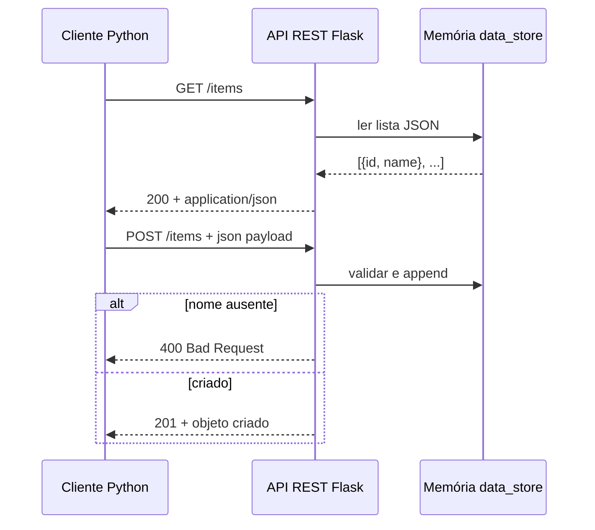
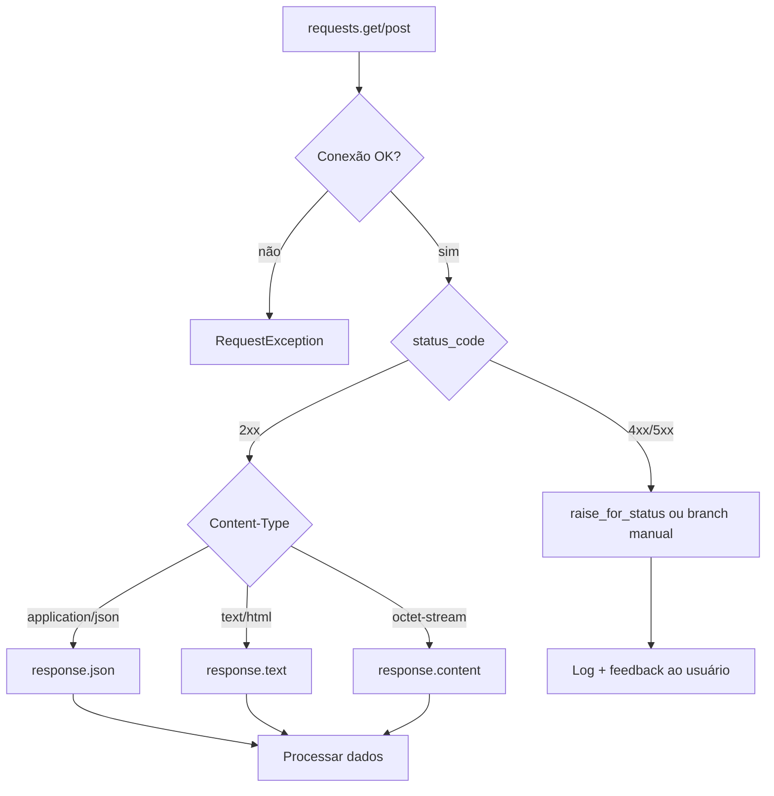

## Visão Geral do Conceito

Integrar aplicações Python com serviços web é rotina em Análise e Desenvolvimento de Sistemas: buscar dados meteorológicos, enviar registros para um back-end, consumir APIs de IA ou sincronizar planilhas com um servidor central. A biblioteca <mark style="background-color: #242424; padding: 2px 4px; border-radius: 3px; color: inherit;">`requests`</mark> encapsula o protocolo HTTP e devolve um objeto <mark style="background-color: #242424; padding: 2px 4px; border-radius: 3px; color: inherit;">`Response`</mark> com tudo que o servidor retornou.

O problema que esta lição resolve não é “fazer a requisição” — isso costuma ser uma linha de código. O desafio real é **interpretar corretamente** o que voltou: o status indica sucesso ou falha? O corpo é JSON, HTML ou binário? O cliente deve repetir, autenticar ou informar o usuário? Sem esse passo, pipelines de dados quebram silenciosamente ou explodem com <mark style="background-color: #242424; padding: 2px 4px; border-radius: 3px; color: inherit;">`JSONDecodeError`</mark> quando o servidor devolve HTML de erro.

> **Regra:** Toda integração HTTP robusta segue a ordem **status → tipo de conteúdo → corpo → headers**. Nunca assuma que uma chamada “funcionou” só porque não houve exceção de rede.

## Modelo Mental

Pense em uma API REST como um **restaurante com cardápio fixo por URL**:

- O **cliente** (seu script Python) escolhe o prato pela URL e pelo método (<mark style="background-color: #242424; padding: 2px 4px; border-radius: 3px; color: inherit;">`GET`</mark> consulta; <mark style="background-color: #242424; padding: 2px 4px; border-radius: 3px; color: inherit;">`POST`</mark> envia dados para criar algo).
- O **servidor** (por exemplo, Flask em um container) prepara a resposta e devolve um **recibo HTTP**: código numérico (200, 201, 400…), cabeçalhos (metadados) e corpo (payload).

No laboratório da disciplina, o professor hospeda um servidor de itens em memória — lista JSON com `id` e `name` — exposto via túnel público. Você atua como **cliente**: consulta a lista, insere nomes e valida se a operação teve sucesso. Os dados vivem na memória do servidor; se o container reinicia, o estado some — isso reforça que **persistência é responsabilidade do servidor**, não do cliente.

A família do status code orienta a reação:

| Família | Significado | Ação típica do cliente |
|---------|-------------|------------------------|
| 2xx | Sucesso | Processar corpo |
| 3xx | Redirecionamento | Seguir `Location` ou ajustar URL |
| 4xx | Erro do cliente | Corrigir payload, URL ou credenciais |
| 5xx | Erro do servidor | Retry, alerta, fallback |

## Mecânica Central

### Arquitetura cliente–servidor



### O objeto Response

Toda chamada como <mark style="background-color: #242424; padding: 2px 4px; border-radius: 3px; color: inherit;">`requests.get(url)`</mark> ou <mark style="background-color: #242424; padding: 2px 4px; border-radius: 3px; color: inherit;">`requests.post(url, json=payload)`</mark> retorna um <mark style="background-color: #242424; padding: 2px 4px; border-radius: 3px; color: inherit;">`Response`</mark>. Os membros mais usados:

| Atributo / método | Função |
|-------------------|--------|
| <mark style="background-color: #242424; padding: 2px 4px; border-radius: 3px; color: inherit;">`status_code`</mark> | Código HTTP inteiro (200, 201, 400…) |
| <mark style="background-color: #242424; padding: 2px 4px; border-radius: 3px; color: inherit;">`ok`</mark> | `True` **somente** se `status_code == 200` |
| <mark style="background-color: #242424; padding: 2px 4px; border-radius: 3px; color: inherit;">`raise_for_status()`</mark> | Lança exceção se status for 4xx ou 5xx |
| <mark style="background-color: #242424; padding: 2px 4px; border-radius: 3px; color: inherit;">`headers`</mark> | Dicionário-like de cabeçalhos |
| <mark style="background-color: #242424; padding: 2px 4px; border-radius: 3px; color: inherit;">`json()`</mark> | Parse do corpo como JSON → `dict`/`list` |
| <mark style="background-color: #242424; padding: 2px 4px; border-radius: 3px; color: inherit;">`text`</mark> | Corpo decodificado como string |
| <mark style="background-color: #242424; padding: 2px 4px; border-radius: 3px; color: inherit;">`content`</mark> | Corpo em `bytes` (arquivos, imagens) |

### GET: consulta sem corpo de envio

```python
import requests

BASE_URL = "https://exemplo.ngrok-free.app"  # URL fornecida pelo servidor

response = requests.get(f"{BASE_URL}/items")
print(f"Status: {response.status_code}")
print(response.json())
```

O servidor Flask equivalente expõe rota <mark style="background-color: #242424; padding: 2px 4px; border-radius: 3px; color: inherit;">`@app.route('/items', methods=['GET'])`</mark> e retorna <mark style="background-color: #242424; padding: 2px 4px; border-radius: 3px; color: inherit;">`jsonify(data_store), 200`</mark>.

### POST: criação com payload JSON

```python
payload = {"name": "Beatriz"}

response = requests.post(f"{BASE_URL}/items", json=payload)
print(f"Status: {response.status_code}")
print(response.json())
```

O parâmetro <mark style="background-color: #242424; padding: 2px 4px; border-radius: 3px; color: inherit;">`json=payload`</mark> serializa o dicionário, define <mark style="background-color: #242424; padding: 2px 4px; border-radius: 3px; color: inherit;">`Content-Type: application/json`</mark> e envia no corpo. No servidor, <mark style="background-color: #242424; padding: 2px 4px; border-radius: 3px; color: inherit;">`request.get_json()`</mark> reconstrói o objeto Python.

Respostas esperadas no servidor de laboratório:

- **201 Created** — item novo com `id` gerado automaticamente.
- **400 Bad Request** — payload sem campo `name` obrigatório.

### Verificação de status: manual vs automática

**Verificação manual** — controle fino por código:

```python
if response.status_code == 200:
    dados = response.json()
elif response.status_code == 404:
    print("Recurso não encontrado")
elif response.status_code == 401:
    print("Não autorizado — verifique token")
```

**Verificação com guard rail** — padrão recomendado em pipelines:

```python
import requests

try:
    response = requests.get(f"{BASE_URL}/items")
    response.raise_for_status()
    dados = response.json()
except requests.exceptions.HTTPError as exc:
    print(f"Erro HTTP: {exc.response.status_code}")
except requests.exceptions.RequestException as exc:
    print(f"Falha de rede: {exc}")
```

<mark style="background-color: #242424; padding: 2px 4px; border-radius: 3px; color: inherit;">`raise_for_status()`</mark> não substitui lógica de negócio: um POST pode retornar 400 com JSON explicando o campo inválido — você ainda precisa ler o corpo após capturar ou tratar o status.

### Fluxo de decisão no cliente



### Headers, cookies e URL final

Cabeçalhos funcionam como metadados da mensagem HTTP:

```python
content_type = response.headers.get("Content-Type", "")
encoding = response.apparent_encoding  # inferido se o servidor não declarar
cookies = response.cookies.get_dict()
url_final = response.url  # após redirects
```

Antes de chamar <mark style="background-color: #242424; padding: 2px 4px; border-radius: 3px; color: inherit;">`response.json()`</mark>, confirme que o servidor declarou JSON — APIs mal configuradas ou proxies podem devolver HTML de erro com status 200.

### Contexto de infraestrutura (laboratório)

**Não coberto em profundidade nesta disciplina:** Docker, Dockerfile e ngrok são ferramentas de **hospedagem** usadas pelo professor para disponibilizar o servidor. Para você como cliente, basta configurar <mark style="background-color: #242424; padding: 2px 4px; border-radius: 3px; color: inherit;">`BASE_URL`</mark> com a URL pública atualizada a cada reinício do túnel. Alternativa local: <mark style="background-color: #242424; padding: 2px 4px; border-radius: 3px; color: inherit;">`http://127.0.0.1:5000`</mark> se você executar o Flask na própria máquina.

## Uso Prático

### Cenário 1: sincronizar lista de itens após inserção

Fluxo completo espelhando o laboratório — GET inicial, POST de novo registro, GET de confirmação:

```python
import json
import requests

BASE_URL = "https://exemplo.ngrok-free.app"

def listar_itens() -> list:
    response = requests.get(f"{BASE_URL}/items")
    response.raise_for_status()
    return response.json()

def criar_item(nome: str) -> dict:
    response = requests.post(f"{BASE_URL}/items", json={"name": nome})
    response.raise_for_status()
    return response.json()

if __name__ == "__main__":
    print("--- Antes ---")
    print(json.dumps(listar_itens(), indent=2, ensure_ascii=False))

    novo = criar_item("Gabriel")
    print(f"\nCriado: id={novo['id']}, name={novo['name']}")

    print("\n--- Depois ---")
    print(json.dumps(listar_itens(), indent=2, ensure_ascii=False))
```

Saída esperada: status 200 nos GETs, 201 no POST, lista com um elemento a mais.

### Cenário 2: API meteorológica (GET externo)

Padrão visto em aula anterior — consulta pública com query string:

```python
import json
import requests

params = {
    "latitude": -23.55,
    "longitude": -46.63,
    "current": "temperature_2m,wind_speed_10m",
}
response = requests.get("https://api.open-meteo.com/v1/forecast", params=params)

print(f"HTTP {response.status_code}")
print(json.dumps(response.json(), indent=4))
```

Aqui <mark style="background-color: #242424; padding: 2px 4px; border-radius: 3px; color: inherit;">`params`</mark> monta a query string; o servidor devolve JSON com temperatura e vento.

### Cenário 3: download de arquivo binário

Quando a resposta não é JSON nem texto — imagem, PDF, export CSV bruto:

```python
import requests

url = "https://servico.exemplo/arquivo/logo.png"
response = requests.get(url)
response.raise_for_status()

with open("logo.png", "wb") as arquivo:
    arquivo.write(response.content)
```

Use <mark style="background-color: #242424; padding: 2px 4px; border-radius: 3px; color: inherit;">`content`</mark> (bytes), nunca <mark style="background-color: #242424; padding: 2px 4px; border-radius: 3px; color: inherit;">`text`</mark>, para dados binários.

### Cenário 4: função reutilizável com validação de Content-Type

```python
import requests
from requests import Response

def parse_resposta_json(response: Response) -> dict | list:
    content_type = response.headers.get("Content-Type", "")
    if "application/json" not in content_type:
        raise ValueError(
            f"Esperado JSON, recebido: {content_type!r}. "
            f"Prévia: {response.text[:200]}"
        )
    return response.json()
```

## Erros Comuns

**Confiar em `response.ok` para POST bem-sucedido**  
<mark style="background-color: #242424; padding: 2px 4px; border-radius: 3px; color: inherit;">`ok`</mark> é `True` apenas para status 200. Um POST que cria recurso corretamente retorna 201 — `ok` será `False` mesmo com sucesso. Use `200 <= response.status_code < 300` ou trate 201 explicitamente.

**Chamar `response.json()` sem checar Content-Type**  
Se o servidor devolver HTML, imagem ou JSON malformado, ocorre <mark style="background-color: #242424; padding: 2px 4px; border-radius: 3px; color: inherit;">`requests.exceptions.JSONDecodeError`</mark>. Sintoma: traceback apontando para `response.json()` após status aparentemente bom.

**Ignorar status code e processar corpo direto**  
Servidor pode retornar 400 com JSON de erro ou 500 com página HTML. Sem <mark style="background-color: #242424; padding: 2px 4px; border-radius: 3px; color: inherit;">`raise_for_status()`</mark> ou branch por família, o pipeline trata erro como dado válido.

**Payload POST com aspas simples (não é JSON válido)**  
Em Python, `{'name': 'valor'}` no código está correto; o problema surge ao montar string manualmente com aspas simples e passar como texto cru em vez de usar <mark style="background-color: #242424; padding: 2px 4px; border-radius: 3px; color: inherit;">`json=dict`</mark>.

**URL desatualizada após reinício do servidor**  
Túneis ngrok geram URL nova a cada sessão. Sintoma: <mark style="background-color: #242424; padding: 2px 4px; border-radius: 3px; color: inherit;">`ConnectionError`</mark> ou 404 inesperado. Solução: atualizar <mark style="background-color: #242424; padding: 2px 4px; border-radius: 3px; color: inherit;">`BASE_URL`</mark>.

**Assumir persistência no servidor de laboratório**  
Dados em memória somem quando o container para. Um GET após reinício não traz registros inseridos na sessão anterior — comportamento esperado, não bug do cliente.

**Servidor retornando status incorreto (ex.: 400 em GET bem-sucedido)**  
Se o back-end devolve código errado, o cliente reage conforme o código — browsers e <mark style="background-color: #242424; padding: 2px 4px; border-radius: 3px; color: inherit;">`raise_for_status()`</mark> interpretam 400 como falha. Correção é no servidor; o cliente deve logar o status recebido para diagnóstico.

## Visão Geral de Debugging

1. **Reproduza a chamada isolada** — uma célula ou script mínimo com URL, método e payload fixos.
2. **Imprima `response.status_code` antes de qualquer parse** — confirme a família (2xx, 4xx, 5xx).
3. **Inspecione `response.headers.get("Content-Type")`** — decide entre `json()`, `text` ou `content`.
4. **Capture o corpo bruto em caso de dúvida** — `print(response.text[:500])` revela HTML de proxy, mensagem de erro ou JSON inesperado.
5. **Teste a URL no navegador** (para GET) — valida se o endpoint está no ar; compare status com o do script.
6. **Verifique conectividade** — `RequestException` indica DNS, timeout, SSL ou URL inválida, não erro de negócio HTTP.
7. **Compare antes/depois de POST** — dois GETs sequenciais confirmam se o estado do servidor mudou.

<details>
<summary>Checklist rápido quando a requisição “não funciona”</summary>

| Sintoma | Causa provável | Próximo passo |
|---------|----------------|---------------|
| `ConnectionError` | URL errada, túnel offline | Atualizar BASE_URL |
| `HTTPError 400` | Payload inválido | Conferir chaves do JSON enviado |
| `JSONDecodeError` | Corpo não é JSON | Ler `response.text` |
| `ok` False com dados corretos | Status 201 em vez de 200 | Testar faixa 2xx |
| Lista “voltou ao estado inicial” | Servidor reiniciou | Reinserir dados ou usar persistência em arquivo |

</details>

## Principais Pontos

- <mark style="background-color: #242424; padding: 2px 4px; border-radius: 3px; color: inherit;">`requests.get`</mark> consulta; <mark style="background-color: #242424; padding: 2px 4px; border-radius: 3px; color: inherit;">`requests.post(..., json=)`</mark> envia e cria recursos.
- O objeto <mark style="background-color: #242424; padding: 2px 4px; border-radius: 3px; color: inherit;">`Response`</mark> concentra status, headers e corpo — interprete nessa ordem.
- Famílias de status: 2xx sucesso, 4xx culpa do cliente, 5xx culpa do servidor.
- <mark style="background-color: #242424; padding: 2px 4px; border-radius: 3px; color: inherit;">`raise_for_status()`</mark> é o primeiro guard rail contra 4xx/5xx.
- <mark style="background-color: #242424; padding: 2px 4px; border-radius: 3px; color: inherit;">`json()`</mark>, <mark style="background-color: #242424; padding: 2px 4px; border-radius: 3px; color: inherit;">`text`</mark> e <mark style="background-color: #242424; padding: 2px 4px; border-radius: 3px; color: inherit;">`content`</mark> servem formatos diferentes de corpo.
- Valide <mark style="background-color: #242424; padding: 2px 4px; border-radius: 3px; color: inherit;">`Content-Type`</mark> antes de desserializar JSON.
- Estado em memória no servidor de laboratório não sobrevive a reinícios.

## Preparação para Prática

Ao concluir esta lição, você deve conseguir:

- Configurar <mark style="background-color: #242424; padding: 2px 4px; border-radius: 3px; color: inherit;">`BASE_URL`</mark> e executar GET em `/items` exibindo status e JSON formatado.
- Enviar POST com dicionário Python e identificar resposta 201 vs 400.
- Usar <mark style="background-color: #242424; padding: 2px 4px; border-radius: 3px; color: inherit;">`raise_for_status()`</mark> com <mark style="background-color: #242424; padding: 2px 4px; border-radius: 3px; color: inherit;">`try/except`</mark> para erros HTTP e de rede.
- Escolher o método correto de leitura do corpo conforme <mark style="background-color: #242424; padding: 2px 4px; border-radius: 3px; color: inherit;">`Content-Type`</mark>.
- Explicar por que um pipeline não deve assumir que HTTP 200 é o único código de sucesso nem que todo corpo é JSON.

## Laboratório de Prática

Configure a variável `BASE_URL` com a URL do servidor de itens fornecida em aula (túnel ngrok ou `http://127.0.0.1:5000` em ambiente local).

### Easy — Consultar itens e exibir status

Implemente a função que faz GET em `/items` e retorna o status code junto com a quantidade de registros.

```python
import requests

BASE_URL = "https://exemplo.ngrok-free.app"  # substitua pela URL atual

def consultar_itens():
    # TODO: fazer GET em f"{BASE_URL}/items"
    response = None  # substitua pela chamada requests.get

    # TODO: obter status_code da resposta
    status = 0

    # TODO: obter lista JSON com response.json() e calcular len
    quantidade = 0

    return status, quantidade


if __name__ == "__main__":
    status, qtd = consultar_itens()
    print(f"HTTP {status} — {qtd} itens")
```

### Medium — Criar item e validar sucesso HTTP

Complete a função que envia POST e usa <mark style="background-color: #242424; padding: 2px 4px; border-radius: 3px; color: inherit;">`raise_for_status()`</mark> para garantir que apenas respostas 2xx prosseguem.

```python
import requests

BASE_URL = "https://exemplo.ngrok-free.app"

def criar_item(nome: str) -> dict:
    payload = {"name": nome}
    response = requests.post(f"{BASE_URL}/items", json=payload)

    # TODO: chamar raise_for_status() para falhar em 4xx/5xx

    # TODO: retornar o dict JSON da resposta
    return {}


if __name__ == "__main__":
    try:
        item = criar_item("NovoRegistro")
        print(f"Criado id={item.get('id')} name={item.get('name')}")
    except requests.exceptions.HTTPError as exc:
        print(f"Falha HTTP: {exc.response.status_code}")
```

### Hard — Cliente robusto com validação de Content-Type e ramos por status

Implemente um cliente que trata sucesso, erro de validação (400) e falha de rede, só parseando JSON quando o header indicar `application/json`.

```python
import requests

BASE_URL = "https://exemplo.ngrok-free.app"


def buscar_itens_seguro() -> list | None:
    try:
        response = requests.get(f"{BASE_URL}/items", timeout=10)

        # TODO: se status for 400, imprimir mensagem e retornar None

        # TODO: chamar raise_for_status() para demais erros 4xx/5xx

        # TODO: verificar se "application/json" está em response.headers.get("Content-Type", "")
        # TODO: se não for JSON, lançar ValueError com prévia do corpo (response.text[:120])
        # TODO: retornar response.json()

        return []
    except requests.exceptions.RequestException as exc:
        print(f"Erro de rede: {exc}")
        return None


if __name__ == "__main__":
    dados = buscar_itens_seguro()
    if dados is not None:
        print(f"{len(dados)} itens carregados")
    else:
        print("Não foi possível obter itens")
```

<!-- CONCEPT_EXTRACTION
concepts:
  - biblioteca requests
  - objeto Response
  - GET e POST HTTP
  - status codes HTTP
  - raise_for_status
  - Content-Type
  - response.json text content
  - headers HTTP
  - API REST cliente-servidor
skills:
  - Executar GET e POST com requests
  - Interpretar status_code e famílias HTTP
  - Validar respostas com raise_for_status
  - Ler corpo em JSON texto ou binário conforme Content-Type
  - Tratar HTTPError e RequestException em integrações
  - Sincronizar dados via sequência GET-POST-GET
examples:
  - get-itens-api-laboratorio
  - post-criar-item-json
  - open-meteo-get-externo
  - download-binario-response-content
  - parse-json-com-validacao-content-type
-->

<!-- EXERCISES_JSON
[
  {
    "id": "consultar-itens-get-status",
    "slug": "consultar-itens-get-status",
    "difficulty": "easy",
    "title": "Consultar itens e exibir status",
    "discipline": "python-para-processamento-de-dados",
    "editorLanguage": "python",
    "tags": ["python", "requests", "get", "http"],
    "summary": "Fazer GET em /items e retornar status HTTP com a quantidade de registros JSON."
  },
  {
    "id": "criar-item-post-raise-for-status",
    "slug": "criar-item-post-raise-for-status",
    "difficulty": "medium",
    "title": "Criar item com POST e raise_for_status",
    "discipline": "python-para-processamento-de-dados",
    "editorLanguage": "python",
    "tags": ["python", "requests", "post", "json", "http"],
    "summary": "Enviar POST com payload JSON e usar raise_for_status antes de retornar o objeto criado."
  },
  {
    "id": "cliente-robusto-content-type",
    "slug": "cliente-robusto-content-type",
    "difficulty": "hard",
    "title": "Cliente robusto com Content-Type e erros HTTP",
    "discipline": "python-para-processamento-de-dados",
    "editorLanguage": "python",
    "tags": ["python", "requests", "error-handling", "content-type", "http"],
    "summary": "Implementar GET com timeout, ramos para 400, raise_for_status e validação de Content-Type antes do parse JSON."
  }
]
-->

LESSONS_JSON_HINT
```json
{
  "discipline": "python-para-processamento-de-dados",
  "slug": "cliente-http-requests-apis",
  "title": "Cliente HTTP com Requests: GET, POST e interpretação de respostas",
  "order": 16,
  "file": "content/python-para-processamento-de-dados/cliente-http-requests-apis.md"
}
```
