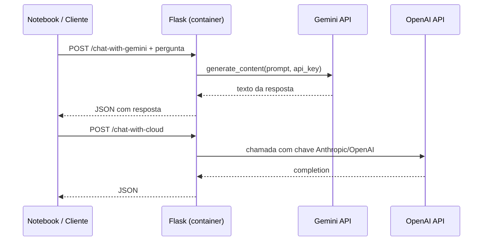

## Visão Geral do Conceito

Profissionais de dados e desenvolvimento passam a integrar **Large Language Models** (LLMs) em pipelines e aplicações: resumir logs, responder perguntas sobre documentação, gerar código ou expor um chat interno via API. A aula conecta três camadas: **cliente Python** que chama provedores de IA na nuvem (IA as a Service), **servidor Flask** que centraliza regras e credenciais, e **infraestrutura opcional** (Docker) para isolar o ambiente.

O problema central não é “usar o ChatGPT no navegador”, e sim **programar a conversa**: autenticar com chave de API, escolher modelo, enviar prompt e tratar erros HTTP — o mesmo padrão de integração usado com qualquer API REST, agora com respostas em linguagem natural.

> **Regra:** Toda integração com LLM em produção exige **credencial fora do código** (`.env` ou variável de ambiente) e **tratamento de status HTTP** antes de ler `response.text`.

## Modelo Mental

Pense em três atores:

1. **Seu script ou notebook** — faz perguntas (cliente).
2. **Servidor Flask** (opcional, mas recomendado no AT) — recebe HTTP do cliente, guarda chaves e orquestra chamadas.
3. **Provedor de LLM** (Google Gemini, OpenAI, Anthropic) — processa tokens e devolve texto.

A LLM não “sabe” seu sistema: ela estima a próxima palavra com base em estatística treinada em enormes corpora. Erros factuais (**alucinações**) são esperados; o código deve validar saídas críticas.



## Mecânica Central

### Hierarquia IA → LLM

Na trilha da disciplina: **IA** ⊃ **Machine Learning** ⊃ **Deep Learning** ⊃ **modelos fundacionais** ⊃ **LLM**. Poucos players (Google, OpenAI, Anthropic, Meta, Amazon) treinam modelos desse porte por custo de infraestrutura e dados.

### Chave de API

Credencial que identifica seu projeto perante o provedor. Fluxo típico (Gemini):

1. Acessar o console do Google AI com conta **pessoal** (contas institucionais podem bloquear criação de chave).
2. Criar **API Key** vinculada a um projeto.
3. Copiar a chave **inteira** (espaços ou trechos faltando geram HTTP 401).

Boas práticas (mencionadas na aula):

| Abordagem | Segurança | Uso típico |
|-----------|-----------|------------|
| Hardcoded no `.py` | Ruim | Só demo em sala |
| Arquivo `.env` + `python-dotenv` | Melhor | Laboratório / AT |
| `os.getenv("GEMINI_API_KEY")` | Melhor ainda | Servidor e CI |

### Cliente Gemini (primeiro experimento)

```python
# pip install google-generativeai
import google.generativeai as genai

API_KEY = "SUA_CHAVE_AQUI"  # em produção: os.getenv(...)
genai.configure(api_key=API_KEY)

client = genai.GenerativeModel("gemini-2.0-flash")
response = client.generate_content("O que é Python para processamento de dados?")
print(response.text)
```

A biblioteca expõe uma **classe de conexão** (`GenerativeModel`); você instancia o cliente e chama métodos — padrão repetido em OpenAI e Anthropic.

### Chatbot com loop

Encapsular a chamada em <mark style="background-color: #242424; padding: 2px 4px; border-radius: 3px; color: inherit;">`while True`</mark> + <mark style="background-color: #242424; padding: 2px 4px; border-radius: 3px; color: inherit;">`input()`</mark> transforma o script em REPL conversacional:

```python
while True:
    pergunta = input("Você: ")
    if pergunta.strip().lower() in {"sair", "exit"}:
        break
    resposta = client.generate_content(pergunta)
    print("IA:", resposta.text)
```

### OpenAI e Anthropic

Mesma ideia, sintaxe do SDK muda. OpenAI costuma exigir cartão para créditos; Gemini oferece tier gratuito limitado. Anthropic (Claude) aceita parâmetro <mark style="background-color: #242424; padding: 2px 4px; border-radius: 3px; color: inherit;">`role`</mark> e limite de tokens na resposta — útil para respostas curtas ou personas (“responda como piloto de F1”).

### Flask como servidor de API

<mark style="background-color: #242424; padding: 2px 4px; border-radius: 3px; color: inherit;">`Flask`</mark> é um microframework para expor rotas HTTP. Stack do laboratório (opcional com Docker):

- `requirements.txt` — Flask, google-generativeai, openai, anthropic, requests
- `Dockerfile` — imagem `python:3.12-slim`, `pip install -r requirements.txt`, `EXPOSE 5000`, `CMD` rodando `app.py`
- Túnel (ngrok / Deepnote Common Connections) — expõe URL pública ao cliente

### API vs endpoint vs rota vs método

| Conceito | O que é |
|----------|---------|
| **API** | Contrato abstrato de troca cliente ↔ servidor |
| **Domínio / URL base** | Onde o servidor vive (`https://host:porta`) |
| **Rota / controller** | Caminho após a barra (`/produtos-comuns`, `/buscar`) |
| **Método HTTP** | GET, POST, … |
| **Endpoint** | **Rota + método** — ponto final invocável |

Implementação servidor:

```python
from flask import Flask, jsonify, request

app = Flask(__name__)

@app.route("/buscar", methods=["GET"])
def buscar():
    return jsonify({"status": "ok", "dados": []})

@app.route("/chat-with-gemini", methods=["POST"])
def chat_gemini():
  pergunta = request.json.get("pergunta", "")
  # TODO: chamar LLM e retornar texto
  return jsonify({"resposta": "..."})

if __name__ == "__main__":
    app.run(host="0.0.0.0", port=5000)
```

Cliente correspondente: <mark style="background-color: #242424; padding: 2px 4px; border-radius: 3px; color: inherit;">`requests.get(url + "/buscar")`</mark> ou <mark style="background-color: #242424; padding: 2px 4px; border-radius: 3px; color: inherit;">`requests.post(url, json={"pergunta": "..."})`</mark>.

### Configuração Flask (visão produtiva)

Em cenários reais, use <mark style="background-color: #242424; padding: 2px 4px; border-radius: 3px; color: inherit;">`app.config`</mark> ou `from_object` / `from_envvar` para `DEBUG`, `SECRET_KEY` e limites — **não coberto em profundidade no laboratório da aula**, mas citado como preparação para deploy.

## Uso Prático

### Erro 401 com chave aparentemente correta

Causas vistas em aula: espaço ao colar, chave parcial, conta Google institucional sem permissão, ou projeto Gemini não habilitado. Teste com `print(len(api_key))` e recrie a chave no console.

### Servidor Flask + múltiplas LLMs

O `app.py` do AT agrega endpoints que delegam para cada SDK. O notebook cliente só envia JSON; **chaves ficam no servidor**, nunca no notebook compartilhado.

### Docker (opcional)

```dockerfile
FROM python:3.12-slim
WORKDIR /app
COPY requirements.txt .
RUN pip install --no-cache-dir -r requirements.txt
COPY . .
EXPOSE 5000
CMD ["python", "app.py"]
```

Build e run: `docker build -t flask-llm .` e `docker run -p 5000:5000 -e GEMINI_API_KEY=... flask-llm`.

## Erros Comuns

**`ModuleNotFoundError: google.generativeai`:** executar `pip install google-generativeai` antes do import.

**HTTP 401 Unauthorized:** chave inválida, expirada ou mal copiada; mensagem típica `authentication failed`.

**Conta Infinity vs pessoal:** criação de chave Gemini pode falhar na conta escolar; usar Gmail pessoal no console AI.

**Servidor não responde no Deepnote:** instalar Flask, subir `app.run` em célula dedicada; notebook fica “preso” — use segundo notebook como cliente (padrão retomado na aula 20).

**Confundir URL com endpoint:** acessar só o domínio sem rota/método correto retorna 404 ou página padrão do Flask.

## Visão Geral de Debugging

1. **Isolar o cliente LLM** — script mínimo com `generate_content` antes de Flask.
2. **Verificar HTTP** — status e corpo em erros de API (`401`, `429`, `500`).
3. **Servidor Flask** — logs no terminal; `curl` local na rota antes do túnel público.
4. **Credenciais** — confirmar variável de ambiente dentro do container (`docker exec` + `env`).
5. **Cliente requests** — URL base + path + método alinhados ao `@app.route`.

## Principais Pontos

- LLM é IA treinada em texto; respostas são probabilísticas, não garantia de verdade.
- Chave de API autentica seu uso; nunca commitar no Git.
- Gemini, OpenAI e Anthropic seguem o padrão: cliente SDK + prompt + parse da resposta.
- Flask expõe endpoints; combinação rota + método HTTP define o ponto de acesso.
- Arquitetura AT: cliente (requests) → Flask → APIs de LLM; Docker opcional.
- Configurações sensíveis pertencem a `.env` ou `os.getenv`.

## Preparação para Prática

Após esta lição você deve: criar chave Gemini, rodar prompt em script isolado, montar loop de chatbot, declarar rota Flask GET/POST e esboçar Dockerfile com dependências — base para o chatbot multi-LLM do AT.

## Laboratório de Prática

### Easy — Validar chave Gemini

Complete a função que testa se a chave responde com HTTP semântico de sucesso (texto não vazio).

```python
import os
# TODO: importar e configurar google.generativeai

def testar_chave_gemini(api_key: str) -> bool:
    # TODO: configurar genai, chamar generate_content com pergunta curta
    # TODO: retornar True se response.text existir, False em exceção
    return False


if __name__ == "__main__":
    chave = os.getenv("GEMINI_API_KEY", "")
    print("OK" if testar_chave_gemini(chave) else "FALHA")
```

### Medium — Endpoint Flask de eco JSON

Implemente rota GET que devolve lista de produtos em comum entre duas listas fixas no servidor.

```python
from flask import Flask, jsonify

app = Flask(__name__)

LOJA_A = ["arroz", "feijão", "café", "açúcar"]
LOJA_B = ["café", "leite", "açúcar", "sal"]

def produtos_comuns(lista_a: list, lista_b: list) -> list:
    # TODO: retornar produtos presentes em ambas (pode usar list comprehension)
    return []


@app.route("/produtos-comuns", methods=["GET"])
def get_produtos_comuns():
    # TODO: chamar produtos_comuns e retornar jsonify da lista
    return jsonify([])


if __name__ == "__main__":
    app.run(port=5000)
```

### Hard — Proxy POST para pergunta à LLM

Rota POST recebe `{"pergunta": "..."}` e devolve `{"resposta": "..."}` usando Gemini (chave via variável de ambiente).

```python
import os
from flask import Flask, jsonify, request
# TODO: import google.generativeai as genai

app = Flask(__name__)

@app.route("/perguntar", methods=["POST"])
def perguntar():
    dados = request.get_json(silent=True) or {}
    pergunta = dados.get("pergunta", "").strip()
    if not pergunta:
        return jsonify({"erro": "pergunta obrigatória"}), 400
    # TODO: configurar genai com os.getenv("GEMINI_API_KEY")
    # TODO: generate_content e retornar jsonify({"resposta": texto})
    return jsonify({"resposta": ""})


if __name__ == "__main__":
    app.run(host="0.0.0.0", port=5000)
```

<!-- CONCEPT_EXTRACTION
concepts:
  - LLM
  - chave de API
  - Gemini SDK
  - Flask
  - endpoint HTTP
  - Docker
  - variáveis de ambiente
skills:
  - Criar e configurar chave de API Gemini
  - Consumir generate_content em script Python
  - Montar chatbot com while e input
  - Declarar rotas Flask com methods GET e POST
  - Descrever arquitetura cliente-servidor com LLM externa
examples:
  - gemini-generate-content-basico
  - chatbot-while-true
  - flask-rota-produtos-comuns
  - dockerfile-flask-llm
-->

<!-- EXERCISES_JSON
[
  {
    "id": "validar-chave-gemini",
    "slug": "validar-chave-gemini",
    "difficulty": "easy",
    "title": "Validar chave Gemini",
    "discipline": "python-processamento-dados",
    "editorLanguage": "python",
    "tags": ["python", "gemini", "api-key", "llm"],
    "summary": "Testar se a chave Gemini responde com texto válido via generate_content."
  },
  {
    "id": "flask-produtos-comuns-get",
    "slug": "flask-produtos-comuns-get",
    "difficulty": "medium",
    "title": "Endpoint GET produtos comuns",
    "discipline": "python-processamento-dados",
    "editorLanguage": "python",
    "tags": ["python", "flask", "jsonify", "list-comprehension"],
    "summary": "Criar rota Flask GET que retorna interseção de duas listas de estoque."
  },
  {
    "id": "flask-proxy-llm-post",
    "slug": "flask-proxy-llm-post",
    "difficulty": "hard",
    "title": "Proxy POST para LLM",
    "discipline": "python-processamento-dados",
    "editorLanguage": "python",
    "tags": ["python", "flask", "gemini", "post", "api"],
    "summary": "Implementar POST /perguntar que encaminha pergunta ao Gemini e devolve JSON."
  }
]
-->
