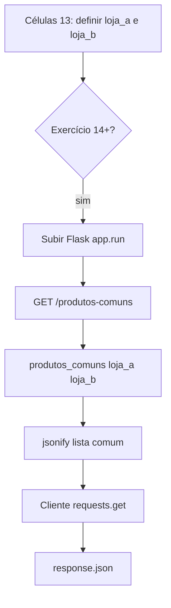

## Visão Geral do Conceito

Esta aula é uma **sessão de monitoria** focada na Parte B do AT: exercícios que expõem um **servidor Flask** com rota <mark style="background-color: #242424; padding: 2px 4px; border-radius: 3px; color: inherit;">`GET /produtos-comuns`</mark>, consomem o endpoint com <mark style="background-color: #242424; padding: 2px 4px; border-radius: 3px; color: inherit;">`requests`</mark> e revisam **funções** e **classes** necessárias para organizar a lógica. O professor resolve junto com a turma, incluindo depuração de ambiente (Docker, portas, serialização JSON).

O problema prático: duas filiais mantêm listas de produtos em estoque; o enunciado pede um **serviço web** que devolva apenas os itens presentes em **ambas** as listas, sem entrada do cliente — dados já definidos no servidor.

> **Regra de correção citada na aula:** na avaliação do AT, o foco é **se a resposta final funciona**; list comprehension, `set` ou `for` são aceitos se o resultado estiver correto.

## Modelo Mental

Fluxo do exercício 13 (núcleo da sessão):

1. **Servidor** — Flask com listas `loja_a` e `loja_b` no módulo.
2. **Função de domínio** — `produtos_comuns(a, b)` calcula interseção.
3. **Rota** — `@app.route("/produtos-comuns", methods=["GET"])` chama a função e retorna JSON.
4. **Cliente** — outro notebook/célula faz `requests.get(BASE_URL + "/produtos-comuns")` e interpreta o corpo.



**Funções** encapsulam um passo nomeado; **classes** encapsulam estado + comportamento de uma entidade (conta bancária, bicicleta) — introdução feita ao final da aula para quem ainda não teve disciplina de OO.

## Mecânica Central

### Endpoint produtos comuns

Estrutura mínima discutida em aula:

```python
from flask import Flask, jsonify

app = Flask(__name__)

loja_a = ["arroz", "feijão", "café"]
loja_b = ["café", "leite", "arroz"]


def produtos_comuns(lista_a, lista_b):
    return [item for item in lista_a if item in lista_b]


@app.route("/produtos-comuns", methods=["GET"])
def get_produtos_comuns():
    resultado = produtos_comuns(loja_a, loja_b)
    return jsonify(resultado)


if __name__ == "__main__":
    app.run(host="0.0.0.0", port=8080)
```

Alternativas mencionadas: loop `for`, <mark style="background-color: #242424; padding: 2px 4px; border-radius: 3px; color: inherit;">`set(lista_a) & set(lista_b)`</mark> — válidas se o enunciado não restringir estrutura.

### Sem entrada HTTP neste exercício

Diferente de APIs que leem `request.json`, aqui as listas já estão no servidor. O cliente só dispara GET; não envia corpo.

### Depuração servidor + cliente

Ordem recomendada na aula:

1. Garantir `app` definido antes das rotas (erro `app não está definido` ocorreu ao vivo).
2. Alinhar **porta** do `app.run` com mapeamento Docker/Deepnote (8080 vs 5000).
3. Com servidor OK, ajustar cliente: `BASE_URL`, path `/produtos-comuns`, `response.json()`.
4. Problemas de **encoding** (`jsonify` vs texto HTML) — testar `Content-Type` da resposta.

**Lacuna da transmissão:** o professor não concluiu a demonstração end-to-end no ambiente dele; alunos que rodaram localmente tiveram sucesso. Resolução formal foi adiada para a aula 20.

### Funções: nomes e parâmetros

- Sintaxe: <mark style="background-color: #242424; padding: 2px 4px; border-radius: 3px; color: inherit;">`def nome(param1, param2):`</mark> + corpo indentado + `return`.
- Nomes de função e parâmetros são **escolha do programador**, desde que não sejam palavras reservadas (`def`, `class`, `return`).
- Boa prática: nomes **sugestivos** (`produtos_comuns`, `loja_a`) — ajudam leitura, não alteram semântica.
- <mark style="background-color: #242424; padding: 2px 4px; border-radius: 3px; color: inherit;">`pass`</mark> permite esqueleto vazio ao prototipar.

### Introdução à orientação a objetos (visão resumida)

| Termo | Significado |
|-------|-------------|
| **Classe** | Modelo / abstração (ex.: `Conta`, `Bicicleta`) |
| **Objeto** | Instância concreta (`conta = Conta("Ana", 100)`) |
| **`__init__`** | Construtor; inicializa atributos (`self.saldo`) |
| **`self`** | Referência à instância atual |
| **Método** | Função dentro da classe (`depositar`, `pedalar`) |

Exemplo conta bancária citado:

```python
class Conta:
    def __init__(self, titular, saldo_inicial):
        self.titular = titular
        self.saldo = saldo_inicial

    def depositar(self, valor):
        self.saldo += valor

    def sacar(self, valor):
        self.saldo -= valor


conta = Conta("Ana", 100)
conta.depositar(50)
conta.sacar(30)
print(conta.saldo)  # 120
```

**Herança** (veículo → carro/bicicleta) e **classe abstrata** foram mencionadas superficialmente — aprofundamento fica para disciplina de Orientação a Objetos.

> **Não coberto em profundidade no material:** polimorfismo, UML completo, padrão MVC além da menção ao “controller” na URL.

## Uso Prático

### Prazos do AT (contexto administrativo)

Data de entrega e janela com penalidade após o prazo foram esclarecidos na abertura; envio via link compartilhado (Deepnote), não anexo do notebook inteiro por e-mail.

### Testar com Thunder Client / navegador

Com servidor rodando, acessar `http://host:porta/produtos-comuns` deve retornar JSON array. Cliente Python:

```python
import requests

BASE_URL = "http://127.0.0.1:8080"
resp = requests.get(f"{BASE_URL}/produtos-comuns")
print(resp.status_code)
print(resp.json())
```

## Erros Comuns

**`NameError: name 'app' is not defined`:** instanciar `app = Flask(__name__)` antes dos decorators `@app.route`.

**404 no cliente, 200 no navegador:** path errado (`/produtos-comum` vs `/produtos-comuns`) ou método diferente.

**Resposta HTML em vez de JSON:** rota ausente (página de erro Flask) ou `return` de string sem `jsonify`.

**Notebook travado após `app.run`:** esperado — servidor bloqueia a célula; usar segundo notebook para cliente (detalhado na aula 20).

**Usar palavra reservada como nome de função:** `def def(...)` ou `def return(...)` gera `SyntaxError`.

## Visão Geral de Debugging

1. Testar função pura `produtos_comuns` no REPL sem Flask.
2. Subir servidor e chamar rota com `curl` ou navegador.
3. Só então rodar cliente `requests` com URL do túnel/Common Connections.
4. Para funções: conferir nomes de parâmetros usados no corpo vs assinatura.
5. Para classes: verificar se `self.` prefixa atributos de instância.

## Principais Pontos

- Exercício 13+: servidor Flask GET com listas fixas e interseção de produtos.
- Correção do AT prioriza funcionamento, não estilo da comprehension.
- Nomes de função/parâmetro são livres mas devem ser legíveis.
- Endpoint = rota + método HTTP.
- Classe é molde; objeto é instância; `__init__` inicializa estado.
- Depurar servidor antes do cliente; ambiente ao vivo teve falhas não resolvidas na sessão.

## Preparação para Prática

Você deve implementar rota GET funcional, consumi-la com requests e explicar por que separar `produtos_comuns` da rota Flask facilita teste e leitura — preparação direta para a resolução formal na aula 20.

## Laboratório de Prática

### Easy — Interseção pura (sem Flask)

```python
LOJA_A = ["notebook", "mouse", "teclado", "hub"]
LOJA_B = ["mouse", "monitor", "teclado", "cabo"]


def produtos_em_ambas(loja_a: list, loja_b: list) -> list:
    # TODO: retornar produtos presentes nas duas listas
    return []


if __name__ == "__main__":
    print(produtos_em_ambas(LOJA_A, LOJA_B))
```

### Medium — Rota Flask isolada

```python
from flask import Flask, jsonify

app = Flask(__name__)
ESTOQUE_SP = ["ssd", "ram", "gpu"]
ESTOQUE_RJ = ["ram", "cpu", "ssd"]


def em_comum(a, b):
    # TODO: implementar interseção
    return []


@app.route("/produtos-comuns", methods=["GET"])
def rota_comuns():
    # TODO: jsonify(em_comum(ESTOQUE_SP, ESTOQUE_RJ))
    return jsonify([])


if __name__ == "__main__":
    app.run(port=5000)
```

### Hard — Cliente com validação de status

```python
import requests

BASE_URL = "http://127.0.0.1:5000"


def buscar_produtos_comuns(base_url: str) -> list | None:
    # TODO: GET em /produtos-comuns
    # TODO: se status 200, retornar response.json(); senão None
    return None


if __name__ == "__main__":
    dados = buscar_produtos_comuns(BASE_URL)
    print(dados if dados is not None else "Falha na API")
```

<!-- CONCEPT_EXTRACTION
concepts:
  - Flask GET
  - list comprehension
  - jsonify
  - definição de funções
  - parâmetros
  - classe e objeto
  - __init__
  - self
skills:
  - Implementar interseção de listas para estoque
  - Declarar rota Flask produtos-comuns
  - Nomear funções e parâmetros com clareza
  - Depurar servidor antes do cliente HTTP
  - Reconhecer classe versus instância em Python
examples:
  - produtos-comuns-list-comprehension
  - flask-get-jsonify-estoque
  - classe-conta-depositar-sacar
-->

<!-- EXERCISES_JSON
[
  {
    "id": "intersecao-listas-estoque",
    "slug": "intersecao-listas-estoque",
    "difficulty": "easy",
    "title": "Interseção de listas de estoque",
    "discipline": "python-processamento-dados",
    "editorLanguage": "python",
    "tags": ["python", "listas", "comprehension"],
    "summary": "Função que retorna produtos presentes em duas listas de filiais."
  },
  {
    "id": "flask-rota-estoque-comuns",
    "slug": "flask-rota-estoque-comuns",
    "difficulty": "medium",
    "title": "Rota Flask produtos comuns",
    "discipline": "python-processamento-dados",
    "editorLanguage": "python",
    "tags": ["python", "flask", "get", "jsonify"],
    "summary": "Expor GET /produtos-comuns com jsonify da interseção de estoques."
  },
  {
    "id": "cliente-validar-get-comuns",
    "slug": "cliente-validar-get-comuns",
    "difficulty": "hard",
    "title": "Cliente GET com validação",
    "discipline": "python-processamento-dados",
    "editorLanguage": "python",
    "tags": ["python", "requests", "flask", "http"],
    "summary": "Consumir /produtos-comuns e retornar JSON só se status for 200."
  }
]
-->
