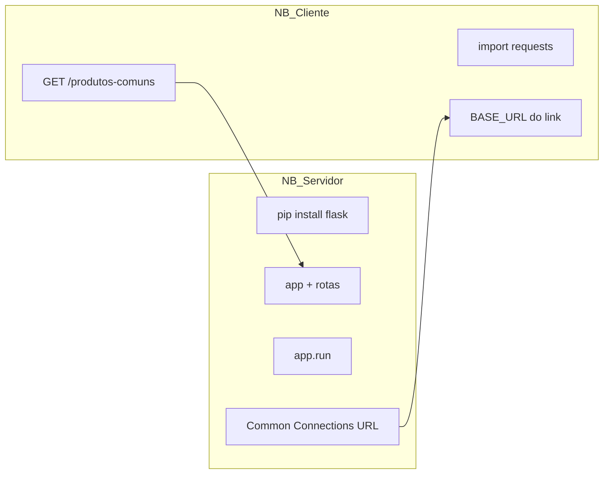

## Visão Geral do Conceito

A aula fecha o ciclo do **AT Parte B** com resolução guiada dos exercícios **12 a 16**: deduplicação de cadastros importados, servidor Flask `GET /produtos-comuns` no **Deepnote**, cliente com <mark style="background-color: #242424; padding: 2px 4px; border-radius: 3px; color: inherit;">`requests`</mark>, e chamada **POST** a LLM gratuita via **OpenRouter**. Complementa com **escopo de funções**, **retornos múltiplos** e alerta sobre **recursão**.

O fio condutor: em ADS você alterna entre **lógica de dados pura** (ex. 12), **serviço HTTP** (13–15) e **integração com API externa** (16) — sempre validando ambiente (notebook servidor preso, URL pública, headers JSON).

## Modelo Mental

Arquitetura Deepnote para exercícios 13–15:



Exercício **12** é offline: lista de dicts de clientes → normalizar → separar únicos e descartados com contadores.

Exercício **16**: cliente POST para OpenRouter com `Authorization: Bearer`, corpo JSON com `model` e `messages`.

## Mecânica Central

### Exercício 13 — Servidor `produtos-comuns`

Passos da resolução em aula:

1. `pip install flask` (comentar célula após primeira execução).
2. Definir `app`, listas `loja_a` / `loja_b`, função interseção.
3. `@app.route("/produtos-comuns", methods=["GET"])`.
4. `app.run` — notebook entra em modo servidor.
5. Menu **Common Connections** → URL pública para o cliente.

Código servidor (equivalente à demonstração):

```python
from flask import Flask, jsonify

app = Flask(__name__)

loja_a = ["a", "b", "c", "d"]
loja_b = ["c", "d", "e", "f"]


def produtos_comuns(a, b):
    return [x for x in a if x in b]


@app.route("/produtos-comuns", methods=["GET"])
def get_produtos_comuns():
    return jsonify(produtos_comuns(loja_a, loja_b))


if __name__ == "__main__":
    app.run(host="0.0.0.0", port=8080)
```

### Exercício 14 — Rota `/relatorio`

Rota adicional que devolve string JSON via <mark style="background-color: #242424; padding: 2px 4px; border-radius: 3px; color: inherit;">`json.dumps`</mark> do relatório — cliente faz GET e exibe texto/JSON.

### Exercício 15 — Cliente `requests`

```python
import requests

BASE_URL = "https://....deepnoteusercontent.com"  # Common Connections

resp = requests.get(f"{BASE_URL}/produtos-comuns")
print(resp.status_code)
print(resp.json())
```

**Problema recorrente na aula:** mesmo erro de parsing da sessão anterior em `/produtos-comuns`; professor adiou correção e mostrou exercício 16 com sucesso.

### Exercício 16 — OpenRouter (LLM gratuita)

Fluxo:

1. Criar chave em openrouter.ai (conta pessoal).
2. `POST` na URL base da API com header `Authorization: Bearer CHAVE`.
3. Corpo: `model`, `messages` com role `user` e conteúdo da pergunta.
4. Extrair texto de `response.json()["choices"][0]["message"]["content"]` (estrutura típica; validar no payload real).

### Exercício 12 — Deduplicar cadastros

Regras do enunciado (síntese):

- Normalizar **e-mail** (minúsculas, strip) e **telefone** (apenas dígitos).
- Duplicata se e-mail normalizado **ou** telefone normalizado coincidir com registro já aceito.
- Retornar: contagem de únicos, contagem de descartados, lista de descartados com motivo.
- Usar <mark style="background-color: #242424; padding: 2px 4px; border-radius: 3px; color: inherit;">`set`</mark> auxiliar para e-mails/telefones vistos.

Esqueleto conceitual:

```python
def normalizar_email(email: str) -> str:
    return email.strip().lower()


def normalizar_telefone(tel: str) -> str:
    return "".join(c for c in tel if c.isdigit())


def deduplicar_cadastros(cadastros: list) -> tuple:
    unicos = []
    descartados = []
    emails_vistos = set()
    fones_vistos = set()

    for cad in cadastros:
        em = normalizar_email(cad.get("email", ""))
        fone = normalizar_telefone(cad.get("telefone", ""))
        if em in emails_vistos or fone in fones_vistos:
            descartados.append({**cad, "motivo": "duplicata"})
            continue
        emails_vistos.add(em)
        fones_vistos.add(fone)
        unicos.append(cad)

    return unicos, descartados


def processar(cadastros: list) -> tuple:
    unicos, descartados = deduplicar_cadastros(cadastros)
    return len(unicos), len(descartados), descartados
```

Professor enfatizou: **várias implementações válidas**; avaliação foca em funcionar para entradas genéricas, não em performance algorítmica.

### Escopo e execução

- Definições `def` no topo do módulo **não executam** até serem chamadas.
- Bloco `if __name__ == "__main__":` é o ponto de entrada do script.
- Parâmetro `cadastros` dentro da função é **local**; variável global homônima é outro objeto.
- Função pode **retornar múltiplos valores** (tupla implícita): `return unicos, descartados`.

### Recursão (alerta)

Fatorial recursivo só termina com **caso base** (`n <= 1`). Função que chama a si mesma sem base → <mark style="background-color: #242424; padding: 2px 4px; border-radius: 3px; color: inherit;">`RecursionError`</mark>. Citado como contraste com loops iterativos usados no AT.

## Uso Prático

### Entrega do AT

Compartilhar link do Deepnote com o professor (não reenviar notebook como arquivo solto). Correções previstas no fim de semana seguinte à aula.

### Revisão de código em grupo

Alunos apresentaram implementação do exercício 12; sugestão pedagógica: comentários linha a linha ajudam correção sem penalizar estilo, desde que o resultado seja correto.

### Separar funções auxiliares

Extrair `normalizar_email` e `normalizar_telefone` melhora leitura — recomendação de design, não requisito de nota.

## Erros Comuns

**Notebook servidor sem cliente separado:** tentar rodar requests na mesma sessão bloqueada por `app.run`.

**URL base errada:** copiar link Common Connections incompleto ou desatualizado após reiniciar servidor.

**OpenRouter sem header Authorization:** HTTP 401.

**Confundir variável global `cadastros` com parâmetro `cadastros`:** lógica correta no parâmetro, mas loop usando global errada.

**Recursão infinita em exercícios que não pedem recursão:** preferir `for` e `set` no 12.

## Visão Geral de Debugging

1. **Ex. 12:** testar normalizadores com strings sujas isoladas.
2. **Ex. 13–14:** `curl` na URL pública antes do notebook cliente.
3. **Ex. 15:** imprimir `resp.headers`, `resp.text[:200]` se `json()` falhar.
4. **Ex. 16:** validar modelo gratuito disponível na documentação OpenRouter.
5. **Escopo:** usar `print(locals().keys())` dentro da função para ver parâmetros.

## Principais Pontos

- Deepnote: servidor em um notebook, cliente em outro; Common Connections fornece BASE_URL.
- Ex. 13 = Flask GET + jsonify; ex. 15 = requests GET; ex. 16 = POST LLM externa.
- Ex. 12 = normalização + sets + retorno múltiplo + relatório de descartados.
- Parâmetros de função são locais; nomes podem diferir das variáveis globais.
- Professor não estabilizou ex. 14–15 ao vivo; estrutura de código permanece válida.
- Recursão exige caso base; AT usa iteração.

## Preparação para Prática

Consolidar entrega do AT: servidor Flask acessível, cliente requests funcional, exercício 12 com saídas no formato do enunciado e exercício 16 com pergunta real à LLM via OpenRouter.

## Laboratório de Prática

### Easy — Normalizar campos de cadastro

```python
def normalizar_email(email: str) -> str:
    # TODO: strip + lower
    return email


def normalizar_telefone(telefone: str) -> str:
    # TODO: manter apenas dígitos
    return telefone


if __name__ == "__main__":
    print(normalizar_email("  User@Mail.COM "))
    print(normalizar_telefone("(11) 98765-4321"))
```

### Medium — Deduplicar e contar

```python
CADASTROS = [
    {"nome": "Ana", "email": "ana@x.com", "telefone": "11999990000"},
    {"nome": "Bia", "email": "ANA@x.com", "telefone": "11888880000"},
]


def deduplicar(cadastros: list) -> tuple:
    # TODO: retornar (unicos, descartados) usando normalização e sets
    return [], []


if __name__ == "__main__":
    u, d = deduplicar(CADASTROS)
    print(len(u), len(d))
```

### Hard — Cliente POST OpenRouter (mock local)

Simule estrutura de chamada; use URL fictícia que não dispara rede se chave vazia.

```python
import os
import requests

OPENROUTER_URL = "https://openrouter.ai/api/v1/chat/completions"


def perguntar_llm(pergunta: str, api_key: str) -> str:
    if not api_key:
        return ""
    headers = {
        "Authorization": f"Bearer {api_key}",
        "Content-Type": "application/json",
    }
    payload = {
        "model": "meta-llama/llama-3.2-3b-instruct:free",
        "messages": [{"role": "user", "content": pergunta}],
    }
    # TODO: requests.post(OPENROUTER_URL, headers=headers, json=payload, timeout=30)
    # TODO: extrair texto da resposta JSON; return "" se falhar
    return ""


if __name__ == "__main__":
    chave = os.getenv("OPENROUTER_API_KEY", "")
    texto = perguntar_llm("Em uma frase: o que é uma API?", chave)
    print(texto or "sem resposta")
```

<!-- CONCEPT_EXTRACTION
concepts:
  - Flask Deepnote
  - Common Connections
  - deduplicação
  - normalização email telefone
  - retorno múltiplo
  - escopo de função
  - OpenRouter
  - recursão
skills:
  - Subir Flask e expor URL no Deepnote
  - Consumir GET com requests e BASE_URL pública
  - Normalizar e deduplicar cadastros com sets
  - Retornar tupla com contagens e listas
  - Montar POST para API de LLM com Bearer token
examples:
  - deepnote-servidor-produtos-comuns
  - cliente-requests-common-connections
  - deduplicar-cadastros-normalizacao
  - openrouter-post-pergunta
-->

<!-- EXERCISES_JSON
[
  {
    "id": "normalizar-email-telefone",
    "slug": "normalizar-email-telefone",
    "difficulty": "easy",
    "title": "Normalizar e-mail e telefone",
    "discipline": "python-processamento-dados",
    "editorLanguage": "python",
    "tags": ["python", "strings", "normalizacao", "cadastros"],
    "summary": "Implementar normalização de e-mail e telefone para pipeline de deduplicação."
  },
  {
    "id": "deduplicar-cadastros-sets",
    "slug": "deduplicar-cadastros-sets",
    "difficulty": "medium",
    "title": "Deduplicar cadastros importados",
    "discipline": "python-processamento-dados",
    "editorLanguage": "python",
    "tags": ["python", "set", "dict", "dados"],
    "summary": "Separar cadastros únicos e descartados por e-mail ou telefone normalizado."
  },
  {
    "id": "openrouter-post-pergunta",
    "slug": "openrouter-post-pergunta",
    "difficulty": "hard",
    "title": "POST OpenRouter com pergunta",
    "discipline": "python-processamento-dados",
    "editorLanguage": "python",
    "tags": ["python", "requests", "post", "llm", "openrouter"],
    "summary": "Enviar pergunta via POST à API OpenRouter e extrair texto da resposta JSON."
  }
]
-->
