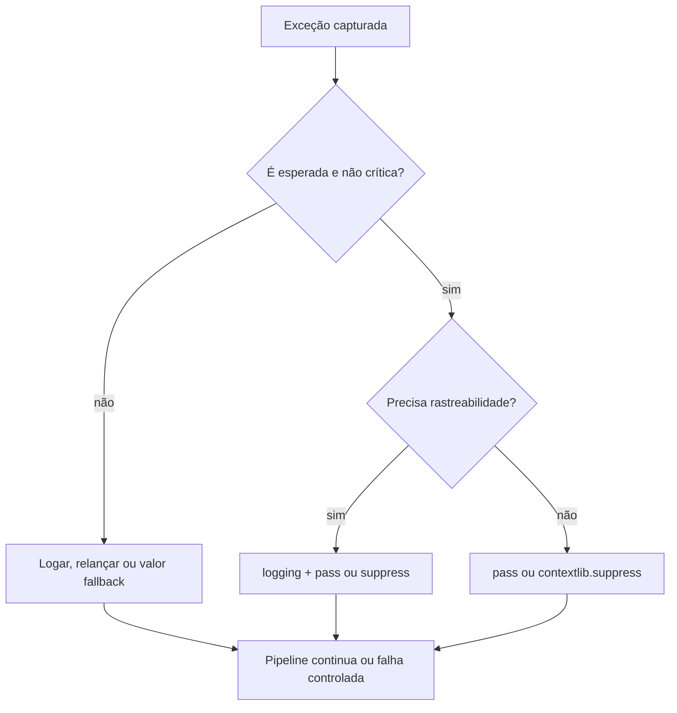
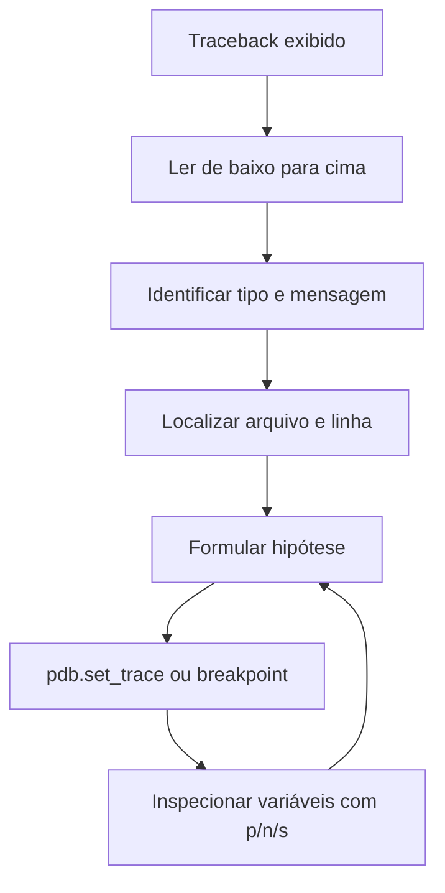

## Visão Geral do Conceito

Tratamento de exceções com <mark style="background-color: #242424; padding: 2px 4px; border-radius: 3px; color: inherit;">`try`</mark>/<mark style="background-color: #242424; padding: 2px 4px; border-radius: 3px; color: inherit;">`except`</mark> impede que erros previsíveis derrubem um pipeline de dados. Nem todo erro, porém, exige ação: às vezes a ausência de um arquivo temporário ou uma linha malformada em um lote é um estado aceitável. Nesses casos, você precisa de uma forma explícita de **não fazer nada** sem quebrar a sintaxe do Python.

A instrução <mark style="background-color: #242424; padding: 2px 4px; border-radius: 3px; color: inherit;">`pass`</mark> ocupa esse papel: é uma instrução nula, sintaticamente válida, que comunica ao leitor que o caso foi considerado e deliberadamente ignorado. Complementarmente, quando algo dá errado de forma inesperada, ferramentas de **debugging** — especialmente a leitura de <mark style="background-color: #242424; padding: 2px 4px; border-radius: 3px; color: inherit;">`traceback`</mark> e o depurador <mark style="background-color: #242424; padding: 2px 4px; border-radius: 3px; color: inherit;">`pdb`</mark> — permitem inspecionar o estado real do programa em execução, algo que <mark style="background-color: #242424; padding: 2px 4px; border-radius: 3px; color: inherit;">`print()`</mark> espalhado pelo código não substitui com eficiência.

> **Regra:** Use <mark style="background-color: #242424; padding: 2px 4px; border-radius: 3px; color: inherit;">`pass`</mark> apenas quando o silêncio completo for a intenção correta; quando o erro precisa ser rastreado ou corrigido, prefira logging, valor padrão ou propagação da exceção.

## Modelo Mental

Pense em <mark style="background-color: #242424; padding: 2px 4px; border-radius: 3px; color: inherit;">`pass`</mark> como um **cartão em branco assinado**: você reconhece que aquele ramo existe, mas não há instrução a executar. Em Java ou C#, um bloco <mark style="background-color: #242424; padding: 2px 4px; border-radius: 3px; color: inherit;">`catch`</mark> vazio pode ser permitido; em Python, blocos vazios são <mark style="background-color: #242424; padding: 2px 4px; border-radius: 3px; color: inherit;">`SyntaxError`</mark>. O <mark style="background-color: #242424; padding: 2px 4px; border-radius: 3px; color: inherit;">`pass`</mark> preenche o espaço obrigatório sem alterar o fluxo.

Para controle de fluxo em laços, três instruções coexistem com papéis distintos:

| Instrução | Onde funciona | Efeito |
|-----------|---------------|--------|
| <mark style="background-color: #242424; padding: 2px 4px; border-radius: 3px; color: inherit;">`pass`</mark> | Qualquer bloco composto | Não faz nada; fluxo segue normalmente |
| <mark style="background-color: #242424; padding: 2px 4px; border-radius: 3px; color: inherit;">`continue`</mark> | Apenas dentro de loops | Pula para a próxima iteração |
| <mark style="background-color: #242424; padding: 2px 4px; border-radius: 3px; color: inherit;">`break`</mark> | Apenas dentro de loops | Encerra o loop mais interno |

No debugging, imagine o programa como uma linha do tempo que você pode **pausar**. O <mark style="background-color: #242424; padding: 2px 4px; border-radius: 3px; color: inherit;">`pdb`</mark> congela a execução num ponto escolhido; você inspeciona variáveis, avança linha a linha e testa hipóteses — atividade comparável a um experimento científico sobre o próprio código.

## Mecânica Central

### Por que blocos vazios são proibidos

Python exige ao menos uma instrução em blocos de <mark style="background-color: #242424; padding: 2px 4px; border-radius: 3px; color: inherit;">`if`</mark>, <mark style="background-color: #242424; padding: 2px 4px; border-radius: 3px; color: inherit;">`except`</mark>, <mark style="background-color: #242424; padding: 2px 4px; border-radius: 3px; color: inherit;">`def`</mark>, <mark style="background-color: #242424; padding: 2px 4px; border-radius: 3px; color: inherit;">`class`</mark> e similares. Sem isso, o interpretador levanta <mark style="background-color: #242424; padding: 2px 4px; border-radius: 3px; color: inherit;">`SyntaxError: incomplete input`</mark>.

```python
try:
    resultado = int("abc")
except ValueError:
    pass  # exceção esperada; seguir sem ação
```

Atribuir uma variável “dummy” (<mark style="background-color: #242424; padding: 2px 4px; border-radius: 3px; color: inherit;">`_ = None`</mark>) apenas para satisfazer a sintaxe funciona, mas obscurece a intenção. O <mark style="background-color: #242424; padding: 2px 4px; border-radius: 3px; color: inherit;">`pass`</mark> deixa explícito: *este caso foi analisado e ignorado propositalmente*.

### Fluxo de decisão: pass ou alternativa



### Cenários legítimos para pass em except

1. **Remoção idempotente de arquivo** — se o arquivo já não existe, o objetivo (não haver arquivo) já foi alcançado.
2. **Carregamento opcional de configuração** — tenta carregar override local; se falhar, usa defaults.
3. **Processamento em lote** — linha ou registro inválido é descartado; o restante do lote continua.
4. **Prototipagem** — funções e métodos placeholder até a implementação real.
5. **Tratamento planejado, ainda não implementado** — mapear a exceção com <mark style="background-color: #242424; padding: 2px 4px; border-radius: 3px; color: inherit;">`pass`</mark> + comentário <mark style="background-color: #242424; padding: 2px 4px; border-radius: 3px; color: inherit;">`TODO`</mark> (temporário).

### contextlib.suppress como alternativa expressiva

Para suprimir exceções específicas de forma declarativa:

```python
from contextlib import suppress
from pathlib import Path

with suppress(FileNotFoundError, PermissionError):
    Path("cache/temp.json").unlink()
```

Equivale semanticamente a um <mark style="background-color: #242424; padding: 2px 4px; border-radius: 3px; color: inherit;">`try`</mark>/<mark style="background-color: #242424; padding: 2px 4px; border-radius: 3px; color: inherit;">`except`</mark> com <mark style="background-color: #242424; padding: 2px 4px; border-radius: 3px; color: inherit;">`pass`</mark>, porém mais legível quando a intenção é exclusivamente suprimir.

### Tipos de erro e ferramentas de diagnóstico

| Tipo | Quando aparece | Exemplo |
|------|----------------|---------|
| Sintaxe | Antes da execução | bloco <mark style="background-color: #242424; padding: 2px 4px; border-radius: 3px; color: inherit;">`except`</mark> vazio |
| Runtime | Durante execução | <mark style="background-color: #242424; padding: 2px 4px; border-radius: 3px; color: inherit;">`TypeError`</mark>, <mark style="background-color: #242424; padding: 2px 4px; border-radius: 3px; color: inherit;">`KeyError`</mark> |
| Lógica | Execução sem exceção, resultado errado | média calculada com divisor errado |

Ferramentas, do mais simples ao mais poderoso:

- <mark style="background-color: #242424; padding: 2px 4px; border-radius: 3px; color: inherit;">`print()`</mark> — rápido, polui código, não permite alterar variáveis em tempo real.
- <mark style="background-color: #242424; padding: 2px 4px; border-radius: 3px; color: inherit;">`pdb`</mark> — depurador nativo; pausa, inspeciona e avança passo a passo.
- IDE (VS Code, PyCharm) — breakpoints visuais sobre o mesmo princípio.

### pdb: pausa e comandos essenciais

```python
import pdb

def calcular_xy(x, y):
    pdb.set_trace()  # execução pausa aqui
    return x / y
```

Comandos no prompt <mark style="background-color: #242424; padding: 2px 4px; border-radius: 3px; color: inherit;">`(Pdb)`</mark>:

| Comando | Ação |
|---------|------|
| <mark style="background-color: #242424; padding: 2px 4px; border-radius: 3px; color: inherit;">`n`</mark> | Next — próxima linha no mesmo nível |
| <mark style="background-color: #242424; padding: 2px 4px; border-radius: 3px; color: inherit;">`s`</mark> | Step — entra dentro de função chamada |
| <mark style="background-color: #242424; padding: 2px 4px; border-radius: 3px; color: inherit;">`c`</mark> | Continue — até próximo breakpoint ou fim |
| <mark style="background-color: #242424; padding: 2px 4px; border-radius: 3px; color: inherit;">`p expr`</mark> | Print — avalia e exibe expressão |
| <mark style="background-color: #242424; padding: 2px 4px; border-radius: 3px; color: inherit;">`l`</mark> | List — mostra trecho do código |
| <mark style="background-color: #242424; padding: 2px 4px; border-radius: 3px; color: inherit;">`q`</mark> | Quit — encerra o depurador |

**Post-mortem:** após exceção não capturada, <mark style="background-color: #242424; padding: 2px 4px; border-radius: 3px; color: inherit;">`python -m pdb script.py`</mark> ou <mark style="background-color: #242424; padding: 2px 4px; border-radius: 3px; color: inherit;">`pdb.pm()`</mark> dentro de um <mark style="background-color: #242424; padding: 2px 4px; border-radius: 3px; color: inherit;">`except`</mark> abre o depurador no ponto da falha.



## Uso Prático

### Remoção segura de arquivo temporário

```python
import os

def limpar_cache(caminho: str) -> None:
    try:
        os.remove(caminho)
    except FileNotFoundError:
        pass  # já removido ou nunca existiu — objetivo alcançado
```

### Pipeline de lote com contagem de erros

Em pipelines de dados, um registro inválido não deve interromper o lote inteiro. Registrar o erro é melhor prática; o contador permite auditoria ao final.

```python
import logging

logging.basicConfig(level=logging.DEBUG)
logger = logging.getLogger(__name__)

def processar_lote(registros: list[str]) -> list[dict]:
    resultados = []
    erros = 0

    for linha in registros:
        try:
            resultados.append(transformar(linha))
        except ValueError:
            erros += 1
            logger.debug("Linha ignorada: %r", linha)
            # pass implícito após log — linha descartada

    logger.info("Processadas: %d | Ignoradas: %d", len(resultados), erros)
    return resultados

def transformar(linha: str) -> dict:
    partes = linha.split(";")
    if len(partes) != 3:
        raise ValueError("formato inválido")
    return {"id": partes[0], "valor": float(partes[1]), "uf": partes[2]}
```

### Valor padrão em vez de pass silencioso

Quando a operação falha mas o downstream exige um valor definido:

```python
def obter_preco(registro: dict) -> float:
    try:
        return float(registro["preco"])
    except (KeyError, TypeError, ValueError):
        return 0.0  # fallback explícito — melhor que pass + variável indefinida
```

### Depuração de média ponderada com pdb

```python
import pdb

def media_ponderada(notas: list[float], pesos: list[float]) -> float:
    pdb.set_trace()
    numerador = sum(n * p for n, p in zip(notas, pesos))
    denominador = sum(pesos)
    return numerador / denominador

# Chamada de teste
print(media_ponderada([8.0, 6.0, 9.0], [2, 3, 1]))
```

No prompt, inspecione <mark style="background-color: #242424; padding: 2px 4px; border-radius: 3px; color: inherit;">`notas`</mark>, <mark style="background-color: #242424; padding: 2px 4px; border-radius: 3px; color: inherit;">`pesos`</mark> e <mark style="background-color: #242424; padding: 2px 4px; border-radius: 3px; color: inherit;">`denominador`</mark> antes de avançar com <mark style="background-color: #242424; padding: 2px 4px; border-radius: 3px; color: inherit;">`n`</mark>. Se <mark style="background-color: #242424; padding: 2px 4px; border-radius: 3px; color: inherit;">`denominador == 0`</mark>, você identificou erro de lógica antes do crash.

### Leitura de traceback (KeyError)

```
Traceback (most recent call last):
  File "pipeline.py", line 42, in extrair_cliente
    nome = pedido["cliente"]["nome"]
KeyError: 'cliente'
```

Leitura correta: a **última linha** informa <mark style="background-color: #242424; padding: 2px 4px; border-radius: 3px; color: inherit;">`KeyError: 'cliente'`</mark> — a chave ausente. A linha acima aponta `pipeline.py:42` como local da falha. Subindo, você reconstrói quem chamou <mark style="background-color: #242424; padding: 2px 4px; border-radius: 3px; color: inherit;">`extrair_cliente`</mark>.

## Erros Comuns

**Suprimir erros críticos com pass genérico**

```python
# RUIM — qualquer falha desaparece
try:
    gravar_no_banco(dados)
except Exception:
    pass
```

Correção: capture exceções específicas, registre com <mark style="background-color: #242424; padding: 2px 4px; border-radius: 3px; color: inherit;">`logging.exception`</mark> ou relance.

**Usar pass dentro de loop quando a intenção é pular iteração**

```python
# RUIM — pass não pula; processar(item) sempre executa
for item in lista:
    if item is None:
        pass
    processar(item)
```

Correção: use <mark style="background-color: #242424; padding: 2px 4px; border-radius: 3px; color: inherit;">`continue`</mark>.

**Esconder bug de lógica**

```python
def total(valores):
    try:
        return sum(valores)
    except TypeError:
        pass  # retorna None implicitamente — bug silencioso
```

Se <mark style="background-color: #242424; padding: 2px 4px; border-radius: 3px; color: inherit;">`valores`</mark> contiver string, deveria falhar visivelmente ou converter com regra clara.

**Confundir família de status HTTP com tratamento local**

Não coberto em profundidade nesta lição: APIs mal implementadas podem retornar código 200 com corpo indicando erro. Em consumo de APIs, sempre valide corpo e status — tema da próxima etapa sobre <mark style="background-color: #242424; padding: 2px 4px; border-radius: 3px; color: inherit;">`requests`</mark>.

**Poluir código com prints permanentes**

Múltiplos <mark style="background-color: #242424; padding: 2px 4px; border-radius: 3px; color: inherit;">`print("passo 1")`</mark> dificultam manutenção. Prefira <mark style="background-color: #242424; padding: 2px 4px; border-radius: 3px; color: inherit;">`pdb`</mark> ou logging configurável por nível.

## Visão Geral de Debugging

Adote um processo sistemático:

1. **Reduza o problema** — isole o menor trecho reproduzível (uma função, um registro, um input).
2. **Leia o traceback de baixo para cima** — tipo de erro → linha → cadeia de chamadas.
3. **Verifique tipos antes de valores** — <mark style="background-color: #242424; padding: 2px 4px; border-radius: 3px; color: inherit;">`TypeError`</mark> frequentemente precede erro de valor; use <mark style="background-color: #242424; padding: 2px 4px; border-radius: 3px; color: inherit;">`type(var)`</mark> no pdb.
4. **Formule uma hipótese por vez** — “a chave não existe”, “divisor é zero”, “string no lugar de float”.
5. **Use pdb no ponto suspeito** — <mark style="background-color: #242424; padding: 2px 4px; border-radius: 3px; color: inherit;">`pdb.set_trace()`</mark> imediatamente antes da linha problemática.
6. **Combine try/except com log + pdb** — em desenvolvimento, logue e depure; em produção, logue sem pdb.

<details>
<summary>Comandos pdb menos usados mas úteis</summary>

- <mark style="background-color: #242424; padding: 2px 4px; border-radius: 3px; color: inherit;">`ll`</mark> — exibe a função inteira atual.
- <mark style="background-color: #242424; padding: 2px 4px; border-radius: 3px; color: inherit;">`w`</mark> — where: mostra stack de chamadas.
- <mark style="background-color: #242424; padding: 2px 4px; border-radius: 3px; color: inherit;">`!var = valor`</mark> — atribui valor durante depuração para testar cenários alternativos (como simular pesos diferentes sem reiniciar).

</details>

Ferramentas de IA podem auxiliar na análise de código, mas em ambientes corporativos exigem avaliação de compliance (dados sensíveis, alucinações, falsos positivos). Depuração manual com pdb permanece competência fundamental — complementar, não substituível cegamente.

## Principais Pontos

- <mark style="background-color: #242424; padding: 2px 4px; border-radius: 3px; color: inherit;">`pass`</mark> é instrução nula obrigatória para blocos que não executam nada; comunica intenção.
- Em <mark style="background-color: #242424; padding: 2px 4px; border-radius: 3px; color: inherit;">`except`</mark>, use <mark style="background-color: #242424; padding: 2px 4px; border-radius: 3px; color: inherit;">`pass`</mark> só quando a exceção é esperada, não crítica e o silêncio é desejado.
- <mark style="background-color: #242424; padding: 2px 4px; border-radius: 3px; color: inherit;">`continue`</mark> pula iteração; <mark style="background-color: #242424; padding: 2px 4px; border-radius: 3px; color: inherit;">`break`</mark> encerra loop; <mark style="background-color: #242424; padding: 2px 4px; border-radius: 3px; color: inherit;">`pass`</mark> não controla loops.
- Prefira logging, contadores, valores padrão ou <mark style="background-color: #242424; padding: 2px 4px; border-radius: 3px; color: inherit;">`contextlib.suppress`</mark> quando precisar de rastreabilidade.
- Nunca <mark style="background-color: #242424; padding: 2px 4px; border-radius: 3px; color: inherit;">`except Exception: pass`</mark> em operações críticas.
- Traceback: leia de baixo para cima; última linha = erro concreto.
- <mark style="background-color: #242424; padding: 2px 4px; border-radius: 3px; color: inherit;">`pdb.set_trace()`</mark> pausa execução; comandos <mark style="background-color: #242424; padding: 2px 4px; border-radius: 3px; color: inherit;">`n`</mark>, <mark style="background-color: #242424; padding: 2px 4px; border-radius: 3px; color: inherit;">`s`</mark>, <mark style="background-color: #242424; padding: 2px 4px; border-radius: 3px; color: inherit;">`c`</mark>, <mark style="background-color: #242424; padding: 2px 4px; border-radius: 3px; color: inherit;">`p`</mark>, <mark style="background-color: #242424; padding: 2px 4px; border-radius: 3px; color: inherit;">`q`</mark> controlam o avanço.

## Preparação para Prática

Ao concluir esta lição, você deve conseguir:

- Completar blocos <mark style="background-color: #242424; padding: 2px 4px; border-radius: 3px; color: inherit;">`except`</mark> com <mark style="background-color: #242424; padding: 2px 4px; border-radius: 3px; color: inherit;">`pass`</mark> ou alternativa adequada conforme criticidade do erro.
- Implementar processamento em lote que ignora registros inválidos sem interromper o pipeline.
- Substituir supressão cega por logging ou valor fallback quando necessário.
- Inserir breakpoint com pdb e navegar até identificar variável ou linha causadora de falha.
- Interpretar um traceback e apontar a causa raiz sem executar o código.

## Laboratório de Prática

### Easy — Limpeza idempotente de arquivos de exportação

Uma ETL diária grava arquivos temporários em `/tmp/export/` antes de enviar ao destino. Após envio bem-sucedido, o script remove os temporários. Se o arquivo já foi removido manualmente, o pipeline deve continuar sem erro.

Complete o tratamento de exceção:

```python
import os

TEMP_FILES = [
    "/tmp/export/pedidos_parcial.csv",
    "/tmp/export/metricas.json",
]

def limpar_temporarios(caminhos: list[str]) -> int:
    removidos = 0
    for caminho in camhos:
        try:
            os.remove(caminho)
            removidos += 1
        except FileNotFoundError:
            # TODO: ignorar silenciosamente — arquivo já inexistente
            pass
    return removidos

if __name__ == "__main__":
    print(limpar_temporarios(TEMP_FILES))
```

### Medium — Parser de linhas de log com contagem de falhas

Um servidor grava logs no formato `TIMESTAMP;NIVEL;MENSAGEM`. Algumas linhas chegam corrompidas. O relatório deve processar todas as linhas válidas e contar quantas foram ignoradas.

```python
import logging

logging.basicConfig(level=logging.INFO)
logger = logging.getLogger(__name__)

LOGS = [
    "2026-06-01T10:00:00;INFO;Inicio do batch",
    "linha_corrompida_sem_formato",
    "2026-06-01T10:00:02;ERROR;Timeout na API",
    "2026-06-01T10:00:03;WARN;Retry",
    ";;;;",
]

def parse_linha(linha: str) -> dict:
    partes = linha.split(";", maxsplit=2)
    if len(partes) != 3:
        raise ValueError("formato inválido")
    return {"timestamp": partes[0], "nivel": partes[1], "mensagem": partes[2]}

def processar_logs(linhas: list[str]) -> tuple[list[dict], int]:
    eventos = []
    ignoradas = 0

    for linha in linhas:
        try:
            eventos.append(parse_linha(linha))
        except ValueError:
            ignoradas += 1
            # TODO: registrar linha ignorada em nível DEBUG e continuar
            logger.debug("Linha ignorada: %r", linha)

    logger.info("Válidas: %d | Ignoradas: %d", len(eventos), ignoradas)
    return eventos, ignoradas

if __name__ == "__main__":
    processar_logs(LOGS)
```

### Hard — Pipeline de preços com fallback e diagnóstico pdb

Um arquivo JSON Lines de produtos de e-commerce contém registros com preços inconsistentes (`null`, string vazia, texto). A função deve calcular totais por cliente, usar `0.0` como fallback seguro e permitir depuração interativa quando `DEBUG=True`.

```python
import pdb

DEBUG = False

PRODUTOS = [
    {"cliente": "Ana", "preco": "89.90", "qtd": 2},
    {"cliente": "Ana", "preco": None, "qtd": 1},
    {"cliente": "Bruno", "preco": "invalido", "qtd": 3},
    {"cliente": "Bruno", "preco": "15.00", "qtd": 1},
]

def extrair_preco(registro: dict) -> float:
    if DEBUG:
        pdb.set_trace()
    try:
        valor = registro["preco"]
        if valor is None or valor == "":
            raise ValueError("preço ausente")
        return float(valor)
    except (KeyError, TypeError, ValueError):
        # TODO: retornar valor padrão 0.0 em vez de suprimir com pass
        return 0.0

def total_por_cliente(registros: list[dict]) -> dict[str, float]:
    totais: dict[str, float] = {}
    erros = 0

    for item in registros:
        preco = extrair_preco(item)
        if preco == 0.0 and item.get("preco") not in (0, 0.0, "0", "0.0"):
            erros += 1
        cliente = item.get("cliente", "DESCONHECIDO")
        totais[cliente] = totais.get(cliente, 0.0) + preco * item.get("qtd", 1)

    print(f"Registros com fallback de preço: {erros}")
    return totais

if __name__ == "__main__":
    print(total_por_cliente(PRODUTOS))
```

<!-- CONCEPT_EXTRACTION
concepts:
  - pass
  - try/except
  - continue vs break
  - contextlib.suppress
  - logging em pipelines
  - traceback
  - pdb
  - erros de sintaxe runtime e lógica
skills:
  - Completar blocos except vazios com pass intencional
  - Processar lotes ignorando registros inválidos sem interromper o fluxo
  - Substituir pass silencioso por logging ou valor fallback
  - Ler traceback de baixo para cima para identificar causa raiz
  - Depurar funções com pdb.set_trace e comandos n/s/c/p
examples:
  - remocao-idempotente-arquivo
  - pipeline-lote-com-contador
  - preco-fallback-extracao
  - media-ponderada-pdb
-->

<!-- EXERCISES_JSON
[
  {
    "id": "limpeza-idempotente-temp",
    "slug": "limpeza-idempotente-temp",
    "difficulty": "easy",
    "title": "Limpeza idempotente de temporários",
    "discipline": "python-para-processamento-de-dados",
    "editorLanguage": "python",
    "tags": ["python", "pass", "FileNotFoundError", "etl"],
    "summary": "Completar except FileNotFoundError com pass para remoção idempotente de arquivos temporários."
  },
  {
    "id": "parser-logs-contagem",
    "slug": "parser-logs-contagem",
    "difficulty": "medium",
    "title": "Parser de logs com linhas corrompidas",
    "discipline": "python-para-processamento-de-dados",
    "editorLanguage": "python",
    "tags": ["python", "try-except", "logging", "batch"],
    "summary": "Processar logs válidos, ignorar linhas corrompidas com log DEBUG e contador de falhas."
  },
  {
    "id": "pipeline-precos-fallback-pdb",
    "slug": "pipeline-precos-fallback-pdb",
    "difficulty": "hard",
    "title": "Pipeline de preços com fallback e pdb",
    "discipline": "python-para-processamento-de-dados",
    "editorLanguage": "python",
    "tags": ["python", "fallback", "pdb", "json-lines", "ecommerce"],
    "summary": "Calcular totais por cliente com fallback de preço, contagem de erros e breakpoint condicional com pdb."
  }
]
-->
