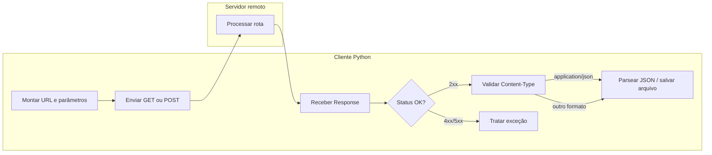
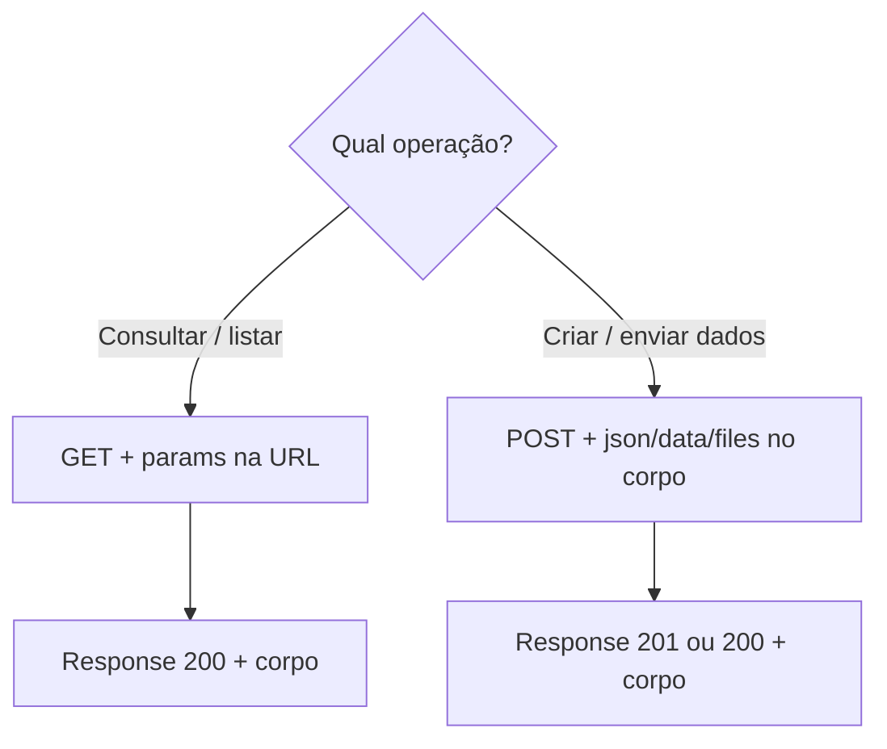

## Visão Geral do Conceito

Integrar sistemas em ADS quase sempre significa **conversar com serviços remotos**: consultar previsões, cadastrar registros, baixar relatórios ou enviar arquivos. Em Python, a biblioteca <mark style="background-color: #242424; padding: 2px 4px; border-radius: 3px; color: inherit;">`requests`</mark> encapsula o protocolo HTTP e transforma uma operação de rede em poucas linhas de código legível.

> **Regra:** Uma requisição HTTP bem feita no cliente não termina em `requests.get(url)` — ela inclui parametrização correta, tratamento de status, validação de formato e persistência ou transformação dos dados recebidos.

Esta lição cobre o fluxo completo do **cliente HTTP em Python**: montar a chamada, interpretar a resposta, tratar erros com <mark style="background-color: #242424; padding: 2px 4px; border-radius: 3px; color: inherit;">`raise_for_status()`</mark>, parsear JSON com segurança e gravar resultados em disco. O foco é uso prático em pipelines de dados, não teoria abstrata de redes.

## Modelo Mental

Pense em cada requisição HTTP como **uma carta endereçada entre dois computadores**:

| Parte da carta | Equivalente HTTP | Onde configura em `requests` |
|----------------|------------------|------------------------------|
| Tipo de pedido (perguntar vs enviar) | Verbo HTTP (`GET`, `POST`, …) | `requests.get()`, `requests.post()` |
| Endereço do destinatário | URL (domínio + caminho + query string) | primeiro argumento + `params` |
| Informações sensíveis no envelope | Cabeçalhos (`headers`) | `headers={...}` ou `auth=(user, pass)` |
| Conteúdo da carta | Corpo da mensagem | `json=`, `data=`, `files=` |

A **URL** divide-se em camadas: domínio (`https://api.exemplo.com`), caminho da API (`/v1/forecasting`) e, no <mark style="background-color: #242424; padding: 2px 4px; border-radius: 3px; color: inherit;">`GET`</mark>, parâmetros na **query string** (`?pagamentos=10`). Quando há conteúdo no corpo — especialmente em <mark style="background-color: #242424; padding: 2px 4px; border-radius: 3px; color: inherit;">`POST`</mark> — os dados costumam ir como JSON, formulário (`data`) ou arquivo (`files`).

Do outro lado, o **servidor** responde com um objeto <mark style="background-color: #242424; padding: 2px 4px; border-radius: 3px; color: inherit;">`Response`</mark>: código de status, cabeçalhos e corpo. Você raramente controla o servidor; no dia a dia de ADS, seu papel é **cliente**: montar a URL correta, interpretar a resposta e falhar de forma controlada quando algo der errado.



Analogia do erro 404: você acertou o **domínio** (a casa), mas endereçou a carta a um **controlador inexistente** (pessoa que não mora lá). O servidor responde <mark style="background-color: #242424; padding: 2px 4px; border-radius: 3px; color: inherit;">`404 Not Found`</mark> — o problema está na URL/rota usada pelo **cliente**, não necessariamente no servidor estar offline.

## Mecânica Central

### Anatomia de uma chamada GET

```python
import json
import requests

url_base = "https://api.exemplo.com/v1/forecasting"
params = {"pagamentos": 12}

response = requests.get(url_base, params=params, timeout=10)

print(response.status_code)   # ex.: 200
print(response.url)           # URL final montada com query string
print(response.elapsed)       # tempo da chamada (timedelta)
dados = response.json()       # corpo parseado como dict/list
```

O parâmetro <mark style="background-color: #242424; padding: 2px 4px; border-radius: 3px; color: inherit;">`params`</mark> gera automaticamente a **query string** — técnica conhecida como *query string* ou parametrização via URL. Não coloque senhas ou tokens em `params`; use <mark style="background-color: #242424; padding: 2px 4px; border-radius: 3px; color: inherit;">`headers`</mark> ou <mark style="background-color: #242424; padding: 2px 4px; border-radius: 3px; color: inherit;">`auth`</mark>.

### Cabeçalhos e autenticação

```python
headers = {
    "Authorization": "Bearer SEU_TOKEN",
    "Accept": "application/json",
}

response = requests.get(url_base, headers=headers, auth=("usuario", "senha"))
```

<mark style="background-color: #242424; padding: 2px 4px; border-radius: 3px; color: inherit;">`auth`</mark> implementa autenticação básica HTTP de forma mais segura do que embutir usuário e senha na URL.

### POST: corpo JSON, formulário e arquivo

| Parâmetro | Formato enviado | Uso típico |
|-----------|-----------------|------------|
| `json=dict` | `application/json` | APIs REST — criar recurso, enviar payload estruturado |
| `data=dict` | `application/x-www-form-urlencoded` | Formulários HTML, campos chave-valor |
| `files=dict` | `multipart/form-data` | Upload de imagem, CSV, PDF |

```python
payload = {"nome_molecula": "C2H6", "formato": "csv"}

response = requests.post(
    "https://pubchem.ncbi.nlm.nih.gov/rest/pug/compound/name/csv/JSON",
    data=payload,
    timeout=30,
)
```

Em integrações reais, é comum **enviar JSON e receber outro formato** — por exemplo, POST com JSON e resposta em CSV ou PNG binário. Nesse caso, use <mark style="background-color: #242424; padding: 2px 4px; border-radius: 3px; color: inherit;">`response.text`</mark> ou <mark style="background-color: #242424; padding: 2px 4px; border-radius: 3px; color: inherit;">`response.content`</mark> (bytes), não <mark style="background-color: #242424; padding: 2px 4px; border-radius: 3px; color: inherit;">`response.json()`</mark>.

### Propriedades essenciais do objeto Response

| Atributo / método | Retorno | Quando usar |
|-------------------|---------|-------------|
| `status_code` | `int` | Verificação rápida (200, 201, 404, 500) |
| `raise_for_status()` | lança exceção se 4xx/5xx | Fluxo robusto com try/except |
| `json()` | `dict` / `list` | Corpo JSON bem formado |
| `text` | `str` | CSV, HTML, texto puro |
| `content` | `bytes` | Imagens, PDFs, arquivos binários |
| `headers` | `CaseInsensitiveDict` | Ler `Content-Type`, paginação, etc. |
| `elapsed` | `timedelta` | Monitorar latência |
| `url` | `str` | Confirmar URL final (redirects + params) |

```python
response = requests.get(url_base, timeout=10)
response.raise_for_status()  # HTTPError se 4xx ou 5xx
```

Status codes relevantes em ADS:

- **200 OK** — consulta bem-sucedida (`GET`).
- **201 Created** — recurso criado (`POST`).
- **400 Bad Request** — payload ou parâmetro inválido (erro do cliente).
- **404 Not Found** — rota ou recurso inexistente.
- **500 Internal Server Error** — falha no servidor.

### GET vs POST



- <mark style="background-color: #242424; padding: 2px 4px; border-radius: 3px; color: inherit;">`GET`</mark> **pergunta** — não deve carregar corpo com credenciais ou grandes volumes.
- <mark style="background-color: #242424; padding: 2px 4px; border-radius: 3px; color: inherit;">`POST`</mark> **envia** — cadastro, upload, operações com payload no corpo.

A sintaxe muda pouco (`requests.get` → `requests.post`); o que muda é **como você parametriza** a requisição.

### Validar Content-Type antes de parsear JSON

```python
response = requests.get(url_itens, timeout=10)
response.raise_for_status()

content_type = response.headers.get("Content-Type", "")

if "application/json" in content_type:
    dados = response.json()
else:
    print("Resposta não é JSON:", response.text[:200])
```

Chamar <mark style="background-color: #242424; padding: 2px 4px; border-radius: 3px; color: inherit;">`response.json()`</mark> cegamente em resposta HTML ou vazia gera <mark style="background-color: #242424; padding: 2px 4px; border-radius: 3px; color: inherit;">`JSONDecodeError`</mark>, mesmo com status 200.

### Navegar, filtrar e transformar JSON

Suponha resposta:

```json
{
  "itens": [
    {"id": 1, "name": "item one"},
    {"id": 2, "name": "item two"},
    {"id": 3, "name": "item three"}
  ]
}
```

```python
dados = response.json()

# Acesso por chave e índice
primeiro = dados["itens"][0]
nome = dados["itens"][0]["name"]          # "item one"
inexistente = dados["itens"][0].get("address")  # None — chave ausente

# Iteração
for item in dados["itens"]:
    print(f"{item['id']:02d}  {item['name']:25}")

# Filtragem (list comprehension)
apenas_three = [i for i in dados["itens"] if i["name"] == "item three"]

# Projeção de campos
somente_nomes = [{"name": i["name"]} for i in dados["itens"]]

# Ordenação
ordenados = sorted(dados["itens"], key=lambda x: x["name"])
```

### Persistir resposta em arquivo local

```python
import json

with open("itens_snapshot.json", "w", encoding="utf-8") as f:
    json.dump(dados["itens"], f, indent=2, ensure_ascii=False)

with open("itens_snapshot.json", encoding="utf-8") as f:
    carregados = json.load(f)

print(len(carregados), "registros carregados")
```

| Função | Direção | Entrada |
|--------|---------|---------|
| `json.dump` | objeto → arquivo | estrutura Python |
| `json.load` | arquivo → objeto | caminho de arquivo |
| `json.dumps` | objeto → string | estrutura Python |
| `json.loads` | string → objeto | string JSON |

## Uso Prático

### Cenário 1: Consulta GET com parâmetros e log de latência

Pipeline de monitoramento que consulta API de previsão financeira:

```python
import requests

def consultar_previsao(base_url: str, meses: int) -> dict:
    response = requests.get(
        base_url,
        params={"pagamentos": meses},
        timeout=15,
    )
    response.raise_for_status()
    print(f"OK em {response.elapsed.total_seconds():.3f}s — {response.url}")
    return response.json()
```

### Cenário 2: POST que envia JSON e salva CSV retornado

Integração com serviço científico (padrão similar ao PubChem da aula):

```python
def baixar_formula_csv(nome_molecula: str, destino: str) -> None:
    response = requests.post(
        "https://exemplo.quimica/api/compound",
        data={"nome": nome_molecula},
        timeout=30,
    )
    response.raise_for_status()

    with open(destino, "wb") as f:
        f.write(response.content)
```

### Cenário 3: Cliente + servidor Flask (visão integrada)

Cliente:

```python
import requests

base = "http://127.0.0.1:5000/itens"

# Listar
lista = requests.get(base, timeout=5).json()

# Criar
novo = requests.post(base, json={"name": "item three"}, timeout=5)
novo.raise_for_status()
print(novo.status_code)  # 201 Created

# Confirmar
atualizado = requests.get(base, timeout=5).json()
```

Servidor (lado oposto — referência; em produção você costuma implementar só um dos lados):

```python
from flask import Flask, request, jsonify

app = Flask(__name__)
datastore = [{"id": 1, "name": "item one"}, {"id": 2, "name": "item two"}]

@app.route("/itens", methods=["GET"])
def listar():
    return jsonify({"itens": datastore})

@app.route("/itens", methods=["POST"])
def criar():
    payload = request.get_json()
    if not payload or "name" not in payload:
        return jsonify({"erro": "campo name obrigatório"}), 400
    novo = {"id": len(datastore) + 1, "name": payload["name"]}
    datastore.append(novo)
    return jsonify(novo), 201
```

Fluxo completo: `GET` lista → `POST` insere → `GET` confirma presença do novo item.

### Cenário 4: Download de imagem binária via GET parametrizado

```python
def salvar_imagem_molecula(nome: str, arquivo_saida: str) -> None:
    url = f"https://exemplo.quimica/rest/pug/compound/name/{nome}/PNG"
    params = {"record_type": "2d"}
    response = requests.get(url, params=params, timeout=20)

    if response.status_code != 200:
        response.raise_for_status()

    with open(arquivo_saida, "wb") as f:
        f.write(response.content)
    print(f"Imagem salva: {arquivo_saida}")
```

### Cenário 5: Pipeline ETL leve — API → filtro → arquivo

```python
def exportar_itens_filtrados(url: str, nome_alvo: str, saida: str) -> int:
    response = requests.get(url, timeout=10)
    response.raise_for_status()

    ct = response.headers.get("Content-Type", "")
    if "application/json" not in ct:
        raise ValueError(f"Formato inesperado: {ct}")

    itens = response.json()["itens"]
    filtrados = [i for i in itens if i["name"] == nome_alvo]
    projetados = [{"name": i["name"]} for i in sorted(filtrados, key=lambda x: x["name"])]

    with open(saida, "w", encoding="utf-8") as f:
        json.dump(projetados, f, indent=2, ensure_ascii=False)

    return len(projetados)
```

## Erros Comuns

**Credenciais na URL.** Passar `?api_key=secreta` expõe o token em logs e histórico. Use `headers` ou variáveis de ambiente.

**Assumir JSON porque status é 200.** Servidor pode retornar HTML de erro customizado ou corpo vazio. Sempre verifique <mark style="background-color: #242424; padding: 2px 4px; border-radius: 3px; color: inherit;">`Content-Type`</mark>.

**Chave inexistente no JSON.** `dados["itens"][0]["address"]` lança <mark style="background-color: #242424; padding: 2px 4px; border-radius: 3px; color: inherit;">`KeyError`</mark> se a chave não existir. Prefira `.get("address")` ou validação prévia.

**Confundir cliente e usuário final.** Em HTTP, **cliente** é o código que faz a chamada (seu script Python), não necessariamente a pessoa digitando no terminal. Erro 404 por rota errada é falha do **cliente** na URL montada.

**Usar `json=` em API que espera formulário.** Alguns endpoints legados esperam `data=`, não `json=`. Sintoma: 400 Bad Request ou corpo ignorado pelo servidor.

**Ignorar `timeout`.** Sem timeout, chamadas travadas bloqueiam o pipeline indefinidamente.

**Gravar binário com modo texto.** Imagens e PDFs exigem `"wb"` em <mark style="background-color: #242424; padding: 2px 4px; border-radius: 3px; color: inherit;">`open()`</mark> e <mark style="background-color: #242424; padding: 2px 4px; border-radius: 3px; color: inherit;">`response.content`</mark>, não `.text`.

**Comparar `Content-Type` com igualdade estrita.** O cabeçalho pode ser `application/json; charset=utf-8`. Use `"application/json" in content_type`.

## Visão Geral de Debugging

1. **Imprima `response.status_code` e `response.url`** — confirma rota e parâmetros efetivos (incluindo redirects).
2. **Meça `response.elapsed`** — distingue erro de lógica de lentidão de rede.
3. **Inspecione `response.headers.get("Content-Type")`** antes de parsear.
4. **Use `response.text[:500]`** quando `json()` falhar — revela HTML ou mensagem de erro do servidor.
5. **Simule 404** alterando um segmento da URL — pratique `raise_for_status()` e leia a exceção <mark style="background-color: #242424; padding: 2px 4px; border-radius: 3px; color: inherit;">`HTTPError`</mark>.
6. **Teste GET e POST separadamente** no mesmo endpoint — confirme verbo, payload e status esperado (200 vs 201).
7. **Compare cliente e contrato da API** — documentação do endpoint vs o que seu código envia.

<details>
<summary>Ver checklist rápido para JSONDecodeError</summary>

1. Status é 2xx?
2. `Content-Type` contém `application/json`?
3. Corpo não está vazio? (`len(response.content)`)
4. Primeiros caracteres são `{` ou `[`?
5. Se falhar, salve `response.text` em arquivo e inspecione manualmente.

</details>

## Principais Pontos

- <mark style="background-color: #242424; padding: 2px 4px; border-radius: 3px; color: inherit;">`requests`</mark> abstrai verbo HTTP, URL, cabeçalhos, corpo e timeout em uma API Python idiomática.
- <mark style="background-color: #242424; padding: 2px 4px; border-radius: 3px; color: inherit;">`GET`</mark> consulta com `params` na query string; <mark style="background-color: #242424; padding: 2px 4px; border-radius: 3px; color: inherit;">`POST`</mark> envia dados via `json`, `data` ou `files`.
- O objeto <mark style="background-color: #242424; padding: 2px 4px; border-radius: 3px; color: inherit;">`Response`</mark> concentra status, cabeçalhos, corpo textual/binário e tempo de resposta.
- <mark style="background-color: #242424; padding: 2px 4px; border-radius: 3px; color: inherit;">`raise_for_status()`</mark> converte 4xx/5xx em exceção — base para tratamento robusto.
- Valide <mark style="background-color: #242424; padding: 2px 4px; border-radius: 3px; color: inherit;">`Content-Type`</mark> antes de <mark style="background-color: #242424; padding: 2px 4px; border-radius: 3px; color: inherit;">`response.json()`</mark>.
- Navegue JSON com chaves, índices, `.get()`, loops e list comprehensions.
- Persista snapshots com <mark style="background-color: #242424; padding: 2px 4px; border-radius: 3px; color: inherit;">`json.dump`</mark> / <mark style="background-color: #242424; padding: 2px 4px; border-radius: 3px; color: inherit;">`json.load`</mark> para pipelines offline.

## Preparação para Prática

Antes do laboratório, você deve conseguir:

- Montar uma chamada <mark style="background-color: #242424; padding: 2px 4px; border-radius: 3px; color: inherit;">`GET`</mark> com `params` e interpretar `status_code`, `elapsed` e `json()`.
- Implementar <mark style="background-color: #242424; padding: 2px 4px; border-radius: 3px; color: inherit;">`POST`</mark> com payload JSON e tratar resposta 201.
- Envolver chamadas em `try/except` usando <mark style="background-color: #242424; padding: 2px 4px; border-radius: 3px; color: inherit;">`raise_for_status()`</mark>.
- Verificar cabeçalho <mark style="background-color: #242424; padding: 2px 4px; border-radius: 3px; color: inherit;">`Content-Type`</mark> e extrair campos aninhados de listas JSON.
- Filtrar, ordenar e gravar subset de dados em arquivo JSON local.

## Laboratório de Prática

### Easy — Consulta GET com parâmetros e status

Implemente uma função que consulta uma API de previsão de pagamentos. A função deve montar a query string, retornar o status HTTP e o tempo de resposta em segundos.

```python
import requests

BASE_URL = "https://httpbin.org/get"

def consultar_pagamentos(meses: int) -> dict:
    # TODO: fazer GET com params={"pagamentos": meses} e timeout=10
    response = None
    return {
        "status": 0,
        "segundos": 0.0,
        "url": "",
    }
```

### Medium — POST com validação de Content-Type

Simule cadastro de item em API REST. Envie JSON, trate erro HTTP e só parseie resposta se o servidor declarar JSON.

```python
import requests

URL_ITENS = "https://httpbin.org/post"

def cadastrar_item(nome: str) -> dict | None:
    # TODO: POST com json={"name": nome}, timeout=10
    # TODO: chamar raise_for_status()
    # TODO: se Content-Type contiver application/json, retornar response.json()
    # TODO: caso contrário, retornar None
    return None
```

### Hard — Pipeline: buscar, filtrar, ordenar e persistir

Consuma lista de registros (mock local), aplique filtro por nome, ordene alfabeticamente, projete apenas o campo `name` e grave JSON enxuto.

```python
import json
import requests

REGISTROS_MOCK = {
    "itens": [
        {"id": 1, "name": "contrato-alpha"},
        {"id": 2, "name": "contrato-beta"},
        {"id": 3, "name": "contrato-alpha"},
    ]
}

def exportar_contratos_por_nome(nome: str, arquivo_saida: str) -> int:
    """
    Filtra itens cujo name coincide com nome (case-sensitive),
    ordena por name, projeta {"name": ...} e grava em arquivo_saida.
    Retorna quantidade gravada.
    """
    dados = REGISTROS_MOCK  # em produção: viria de requests.get(...).json()
    # TODO: filtrar por name
    # TODO: ordenar alfabeticamente por name
    # TODO: projetar somente campo name
    # TODO: json.dump em arquivo_saida com indent=2 e ensure_ascii=False
    return 0
```

<!-- CONCEPT_EXTRACTION
concepts:
  - requisições HTTP
  - biblioteca requests
  - GET e POST
  - query string
  - headers HTTP
  - objeto Response
  - status code HTTP
  - raise_for_status
  - Content-Type
  - parsing JSON
  - json.dump e json.load
skills:
  - Executar chamadas GET e POST com requests
  - Parametrizar URLs com params, headers e auth
  - Validar status HTTP com raise_for_status
  - Verificar Content-Type antes de parsear JSON
  - Navegar estruturas JSON aninhadas
  - Filtrar e ordenar listas de registros de API
  - Persistir snapshots JSON em arquivo local
examples:
  - get-forecasting-com-query-string
  - post-molecula-csv-pubchem
  - cliente-flask-get-post-itens
  - validacao-content-type-json
  - pipeline-filtro-ordenacao-json-dump
-->

<!-- EXERCISES_JSON
[
  {
    "id": "requisicoes-http-get-params-status",
    "slug": "requisicoes-http-get-params-status",
    "difficulty": "easy",
    "title": "Consulta GET com parâmetros e status",
    "discipline": "python-para-processamento-de-dados",
    "editorLanguage": "python",
    "tags": ["python", "requests", "get", "http"],
    "summary": "Implementar GET com params e retornar status, tempo de resposta e URL final."
  },
  {
    "id": "requisicoes-http-post-content-type",
    "slug": "requisicoes-http-post-content-type",
    "difficulty": "medium",
    "title": "POST com validação de Content-Type",
    "discipline": "python-para-processamento-de-dados",
    "editorLanguage": "python",
    "tags": ["python", "requests", "post", "content-type", "json"],
    "summary": "Cadastrar item via POST, usar raise_for_status e parsear JSON somente se Content-Type for application/json."
  },
  {
    "id": "requisicoes-http-pipeline-filtro-json",
    "slug": "requisicoes-http-pipeline-filtro-json",
    "difficulty": "hard",
    "title": "Pipeline filtrar, ordenar e persistir JSON",
    "discipline": "python-para-processamento-de-dados",
    "editorLanguage": "python",
    "tags": ["python", "json", "filtro", "ordenacao", "persistencia"],
    "summary": "Filtrar registros por nome, ordenar, projetar campos e gravar snapshot JSON local."
  }
]
-->
