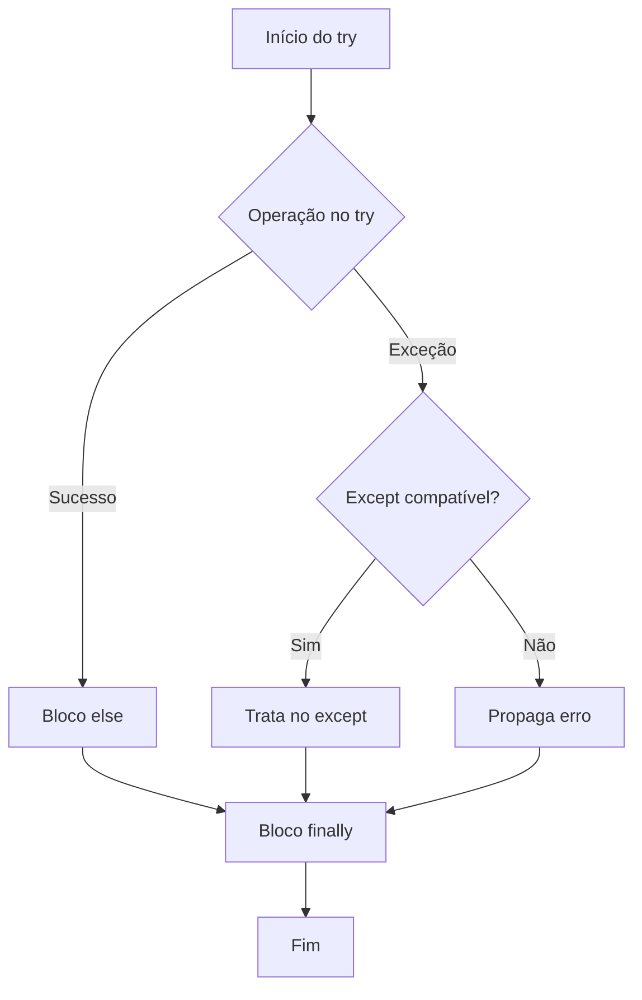

## Visão Geral do Conceito

Programas que processam dados reais — arquivos JSON de pedidos, CSVs de vendas, respostas de API — enfrentam situações **fora do planejamento**: arquivo ausente, JSON malformado, conversão de tipo impossível, divisão por zero em cálculos derivados. Sem um mecanismo estruturado de tratamento, um único erro derruba todo o pipeline ou, pior, falha silenciosamente.

O bloco <mark style="background-color: #242424; padding: 2px 4px; border-radius: 3px; color: inherit;">`try`</mark> / <mark style="background-color: #242424; padding: 2px 4px; border-radius: 3px; color: inherit;">`except`</mark> (complementado por <mark style="background-color: #242424; padding: 2px 4px; border-radius: 3px; color: inherit;">`else`</mark> e <mark style="background-color: #242424; padding: 2px 4px; border-radius: 3px; color: inherit;">`finally`</mark>) existe para **isolar trechos que podem falhar**, tratar cada tipo de erro de forma adequada e garantir limpeza de recursos — tudo isso sem misturar lógica de negócio com controle de falhas.

> **Regra:** <mark style="background-color: #242424; padding: 2px 4px; border-radius: 3px; color: inherit;">`if`</mark> / <mark style="background-color: #242424; padding: 2px 4px; border-radius: 3px; color: inherit;">`else`</mark> controla fluxo **esperado**; <mark style="background-color: #242424; padding: 2px 4px; border-radius: 3px; color: inherit;">`try`</mark> / <mark style="background-color: #242424; padding: 2px 4px; border-radius: 3px; color: inherit;">`except`</mark> trata falhas **inesperadas** que interrompem a execução normal.

Na prática de ADS, isso aparece ao ler <mark style="background-color: #242424; padding: 2px 4px; border-radius: 3px; color: inherit;">`pedidos.json`</mark>, converter limites informados via <mark style="background-color: #242424; padding: 2px 4px; border-radius: 3px; color: inherit;">`input()`</mark> para <mark style="background-color: #242424; padding: 2px 4px; border-radius: 3px; color: inherit;">`float`</mark>, filtrar pedidos pendentes de alto valor e gravar o resultado — cada etapa com pontos de falha distintos.

---

## Modelo Mental

Imagine um pipeline de processamento como uma linha de montagem com **estações de inspeção**:

1. **Try** — a estação tenta executar a operação (abrir arquivo, parsear JSON, converter tipo).
2. **Except** — se algo quebra, um inspetor especializado analisa o tipo de defeito (<mark style="background-color: #242424; padding: 2px 4px; border-radius: 3px; color: inherit;">`FileNotFoundError`</mark>, <mark style="background-color: #242424; padding: 2px 4px; border-radius: 3px; color: inherit;">`ValueError`</mark>, <mark style="background-color: #242424; padding: 2px 4px; border-radius: 3px; color: inherit;">`ZeroDivisionError`</mark>).
3. **Else** — só roda quando a estação **passou sem defeito**; é o caminho do sucesso explícito.
4. **Finally** — a equipe de limpeza que **sempre** fecha conexões, arquivos e registra fim de operação, independentemente do resultado.

A hierarquia de exceções funciona como uma árvore genealógica: <mark style="background-color: #242424; padding: 2px 4px; border-radius: 3px; color: inherit;">`BaseException`</mark> no topo, depois <mark style="background-color: #242424; padding: 2px 4px; border-radius: 3px; color: inherit;">`Exception`</mark>, e abaixo dela tipos mais específicos como <mark style="background-color: #242424; padding: 2px 4px; border-radius: 3px; color: inherit;">`ValueError`</mark>, <mark style="background-color: #242424; padding: 2px 4px; border-radius: 3px; color: inherit;">`TypeError`</mark> e <mark style="background-color: #242424; padding: 2px 4px; border-radius: 3px; color: inherit;">`KeyError`</mark>. Capturar um ancestral genérico cedo demais "engole" erros que deveriam ter tratamento dedicado.

Outro modelo útil: <mark style="background-color: #242424; padding: 2px 4px; border-radius: 3px; color: inherit;">`raise`</mark> é o oposto de <mark style="background-color: #242424; padding: 2px 4px; border-radius: 3px; color: inherit;">`except`</mark>. Enquanto <mark style="background-color: #242424; padding: 2px 4px; border-radius: 3px; color: inherit;">`except`</mark> **recebe** o problema, <mark style="background-color: #242424; padding: 2px 4px; border-radius: 3px; color: inherit;">`raise`</mark> **levanta** o problema para quem chamou a função decidir o que fazer.

---

## Mecânica Central

### Estrutura completa: try / except / else / finally

```python
try:
    # código que pode falhar
    resultado = operacao_arriscada()
except TipoErroA as e:
    # tratamento específico para TipoErroA
    registrar_log(e)
except (TipoErroB, TipoErroC) as e:
    # mesma tratativa para vários tipos
    print(f"Dados inválidos: {e}")
else:
    # executa SOMENTE se nenhuma exceção foi lançada no try
    print(f"Sucesso: {resultado}")
finally:
    # executa SEMPRE
    liberar_recurso()
```

### Fluxo de execução



### Ordem dos blocos except: específico → genérico

O Python avalia os blocos <mark style="background-color: #242424; padding: 2px 4px; border-radius: 3px; color: inherit;">`except`</mark> **de cima para baixo** e para no primeiro compatível.

```python
try:
    numero = int(input("Digite um número: "))
    resultado = 100 / numero
except ValueError:
    print("Entrada não é um número.")
except ZeroDivisionError:
    print("Divisão por zero não é permitida.")
except Exception:
    print("Erro inesperado.")  # fallback
```

Se <mark style="background-color: #242424; padding: 2px 4px; border-radius: 3px; color: inherit;">`except Exception`</mark> vier **antes** de <mark style="background-color: #242424; padding: 2px 4px; border-radius: 3px; color: inherit;">`except ValueError`</mark>, ele captura tudo — inclusive <mark style="background-color: #242424; padding: 2px 4px; border-radius: 3px; color: inherit;">`ValueError`</mark> e <mark style="background-color: #242424; padding: 2px 4px; border-radius: 3px; color: inherit;">`ZeroDivisionError`</mark> — e os blocos específicos nunca executam.

### Captura múltipla e inspeção com `as e`

Quando a mesma tratativa serve para vários tipos, agrupe-os em uma tupla:

```python
try:
    desconto = float(input("Desconto (%): "))
    preco_final = 100 * (1 - desconto / 100)
except (ValueError, TypeError, KeyError) as e:
    preco_final = 0
    print(f"Dados inválidos: {e}")
```

A variável <mark style="background-color: #242424; padding: 2px 4px; border-radius: 3px; color: inherit;">`e`</mark> contém o objeto da exceção lançada, permitindo inspecionar a mensagem original (ex.: `could not convert string to float`) e decidir se exibe ao usuário ou mapeia para mensagem customizada.

### Bloco else: sucesso explícito

O <mark style="background-color: #242424; padding: 2px 4px; border-radius: 3px; color: inherit;">`else`</mark> resolve ambiguidade: código que **só faz sentido** se o <mark style="background-color: #242424; padding: 2px 4px; border-radius: 3px; color: inherit;">`try`</mark> não lançou exceção não deve ficar misturado dentro do <mark style="background-color: #242424; padding: 2px 4px; border-radius: 3px; color: inherit;">`try`</mark> nem dentro do <mark style="background-color: #242424; padding: 2px 4px; border-radius: 3px; color: inherit;">`except`</mark>.

```python
try:
    with open("config.json", encoding="utf-8") as f:
        config = json.load(f)
except FileNotFoundError:
    print("Arquivo de configuração não encontrado.")
except json.JSONDecodeError:
    print("JSON inválido.")
else:
    print("Configuração carregada:", list(config.keys()))
```

### Bloco finally: limpeza garantida

O <mark style="background-color: #242424; padding: 2px 4px; border-radius: 3px; color: inherit;">`finally`</mark> executa **sempre** — sucesso, erro capturado ou erro propagado. Uso típico: fechar conexão de banco, registrar fim de operação, liberar handle de arquivo.

```python
conexao = abrir_conexao_banco()
try:
    conexao.executar_query("SELECT * FROM pedidos")
except DatabaseError as e:
    print(f"Erro no banco: {e}")
finally:
    conexao.fechar()
```

> **Diferença crítica:** <mark style="background-color: #242424; padding: 2px 4px; border-radius: 3px; color: inherit;">`else`</mark> = "deu certo"; <mark style="background-color: #242424; padding: 2px 4px; border-radius: 3px; color: inherit;">`finally`</mark> = "sempre executar limpeza". Não use <mark style="background-color: #242424; padding: 2px 4px; border-radius: 3px; color: inherit;">`finally`</mark> como substituto semântico do <mark style="background-color: #242424; padding: 2px 4px; border-radius: 3px; color: inherit;">`else`</mark>.

### Lançar exceções com `raise`

<mark style="background-color: #242424; padding: 2px 4px; border-radius: 3px; color: inherit;">`raise`</mark> interrompe o fluxo e sinaliza erro ao chamador:

```python
def calcular_raiz(numero):
    if not isinstance(numero, (int, float)):
        raise TypeError("Esperado int ou float.")
    if numero < 0:
        raise ValueError("Número negativo: raiz indefinida nos reais.")
    return numero ** 0.5
```

<mark style="background-color: #242424; padding: 2px 4px; border-radius: 3px; color: inherit;">`raise`</mark> sem argumento dentro de um <mark style="background-color: #242424; padding: 2px 4px; border-radius: 3px; color: inherit;">`except`</mark> **relança** a exceção atual para o nível superior tratar.

### Exceções customizadas

Para regras de negócio específicas, crie classes que herdam de <mark style="background-color: #242424; padding: 2px 4px; border-radius: 3px; color: inherit;">`Exception`</mark>:

```python
class SaldoInsuficienteError(Exception):
    def __init__(self, saldo, valor):
        self.saldo = saldo
        self.valor = valor
        super().__init__(f"Saldo {saldo} insuficiente para sacar {valor}.")

def sacar(saldo, valor):
    if saldo < valor:
        raise SaldoInsuficienteError(saldo, valor)
    return saldo - valor
```

Isso permite que o chamador capture exatamente o tipo de falha de negócio e acesse atributos como <mark style="background-color: #242424; padding: 2px 4px; border-radius: 3px; color: inherit;">`e.saldo`</mark> e <mark style="background-color: #242424; padding: 2px 4px; border-radius: 3px; color: inherit;">`e.valor`</mark>.

### Context manager vs try/finally

O <mark style="background-color: #242424; padding: 2px 4px; border-radius: 3px; color: inherit;">`with open(...)`</mark> já garante fechamento do arquivo — equivalente a <mark style="background-color: #242424; padding: 2px 4px; border-radius: 3px; color: inherit;">`try`</mark> / <mark style="background-color: #242424; padding: 2px 4px; border-radius: 3px; color: inherit;">`finally`</mark> com <mark style="background-color: #242424; padding: 2px 4px; border-radius: 3px; color: inherit;">`f.close()`</mark>, porém mais legível:

```python
# Preferido
with open("pedidos.json", encoding="utf-8") as f:
    dados = json.load(f)

# Equivalente manual (evitar quando with resolve)
f = open("pedidos.json", encoding="utf-8")
try:
    dados = json.load(f)
finally:
    f.close()
```

Combine <mark style="background-color: #242424; padding: 2px 4px; border-radius: 3px; color: inherit;">`with open`</mark> com <mark style="background-color: #242424; padding: 2px 4px; border-radius: 3px; color: inherit;">`try`</mark> / <mark style="background-color: #242424; padding: 2px 4px; border-radius: 3px; color: inherit;">`except`</mark> para tratar erros de leitura e parsing, mantendo o <mark style="background-color: #242424; padding: 2px 4px; border-radius: 3px; color: inherit;">`try`</mark> **mínimo** — apenas o trecho que pode falhar.

---

## Uso Prático

### Cenário: filtrar pedidos pendentes de alto valor (JSON)

O time de operações precisa, ao final do dia, identificar pedidos com status <mark style="background-color: #242424; padding: 2px 4px; border-radius: 3px; color: inherit;">`"aberto"`</mark> e total acima de um limite informado pelo usuário, gravando o resultado em <mark style="background-color: #242424; padding: 2px 4px; border-radius: 3px; color: inherit;">`pedidos_pendentes.json`</mark>.

```python
import json

ARQUIVO_ENTRADA = "pedidos.json"
ARQUIVO_SAIDA = "pedidos_pendentes.json"

with open(ARQUIVO_ENTRADA, encoding="utf-8") as f:
    dados = json.load(f)

limite = float(input("Valor limite: "))

pendentes = [
    p for p in dados["pedidos"]
    if p["status"] == "aberto" and p["total"] > limite
]

with open(ARQUIVO_SAIDA, "w", encoding="utf-8") as f:
    json.dump({"pendentes": pendentes}, f, indent=2, ensure_ascii=False)

print(f"{len(pendentes)} pedidos pendentes acima do limite.")
```

Com limite `300`, entram pedidos da Ana (350) e do Diego (990); o Bruno tem total 1200, mas status <mark style="background-color: #242424; padding: 2px 4px; border-radius: 3px; color: inherit;">`"fechado"`</mark> — excluído pelo filtro.

### Versão robusta com try/except/else/finally

```python
import json
import logging

logging.basicConfig(level=logging.INFO)
logger = logging.getLogger(__name__)

def filtrar_pedidos_pendentes(caminho_entrada, caminho_saida, limite):
    registros_lidos = 0
    try:
        with open(caminho_entrada, encoding="utf-8") as f:
            dados = json.load(f)
    except FileNotFoundError:
        logger.error("Arquivo %s não encontrado.", caminho_entrada)
        return None
    except json.JSONDecodeError as e:
        logger.error("JSON inválido em %s: %s", caminho_entrada, e)
        return None
    except PermissionError:
        logger.error("Sem permissão para ler %s.", caminho_entrada)
        return None
    else:
        pedidos = dados.get("pedidos", [])
        registros_lidos = len(pedidos)
        pendentes = [
            p for p in pedidos
            if p.get("status") == "aberto" and p.get("total", 0) > limite
        ]
    finally:
        logger.info("Tentativa de leitura de %s concluída.", caminho_entrada)

    try:
        with open(caminho_saida, "w", encoding="utf-8") as f:
            json.dump({"pendentes": pendentes}, f, indent=2, ensure_ascii=False)
    except PermissionError as e:
        logger.error("Falha ao gravar %s: %s", caminho_saida, e)
        return None
    else:
        print(f"{len(pendentes)} pedidos pendentes acima do limite.")
        return pendentes
```

### Leitura de CSV com tratamento granular

```python
import csv

def ler_csv(caminho):
    registros = []
    try:
        with open(caminho, newline="", encoding="utf-8") as f:
            leitor = csv.DictReader(f)
            for linha in leitor:
                registros.append(linha)
    except FileNotFoundError:
        print(f"Arquivo {caminho} não encontrado.")
    except PermissionError:
        print(f"Sem permissão de leitura em {caminho}.")
    finally:
        return registros
```

### Validação de entrada com laço e try/else

Para insistir até receber um inteiro válido dentro de faixa:

```python
def ler_inteiro_valido(prompt, minimo, maximo):
    while True:
        try:
            valor = int(input(prompt))
        except ValueError:
            print("Entrada inválida. Digite um número inteiro.")
        else:
            if valor < minimo:
                print(f"Valor deve ser >= {minimo}.")
            elif valor > maximo:
                print(f"Valor deve ser <= {maximo}.")
            else:
                return valor
```

O <mark style="background-color: #242424; padding: 2px 4px; border-radius: 3px; color: inherit;">`return`</mark> dentro do <mark style="background-color: #242424; padding: 2px 4px; border-radius: 3px; color: inherit;">`else`</mark> encerra a função apenas quando o <mark style="background-color: #242424; padding: 2px 4px; border-radius: 3px; color: inherit;">`try`</mark> converteu com sucesso **e** a validação de faixa passou.

### Transformar exceção capturada em tipo de domínio

```python
class ConfiguracaoInvalidaError(Exception):
    pass

try:
    porta = config["servidor"]["porta"]
except KeyError:
    raise ConfiguracaoInvalidaError("Porta ausente na configuração.") from None
```

O <mark style="background-color: #242424; padding: 2px 4px; border-radius: 3px; color: inherit;">`from None`</mark> suprime o encadeamento da exceção original, expondo apenas a mensagem de domínio ao consumidor da API interna.

---

## Erros Comuns

**Colocar `except Exception` antes dos tipos específicos.** Sintoma: mensagens genéricas para todos os erros; blocos dedicados nunca executam. Correção: ordem do mais específico ao mais genérico, com <mark style="background-color: #242424; padding: 2px 4px; border-radius: 3px; color: inherit;">`except Exception`</mark> como último recurso.

**`except` vazio ou com `pass`.** O programa continua como se nada tivesse acontecido; bugs ficam invisíveis na sustentação. Correção: pelo menos registrar com <mark style="background-color: #242424; padding: 2px 4px; border-radius: 3px; color: inherit;">`logging.exception()`</mark> ou relançar com <mark style="background-color: #242424; padding: 2px 4px; border-radius: 3px; color: inherit;">`raise`</mark>.

**Bloco `try` enorme.** Colocar todo o programa dentro de um único <mark style="background-color: #242424; padding: 2px 4px; border-radius: 3px; color: inherit;">`try`</mark> dificulta saber qual linha falhou e mistura lógica de negócio com tratamento. Correção: isolar apenas operações que podem lançar exceção (conversão, I/O, parsing).

**Usar exceções para controle de fluxo normal.** Verificar condições previsíveis com <mark style="background-color: #242424; padding: 2px 4px; border-radius: 3px; color: inherit;">`try`</mark> / <mark style="background-color: #242424; padding: 2px 4px; border-radius: 3px; color: inherit;">`except`</mark> quando um simples <mark style="background-color: #242424; padding: 2px 4px; border-radius: 3px; color: inherit;">`if`</mark> bastaria inverte o propósito do mecanismo e prejudica performance e legibilidade.

**Confundir `else` com `finally`.** Colocar processamento de sucesso no <mark style="background-color: #242424; padding: 2px 4px; border-radius: 3px; color: inherit;">`finally`</mark> faz código rodar mesmo após erro. O <mark style="background-color: #242424; padding: 2px 4px; border-radius: 3px; color: inherit;">`else`</mark> é exclusivo do caminho sem exceção.

**Aninhamento excessivo de try.** Mais de dois níveis de <mark style="background-color: #242424; padding: 2px 4px; border-radius: 3px; color: inherit;">`try`</mark> dentro de <mark style="background-color: #242424; padding: 2px 4px; border-radius: 3px; color: inherit;">`except`</mark> indica necessidade de refatoração — extrair funções com responsabilidade única.

**Exibir mensagem crua de exceção ao usuário final.** Textos como `could not convert string to float` são técnicos demais. Capture com <mark style="background-color: #242424; padding: 2px 4px; border-radius: 3px; color: inherit;">`as e`</mark> e mapeie para mensagem compreensível via dicionário de localização.

**Capturar exceção sem saber tratá-la.** Silenciar erros que você não entende esconde a causa raiz. Melhor deixar propagar ou registrar e relançar.

---

## Visão Geral de Debugging

Quando um script de dados falha silenciosamente ou exibe mensagem genérica, siga esta ordem:

1. **Reproduza com entrada mínima** — um único arquivo, um único valor de <mark style="background-color: #242424; padding: 2px 4px; border-radius: 3px; color: inherit;">`input()`</mark>, um registro de CSV.
2. **Identifique o tipo exato da exceção** — leia o traceback completo; a última linha indica a classe (<mark style="background-color: #242424; padding: 2px 4px; border-radius: 3px; color: inherit;">`ValueError`</mark>, <mark style="background-color: #242424; padding: 2px 4px; border-radius: 3px; color: inherit;">`FileNotFoundError`</mark>, etc.).
3. **Verifique a ordem dos `except`** — se um genérico está "engolindo" erros específicos.
4. **Inspecione o objeto com `as e`** — imprima <mark style="background-color: #242424; padding: 2px 4px; border-radius: 3px; color: inherit;">`type(e)`</mark> e <mark style="background-color: #242424; padding: 2px 4px; border-radius: 3px; color: inherit;">`e`</mark> para confirmar qual ramo deveria ter sido executado.
5. **Confirme se `else` e `finally` estão corretos** — adicione prints temporários em cada bloco para rastrear o fluxo (cenário de "teste de mesa").
6. **Reduza o bloco `try`** — mova código que não lança exceção para fora; isso estreita a linha do traceback.

<details>
<summary>Ver checklist rápido para leitura de JSON</summary>

- Arquivo existe no diretório de trabalho?
- Encoding é <mark style="background-color: #242424; padding: 2px 4px; border-radius: 3px; color: inherit;">`utf-8`</mark>?
- JSON está bem formado (vírgulas, aspas)?
- Chaves esperadas existem (<mark style="background-color: #242424; padding: 2px 4px; border-radius: 3px; color: inherit;">`"pedidos"`</mark>)?
- Tipos dos campos batem com o filtro (<mark style="background-color: #242424; padding: 2px 4px; border-radius: 3px; color: inherit;">`total`</mark> numérico, <mark style="background-color: #242424; padding: 2px 4px; border-radius: 3px; color: inherit;">`status`</mark> string)?
</details>

---

## Principais Pontos

- <mark style="background-color: #242424; padding: 2px 4px; border-radius: 3px; color: inherit;">`try`</mark> isola código sujeito a falha; <mark style="background-color: #242424; padding: 2px 4px; border-radius: 3px; color: inherit;">`except`</mark> trata tipos específicos de exceção.
- Ordem dos <mark style="background-color: #242424; padding: 2px 4px; border-radius: 3px; color: inherit;">`except`</mark>: do mais específico ao mais genérico.
- Tupla em <mark style="background-color: #242424; padding: 2px 4px; border-radius: 3px; color: inherit;">`except (A, B) as e`</mark> unifica tratativa para múltiplos tipos.
- <mark style="background-color: #242424; padding: 2px 4px; border-radius: 3px; color: inherit;">`else`</mark> roda somente sem exceção; <mark style="background-color: #242424; padding: 2px 4px; border-radius: 3px; color: inherit;">`finally`</mark> roda sempre.
- <mark style="background-color: #242424; padding: 2px 4px; border-radius: 3px; color: inherit;">`raise`</mark> sinaliza erro ao chamador; <mark style="background-color: #242424; padding: 2px 4px; border-radius: 3px; color: inherit;">`raise`</mark> sem argumento relança a exceção atual.
- Exceções customizadas herdam de <mark style="background-color: #242424; padding: 2px 4px; border-radius: 3px; color: inherit;">`Exception`</mark> e encapsulam regras de negócio.
- <mark style="background-color: #242424; padding: 2px 4px; border-radius: 3px; color: inherit;">`with open`</mark> é a forma idiomática de garantir fechamento de arquivo.
- Minimize o <mark style="background-color: #242424; padding: 2px 4px; border-radius: 3px; color: inherit;">`try`</mark>; nunca silencie erros com <mark style="background-color: #242424; padding: 2px 4px; border-radius: 3px; color: inherit;">`pass`</mark> em produção.

---

## Preparação para Prática

Após esta lição, você deve conseguir:

- Estruturar leitura de arquivos JSON/CSV com tratamento separado para arquivo ausente, permissão negada e conteúdo inválido.
- Converter entrada do usuário com captura de <mark style="background-color: #242424; padding: 2px 4px; border-radius: 3px; color: inherit;">`ValueError`</mark> e validação de faixa no bloco <mark style="background-color: #242424; padding: 2px 4px; border-radius: 3px; color: inherit;">`else`</mark>.
- Implementar funções que lançam exceções tipadas quando regras de negócio são violadas.
- Escolher conscientemente entre <mark style="background-color: #242424; padding: 2px 4px; border-radius: 3px; color: inherit;">`if`</mark> / <mark style="background-color: #242424; padding: 2px 4px; border-radius: 3px; color: inherit;">`else`</mark> e <mark style="background-color: #242424; padding: 2px 4px; border-radius: 3px; color: inherit;">`try`</mark> / <mark style="background-color: #242424; padding: 2px 4px; border-radius: 3px; color: inherit;">`except`</mark> conforme o tipo de decisão.
- Aplicar boas práticas: bloco <mark style="background-color: #242424; padding: 2px 4px; border-radius: 3px; color: inherit;">`try`</mark> mínimo, logging em vez de supressão, e <mark style="background-color: #242424; padding: 2px 4px; border-radius: 3px; color: inherit;">`finally`</mark> para liberação de recursos.

---

## Laboratório de Prática

### Easy — Converter limite de pedido com tratamento básico

O time de logística informa o valor limite via terminal. Complete a função para converter a entrada com segurança; em caso de erro, retorne `0.0` e exiba mensagem amigável.

```python
def ler_limite_pedido() -> float:
    texto = input("Informe o valor limite (R$): ")
    valor = 0.0
    # TODO: usar try/except para converter texto em float
    # TODO: em ValueError, imprimir "Limite inválido. Usando 0.0."
    return valor


if __name__ == "__main__":
    limite = ler_limite_pedido()
    print(f"Limite configurado: R$ {limite:.2f}")
```

---

### Medium — Carregar configuração JSON com try/except/else/finally

Um serviço de ETL carrega `config.json` antes de processar pedidos. Implemente a função que retorna o dicionário de configuração ou `None` em caso de falha, registrando o fim da tentativa no `finally`.

```python
import json

ARQUIVO_CONFIG = "config.json"


def carregar_configuracao(caminho: str = ARQUIVO_CONFIG):
    config = None
    # TODO: no try, abrir o arquivo com encoding utf-8 e fazer json.load
    # TODO: capturar FileNotFoundError com mensagem "Configuração não encontrada."
    # TODO: capturar json.JSONDecodeError com mensagem "JSON de configuração inválido."
    # TODO: no else, atribuir o resultado carregado a config
    # TODO: no finally, imprimir "Tentativa de carregar configuração concluída."
    return config


if __name__ == "__main__":
    cfg = carregar_configuracao()
    if cfg:
        print("Chaves carregadas:", list(cfg.keys()))
    else:
        print("Processamento abortado por falha na configuração.")
```

---

### Hard — Exceção customizada para saque com saldo insuficiente

Um módulo financeiro precisa impedir saques acima do saldo disponível. Complete a exceção customizada, a função `sacar` e o bloco de tratamento no `__main__`.

```python
class SaldoInsuficienteError(Exception):
    def __init__(self, saldo: float, valor: float):
        self.saldo = saldo
        self.valor = valor
        # TODO: chamar super().__init__ com mensagem descritiva


def sacar(saldo: float, valor: float) -> float:
    # TODO: se saldo < valor, lançar SaldoInsuficienteError
    return saldo - valor


if __name__ == "__main__":
    conta = 500.0
    try:
        conta = sacar(conta, 1000.0)
    except SaldoInsuficienteError as e:
        # TODO: imprimir mensagem com e.saldo e e.valor
        pass
    finally:
        print(f"Saldo final da conta: R$ {conta:.2f}")
```

---

<!-- CONCEPT_EXTRACTION
concepts:
  - try / except
  - hierarquia de exceções
  - bloco else
  - bloco finally
  - raise
  - exceções customizadas
  - except múltiplo com tupla
  - captura com as e
skills:
  - Estruturar blocos try/except/else/finally em pipelines de dados
  - Ordenar handlers de exceção do específico ao genérico
  - Capturar e inspecionar exceções com as e
  - Lançar exceções tipadas com raise para regras de negócio
  - Criar classes de exceção customizadas herdando de Exception
  - Combinar with open com tratamento granular de erros de I/O e parsing
  - Diferenciar controle de fluxo (if/else) de tratamento de falhas (try/except)
examples:
  - filtro-pedidos-json-list-comprehension
  - leitura-config-json-try-except-else-finally
  - calcular-raiz-com-raise
  - saldo-insuficiente-excecao-customizada
  - ler-csv-com-file-not-found
-->

<!-- EXERCISES_JSON
[
  {
    "id": "converter-limite-try-except",
    "slug": "converter-limite-try-except",
    "difficulty": "easy",
    "title": "Converter limite de pedido com try/except",
    "discipline": "python-processamento-dados",
    "editorLanguage": "python",
    "tags": ["python", "try-except", "conversao-tipos", "input"],
    "summary": "Converter entrada do usuário para float com tratamento de ValueError e valor padrão seguro."
  },
  {
    "id": "carregar-config-json-completo",
    "slug": "carregar-config-json-completo",
    "difficulty": "medium",
    "title": "Carregar configuração JSON com try/except/else/finally",
    "discipline": "python-processamento-dados",
    "editorLanguage": "python",
    "tags": ["python", "try-except", "json", "io", "finally"],
    "summary": "Implementar carregamento robusto de config.json com tratamento de arquivo ausente, JSON inválido e bloco finally."
  },
  {
    "id": "excecao-customizada-saldo",
    "slug": "excecao-customizada-saldo",
    "difficulty": "hard",
    "title": "Exceção customizada para saldo insuficiente",
    "discipline": "python-processamento-dados",
    "editorLanguage": "python",
    "tags": ["python", "raise", "excecoes-customizadas", "finally"],
    "summary": "Criar SaldoInsuficienteError, lançar com raise em regra de negócio e tratar no bloco except com finally."
  }
]
-->
