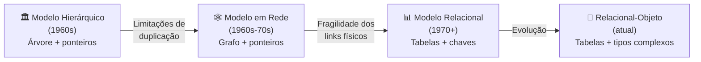
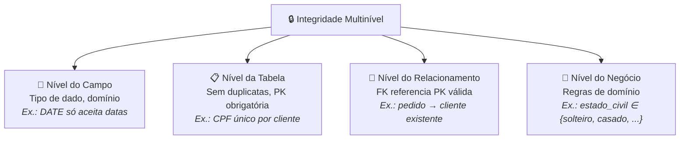
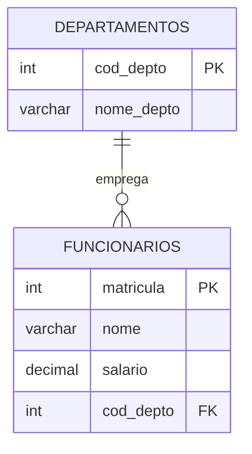
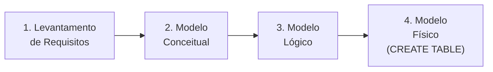

## Visão Geral do Conceito

Antes de escrever qualquer <mark style="background-color: #242424; padding: 2px 4px; border-radius: 3px; color: inherit;">`SELECT`</mark> ou <mark style="background-color: #242424; padding: 2px 4px; border-radius: 3px; color: inherit;">`CREATE TABLE`</mark>, existe uma etapa anterior e decisiva: **modelar** o banco de dados.

Modelagem é o processo de projetar a estrutura do banco — quais tabelas existirão, quais colunas cada uma terá, como elas se relacionam e quais regras de integridade governam os dados. Uma modelagem bem feita previne redundância, inconsistência e dificuldade de manutenção. Uma modelagem mal feita é a causa raiz de problemas de desempenho e dados inválidos que aparecem meses depois, quando o sistema já está em produção.

Nesta lição, percorremos a **evolução dos modelos de banco de dados** — do hierárquico ao relacional — para entender *por que* o modelo relacional se tornou dominante, quais **vantagens** ele trouxe, qual **terminologia** usa, e quais são as **etapas** para projetar um banco de dados do zero.

---

## Modelo Mental

Pense em três formas de organizar uma biblioteca:

1. **Modelo Hierárquico** — Todos os livros estão organizados como uma árvore: a raiz é "Biblioteca", abaixo ficam "Seções", abaixo ficam "Prateleiras", abaixo ficam "Livros". Para encontrar um livro, você **sempre** parte da raiz e desce pela hierarquia. Se o mesmo livro pertence a duas seções (ex.: "Python para Ciência de Dados" é tanto Programação quanto Dados), você precisa duplicar o livro.

2. **Modelo em Rede** — Similar à árvore, mas agora as conexões podem ir em qualquer direção — um livro pode estar ligado a múltiplas seções sem duplicação. O problema: cada conexão é um "fio físico". Se um fio se perde, a conexão se perde.

3. **Modelo Relacional** — Em vez de fios, cada livro tem um **código único** (chave primária), e cada seção registra os códigos dos livros que contém (chave estrangeira). A conexão está **no dado**, não em fios. Se o sistema cair e reiniciar, os dados e suas conexões continuam intactos.

O modelo relacional resolve os problemas dos anteriores: elimina duplicação forçada, remove dependência de ponteiros físicos e adiciona regras de integridade em múltiplos níveis.



---

## Mecânica Central

### Evolução histórica dos modelos de banco de dados

O modelo relacional surgiu no **início dos anos 1970**, proposto por Edgar F. Codd (IBM). Antes dele, dois modelos dominavam:

**Modelo Hierárquico**
- Dados organizados em estrutura de **árvore** com um nó raiz.
- Cada registro-filho pertence a exatamente **um** registro-pai.
- A ligação entre registros é um **ponteiro físico** (controlado internamente pelo banco).
- **Problema central**: se um registro precisa pertencer a dois pais, ele deve ser duplicado. A perda de um ponteiro pode tornar dados inacessíveis.

**Modelo em Rede**
- Similar ao hierárquico, mas sem a restrição de pai único — um registro pode ter **múltiplos links**.
- Não existe nó raiz obrigatório.
- **Problema persistente**: as ligações continuam sendo ponteiros físicos; a fragilidade dos links permanece.

**Modelo Relacional**
- Os dados são organizados em **tabelas** (relações).
- A ligação entre tabelas acontece no **nível do dado**: a <mark style="background-color: #242424; padding: 2px 4px; border-radius: 3px; color: inherit;">`chave primária`</mark> de uma tabela é referenciada pela <mark style="background-color: #242424; padding: 2px 4px; border-radius: 3px; color: inherit;">`chave estrangeira`</mark> de outra.
- Fundamentado em **teoria dos conjuntos** e **lógica de predicados de primeira ordem**.

### Terminologia relacional

A teoria usa termos formais que, na prática, têm sinônimos comuns:

| Teoria (formal) | Prática (dia a dia) | Significado |
|:---|:---|:---|
| **Tupla** | Registro / Linha | Um conjunto de valores que representa uma entrada na tabela |
| **Relação** | Tabela / Entidade | Conjunto de tuplas com a mesma estrutura |
| **Atributo** | Campo / Coluna | Uma propriedade nomeada de uma relação |

> **Regra prática:** Em provas formais e concursos, espere "tupla", "relação" e "atributo". No trabalho e em ferramentas, use "linha", "tabela" e "coluna".

### Tipos de SGBD

<mark style="background-color: #242424; padding: 2px 4px; border-radius: 3px; color: inherit;">`SGBD`</mark> = Sistema Gerenciador de Banco de Dados. As variações mais importantes:

| Sigla | Nome completo | Característica |
|:---|:---|:---|
| **SGBDR** | SGBD Relacional (RDBMS) | Usa modelo relacional — MySQL, PostgreSQL, Oracle, SQL Server, SQLite, DB2 |
| **SGBDC** | SGBD Centralizado | Banco de dados em **um único servidor** |
| **SGBDD** | SGBD Distribuído | Banco de dados distribuído em **múltiplas máquinas** que atuam como um só banco |

### OLTP vs OLAP

| | OLTP | OLAP |
|:---|:---|:---|
| **Sigla** | Online Transaction Processing | Online Analytical Processing |
| **Perfil** | Operacional (dia a dia) | Analítico (BI, relatórios) |
| **Dados** | Crus, transacionais | Tratados, sumarizados |
| **Operações** | INSERT, UPDATE, DELETE intensos | SELECT com agregações complexas |
| **Exemplo** | Sistema de vendas, ERP | Data Warehouse, dashboards executivos |

### Integridade multinível

O modelo relacional oferece integridade em **quatro níveis**:



1. **Campo** — O tipo de dado restringe o que pode ser armazenado. Uma coluna <mark style="background-color: #242424; padding: 2px 4px; border-radius: 3px; color: inherit;">`DATE`</mark> rejeita texto livre; uma coluna <mark style="background-color: #242424; padding: 2px 4px; border-radius: 3px; color: inherit;">`INTEGER`</mark> rejeita letras.
2. **Tabela** — Nenhum registro inteiro pode ser duplicado. A chave primária garante unicidade.
3. **Relacionamento** — A chave estrangeira na tabela-filha deve referenciar um valor existente na chave primária da tabela-mãe.
4. **Negócio** — Regras definidas no banco limitam valores válidos (ex.: coluna `estado_civil` só aceita `'solteiro'`, `'casado'`, `'viúvo'`, `'separado'`).

### Chave primária e chave estrangeira



- **Chave Primária (PK)**: coluna (ou combinação de colunas) que identifica **unicamente** cada registro na tabela. Não pode ter valores duplicados nem nulos.
- **Chave Estrangeira (FK)**: coluna na tabela-filha que referencia a chave primária da tabela-mãe. É o mecanismo que cria o **relacionamento** entre tabelas no nível do dado.

### Etapas de modelagem de banco de dados



| Etapa | O que é | Analogia com construção |
|:---|:---|:---|
| **Levantamento de Requisitos** | Entrevistas, análise de regras de negócio, entender o que o banco deve armazenar | Reunião com o cliente para entender o que ele quer na casa |
| **Modelo Conceitual** | Identificar entidades, atributos e relacionamentos de forma abstrata | Planta baixa inicial do arquiteto |
| **Modelo Lógico** | Detalhar tabelas, colunas, tipos, chaves e cardinalidades sem depender de um SGBD específico | Projeto estrutural com medidas, elétrica e hidráulica |
| **Modelo Físico** | Criar as tabelas efetivamente no SGBD escolhido (<mark style="background-color: #242424; padding: 2px 4px; border-radius: 3px; color: inherit;">`CREATE TABLE`</mark>) | Empreiteiro construindo seguindo o projeto |

---

## Uso Prático

### Vantagens de um bom design de banco de dados

Um banco bem modelado proporciona:

- **Eliminação de redundância** — cada dado é armazenado uma única vez. Atualizações atingem um ponto, não dez.
- **Integridade garantida** — os quatro níveis de integridade previnem dados inválidos.
- **Facilidade de recuperação** — consultas SQL retornam dados confiáveis.
- **Manutenção simplificada** — estrutura fácil de modificar com <mark style="background-color: #242424; padding: 2px 4px; border-radius: 3px; color: inherit;">`ALTER TABLE`</mark>.
- **Crescimento futuro** — o banco suporta novas regras e entidades sem reescrever o existente.

### Cenário: o problema da redundância

Imagine uma tabela de clientes onde "Maria" aparece **10 vezes** (registros duplicados):

```sql
-- Atualizar o endereço da Maria (que se mudou)
UPDATE clientes
SET logradouro = 'Rua Nova, 42',
    complemento = 'Apto 301',
    cep = '20040-020'
WHERE nome = 'Maria';
```

Se o banco falhar no meio da execução e só 5 dos 10 registros forem atualizados, metade do banco diz que Maria mora no endereço antigo e metade diz que mora no novo. Isso é **inconsistência de dados** — resultado direto de redundância.

**Com modelagem correta**, Maria teria **um único registro** na tabela de clientes. O <mark style="background-color: #242424; padding: 2px 4px; border-radius: 3px; color: inherit;">`UPDATE`</mark> atualizaria uma linha, eliminando o risco.

### Ferramentas de modelagem

Para criar modelos conceituais e lógicos antes de implementar, podem ser usadas:

| Ferramenta | Tipo | Acesso |
|:---|:---|:---|
| **DB Designer** | Web (online) | [erd.dbdesigner.net](https://erd.dbdesigner.net/) |
| **brModelo** | Desktop (Java) | [sis4.com/brModelo](http://www.sis4.com/brModelo/download.html) |
| **MySQL Workbench** | Desktop | Download via MySQL/Oracle |
| **Oracle Data Modeler** | Desktop | [oracle.com/datamodeler](http://www.oracle.com/technetwork/developer-tools/datamodeler/overview/index.html) |

### Evolução do modelo relacional

O modelo relacional puro evoluiu para o **modelo relacional-objeto (relacional estendido)**, incorporando:

- Armazenamento de objetos complexos (CAD, dados geográficos, multimídia) em colunas
- Suporte a <mark style="background-color: #242424; padding: 2px 4px; border-radius: 3px; color: inherit;">`XML`</mark> e <mark style="background-color: #242424; padding: 2px 4px; border-radius: 3px; color: inherit;">`JSON`</mark> nativamente
- Conceitos de Data Warehouse (DW) e Data Mart para análise

Na prática, bancos como PostgreSQL, Oracle e SQL Server modernos não são "puramente relacionais" — são **relacionais-objeto estendidos**.

---

## Erros Comuns

| Erro | Causa | Consequência | Correção |
|:---|:---|:---|:---|
| Confundir backup com espelhamento (RAID) | Espelhamento mantém réplica em tempo real, mas não permite restore granular (ex.: restaurar uma tabela) | Perda de dados sem possibilidade de recuperação parcial | Implementar procedimento de backup dedicado, além do espelhamento |
| Criar tabelas sem chave primária | Pressa ou falta de planejamento | Registros duplicados impossíveis de distinguir; JOINs falham | Sempre definir PK antes de popular a tabela |
| Nomear tabelas com siglas ou abreviações | Economia de caracteres | Ninguém entende o que `EMVM` significa 6 meses depois | Usar nomes descritivos: `Equipamento`, `Manutencao_Veiculo` |
| Misturar dois assuntos numa tabela | Ex.: `Departamento_ou_Filial` | Ambiguidade sobre o que cada registro representa | Uma tabela = um assunto (entidade) |
| Ignorar campos multiparte | Ex.: coluna "endereço" com rua + número + CEP juntos | Impossível filtrar por CEP ou cidade separadamente | Separar em colunas atômicas: `logradouro`, `numero`, `cep`, `cidade` |

---

## Visão Geral de Debugging

Quando dados parecem errados em um banco relacional, siga esta lógica:

1. **O dado está duplicado?** → Verifique se a tabela tem chave primária definida. Verifique se há redundância que deveria ter sido eliminada na modelagem.

2. **Dados inconsistentes entre registros?** → Clássico sintoma de redundância. O mesmo dado em múltiplos registros foi atualizado parcialmente.

3. **Valor inesperado em uma coluna?** → Verifique a integridade de campo (tipo de dado definido) e de negócio (constraints/check constraints).

4. **Registro órfão (sem "pai")?** → A chave estrangeira referencia um valor que não existe na tabela-mãe. Verifique se a integridade referencial está ativa.

5. **Consulta retorna resultados estranhos após JOIN?** → Verifique se PK e FK estão corretamente definidas e se os tipos de dado coincidem.

---

## Principais Pontos

- O modelo relacional substitui **ponteiros físicos** (hierárquico/rede) por **ligações no nível do dado** (PK ↔ FK).
- A integridade do modelo relacional atua em **quatro níveis**: campo, tabela, relacionamento e negócio.
- **Tupla** = registro/linha; **Relação** = tabela/entidade; **Atributo** = campo/coluna.
- OLTP é o banco **operacional** (transações); OLAP é o banco **analítico** (BI).
- SGBDR = relacional; SGBDC = centralizado; SGBDD = distribuído.
- Modelagem segue **quatro etapas**: requisitos → conceitual → lógico → físico.
- **Um bom design** elimina redundância, garante integridade e facilita manutenção e crescimento futuro.
- A chave primária **identifica unicamente** um registro; a chave estrangeira **referencia** a PK de outra tabela.

---

## Preparação para Prática

Após esta lição, você deve ser capaz de:

- Explicar por que o modelo relacional superou o hierárquico e o em rede.
- Identificar problemas causados por redundância de dados.
- Traduzir termos teóricos para práticos e vice-versa.
- Reconhecer os quatro níveis de integridade em um cenário de banco de dados.
- Dado um cenário de negócio simples, listar as entidades, seus atributos e indicar candidatos a chave primária e estrangeira.
- Descrever as quatro etapas de modelagem e o que cada uma produz.

---

## Laboratório de Prática

### Desafio 1 — Easy: Mapeamento de terminologia

**Contexto:** Você é um analista júnior e seu líder técnico usa termos formais de banco de dados em reuniões. Você precisa traduzir para os desenvolvedores da equipe.

Complete a query abaixo que consulta uma "tabela de tradução" de termos:

```sql
-- Tabela: termos_bd
-- Colunas: id, termo_formal, termo_pratico, definicao
--
-- Retorne todos os pares (termo_formal, termo_pratico)
-- ordenados alfabeticamente pelo termo formal.

SELECT termo_formal, termo_pratico
FROM termos_bd
-- TODO: adicionar ordenação pelo termo formal
;
```

<details>
<summary>Dica</summary>

Use <mark style="background-color: #242424; padding: 2px 4px; border-radius: 3px; color: inherit;">`ORDER BY`</mark> seguido do nome da coluna que deseja ordenar.
</details>

---

### Desafio 2 — Medium: Identificando problemas de integridade

**Contexto:** Uma empresa de e-commerce tem a seguinte tabela de clientes com problemas. Analise e escreva queries para identificar as violações.

```sql
-- Tabela: clientes
-- Colunas: id, nome, email, cpf, estado_civil, data_nascimento
--
-- Problema 1: Encontrar registros com CPF duplicado (violação de integridade de tabela)
SELECT cpf, COUNT(*) AS total
FROM clientes
-- TODO: agrupar por cpf e filtrar apenas os que aparecem mais de uma vez
;

-- Problema 2: Encontrar registros com estado_civil inválido
-- Valores válidos: 'solteiro', 'casado', 'viuvo', 'separado', 'divorciado'
SELECT id, nome, estado_civil
FROM clientes
-- TODO: filtrar registros cujo estado_civil NÃO está na lista de valores válidos
;

-- Problema 3: Encontrar pedidos sem cliente correspondente (integridade referencial)
-- Tabela: pedidos (id, cliente_id, valor, data_pedido)
SELECT p.id AS pedido_id, p.cliente_id
FROM pedidos p
-- TODO: usar LEFT JOIN com clientes e filtrar onde o cliente não existe
;
```

<details>
<summary>Dica</summary>

Para o Problema 1, use <mark style="background-color: #242424; padding: 2px 4px; border-radius: 3px; color: inherit;">`GROUP BY`</mark> + <mark style="background-color: #242424; padding: 2px 4px; border-radius: 3px; color: inherit;">`HAVING COUNT(*) > 1`</mark>. Para o Problema 2, use <mark style="background-color: #242424; padding: 2px 4px; border-radius: 3px; color: inherit;">`NOT IN`</mark>. Para o Problema 3, use <mark style="background-color: #242424; padding: 2px 4px; border-radius: 3px; color: inherit;">`LEFT JOIN ... WHERE ... IS NULL`</mark>.
</details>

---

### Desafio 3 — Hard: Modelando do zero

**Contexto:** Uma pequena loja de bicicletas (inspirada no estudo de caso "Bicicletas do Mike") precisa de um banco de dados. A declaração de missão é: *"Manter dados de inventário, clientes, vendas, fornecedores e funcionários."*

Crie as tabelas com chaves primárias e estrangeiras adequadas:

```sql
-- Missão: sistema de vendas da loja de bicicletas
-- Entidades identificadas: Clientes, Produtos, Fornecedores, Funcionarios, Vendas, Itens_Venda

-- TODO: Criar tabela Clientes com PK e colunas relevantes
CREATE TABLE Clientes (
    cliente_id INTEGER PRIMARY KEY,
    nome VARCHAR(100) NOT NULL,
    telefone VARCHAR(20),
    email VARCHAR(100),
    cidade VARCHAR(50),
    estado VARCHAR(2)
);

-- TODO: Criar tabela Fornecedores com PK
CREATE TABLE Fornecedores (
    fornecedor_id INTEGER PRIMARY KEY
    -- TODO: adicionar colunas nome_empresa, contato, telefone, cidade, estado
);

-- TODO: Criar tabela Produtos com PK e FK para Fornecedores
CREATE TABLE Produtos (
    produto_id INTEGER PRIMARY KEY,
    nome VARCHAR(100) NOT NULL,
    preco DECIMAL(10,2),
    estoque INTEGER DEFAULT 0
    -- TODO: adicionar FK fornecedor_id referenciando Fornecedores
);

-- TODO: Criar tabela Funcionarios com PK
CREATE TABLE Funcionarios (
    funcionario_id INTEGER PRIMARY KEY
    -- TODO: adicionar colunas nome, cargo, data_admissao
);

-- TODO: Criar tabela Vendas com PK e FKs para Clientes e Funcionarios
CREATE TABLE Vendas (
    venda_id INTEGER PRIMARY KEY,
    data_venda DATE NOT NULL
    -- TODO: adicionar FK cliente_id referenciando Clientes
    -- TODO: adicionar FK funcionario_id referenciando Funcionarios
);

-- TODO: Criar tabela Itens_Venda com PK composta e FKs para Vendas e Produtos
-- Esta tabela resolve o relacionamento muitos-para-muitos entre Vendas e Produtos
CREATE TABLE Itens_Venda (
    venda_id INTEGER,
    produto_id INTEGER,
    quantidade INTEGER NOT NULL,
    preco_unitario DECIMAL(10,2) NOT NULL
    -- TODO: definir PRIMARY KEY composta (venda_id, produto_id)
    -- TODO: adicionar FK venda_id referenciando Vendas
    -- TODO: adicionar FK produto_id referenciando Produtos
);
```

<details>
<summary>Dica</summary>

Para a FK em Produtos, adicione: <mark style="background-color: #242424; padding: 2px 4px; border-radius: 3px; color: inherit;">`fornecedor_id INTEGER REFERENCES Fornecedores(fornecedor_id)`</mark>. Para a PK composta em Itens_Venda, use: <mark style="background-color: #242424; padding: 2px 4px; border-radius: 3px; color: inherit;">`PRIMARY KEY (venda_id, produto_id)`</mark>. Para as FKs, use: <mark style="background-color: #242424; padding: 2px 4px; border-radius: 3px; color: inherit;">`FOREIGN KEY (coluna) REFERENCES tabela(coluna)`</mark>.
</details>

---

<!-- CONCEPT_EXTRACTION
concepts:
  - modelo relacional
  - modelo hierárquico
  - modelo em rede
  - OLTP (Online Transaction Processing)
  - OLAP (Online Analytical Processing)
  - SGBD / SGBDR / SGBDC / SGBDD
  - chave primária (PK)
  - chave estrangeira (FK)
  - integridade de dados (campo, tabela, relacionamento, negócio)
  - terminologia relacional (tupla, relação, atributo)
  - etapas de modelagem (requisitos, conceitual, lógico, físico)
  - redundância de dados
  - normalização (introdução)
  - Data Warehouse / Data Mart
  - modelo relacional-objeto (estendido)

skills:
  - Distinguir modelos de BD (hierárquico, rede, relacional) e suas limitações
  - Identificar os quatro níveis de integridade em BD relacional
  - Mapear terminologia teórica para prática (tupla/linha, relação/tabela, atributo/coluna)
  - Reconhecer o papel de chave primária e chave estrangeira na ligação entre tabelas
  - Descrever as etapas de modelagem (requisitos → conceitual → lógico → físico)
  - Identificar problemas de redundância em cenários de dados
  - Classificar SGBD por tipo (relacional, centralizado, distribuído)
  - Diferenciar OLTP de OLAP em cenários práticos

examples:
  - Evolução: hierárquico (árvore + ponteiros) → rede (grafo + ponteiros) → relacional (tabelas + chaves)
  - Integridade campo: coluna DATE rejeita texto; coluna INTEGER rejeita letras
  - Integridade negócio: estado_civil IN ('solteiro', 'casado', 'viuvo', 'separado')
  - Redundância: cliente Maria com 10 registros → UPDATE parcial → inconsistência
  - PK/FK: DEPARTAMENTOS.cod_depto (PK) → FUNCIONARIOS.cod_depto (FK)
  - CREATE TABLE com PRIMARY KEY e FOREIGN KEY
-->

<!-- EXERCISES_JSON
[
  {
    "id": "sql-mr-01-mapeamento-terminologia",
    "slug": "sql-mr-01-mapeamento-terminologia",
    "difficulty": "easy",
    "title": "Mapeamento de terminologia relacional",
    "discipline": "sql-modelagem-relacional",
    "editorLanguage": "sql",
    "tags": ["sql", "terminologia", "ORDER BY", "modelagem-relacional"],
    "summary": "Completar query de consulta a uma tabela de termos de banco de dados com ordenação."
  },
  {
    "id": "sql-mr-01-identificar-problemas-integridade",
    "slug": "sql-mr-01-identificar-problemas-integridade",
    "difficulty": "medium",
    "title": "Identificando problemas de integridade",
    "discipline": "sql-modelagem-relacional",
    "editorLanguage": "sql",
    "tags": ["sql", "integridade", "GROUP BY", "HAVING", "NOT IN", "LEFT JOIN", "modelagem-relacional"],
    "summary": "Escrever queries para detectar CPFs duplicados, estados civis inválidos e pedidos órfãos."
  },
  {
    "id": "sql-mr-01-modelando-loja-bicicletas",
    "slug": "sql-mr-01-modelando-loja-bicicletas",
    "difficulty": "hard",
    "title": "Modelando a loja de bicicletas do zero",
    "discipline": "sql-modelagem-relacional",
    "editorLanguage": "sql",
    "tags": ["sql", "CREATE TABLE", "PRIMARY KEY", "FOREIGN KEY", "modelagem", "modelagem-relacional"],
    "summary": "Criar tabelas com chaves primárias e estrangeiras para o sistema de vendas de uma loja de bicicletas."
  }
]
-->
