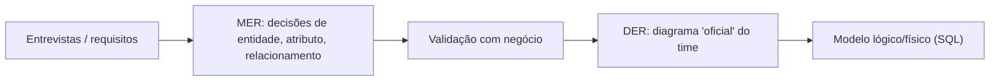
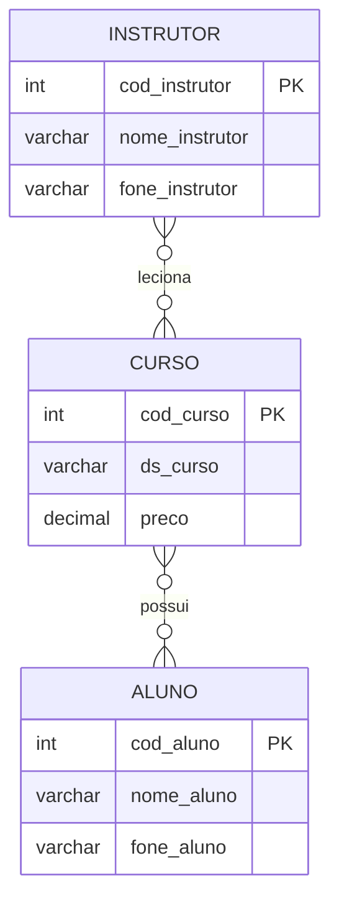
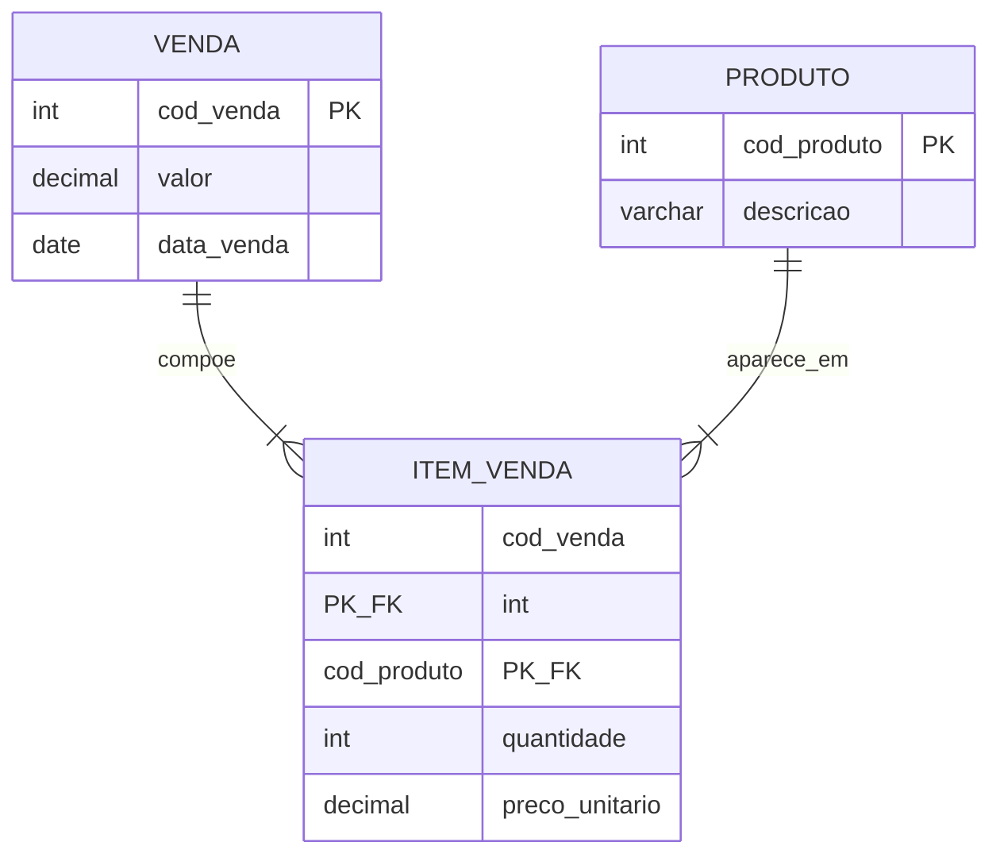

## Visão Geral do Conceito

Na [[modelagem-dados-relacional-fundamentos]], você viu *por que* o relacional venceu e quais são as etapas macro (requisitos → conceitual → lógico → físico). Nesta lição, o foco muda para **comunicar e decidir estrutura antes do <mark style="background-color: #242424; padding: 2px 4px; border-radius: 3px; color: inherit;">`CREATE TABLE`</mark>**: desenhar **entidades**, **atributos** e **relacionamentos**, ler **cardinalidade**, nomear **dados** com precisão e encaixar o desenho num **processo** (validação com negócio, documentação, visões para exposição mínima de dados).

O fio condutor da aula é duplo: (1) **notação e leitura** — o professor trabalhou o modelo de **Peter Chen** e alertou que outras notações (por exemplo, **pé de galinha** / crow's foot) mudam hábitos visuais; (2) **engenharia** — transformar entrevistas e listas em um **MER**/**DER** vivo, que alimenta restrições como <mark style="background-color: #242424; padding: 2px 4px; border-radius: 3px; color: inherit;">`UNIQUE`</mark> e <mark style="background-color: #242424; padding: 2px 4px; border-radius: 3px; color: inherit;">`NOT NULL`</mark> e amarra o estudo de caso **Bicicletas do Mike**.

> **Regra:** Diagrama bom não é “desenho bonito”. É **contrato interpretável** entre negócio, dados e software.

---

## Modelo Mental

Pense no MER/DER como **mapa de conversas** entre “coisas estáveis do negócio” (entidades) e “fatos que conectam essas coisas” (relacionamentos). Cada relacionamento pode ser lido como uma **frase** com sujeito, verbo e objeto: “Instrutor **leciona** Curso”, “Cliente **compra** em Venda”.

**Cardinalidade** (na abordagem min/max da aula) responde a duas perguntas para cada lado do vínculo:

- **Mínimo:** pode ser zero? (ex.: curso novo sem instrutor ainda)
- **Máximo:** pode passar de um? (usa-se <mark style="background-color: #242424; padding: 2px 4px; border-radius: 3px; color: inherit;">`N`</mark> para “muitos”)

Quando ambos os lados podem chegar a **muitos**, você está diante de **N:N** — na implementação relacional, quase sempre aparecerá uma **tabela de junção** (lição 1 já mostrou o padrão em `Itens_Venda`).

**MER vs DER** (como discutido na aula): há autores e times que tratam como sinônimos; há quem diga que o **MER** é a **ideia** (mais abstrata) e o **DER** é a **materialização** diagramática mais “fechada”, já com decisões de tabelas-chaves. O importante é o time **combinar o vocabulário**.



---

## Mecânica Central

### Entidades, atributos e chaves no diagrama

- **Entidade** (retângulo): candidata a virar **tabela**.
- **Atributo** (elipse / “bolinha” na convenção da aula): candidato a **coluna**.
- **Chave primária** destacada (na aula, atributo em destaque “azul”): identificador único da entidade.



> **Nota de fidelidade ao exemplo oral:** Na transcrição, o professor leu cardinalidades **mínima/máxima** entre Instrutor–Curso e Curso–Aluno com vários cenários “zero ou muitos”. O desenho exato (onde anotar 0, 1, N) depende da **legenda do slide**. Guarde como hábito: **reproduza os números do seu material** e valide com uma frase em português.

### Relacionamento com atributo

Pergunta comum: “relacionamento pode ter atributo?” **Sim.** Exemplo clássico: nota de um aluno **em** uma turma é atributo do vínculo Aluno–Turma, não exclusivamente de Aluno nem de Turma. Na implementação, isso frequentemente vira **tabela associativa** com chaves estrangeiras.

### Cardinalidades 1:1, 1:N e N:N

- **1:N:** um lado “um”, outro “vários”. Exemplo típico: Departamento–Funcionários (uma filial, muitos empregados — regra de negócio permitindo).
- **N:N:** ambos os lados com máximo **N**. Exemplo da aula: **Venda** e **Produto** — uma venda envolve vários produtos; um produto aparece em várias vendas.
- **Leitura confusa (Chen):** na discussão com a turma, ficou explícito que **há convenções em que você lê a cardinalidade “do lado oposto”** à entidade que está ancorando a frase mental. Quando trocar de material (crow's foot), **revalide a legenda** — times invertem lados por hábito visual.

### Terminologia: dado, valor, informação

- **Valor** na célula: o conteúdo armazenado (ex.: matrícula `1`, nome `Maria`).
- **Dado:** muitas vezes usado como sinônimo de **valor** armazenado; na prática de time, combine o glossário.
- **Informação:** o que **sai** quando alguém executa uma **consulta** (<mark style="background-color: #242424; padding: 2px 4px; border-radius: 3px; color: inherit;">`SELECT`</mark> / *query*) útil para decisão.

### <mark style="background-color: #242424; padding: 2px 4px; border-radius: 3px; color: inherit;">`NULL`</mark>

**Nulo** representa **ausência de valor conhecido** ou **inaplicável** — não é zero, não é string vazia. Na aula: cuidado com **expressões** e **agregações** que podem “perder” ou mal comportar nulos se você não pensar o domínio.

### Campos calculados, multipart e multivalorados

- **Campo calculado:** deriva de outros (ex.: concatenar `primeiro_nome` + `ultimo_nome`). Pode existir como coluna persistida ou como expressão em consulta/view — trade-off de **armazenamento vs consistência**.
- **Campo multiparte:** vários fatos diferentes na mesma coluna (ex.: cidade, estado e CEP “cosidos”). **Cheiro forte** de problema que a **normalização** tratará.
- **Campo multivalorado:** múltiplos valores de mesmo papel na mesma célula (ex.: representantes separados por vírgula). Também é **anti-padrão** relacional; legado pode trazer isso — seu trabalho é **detectar** e **planejar correção**.

### <mark style="background-color: #242424; padding: 2px 4px; border-radius: 3px; color: inherit;">`VIEW`</mark> (visão)

**View** é uma **consulta nomeada** que se comporta como “tabela virtual”. Usos ligados à aula:

- **Expor só colunas permitidas** a um papel (ex.: vendas vendo telefone, mas **não** salário).
- **Encapsular junções** recorrentes para simplificar aplicações e relatórios.

> **Regra de ouro LGPD (contexto da aula):** minimizar dados sensíveis por **papel**. View não substitui **governança**, **auditoria** e **políticas de acesso**, mas é peça comum no **modelo lógico** de exposição.

### Chaves revisitadas

- **PK:** unicidade de linha na tabela.
- **FK:** no discurso da aula, coluna filha que **deve existir** no lado mãe **como regra de integridade referencial** quando a restrição está ativa. **Pergunta da turma:** FK **sempre** aponta para PK? **Resposta dada:** não necessariamente; **na prática** alinhe tipos e prefira a **PK** para evitar ambiguidade.

### Etapa 2: restrições citadas

Ao introduzir a etapa seguinte, a aula mencionou explicitamente planejar relações com **restrições** como <mark style="background-color: #242424; padding: 2px 4px; border-radius: 3px; color: inherit;">`UNIQUE`</mark> (unicidade além da PK quando necessário) e <mark style="background-color: #242424; padding: 2px 4px; border-radius: 3px; color: inherit;">`NOT NULL`</mark> (obrigatoriedade de valor). São **decisões de modelo** antes/por trás do SQL.

### Processo, entrevistas e listas preliminares (Bicicletas do Mike)

Fluxo retomado na aula:

1. **Declaração de missão** do banco (por que existe).
2. **Objetivos operacionais** (inventário completo, cadastro de clientes atual, histórico de vendas, fornecedores, funcionários).
3. **Listas preliminares** de **campos** e de **assuntos/entidades** — depois **deduplicar** nomes (não manter duas `Funcionario` conceituais se for a mesma coisa).
4. **Checar** se as tabelas imaginadas cobrem a missão.

A professura também reforçou **migração** quando existe banco anterior: mapear coluna a coluna entre origem e destino se o modelo físico mudar de SGBD mas preservar desenho lógico.

### Ferramentas (atalho prático)

Use o guia institucional em `aulas/segundoTri/sqlModelagemRelacional/Contexto/Dica-Inicial-de-como-usar-Data-Modeler-brModelo-e-DBDesigner.txt` para **DB Designer**, **brModelo** e **Oracle SQL Developer Data Modeler**. Ferramentas mudam menus, mas o **artefato** (MER/DER) permanece.

---

## Uso Prático

### Mini-guia: traduzir N:N em tabelas



`ITEM_VENDA` carrega **atributos do relacionamento** (quantidade, preço na venda).

### Exemplo SQL: view “somente não sensível”

```sql
-- Base: funcionarios(id, nome, email, telefone, salario)
CREATE VIEW vw_funcionarios_contato_vendas AS
SELECT
  id,
  nome,
  email,
  telefone
FROM funcionarios;
-- Vendas não enxerga salario, mas consulta uma relação estável e auditável.
```

### Perguntas de entrevista (aberta vs fechada — como na aula)

- **Aberta:** “Como vocês definem **preço válido** de produto em promoção?”
- **Fechada:** “Quais valores **sexo** aceita no cadastro?” (se o negócio ainda usar esse campo; caso contrário, questione se o campo deve existir)

---

## Erros Comuns

| Erro | Sintoma | Correção |
|:---|:---|:---|
| Ler cardinalidade sem legenda | Junta errada, FK invertida | Pare e alinhe a **notação** com o time; confirme com **regra de negócio** em frase natural. |
| Tratar view como cópia física | Estranheza com “atualização” | Views são **consultas**; atualizações dependem de regras do SGBD e do desenho (às vezes exige `INSTEAD OF` em produtos específicos — tema avançado). |
| `NULL` em campo que o negócio diz obrigatório | relatórios com buracos | `NOT NULL` + validação na aplicação; em alguns casos, **valor sentinela** é pior que `NULL` — decida com domínio. |
| Lista CSV dentro de coluna | `LIKE` frágil, duplicidade semântica | Modelar **tabela filha** 1:N ou N:N. |
| FK apontando “para qualquer coluna” sem padrão | surpresas em migração | Padronizar para **PK** salvo exceções documentadas. |
| Duplicar entidade com nomes diferentes | dois “cadastros” de cliente | **Deduplicar** na etapa de listas preliminares. |

---

## Visão Geral de Debugging

1. **Ambiguidade de cardinalidade?** Escreva **duas frases** (uma partindo de cada entidade) e peça ao negócio validar.
2. **Dados ‘somem’ em agregação?** Verifique **nulos** e `COUNT(*)` vs `COUNT(coluna)`.
3. **Integridade referencial falha?** Compare **tipos** e **uniqueness** no lado referenciado.
4. **Relatório com dados sensíveis?** Cheque **papéis**, **views** e **privilégios** — não apenas o MER “bonito”.

---

## Principais Pontos

- **MER/DER** comunicam entidades, atributos e relacionamentos; **MER** tende a ser mais **abstrato**, **DER** mais **diagramático** — mas combine com o time.
- **Cardinalidade min/max** descreve **quantos** em cada lado; **N:N** pede **associação**.
- **Atributo de relacionamento** existe; na implementação, muitas vezes **vira tabela**.
- **Termos:** valor armazenado, registro, domínio/tipo, **campo calculado**, **multipart**, **multivalor**.
- **`NULL`** não é “zero”; cuidado com operações e agregações.
- **`VIEW`** ajuda a **limitar colunas** por necessidade/LGPD.
- **FK** idealmente referencia **PK** com **mesmo tipo**; exceções precisam de **critério**.
- **Etapa 2** liga **regras** a **restrições** (`UNIQUE`, `NOT NULL`).
- **Bicicletas do Mike:** missão → objetivos → **listas** → **deduplicação** → checagem de cobertura.

---

## Preparação para Prática

Você deve sair desta lição capaz de:

- Desenhar e **ler** um MER/DER simples com **PK** marcada.
- Explicar **1:1**, **1:N**, **N:N** com exemplos de negócio.
- Identificar **multipart**/**multivalor** e propor o caminho relacional correto (mesmo antes de estudar formas normais formalmente).
- Escrever a **missão** do BD e **listas preliminares** para um caso parecido com o Mike.
- Relacionar **views** com **mínimo privilégio** de colunas.

---

## Laboratório de Prática

### Desafio 1 — Easy: cardinalidade em palavras

**Contexto:** Você documentará regras para o time de dados.

Complete as frases substituindo os comentários por **0**, **1** ou **N** conforme o caso descrito: “Um **pedido** pode existir sem itens ainda?” (mínimo **0** itens). “Um **item** pertence a quantos pedidos?” (normalmente **1**).

```sql
-- Pedido -> Item: mínimo ___ , máximo ___
-- Item -> Pedido: mínimo ___ , máximo ___
-- TODO: preencher os quatro valores (0, 1 ou N) para o modelo padrão de e-commerce
--       e manter abaixo uma consulta válida (placeholder) até você revisar o plano.

SELECT 'preencher cardinalidades nos comentários acima' AS status_planejamento;
```

<details>
<summary>Dica</summary>

No modelo clássico, **pedido sem itens** pode existir como rascunho (mínimo **0**); **item** sem pedido não faz sentido (mínimo **1**). Ajuste se o seu negócio for diferente — o importante é **explicitar**.
</details>

---

### Desafio 2 — Medium: caçador de cheiros em colunas

**Contexto:** Auditoria de legado. Abaixo, uma tabela problemática. Liste **quais colunas** são multipart ou multivalor e **por quê**.

```sql
-- Tabela legada: cliente_contato
-- Colunas: id, nome, cidade_estado_cep, fones, observacao

SELECT id, nome, cidade_estado_cep, fones, observacao
FROM cliente_contato
WHERE 1 = 1
-- TODO: escrever em comentários SQL quais colunas violam atomicidade/multivalor e qual decomposição inicial você proporia (nomes de tabelas/colunas alvo)
;
```

<details>
<summary>Dica</summary>

Separe **cidade**, **UF**, **CEP**; `fones` provavelmente pede tabela **telefone**; `observacao` pode ser texto livre (não é multivalor **por si**).
</details>

---

### Desafio 3 — Hard: listas preliminares + entidades (Bicicletas do Mike)

**Contexto:** Sua missão (copiada da aula) é apoiar **varejo** e **atendimento**. A partir dos objetivos (inventário, cliente atualizado, vendas, fornecedores, funcionários), proponha **entidades** e **3 relacionamentos 1:N** ou **1 N:N resolvido com tabela associativa**, já pensando em PKs.

```sql
-- Use comentários SQL para planejamento (não precisa ser SGBD específico).

-- TODO: listar 6 a 9 entidades candidatas (nomes no singular, em português)
-- TODO: para cada entidade, indicar PK sugerida (nome + tipo)
-- TODO: escrever 3 relacionamentos com cardinalidade (ex.: 1:N cliente -> venda)
-- TODO: se houver N:N entre produto e venda, nomear a tabela associativa e suas FKs

SELECT 'Planejamento MER no comentário acima' AS status;
```

<details>
<summary>Dica</summary>

Compare sua lista com a missão: se algum objetivo não “cai” em nenhuma entidade, falta entidade ou relacionamento.
</details>

---

<!-- CONCEPT_EXTRACTION
concepts:
  - MER (modelo entidade-relacionamento)
  - DER (diagrama entidade-relacionamento)
  - notação Peter Chen
  - notação pé de galinha (crow's foot)
  - entidade
  - atributo
  - relacionamento com atributo
  - cardinalidade mínima e máxima
  - cardinalidade 1:1, 1:N, N:N
  - tabela associativa (junção)
  - valor, dado, informação
  - NULL (valor ausente/desconhecido)
  - campo calculado
  - campo multiparte
  - campo multivalorado
  - view (visão)
  - LGPD e minimização de exposição
  - chave primária (PK)
  - chave estrangeira (FK)
  - restrição UNIQUE
  - restrição NOT NULL
  - declaração de missão
  - listas preliminares de tabelas e colunas
  - deduplicação de entidades
  - migração entre SGBDs
skills:
  - Ler e validar cardinalidades min/max em diagramas ER
  - Diferenciar MER e DER conforme definições de time e material
  - Explicar N:N e propor tabela associativa com chaves compostas lógicas
  - Detectar campos multipart e multivalorados em modelos legados
  - Argumentar uso de views para exposição mínima de colunas
  - Planejar entrevistas com perguntas abertas e fechadas para regras de dados
  - Produzir listas preliminares de entidades e atributos a partir de missão de negócio
  - Mapear necessidade de restrições UNIQUE e NOT NULL a partir de regras explícitas
examples:
  - Instrutor–Curso–Aluno com leitura verbal de cardinalidades
  - Venda–Produto como N:N com itens de venda
  - Departamento–Funcionário para PK/FK e tentativa de inserção inválida
  - View vw_funcionarios_contato_vendas sem salário
  - Campo cidade_estado_cep multipart e coluna fones multivalor
  - Missão e objetivos das Bicicletas do Mike
-->

<!-- EXERCISES_JSON
[
  {
    "id": "sql-mr-02-cardinalidade-pedido-item",
    "slug": "sql-mr-02-cardinalidade-pedido-item",
    "difficulty": "easy",
    "title": "Cardinalidade mínima/máxima: pedido e item",
    "discipline": "sql-modelagem-relacional",
    "editorLanguage": "sql",
    "tags": ["sql", "modelagem", "cardinalidade", "modelagem-relacional"],
    "summary": "Preencher cardinalidades mínima e máxima entre pedido e item em comentários de planejamento."
  },
  {
    "id": "sql-mr-02-cheiros-multipart-multivalor",
    "slug": "sql-mr-02-cheiros-multipart-multivalor",
    "difficulty": "medium",
    "title": "Detectar colunas multipart e multivaloradas",
    "discipline": "sql-modelagem-relacional",
    "editorLanguage": "sql",
    "tags": ["sql", "modelagem", "normalização", "modelagem-relacional"],
    "summary": "Marcar colunas problemáticas em legado e esboçar decomposição inicial em comentários SQL."
  },
  {
    "id": "sql-mr-02-listas-preliminares-bicicletas-mike",
    "slug": "sql-mr-02-listas-preliminares-bicicletas-mike",
    "difficulty": "hard",
    "title": "Listas preliminares e relacionamentos: Bicicletas do Mike",
    "discipline": "sql-modelagem-relacional",
    "editorLanguage": "sql",
    "tags": ["sql", "MER", "DER", "modelagem-relacional", "requisitos"],
    "summary": "Propor entidades, PKs e relacionamentos alinhados à missão do caso Bicicletas do Mike usando comentários SQL estruturados."
  }
]
-->
