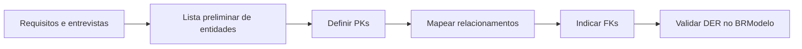

## Visão Geral do Conceito

A aula retoma a etapa de <mark style="background-color: #242424; padding: 2px 4px; border-radius: 3px; color: inherit;">`modelagem conceitual`</mark> e mostra que modelar não é desenhar caixas aleatórias: primeiro surgem entidades candidatas, depois relações, chaves e restrições. O foco é passar da conversa de negócio para uma representação verificável em <mark style="background-color: #242424; padding: 2px 4px; border-radius: 3px; color: inherit;">`DER`</mark>, com apoio do BRModelo.

> **Regra:** esta lição foi reconstruída a partir da transcrição da aula e dos materiais disponíveis no repositório; quando a fonte não cobre um detalhe, isso é declarado como lacuna em vez de ser tratado como fato.

## Modelo Mental

Pense na etapa conceitual como rascunho controlado: você coleta nomes do negócio, remove duplicidades, testa relações e só depois endurece o desenho. A ferramenta ajuda a visualizar, mas a decisão vem das regras de negócio.



## Mecânica Central

- <mark style="background-color: #242424; padding: 2px 4px; border-radius: 3px; color: inherit;">`Entidade`</mark> candidata tende a virar tabela.
- <mark style="background-color: #242424; padding: 2px 4px; border-radius: 3px; color: inherit;">`PK`</mark> identifica uma linha de forma estável.
- <mark style="background-color: #242424; padding: 2px 4px; border-radius: 3px; color: inherit;">`FK`</mark> materializa vínculo com outra entidade.
- Nomes precisam ser significativos e não restritivos demais.
- Chaves compostas podem existir, mas aumentam cuidado no modelo lógico.

Não coberto no material: instalação detalhada e troubleshooting do BRModelo em cada sistema operacional.

## Uso Prático

Use um cenário de reserva de salas: identifique `empresa`, `sala`, `apresentacao`, `participante` e `ingresso`. Antes de criar SQL, escreva as frases de negócio: uma empresa possui salas; uma apresentação ocorre em uma sala; participantes compram ingressos.

## Erros Comuns

- Tratar nome de relatório como tabela definitiva.
- Usar nomes restritivos como `funcionarios_regiao_sudoeste` quando a regra pode mudar.
- Desenhar FK sem entender a cardinalidade.
- Achar que BRModelo corrige decisões ruins automaticamente.

## Visão Geral de Debugging

Revise cada relacionamento como frase em português. Se a frase ficar ambígua, o DER também ficará. Depois confirme se cada FK aponta para uma PK ou chave candidata compatível.

## Principais Pontos

- Modelo conceitual organiza ideias antes do SQL.
- PK identifica; FK relaciona.
- Ferramenta visual não substitui regra de negócio.
- Lista preliminar precisa ser refinada.


## Preparação para Prática

Antes de praticar, escolha um domínio simples e escreva entidades, atributos-chave e frases de relacionamento.

## Laboratório de Prática
### Easy — Identificar entidades e chaves
Complete o esboço com chaves primárias e estrangeiras coerentes com o cenário.
```sql
-- TODO: revisar nomes e completar as chaves
CREATE TABLE exemplo_pai (
  id INTEGER PRIMARY KEY,
  nome TEXT NOT NULL
);

CREATE TABLE exemplo_filho (
  id INTEGER PRIMARY KEY,
  pai_id INTEGER NOT NULL,
  descricao TEXT,
  -- TODO: declarar FOREIGN KEY para exemplo_pai(id)
  FOREIGN KEY (pai_id) REFERENCES exemplo_pai(id)
);
```
Critérios:
- Declarar PK em cada tabela.
- Declarar FK com tipo compatível.
- Usar nomes semânticos.

### Medium — Normalizar atributos problemáticos
Reescreva a modelagem para evitar campo multivalorado em uma única coluna.
```sql
-- Estrutura ruim: telefones misturados em uma coluna
CREATE TABLE cliente_ruim (
  id INTEGER PRIMARY KEY,
  nome TEXT NOT NULL,
  telefones TEXT
);

-- TODO: criar tabela cliente
-- TODO: criar tabela cliente_telefone com uma linha por telefone
```
Critérios:
- Evitar lista dentro de célula.
- Criar tabela dependente quando houver múltiplos valores.
- Manter relacionamento rastreável.

### Hard — Validar modelo por regras de negócio
Adicione restrições e uma consulta de verificação para encontrar registros órfãos.
```sql
CREATE TABLE departamento (
  id INTEGER PRIMARY KEY,
  nome TEXT NOT NULL UNIQUE
);

CREATE TABLE funcionario (
  id INTEGER PRIMARY KEY,
  departamento_id INTEGER,
  nome TEXT NOT NULL
  -- TODO: adicionar FK quando a regra exigir vínculo obrigatório
);

-- TODO: escrever SELECT que encontre funcionarios sem departamento válido
```
Critérios:
- Relacionar regra de negócio a NOT NULL quando aplicável.
- Usar FK para integridade.
- Criar consulta de auditoria.


<!-- CONCEPT_EXTRACTION
concepts:
  - modelagem conceitual
  - lista preliminar de tabelas
  - chave primária
  - chave estrangeira
  - DER
  - BRModelo
skills:
  - Identificar entidades candidatas
  - Definir chaves primárias
  - Relacionar tabelas por chaves estrangeiras
  - Validar nomes de tabelas
examples:
  - company-room-presentation-attendee
  - brmodelo-der-pk-fk
-->

<!-- EXERCISES_JSON
[
  {
    "id": "modelagem-conceitual-listas-der-brmodelo-identificar-entidades",
    "slug": "modelagem-conceitual-listas-der-brmodelo-identificar-entidades",
    "difficulty": "easy",
    "title": "Identificar entidades e chaves",
    "discipline": "sql-modelagem-relacional",
    "editorLanguage": "sql",
    "tags": [
      "sql",
      "modelagem",
      "chaves"
    ],
    "summary": "Completar um esboço SQL com entidades, PK e FK coerentes."
  },
  {
    "id": "modelagem-conceitual-listas-der-brmodelo-normalizar-campos",
    "slug": "modelagem-conceitual-listas-der-brmodelo-normalizar-campos",
    "difficulty": "medium",
    "title": "Normalizar atributos problemáticos",
    "discipline": "sql-modelagem-relacional",
    "editorLanguage": "sql",
    "tags": [
      "sql",
      "normalizacao",
      "1fn"
    ],
    "summary": "Separar campos multipartidos ou multivalorados em estruturas relacionais."
  },
  {
    "id": "modelagem-conceitual-listas-der-brmodelo-validar-modelo",
    "slug": "modelagem-conceitual-listas-der-brmodelo-validar-modelo",
    "difficulty": "hard",
    "title": "Validar modelo por regras de negócio",
    "discipline": "sql-modelagem-relacional",
    "editorLanguage": "sql",
    "tags": [
      "sql",
      "modelagem",
      "regras-negocio"
    ],
    "summary": "Escrever constraints e consultas para validar cardinalidade e integridade."
  }
]
-->

<!-- SOURCE_CONTEXT
canonical_memory: MEMORIES.md
source: downloads/SQL_e_Modelagem_Relacional/Aula_03_-_28042026.md
source_sha256: 52743540f922a24f0def349fb8fea914a5b8a7f5600ccece84514bf26934768f
source: downloads/SQL_e_Modelagem_Relacional/Aula_03_-_28042026.vtt
source_sha256: 25203f4743ce2ec9de39ac560a31165e1d71d29e5b4b4f36d6dbf2bc27daf0e0
notes:
  - O arquivo Markdown da transcrição contém apenas frontmatter; o conteúdo útil está no VTT.
  - Documentos de apoio da disciplina existem no manifest como materiais gerais, não como arquivo específico desta aula.
-->
