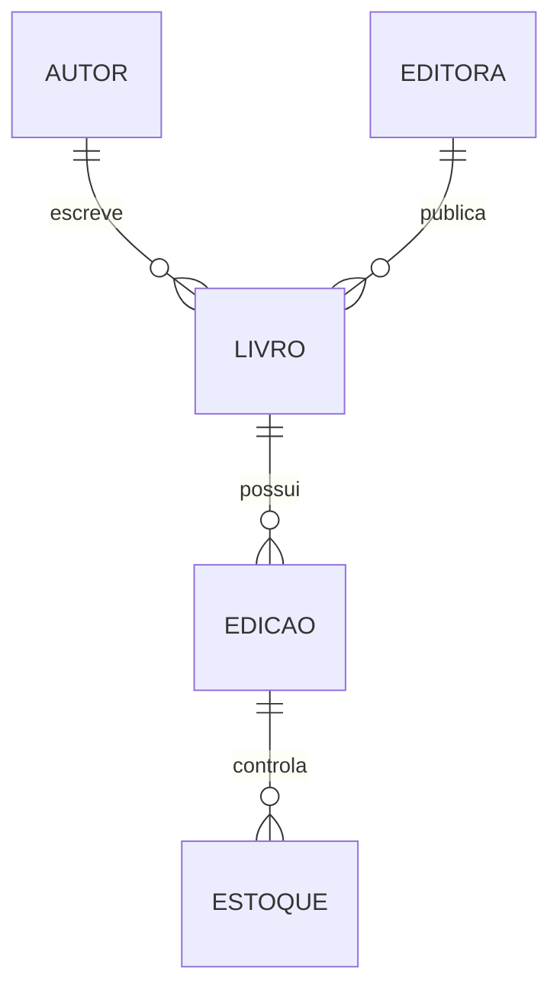

## Visão Geral do Conceito

A aula usa o TP1 de livraria para transformar regras de negócio em decisões de <mark style="background-color: #242424; padding: 2px 4px; border-radius: 3px; color: inherit;">`normalização`</mark>, chaves e tipos. O ponto importante é não copiar atributos mecanicamente: é preciso entender se o dado identifica edição, item, livro, autor ou relação.

> **Regra:** esta lição foi reconstruída a partir da transcrição da aula e dos materiais disponíveis no repositório; quando a fonte não cobre um detalhe, isso é declarado como lacuna em vez de ser tratado como fato.

## Modelo Mental

Trate o enunciado como contrato: cada frase indica entidade, atributo ou relacionamento. Quando aparecer um identificador famoso, como ISBN, pergunte se ele é suficiente para a necessidade do sistema ou se o sistema precisa de um código próprio.



## Mecânica Central

- <mark style="background-color: #242424; padding: 2px 4px; border-radius: 3px; color: inherit;">`ISBN`</mark> pode conter letras/hífens e deve ser tratado como texto quando preservar formato importa.
- <mark style="background-color: #242424; padding: 2px 4px; border-radius: 3px; color: inherit;">`Chave candidata`</mark> identifica, mas nem sempre é a melhor PK operacional.
- Chave composta é possível, mas deve usar o menor número de colunas necessário.
- Normalização começa ao separar conceitos que parecem iguais no enunciado.

## Uso Prático

Modele `autor`, `editora`, `livro` e `edicao`. Se uma edição tem ISBN, páginas e estoque próprios, não coloque tudo diretamente em `livro` sem avaliar a regra por edição.

## Erros Comuns

- Usar tipo numérico para identificadores que têm formato textual.
- Confundir exemplar, edição e livro.
- Criar chave composta grande quando um identificador simples resolveria.
- Ignorar autores/editoras sem livros se a regra permitir cadastro prévio.

## Visão Geral de Debugging

Quando uma chave parecer óbvia, teste três cenários: valor muda? pode repetir em outro contexto? identifica exatamente a entidade correta?

## Principais Pontos

- TP exige interpretação, não cópia literal.
- ISBN não é sinônimo de código interno.
- Tipo de dados afeta integridade e performance.
- Chaves compostas têm custo cognitivo.


## Preparação para Prática

Releia o enunciado do TP destacando substantivos, verbos e restrições; depois derive entidades e relações.

## Laboratório de Prática
### Easy — Identificar entidades e chaves
Complete o esboço com chaves primárias e estrangeiras coerentes com o cenário.
```sql
-- TODO: revisar nomes e completar as chaves
CREATE TABLE exemplo_pai (
  id INTEGER PRIMARY KEY,
  nome TEXT NOT NULL
);

CREATE TABLE exemplo_filho (
  id INTEGER PRIMARY KEY,
  pai_id INTEGER NOT NULL,
  descricao TEXT,
  -- TODO: declarar FOREIGN KEY para exemplo_pai(id)
  FOREIGN KEY (pai_id) REFERENCES exemplo_pai(id)
);
```
Critérios:
- Declarar PK em cada tabela.
- Declarar FK com tipo compatível.
- Usar nomes semânticos.

### Medium — Normalizar atributos problemáticos
Reescreva a modelagem para evitar campo multivalorado em uma única coluna.
```sql
-- Estrutura ruim: telefones misturados em uma coluna
CREATE TABLE cliente_ruim (
  id INTEGER PRIMARY KEY,
  nome TEXT NOT NULL,
  telefones TEXT
);

-- TODO: criar tabela cliente
-- TODO: criar tabela cliente_telefone com uma linha por telefone
```
Critérios:
- Evitar lista dentro de célula.
- Criar tabela dependente quando houver múltiplos valores.
- Manter relacionamento rastreável.

### Hard — Validar modelo por regras de negócio
Adicione restrições e uma consulta de verificação para encontrar registros órfãos.
```sql
CREATE TABLE departamento (
  id INTEGER PRIMARY KEY,
  nome TEXT NOT NULL UNIQUE
);

CREATE TABLE funcionario (
  id INTEGER PRIMARY KEY,
  departamento_id INTEGER,
  nome TEXT NOT NULL
  -- TODO: adicionar FK quando a regra exigir vínculo obrigatório
);

-- TODO: escrever SELECT que encontre funcionarios sem departamento válido
```
Critérios:
- Relacionar regra de negócio a NOT NULL quando aplicável.
- Usar FK para integridade.
- Criar consulta de auditoria.


<!-- CONCEPT_EXTRACTION
concepts:
  - TP1 livraria
  - normalização
  - chave candidata
  - chave composta
  - ISBN
  - tipo de dados
skills:
  - Interpretar enunciados de modelagem
  - Escolher tipos de dados
  - Distinguir identificadores de negócio e sistema
  - Aplicar normalização inicial
examples:
  - tp1-livraria-isbn
  - autor-editora-livro-edicao
-->

<!-- EXERCISES_JSON
[
  {
    "id": "tp1-livraria-normalizacao-chaves-tipos-identificar-entidades",
    "slug": "tp1-livraria-normalizacao-chaves-tipos-identificar-entidades",
    "difficulty": "easy",
    "title": "Identificar entidades e chaves",
    "discipline": "sql-modelagem-relacional",
    "editorLanguage": "sql",
    "tags": [
      "sql",
      "modelagem",
      "chaves"
    ],
    "summary": "Completar um esboço SQL com entidades, PK e FK coerentes."
  },
  {
    "id": "tp1-livraria-normalizacao-chaves-tipos-normalizar-campos",
    "slug": "tp1-livraria-normalizacao-chaves-tipos-normalizar-campos",
    "difficulty": "medium",
    "title": "Normalizar atributos problemáticos",
    "discipline": "sql-modelagem-relacional",
    "editorLanguage": "sql",
    "tags": [
      "sql",
      "normalizacao",
      "1fn"
    ],
    "summary": "Separar campos multipartidos ou multivalorados em estruturas relacionais."
  },
  {
    "id": "tp1-livraria-normalizacao-chaves-tipos-validar-modelo",
    "slug": "tp1-livraria-normalizacao-chaves-tipos-validar-modelo",
    "difficulty": "hard",
    "title": "Validar modelo por regras de negócio",
    "discipline": "sql-modelagem-relacional",
    "editorLanguage": "sql",
    "tags": [
      "sql",
      "modelagem",
      "regras-negocio"
    ],
    "summary": "Escrever constraints e consultas para validar cardinalidade e integridade."
  }
]
-->

<!-- SOURCE_CONTEXT
canonical_memory: MEMORIES.md
source: downloads/SQL_e_Modelagem_Relacional/Aula_04_-_30042026.md
source_sha256: b4169e418e726a62002d3c23dd04e9ee8dbe043635430ce89dcd4af5007b3dc9
source: downloads/SQL_e_Modelagem_Relacional/Aula_04_-_30042026.vtt
source_sha256: b3bdd3da2a7b861661a240da0b9f20f894ab7c4b42ff8696341a811db3af33aa
notes:
  - Markdown sem corpo; VTT é a fonte principal.
-->
