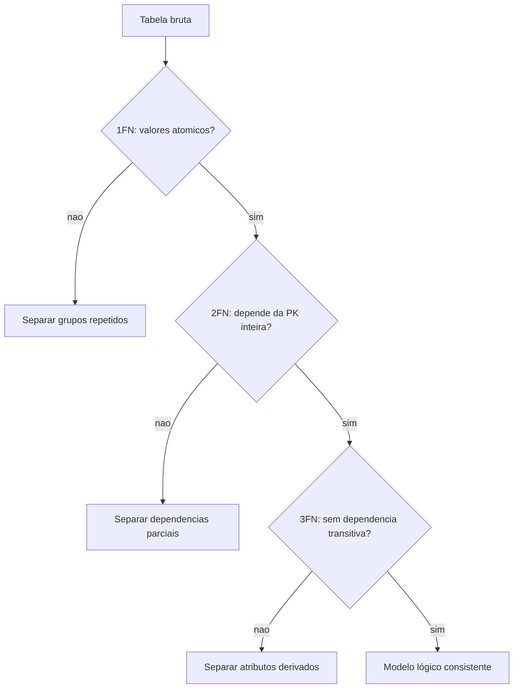

## Visão Geral do Conceito

A aula detalha <mark style="background-color: #242424; padding: 2px 4px; border-radius: 3px; color: inherit;">`normalização`</mark> como ponte entre modelo conceitual e lógico. O objetivo não é decorar siglas, mas evitar redundância, anomalias de atualização e dependências mal posicionadas.

> **Regra:** esta lição foi reconstruída a partir da transcrição da aula e dos materiais disponíveis no repositório; quando a fonte não cobre um detalhe, isso é declarado como lacuna em vez de ser tratado como fato.

## Modelo Mental

Normalizar é perguntar: cada coluna depende da chave, da chave inteira e de nada além da chave? Se a resposta falha, há cheiro de separação em nova tabela.



## Mecânica Central

- <mark style="background-color: #242424; padding: 2px 4px; border-radius: 3px; color: inherit;">`1FN`</mark>: cada célula guarda um valor atômico.
- <mark style="background-color: #242424; padding: 2px 4px; border-radius: 3px; color: inherit;">`2FN`</mark>: atributo não-chave depende da chave primária completa.
- <mark style="background-color: #242424; padding: 2px 4px; border-radius: 3px; color: inherit;">`3FN`</mark>: atributo não-chave não depende de outro atributo não-chave.
- <mark style="background-color: #242424; padding: 2px 4px; border-radius: 3px; color: inherit;">`FK`</mark> preserva relação depois de separar tabelas.

## Uso Prático

Em pedidos, se `subtotal` depende de `quantidade * preco_unitario`, avalie se é cálculo derivado ou valor histórico congelado. Em matrículas, se `nome_cargo` depende de `codigo_cargo`, cargo deve ser tabela própria.

## Erros Comuns

- Chamar campo multivalorado de 'string prática'.
- Separar demais sem regra de negócio.
- Guardar subtotal sem decidir se é histórico ou calculado.
- Ignorar que 2FN só aparece quando há chave composta relevante.

## Visão Geral de Debugging

Procure repetição e pergunte qual atualização quebraria consistência. Se mudar um endereço exige editar muitas linhas, o modelo está denunciando redundância.

## Principais Pontos

- 1FN exige atomicidade.
- 2FN remove dependência parcial.
- 3FN remove dependência transitiva.
- Normalização reduz anomalias.


## Preparação para Prática

Pegue uma planilha com repetição e marque quais colunas identificam linha, quais repetem e quais dependem de outras.

## Laboratório de Prática
### Easy — Identificar entidades e chaves
Complete o esboço com chaves primárias e estrangeiras coerentes com o cenário.
```sql
-- TODO: revisar nomes e completar as chaves
CREATE TABLE exemplo_pai (
  id INTEGER PRIMARY KEY,
  nome TEXT NOT NULL
);

CREATE TABLE exemplo_filho (
  id INTEGER PRIMARY KEY,
  pai_id INTEGER NOT NULL,
  descricao TEXT,
  -- TODO: declarar FOREIGN KEY para exemplo_pai(id)
  FOREIGN KEY (pai_id) REFERENCES exemplo_pai(id)
);
```
Critérios:
- Declarar PK em cada tabela.
- Declarar FK com tipo compatível.
- Usar nomes semânticos.

### Medium — Normalizar atributos problemáticos
Reescreva a modelagem para evitar campo multivalorado em uma única coluna.
```sql
-- Estrutura ruim: telefones misturados em uma coluna
CREATE TABLE cliente_ruim (
  id INTEGER PRIMARY KEY,
  nome TEXT NOT NULL,
  telefones TEXT
);

-- TODO: criar tabela cliente
-- TODO: criar tabela cliente_telefone com uma linha por telefone
```
Critérios:
- Evitar lista dentro de célula.
- Criar tabela dependente quando houver múltiplos valores.
- Manter relacionamento rastreável.

### Hard — Validar modelo por regras de negócio
Adicione restrições e uma consulta de verificação para encontrar registros órfãos.
```sql
CREATE TABLE departamento (
  id INTEGER PRIMARY KEY,
  nome TEXT NOT NULL UNIQUE
);

CREATE TABLE funcionario (
  id INTEGER PRIMARY KEY,
  departamento_id INTEGER,
  nome TEXT NOT NULL
  -- TODO: adicionar FK quando a regra exigir vínculo obrigatório
);

-- TODO: escrever SELECT que encontre funcionarios sem departamento válido
```
Critérios:
- Relacionar regra de negócio a NOT NULL quando aplicável.
- Usar FK para integridade.
- Criar consulta de auditoria.


<!-- CONCEPT_EXTRACTION
concepts:
  - modelo lógico
  - 1FN
  - 2FN
  - 3FN
  - dependência parcial
  - dependência transitiva
  - anomalias
skills:
  - Aplicar 1FN
  - Aplicar 2FN
  - Aplicar 3FN
  - Detectar anomalias de atualização
examples:
  - pedido-subtotal
  - produto-chave-composta
  - funcionario-cargo
-->

<!-- EXERCISES_JSON
[
  {
    "id": "modelo-logico-normalizacao-1fn-2fn-3fn-identificar-entidades",
    "slug": "modelo-logico-normalizacao-1fn-2fn-3fn-identificar-entidades",
    "difficulty": "easy",
    "title": "Identificar entidades e chaves",
    "discipline": "sql-modelagem-relacional",
    "editorLanguage": "sql",
    "tags": [
      "sql",
      "modelagem",
      "chaves"
    ],
    "summary": "Completar um esboço SQL com entidades, PK e FK coerentes."
  },
  {
    "id": "modelo-logico-normalizacao-1fn-2fn-3fn-normalizar-campos",
    "slug": "modelo-logico-normalizacao-1fn-2fn-3fn-normalizar-campos",
    "difficulty": "medium",
    "title": "Normalizar atributos problemáticos",
    "discipline": "sql-modelagem-relacional",
    "editorLanguage": "sql",
    "tags": [
      "sql",
      "normalizacao",
      "1fn"
    ],
    "summary": "Separar campos multipartidos ou multivalorados em estruturas relacionais."
  },
  {
    "id": "modelo-logico-normalizacao-1fn-2fn-3fn-validar-modelo",
    "slug": "modelo-logico-normalizacao-1fn-2fn-3fn-validar-modelo",
    "difficulty": "hard",
    "title": "Validar modelo por regras de negócio",
    "discipline": "sql-modelagem-relacional",
    "editorLanguage": "sql",
    "tags": [
      "sql",
      "modelagem",
      "regras-negocio"
    ],
    "summary": "Escrever constraints e consultas para validar cardinalidade e integridade."
  }
]
-->

<!-- SOURCE_CONTEXT
canonical_memory: MEMORIES.md
source: downloads/SQL_e_Modelagem_Relacional/Aula_05_-_05052026.md
source_sha256: ac4fdddd1eb1932312fd10502c4eafbe1c0fc606a09099b0238a19a70df5d66d
source: downloads/SQL_e_Modelagem_Relacional/Aula_05_-_05052026.vtt
source_sha256: 85525c3048fc9c74157ca426580610177aeee587176345da8135c86a48e54063
notes:
  - Markdown sem corpo; VTT é a fonte principal.
-->
