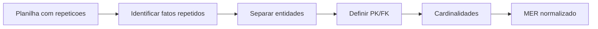

## Visão Geral do Conceito

A aula aplica a teoria de normalização ao TP2: partir de uma <mark style="background-color: #242424; padding: 2px 4px; border-radius: 3px; color: inherit;">`planilha desnormalizada`</mark> e produzir entidades, atributos, relacionamentos e cardinalidades. O valor está na interpretação: a planilha mostra sintomas, mas o modelo exige decisão.

> **Regra:** esta lição foi reconstruída a partir da transcrição da aula e dos materiais disponíveis no repositório; quando a fonte não cobre um detalhe, isso é declarado como lacuna em vez de ser tratado como fato.

## Modelo Mental

Veja a planilha como fotografia achatada de várias tabelas misturadas. Sua tarefa é recuperar as entidades escondidas e recolocar cada fato no lugar onde ele depende da chave correta.



## Mecânica Central

- Repetição indica candidata a entidade separada.
- <mark style="background-color: #242424; padding: 2px 4px; border-radius: 3px; color: inherit;">`1FN`</mark> impede múltiplos valores na mesma célula.
- <mark style="background-color: #242424; padding: 2px 4px; border-radius: 3px; color: inherit;">`2FN`</mark> evita atributos dependentes só de parte da chave.
- Cardinalidade nasce da regra de negócio, não só da linha observada.

## Uso Prático

Se uma planilha repete `nome`, `endereco`, `telefone` e `matricula`, separe pessoa, contato e vínculo acadêmico/profissional conforme o significado de cada campo.

## Erros Comuns

- Modelar apenas pelo cabeçalho da planilha.
- Confundir ausência de dado com inexistência de relacionamento.
- Usar IA para gerar modelo sem validar regra de negócio.
- Repetir a teoria da aula anterior sem aplicar ao TP.

## Visão Geral de Debugging

Faça alterações hipotéticas: se um endereço mudar, quantas linhas mudam? Se a resposta for muitas, existe redundância a tratar.

## Principais Pontos

- TP2 é aplicação de normalização.
- Planilha mistura entidades.
- Cardinalidade depende de regra de negócio.
- Anomalias revelam mau desenho.


## Preparação para Prática

Antes de desenhar, liste colunas, valores repetidos e perguntas de negócio que a planilha deveria responder.

## Laboratório de Prática
### Easy — Identificar entidades e chaves
Complete o esboço com chaves primárias e estrangeiras coerentes com o cenário.
```sql
-- TODO: revisar nomes e completar as chaves
CREATE TABLE exemplo_pai (
  id INTEGER PRIMARY KEY,
  nome TEXT NOT NULL
);

CREATE TABLE exemplo_filho (
  id INTEGER PRIMARY KEY,
  pai_id INTEGER NOT NULL,
  descricao TEXT,
  -- TODO: declarar FOREIGN KEY para exemplo_pai(id)
  FOREIGN KEY (pai_id) REFERENCES exemplo_pai(id)
);
```
Critérios:
- Declarar PK em cada tabela.
- Declarar FK com tipo compatível.
- Usar nomes semânticos.

### Medium — Normalizar atributos problemáticos
Reescreva a modelagem para evitar campo multivalorado em uma única coluna.
```sql
-- Estrutura ruim: telefones misturados em uma coluna
CREATE TABLE cliente_ruim (
  id INTEGER PRIMARY KEY,
  nome TEXT NOT NULL,
  telefones TEXT
);

-- TODO: criar tabela cliente
-- TODO: criar tabela cliente_telefone com uma linha por telefone
```
Critérios:
- Evitar lista dentro de célula.
- Criar tabela dependente quando houver múltiplos valores.
- Manter relacionamento rastreável.

### Hard — Validar modelo por regras de negócio
Adicione restrições e uma consulta de verificação para encontrar registros órfãos.
```sql
CREATE TABLE departamento (
  id INTEGER PRIMARY KEY,
  nome TEXT NOT NULL UNIQUE
);

CREATE TABLE funcionario (
  id INTEGER PRIMARY KEY,
  departamento_id INTEGER,
  nome TEXT NOT NULL
  -- TODO: adicionar FK quando a regra exigir vínculo obrigatório
);

-- TODO: escrever SELECT que encontre funcionarios sem departamento válido
```
Critérios:
- Relacionar regra de negócio a NOT NULL quando aplicável.
- Usar FK para integridade.
- Criar consulta de auditoria.


<!-- CONCEPT_EXTRACTION
concepts:
  - TP2
  - planilha desnormalizada
  - anomalia de atualização
  - 1FN
  - 2FN
  - MER
  - cardinalidade
skills:
  - Normalizar planilhas
  - Detectar redundância
  - Definir cardinalidades
  - Construir MER a partir de dados
examples:
  - planilha-maria-angela-antonio
  - anomalia-endereco
  - tp2-normalizacao
-->

<!-- EXERCISES_JSON
[
  {
    "id": "tp2-planilha-normalizacao-mer-identificar-entidades",
    "slug": "tp2-planilha-normalizacao-mer-identificar-entidades",
    "difficulty": "easy",
    "title": "Identificar entidades e chaves",
    "discipline": "sql-modelagem-relacional",
    "editorLanguage": "sql",
    "tags": [
      "sql",
      "modelagem",
      "chaves"
    ],
    "summary": "Completar um esboço SQL com entidades, PK e FK coerentes."
  },
  {
    "id": "tp2-planilha-normalizacao-mer-normalizar-campos",
    "slug": "tp2-planilha-normalizacao-mer-normalizar-campos",
    "difficulty": "medium",
    "title": "Normalizar atributos problemáticos",
    "discipline": "sql-modelagem-relacional",
    "editorLanguage": "sql",
    "tags": [
      "sql",
      "normalizacao",
      "1fn"
    ],
    "summary": "Separar campos multipartidos ou multivalorados em estruturas relacionais."
  },
  {
    "id": "tp2-planilha-normalizacao-mer-validar-modelo",
    "slug": "tp2-planilha-normalizacao-mer-validar-modelo",
    "difficulty": "hard",
    "title": "Validar modelo por regras de negócio",
    "discipline": "sql-modelagem-relacional",
    "editorLanguage": "sql",
    "tags": [
      "sql",
      "modelagem",
      "regras-negocio"
    ],
    "summary": "Escrever constraints e consultas para validar cardinalidade e integridade."
  }
]
-->

<!-- SOURCE_CONTEXT
canonical_memory: MEMORIES.md
source: downloads/SQL_e_Modelagem_Relacional/Aula_06_-_07052026.md
source_sha256: 744e791f620dda33d15c7de68e2af0683c77a7f3411b2243987a49190c1a3b5b
source: downloads/SQL_e_Modelagem_Relacional/Aula_06_-_07052026.vtt
source_sha256: 7c69e35852cc517d24ee875c2eda96512fa893a14ab6d2f8963cda3a2bdc1db3
notes:
  - Aula curta com falhas técnicas; lição foca a parte objetiva do TP2.
-->
