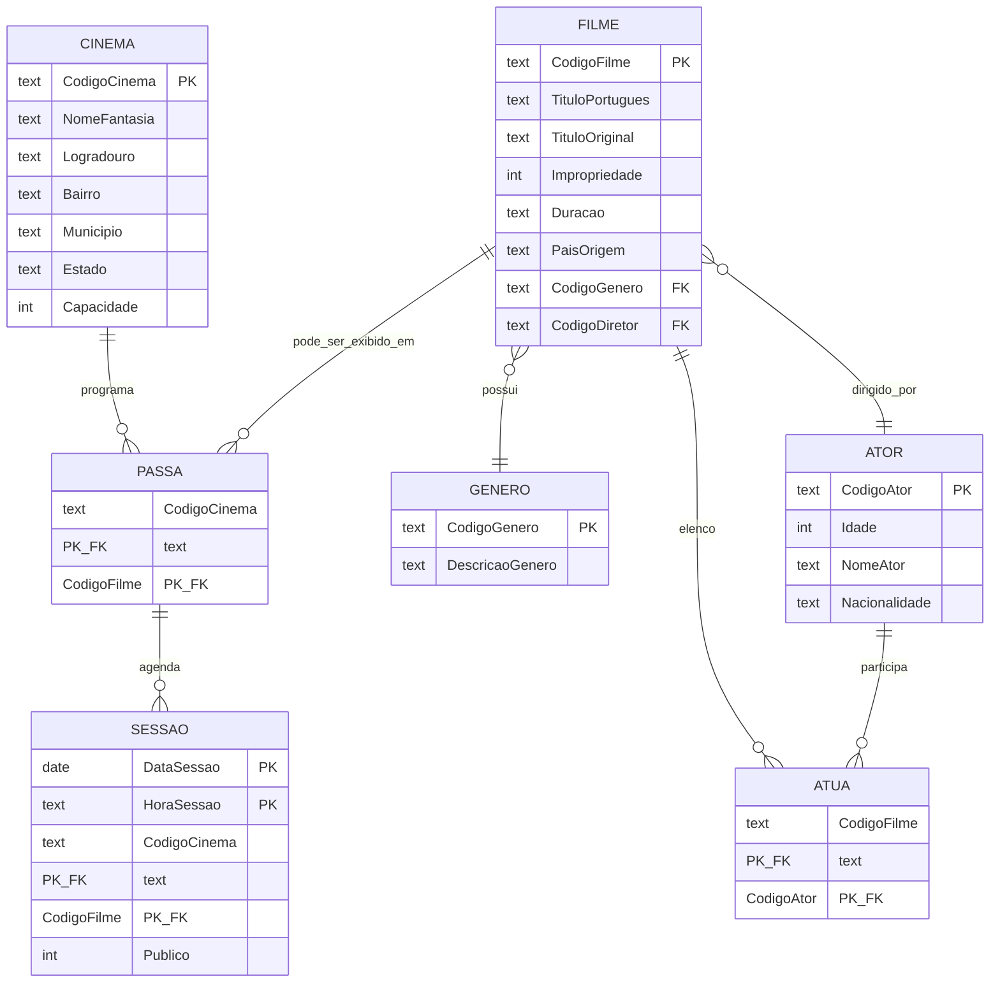
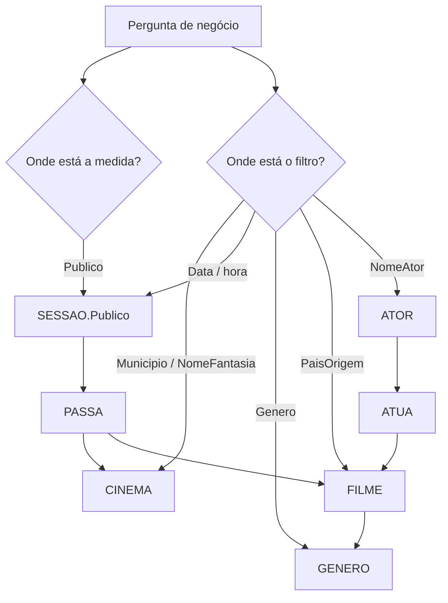

## Visão Geral do Conceito

Esta lição reconstrói um fluxo completo de modelagem e uso de SQL no estilo do material “controle de cinemas”: você parte de requisitos escritos, organiza entidades e relacionamentos, desce para tabelas com chaves e integridade referencial, carrega dados na ordem correta e só então responde perguntas de negócio com consultas.

O ganho prático para ADS é direto: relatórios como totalização de público por município, cinema ou sessão não são “truques de SQL”, são consequências de um esquema que reflete o mundo real (sessão amarrada ao vínculo cinema–filme, público medido por sessão, endereço no cinema, cartaz no relacionamento <mark style="background-color: #242424; padding: 2px 4px; border-radius: 3px; color: inherit;">`PASSA`</mark>).

> **Regra:** cada pergunta analítica deve ser rastreável no diagrama: localize onde o fato nasce (medida), onde o filtro nasce (dimensão/corte) e qual caminho de chaves conecta os dois.

## Modelo Mental

Pense em três “camadas” de decisão que caminham juntas:

1. **Negócio:** frases como “apuras público por município” definem medidas (<mark style="background-color: #242424; padding: 2px 4px; border-radius: 3px; color: inherit;">`Publico`</mark>) e cortes (<mark style="background-color: #242424; padding: 2px 4px; border-radius: 3px; color: inherit;">`Municipio`</mark>, datas, horários).
2. **Conceitual (MER):** entidades e relacionamentos com cardinalidade máxima (1, N) descrevem o que pode existir sem falar de SQL.
3. **Lógico/físico (tabelas):** relacionamentos N:N viram tabela associativa; 1:N viram <mark style="background-color: #242424; padding: 2px 4px; border-radius: 3px; color: inherit;">`FOREIGN KEY`</mark> no lado N; eventos que dependem de duas entidades juntas frequentemente “pousam” na associação — é o caso da <mark style="background-color: #242424; padding: 2px 4px; border-radius: 3px; color: inherit;">`SESSAO`</mark> ligada ao par cinema–filme.

No exemplo discutido em aula, <mark style="background-color: #242424; padding: 2px 4px; border-radius: 3px; color: inherit;">`capacidade`</mark> descreve quantas poltronas existem, enquanto <mark style="background-color: #242424; padding: 2px 4px; border-radius: 3px; color: inherit;">`Publico`</mark> descreve comparecimento na sessão: são grandezas diferentes e não substituem uma à outra.

### Alternativa de modelagem (trade-off)

Um mesmo enunciado pode permitir **cinema como complexo** e **sala** como unidade com lotação. Isso muda cardinalidades e consultas. Neste roteiro pedagógico, o texto trata “cinema/sala” de forma mais compacta; ao projetar no trabalho, escolha o nível de granularidade que o negócio realmente precisa auditar.



## Mecânica Central

### Do texto aos relacionamentos

No caso cinemas–filmes:

- **Cinema ↔ filme em cartaz** tende a **N:N**: um cinema pode exibir vários filmes e um filme pode circular em vários cinemas. Isso vira <mark style="background-color: #242424; padding: 2px 4px; border-radius: 3px; color: inherit;">`PASSA`</mark> com <mark style="background-color: #242424; padding: 2px 4px; border-radius: 3px; color: inherit;">`PRIMARY KEY (CodigoCinema, CodigoFilme)`</mark>.
- **Filme ↔ ator (elenco)** é **N:N** via <mark style="background-color: #242424; padding: 2px 4px; border-radius: 3px; color: inherit;">`ATUA`</mark>.
- **Filme ↔ gênero** é **N:1** (no modelo discutido): o lado filme recebe <mark style="background-color: #242424; padding: 2px 4px; border-radius: 3px; color: inherit;">`CodigoGenero`</mark>.
- **Filme ↔ diretor** é **N:1** com interpretação de negócio “no máximo um diretor por filme”: o lado filme recebe <mark style="background-color: #242424; padding: 2px 4px; border-radius: 3px; color: inherit;">`CodigoDiretor`</mark> referenciando <mark style="background-color: #242424; padding: 2px 4px; border-radius: 3px; color: inherit;">`ATOR`</mark> (papéis diferentes coexistindo na mesma tabela de pessoas).

### Agregação e sessão

Para caracterizar sessão, você precisa simultaneamente do cinema e do filme “daquele cartaz”. Conceptualmente isso foi encaixado como uma agregação: o vínculo cinema–filme vira ancoragem para várias sessões; cada sessão referencia o par via <mark style="background-color: #242424; padding: 2px 4px; border-radius: 3px; color: inherit;">`FOREIGN KEY (CodigoCinema, CodigoFilme)`</mark> para <mark style="background-color: #242424; padding: 2px 4px; border-radius: 3px; color: inherit;">`PASSA`</mark>.

### Especialização/generalização (conceito)

O PDF discute especialização (ex.: filme nacional vs estrangeiro). Na implementação SQLite apresentada, a especialização pode ser absorvida por uma única <mark style="background-color: #242424; padding: 2px 4px; border-radius: 3px; color: inherit;">`FILME`</mark> usando <mark style="background-color: #242424; padding: 2px 4px; border-radius: 3px; color: inherit;">`PaisOrigem`</mark> e títulos — ou pode virar subtipos/tabelas separadas se regras e atributos específicos justificarem.

### DDL e integridade (SQLite)

No roteiro físico:

- <mark style="background-color: #242424; padding: 2px 4px; border-radius: 3px; color: inherit;">`CREATE TABLE`</mark> cria estrutura; <mark style="background-color: #242424; padding: 2px 4px; border-radius: 3px; color: inherit;">`PRIMARY KEY`</mark> impõe unicidade; <mark style="background-color: #242424; padding: 2px 4px; border-radius: 3px; color: inherit;">`FOREIGN KEY`</mark> impõe existência do referenciado.
- Uma única tabela pode ter **uma** PK **composta** (várias colunas). Uma FK também pode ser **composta**, referenciando um par de colunas na tabela pai — como em <mark style="background-color: #242424; padding: 2px 4px; border-radius: 3px; color: inherit;">`SESSAO`</mark> → <mark style="background-color: #242424; padding: 2px 4px; border-radius: 3px; color: inherit;">`PASSA`</mark>.

### Consultas como composição de junções

O padrão central é:

- Para fatos em <mark style="background-color: #242424; padding: 2px 4px; border-radius: 3px; color: inherit;">`SESSAO`</mark>, atravesse <mark style="background-color: #242424; padding: 2px 4px; border-radius: 3px; color: inherit;">`PASSA`</mark> quando precisar validar cartaz e quando precisar chegar a dimensões em <mark style="background-color: #242424; padding: 2px 4px; border-radius: 3px; color: inherit;">`CINEMA`</mark> ou <mark style="background-color: #242424; padding: 2px 4px; border-radius: 3px; color: inherit;">`FILME`</mark>.
- Agregue com <mark style="background-color: #242424; padding: 2px 4px; border-radius: 3px; color: inherit;">`SUM()`</mark> quando a pergunta pedir total.



## Uso Prático

Os exemplos abaixo seguem a linha do material “cinema.db”: nomes de tabelas em maiúsculas e colunas com padronização mista.

### Total de público por município (sem janela de datas)

```sql
SELECT SUM(se.Publico) AS total_publico
FROM SESSAO se
INNER JOIN PASSA pa
  ON pa.CodigoCinema = se.CodigoCinema
 AND pa.CodigoFilme = se.CodigoFilme
INNER JOIN CINEMA ci
  ON ci.CodigoCinema = pa.CodigoCinema
WHERE ci.Municipio = 'Rio de Janeiro';
```

### Mesma base de junções, agora com intervalo de datas

```sql
SELECT SUM(se.Publico) AS total_publico
FROM SESSAO se
INNER JOIN PASSA pa
  ON pa.CodigoCinema = se.CodigoCinema
 AND pa.CodigoFilme = se.CodigoFilme
INNER JOIN CINEMA ci
  ON ci.CodigoCinema = pa.CodigoCinema
WHERE ci.Municipio = 'Rio de Janeiro'
  AND se.DataSessao BETWEEN DATE('2007-05-29') AND DATE('2007-05-29');
```

**Nota de portabilidade:** o PDF mostra literais no estilo <mark style="background-color: #242424; padding: 2px 4px; border-radius: 3px; color: inherit;">`'29/05/2007'`</mark> (comum em materiais Oracle-oriented). Em SQLite, prefira <mark style="background-color: #242424; padding: 2px 4px; border-radius: 3px; color: inherit;">`DATE('AAAA-MM-DD')`</mark> ou armazenamento textual ISO para evitar ambiguidade.

### Público por cinema e por horário de sessão

O mesmo esqueleto <mark style="background-color: #242424; padding: 2px 4px; border-radius: 3px; color: inherit;">`SESSAO → PASSA → CINEMA`</mark> muda apenas o filtro:

```sql
SELECT SUM(se.Publico) AS total_publico
FROM SESSAO se
INNER JOIN PASSA pa
  ON pa.CodigoCinema = se.CodigoCinema
 AND pa.CodigoFilme = se.CodigoFilme
INNER JOIN CINEMA ci
  ON ci.CodigoCinema = pa.CodigoCinema
WHERE ci.NomeFantasia = 'Tijuca 1'
  AND se.HoraSessao = '1400';
```

### Ator → cinemas onde há cartaz (cadeia mais longa)

```sql
SELECT ci.NomeFantasia
FROM ATOR at
INNER JOIN ATUA au
  ON au.CodigoAtor = at.CodigoAtor
INNER JOIN FILME fi
  ON fi.CodigoFilme = au.CodigoFilme
INNER JOIN PASSA pa
  ON pa.CodigoFilme = fi.CodigoFilme
INNER JOIN CINEMA ci
  ON ci.CodigoCinema = pa.CodigoCinema
WHERE at.NomeAtor = 'Alves';
```

### Gênero → cinemas + título do filme

```sql
SELECT ci.NomeFantasia, fi.TituloPortugues
FROM GENERO ge
INNER JOIN FILME fi
  ON fi.CodigoGenero = ge.CodigoGenero
INNER JOIN PASSA pa
  ON pa.CodigoFilme = fi.CodigoFilme
INNER JOIN CINEMA ci
  ON ci.CodigoCinema = pa.CodigoCinema
WHERE ge.DescricaoGenero = 'Romance';
```

### Filmes nacionais em cartaz

```sql
SELECT ci.NomeFantasia, fi.TituloPortugues
FROM FILME fi
INNER JOIN PASSA pa
  ON pa.CodigoFilme = fi.CodigoFilme
INNER JOIN CINEMA ci
  ON ci.CodigoCinema = pa.CodigoCinema
WHERE fi.PaisOrigem = 'Brasil';
```

### Carga de dados: ordem e verificação

Regra operacional: carregue primeiro tabelas “de cadastro” sem dependências (<mark style="background-color: #242424; padding: 2px 4px; border-radius: 3px; color: inherit;">`CINEMA`</mark>, <mark style="background-color: #242424; padding: 2px 4px; border-radius: 3px; color: inherit;">`ATOR`</mark>, <mark style="background-color: #242424; padding: 2px 4px; border-radius: 3px; color: inherit;">`GENERO`</mark>), depois <mark style="background-color: #242424; padding: 2px 4px; border-radius: 3px; color: inherit;">`FILME`</mark>, depois associações (<mark style="background-color: #242424; padding: 2px 4px; border-radius: 3px; color: inherit;">`ATUA`</mark>, <mark style="background-color: #242424; padding: 2px 4px; border-radius: 3px; color: inherit;">`PASSA`</mark>) e por último <mark style="background-color: #242424; padding: 2px 4px; border-radius: 3px; color: inherit;">`SESSAO`</mark>.

```sql
SELECT COUNT(*) FROM ATOR;
SELECT COUNT(*) FROM ATUA;
SELECT COUNT(*) FROM CINEMA;
SELECT COUNT(*) FROM FILME;
SELECT COUNT(*) FROM GENERO;
SELECT COUNT(*) FROM PASSA;
SELECT COUNT(*) FROM SESSAO;
```

Os totais esperados no roteiro são: <mark style="background-color: #242424; padding: 2px 4px; border-radius: 3px; color: inherit;">`ATOR 20`</mark>, <mark style="background-color: #242424; padding: 2px 4px; border-radius: 3px; color: inherit;">`ATUA 16`</mark>, <mark style="background-color: #242424; padding: 2px 4px; border-radius: 3px; color: inherit;">`CINEMA 17`</mark>, <mark style="background-color: #242424; padding: 2px 4px; border-radius: 3px; color: inherit;">`FILME 8`</mark>, <mark style="background-color: #242424; padding: 2px 4px; border-radius: 3px; color: inherit;">`GENERO 6`</mark>, <mark style="background-color: #242424; padding: 2px 4px; border-radius: 3px; color: inherit;">`PASSA 34`</mark>, <mark style="background-color: #242424; padding: 2px 4px; border-radius: 3px; color: inherit;">`SESSAO 476`</mark>.

## Erros Comuns

- **Confundir cardinalidade “um diretor por filme” com 1:1:** isso descreve uma restrição no lado filme, não impede um diretor de ter múltiplos filmes.
- **Julgar FK composta como “duas PKs”:** é uma PK única composta ou uma FK única composta — não são duas chaves primárias independentes.
- **Somar público sem atravessar <mark style="background-color: #242424; padding: 2px 4px; border-radius: 3px; color: inherit;">`PASSA`</mark> quando o modelo exige cartaz:** você pode até “funcionar” em protótipos simples, mas perde a garantia de que a sessão referencia um par cinema–filme válido.
- **INSERT fora de ordem:** estoura violação de FK ao referenciar registros inexistentes.
- **Filtros literais incorretos:** <mark style="background-color: #242424; padding: 2px 4px; border-radius: 3px; color: inherit;">`'RIO DE JANEIRO'`</mark> vs <mark style="background-color: #242424; padding: 2px 4px; border-radius: 3px; color: inherit;">`'Rio de Janeiro'`</mark>, ou <mark style="background-color: #242424; padding: 2px 4px; border-radius: 3px; color: inherit;">`'Sao Paulo'`</mark> vs <mark style="background-color: #242424; padding: 2px 4px; border-radius: 3px; color: inherit;">`'São Paulo'`</mark>, pode zerar resultados sem erro.
- ** misturar papel de elenco e papel de direção na mesma busca:** como diretor e elenco compartilham a entidade de pessoa, consultas que olham só <mark style="background-color: #242424; padding: 2px 4px; border-radius: 3px; color: inherit;">`ATUA`</mark> podem não capturar papéis exclusivamente de direção — isso é esperado se a modelagem separa direção por FK em <mark style="background-color: #242424; padding: 2px 4px; border-radius: 3px; color: inherit;">`FILME`</mark>.

<details>
<summary>Onde isso aparece na transcrição?</summary>

A aula percorre o PDF “Da modelagem até a execução de consultas”, com ênfase em MER/DER, agregação para encaixar <mark style="background-color: #242424; padding: 2px 4px; border-radius: 3px; color: inherit;">`SESSAO`</mark>, criação SQLite no <mark style="background-color: #242424; padding: 2px 4px; border-radius: 3px; color: inherit;">`SQLiteStudio`</mark>, arquivo de inserts <mark style="background-color: #242424; padding: 2px 4px; border-radius: 3px; color: inherit;">`DadosEntrada.sql`</mark> (nome citado na aula), contagens e consultas analíticas listadas nas seções 1.11.x do PDF.

**Não coberto em profundidade neste material de referência da aula:** o arquivo adicional <mark style="background-color: #242424; padding: 2px 4px; border-radius: 3px; color: inherit;">`Estabelecimentos.csv`</mark> mencionado no inventário; a etapa 5 completa ficou anunciada para a próxima sessão.

</details>

## Visão Geral de Debugging

Quando um relatório “dá zero” ou <mark style="background-color: #242424; padding: 2px 4px; border-radius: 3px; color: inherit;">`NULL`</mark>:

1. **Valide existência:** rode um <mark style="background-color: #242424; padding: 2px 4px; border-radius: 3px; color: inherit;">`SELECT DISTINCT`</mark> nas colunas de filtro (<mark style="background-color: #242424; padding: 2px 4px; border-radius: 3px; color: inherit;">`Municipio`</mark>, <mark style="background-color: #242424; padding: 2px 4px; border-radius: 3px; color: inherit;">`NomeFantasia`</mark>, <mark style="background-color: #242424; padding: 2px 4px; border-radius: 3px; color: inherit;">`DescricaoGenero`</mark>).
2. **Reduza o grafo:** substitua <mark style="background-color: #242424; padding: 2px 4px; border-radius: 3px; color: inherit;">`SUM`</mark> por linhas (<mark style="background-color: #242424; padding: 2px 4px; border-radius: 3px; color: inherit;">`SELECT *`</mark> com <mark style="background-color: #242424; padding: 2px 4px; border-radius: 3px; color: inherit;">`LIMIT`</mark>) para ver se junções estão eliminando linhas.
3. **Cheque datas:** confirme formato e inclusividade do <mark style="background-color: #242424; padding: 2px 4px; border-radius: 3px; color: inherit;">`BETWEEN`</mark>.
4. **Cheque caminho semântico:** atores em <mark style="background-color: #242424; padding: 2px 4px; border-radius: 3px; color: inherit;">`ATUA`</mark> vs direção via <mark style="background-color: #242424; padding: 2px 4px; border-radius: 3px; color: inherit;">`FILME.CodigoDiretor`</mark>.

## Principais Pontos

- Requisitos estáveis viram candidatos a entidade/atributo; relacionamentos carregam cardinalidades e decisões de integridade.
- N:N exige tabela associativa; 1:N replica a chave do lado 1 no lado N.
- <mark style="background-color: #242424; padding: 2px 4px; border-radius: 3px; color: inherit;">`SESSAO`</mark> ancora em <mark style="background-color: #242424; padding: 2px 4px; border-radius: 3px; color: inherit;">`PASSA`</mark> porque o evento depende do par cinema–filme.
- Consultas analíticas são composição de junções + filtros + agregações coerentes com o diagrama.
- Carga respeita FK; conferência usa <mark style="background-color: #242424; padding: 2px 4px; border-radius: 3px; color: inherit;">`COUNT(*)`</mark>.
- Resultados “silenciosos” frequentemente são problema de **igualdade literal** em strings.

## Preparação para Prática

Depois desta lição, você deve conseguir:

- Explicar o papel de <mark style="background-color: #242424; padding: 2px 4px; border-radius: 3px; color: inherit;">`PASSA`</mark> e por que <mark style="background-color: #242424; padding: 2px 4px; border-radius: 3px; color: inherit;">`SESSAO`</mark> referencia uma FK composta.
- Escrever consultas de totalização ligando <mark style="background-color: #242424; padding: 2px 4px; border-radius: 3px; color: inherit;">`SESSAO`</mark>, <mark style="background-color: #242424; padding: 2px 4px; border-radius: 3px; color: inherit;">`PASSA`</mark> e <mark style="background-color: #242424; padding: 2px 4px; border-radius: 3px; color: inherit;">`CINEMA`</mark>.
- Montar cadeias maiores (<mark style="background-color: #242424; padding: 2px 4px; border-radius: 3px; color: inherit;">`ATOR`</mark>/<mark style="background-color: #242424; padding: 2px 4px; border-radius: 3px; color: inherit;">`ATUA`</mark>/<mark style="background-color: #242424; padding: 2px 4px; border-radius: 3px; color: inherit;">`FILME`</mark>/<mark style="background-color: #242424; padding: 2px 4px; border-radius: 3px; color: inherit;">`PASSA`</mark>/<mark style="background-color: #242424; padding: 2px 4px; border-radius: 3px; color: inherit;">`CINEMA`</mark>) sem duplicar junções inúteis.

## Laboratório de Prática

### Easy — total de público por município com filtro seguro

**Contexto:** você precisa auditar o público somando todas as sessões dos cinemas de um município, garantindo junção pelo cartaz.

Complete o filtro respeitando **igualdade exata** ao valor cadastrado.

```sql
SELECT SUM(se.Publico) AS total_publico
FROM SESSAO se
INNER JOIN PASSA pa
  ON pa.CodigoCinema = se.CodigoCinema
 AND pa.CodigoFilme = se.CodigoFilme
INNER JOIN CINEMA ci
  ON ci.CodigoCinema = pa.CodigoCinema
WHERE 1 = 1
-- TODO: adicionar AND ci.Municipio = '<valor_exato_do_insert>'
;
```

### Medium — cinemas onde um ator aparece no elenco (<mark style="background-color: #242424; padding: 2px 4px; border-radius: 3px; color: inherit;">`NomeAtor`</mark>)

**Contexto:** relatório de marketing quer saber em quais <mark style="background-color: #242424; padding: 2px 4px; border-radius: 3px; color: inherit;">`NomeFantasia`</mark> existem filmes com determinado intérprete no elenco.

```sql
SELECT ci.NomeFantasia
FROM ATOR at
INNER JOIN ATUA au
  ON au.CodigoAtor = at.CodigoAtor
INNER JOIN FILME fi
  ON fi.CodigoFilme = au.CodigoFilme
-- TODO: completar JOINs até CINEMA e projetar NomeFantasia
WHERE at.NomeAtor = 'Alves'
;
```

> **Dica de consistência:** este exercício mede elenco via <mark style="background-color: #242424; padding: 2px 4px; border-radius: 3px; color: inherit;">`ATUA`</mark>. Direção isolada exigiria outro caminho.

### Hard — filmes nacionais em cartaz com janela de datas opcional

**Contexto:** compliance cultural quer monitorar exibições de filmes com <mark style="background-color: #242424; padding: 2px 4px; border-radius: 3px; color: inherit;">`PaisOrigem = 'Brasil'`</mark>, restritas a um período operacional.

```sql
SELECT ci.NomeFantasia, fi.TituloPortugues, se.DataSessao, se.HoraSessao, se.Publico
FROM SESSAO se
INNER JOIN PASSA pa
  ON pa.CodigoCinema = se.CodigoCinema
 AND pa.CodigoFilme = se.CodigoFilme
INNER JOIN CINEMA ci
  ON ci.CodigoCinema = pa.CodigoCinema
INNER JOIN FILME fi
  ON fi.CodigoFilme = pa.CodigoFilme
WHERE fi.PaisOrigem = 'Brasil'
-- TODO: adicionar opcionalmente AND se.DataSessao BETWEEN DATE('AAAA-MM-DD') AND DATE('AAAA-MM-DD')
ORDER BY ci.NomeFantasia, se.DataSessao, se.HoraSessao
;
```

<!-- CONCEPT_EXTRACTION
concepts:
  - MER/DER como tradução de requisitos
  - cardinalidades 1:N e N:N
  - tabela associativa (PASSA, ATUA)
  - agregação cinema–filme para sessão
  - PK/FK simples e compostas
  - INNER JOIN para navegação no esquema
  - SUM e filtros (WHERE/BETWEEN)
  - ordem de INSERT e validação por COUNT
skills:
  - Identificar entidades e atributos a partir de texto de negócio
  - Mapear N:N para tabela de vínculo com PK composta
  - Explicar por que SESSAO referencia PASSA com FK composta
  - Escrever consultas analíticas encadeando junções corretas
  - Diagnosticar resultados vazios por literals/collation e por junções excessivas
examples:
  - er-diagrama-cinemas-filmes-sessao
  - flowchart-medida-filtro-juncoes
  - sql-sum-publico-municipio
  - sql-cadeia-ator-elenco-cinema
  - sql-genero-nacionalidade-cartaz
-->

<!-- EXERCISES_JSON
[
  {
    "id": "aula-07-easy-sum-publico-municipio",
    "slug": "aula-07-easy-sum-publico-municipio",
    "difficulty": "easy",
    "title": "Totalizar público por município com INNER JOIN",
    "discipline": "sql-e-modelagem-relacional",
    "editorLanguage": "sql",
    "tags": ["sql", "inner-join", "sum", "sqlite"],
    "summary": "Completar filtro por município com igualdade exata à base e manter SESSAO→PASSA→CINEMA."
  },
  {
    "id": "aula-07-medium-ator-cinemas-elenco",
    "slug": "aula-07-medium-ator-cinemas-elenco",
    "difficulty": "medium",
    "title": "Localizar cinemas por nome de ator no elenco",
    "discipline": "sql-e-modelagem-relacional",
    "editorLanguage": "sql",
    "tags": ["sql", "join-chain", "ator", "atua"],
    "summary": "Fechar a cadeia ATOR→ATUA→FILME→PASSA→CINEMA e projetar NomeFantasia."
  },
  {
    "id": "aula-07-hard-nacionais-periodo",
    "slug": "aula-07-hard-nacionais-periodo",
    "difficulty": "hard",
    "title": "Exibições de filmes nacionais com período opcional",
    "discipline": "sql-e-modelagem-relacional",
    "editorLanguage": "sql",
    "tags": ["sql", "between", "passa", "sessao"],
    "summary": "Listar sessões de filmes brasileiros em cartaz e aplicar janela de datas opcional em SQLite."
  }
]
-->

```LESSONS_JSON_HINT
{
  "discipline": "sql-e-modelagem-relacional",
  "slug": "aula-07-cinemas-modelagem-e-queries",
  "title": "Caso cinemas: do MER ao SQLite e consultas com JOIN",
  "order": 7,
  "file": "content/sql-e-modelagem-relacional/aula-07-cinemas-modelagem-e-queries.md"
}
```
