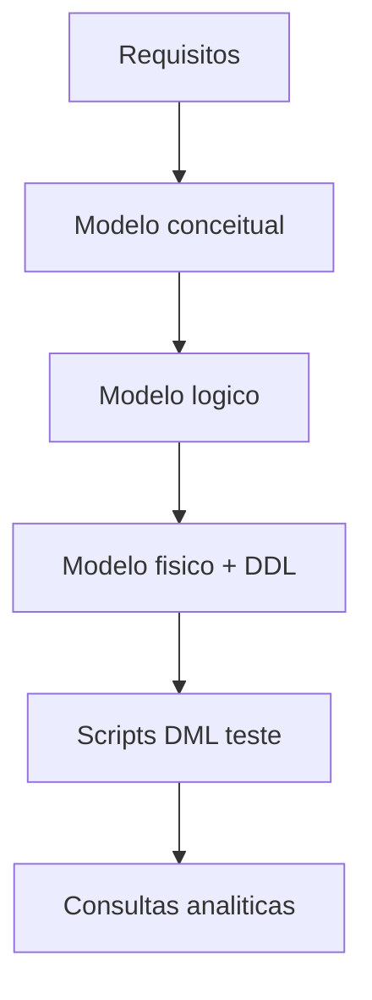
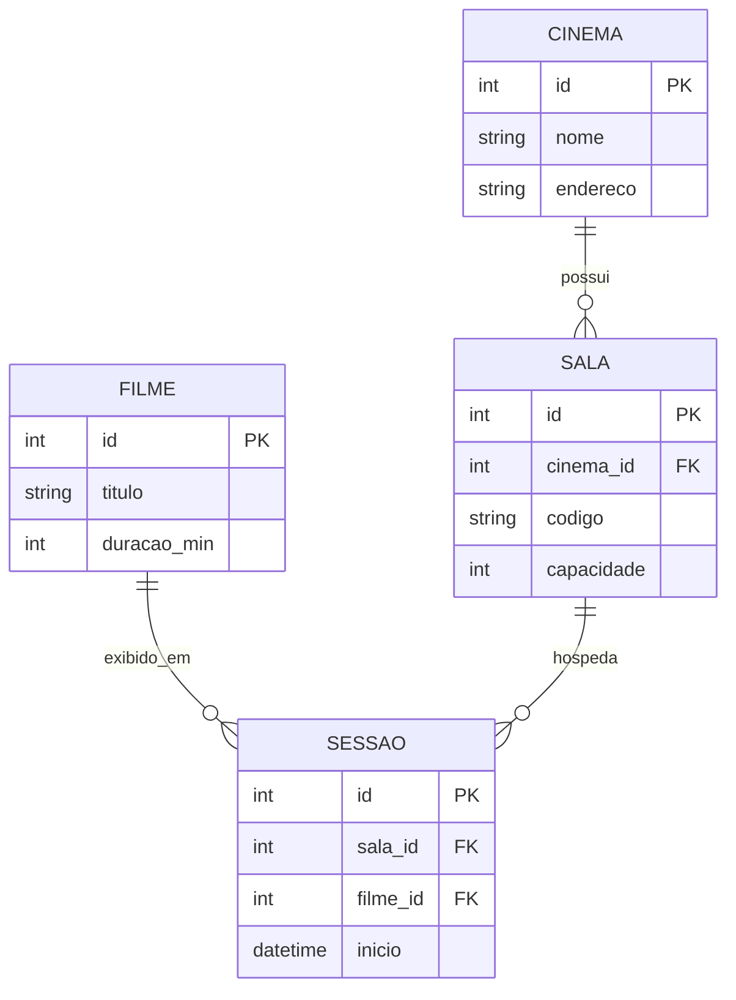

## Visão Geral do Conceito

A sessão revisita o <mark style="background-color: #242424; padding: 2px 4px; border-radius: 3px; color: inherit;">`TP2`</mark> (remissão à aula anterior gravada) e apresenta um **documento PDF longo** que percorre, num único fio, <mark style="background-color: #242424; padding: 2px 4px; border-radius: 3px; color: inherit;">`levantamento de requisitos`</mark>, <mark style="background-color: #242424; padding: 2px 4px; border-radius: 3px; color: inherit;">`modelo conceitual`</mark>, <mark style="background-color: #242424; padding: 2px 4px; border-radius: 3px; color: inherit;">`modelo lógico`</mark>, <mark style="background-color: #242424; padding: 2px 4px; border-radius: 3px; color: inherit;">`modelo físico`</mark> e ainda um adendo com <mark style="background-color: #242424; padding: 2px 4px; border-radius: 3px; color: inherit;">`script`</mark> de criação de tabelas e inserções para teste em <mark style="background-color: #242424; padding: 2px 4px; border-radius: 3px; color: inherit;">`SQLite`</mark> ou outro SGBD. O domínio exemplo é **controle de cinemas** com salas e operações associadas.

> **Regra:** esta lição não reproduz página a página o PDF; resume o fluxo e o vocabulário técnico conforme a transcrição. Detalhes de cada figura devem ser consultados no ficheiro original em `downloads/documents/`.

## Modelo Mental

Imagine uma linha do tempo de artefactos: primeiro o texto de requisitos fixa o escopo; o desenho entidade-relacionamento captura substantivos e verbos de negócio; o modelo lógico traduz para tabelas e chaves; o físico escolhe tipos, índices e scripts; por fim, dados de teste validam leitura e integridade referencial.



## Mecânica Central

### Domínio cinema (simplificado da narração)

O sistema visa apoiar cadastro e consulta de informações de um cinema com várias salas. Entidades típicas citadas na linha de raciocínio da aula incluem filmes, salas e sessões como pontos de amarração entre negócio e dados.



**Não coberto no VTT:** cardinalidades finais exatas de cada relacionamento no PDF; a figura acima é pedagógica e deve ser confrontada com o documento-fonte.

### Script físico e DML

A transcrição menciona script com <mark style="background-color: #242424; padding: 2px 4px; border-radius: 3px; color: inherit;">`CREATE TABLE`</mark> e comandos de <mark style="background-color: #242424; padding: 2px 4px; border-radius: 3px; color: inherit;">`INSERT`</mark> para popular uma base de testes. Use o mesmo ficheiro PDF e os CSVs disponibilizados na pasta da disciplina em `downloads/documents/` para reproduzir o ambiente.

## Uso Prático

1. Abrir o PDF **“Da modelagem até a execução de consultas”** (referência na transcrição).
2. Para cada secção, anotar: decisões de chave, redundâncias eliminadas, dependências entre tabelas.
3. Executar o script em SQLite e validar <mark style="background-color: #242424; padding: 2px 4px; border-radius: 3px; color: inherit;">`PRAGMA foreign_keys = ON;`</mark> antes de inserções.

## Erros Comuns

- Pular requisitos e ir direto ao diagrama (perde rastreabilidade).
- Confundir modelo lógico com físico (tipos e índices não são negócio).
- Testar script sem dados mínimos e achar que `JOIN` “não funciona”.

## Visão Geral de Debugging

Se inserção falhar, verifique ordem de tabelas referenciadas por <mark style="background-color: #242424; padding: 2px 4px; border-radius: 3px; color: inherit;">`FK`</mark> e valores órfãos.

## Principais Pontos

- Documento único amarra as quatro etapas principais.
- Cinema é o fio condutor do exemplo completo.
- Script fecha o ciclo até dados reais de teste.

## Preparação para Prática

Você deve ser capaz de explicar, sem abrir slides aleatórios, a ordem dos artefactos e apontar onde cada decisão de chave aparece.

## Laboratório de Prática

### Easy — Identificar entidades candidatas

Dado o mini-texto: “Cada cinema tem nome; cada sala tem código e capacidade; cada sessão liga um filme a uma sala com horário”, liste três entidades.

```sql
-- TODO: escrever em comentario SQL as tres entidades em MAIUSCULAS separadas por virgula
-- Exemplo: -- CINEMA, SALA, ...
```

Critérios: três substantivos distintos; sem atributo misturado como entidade.

### Medium — Chaves mínimas em CREATE TABLE simplificado

```sql
CREATE TABLE cinema (id INTEGER PRIMARY KEY, nome TEXT);
CREATE TABLE filme (id INTEGER PRIMARY KEY, titulo TEXT);

CREATE TABLE sala (
    id INTEGER PRIMARY KEY,
    cinema_id INTEGER -- TODO: descomentar REFERENCES cinema(id) quando validar ordem de criacao
);

CREATE TABLE sessao (
    id INTEGER PRIMARY KEY,
    sala_id INTEGER, -- TODO REFERENCES sala(id)
    filme_id INTEGER, -- TODO REFERENCES filme(id)
    inicio TEXT
);
```

Critérios: sintaxe válida em SQLite; comentários `REFERENCES` explícitos a preencher.

### Hard — Consulta de sessões por cinema

```sql
-- Tabelas: cinema(id,nome), sala(id,cinema_id,codigo), sessao(id,sala_id,filme_id,inicio), filme(id,titulo)
-- TODO: escrever SELECT que lista titulo e inicio para um cinema_id = 1
SELECT 1 AS placeholder;
```

Critérios: usar pelo menos dois <mark style="background-color: #242424; padding: 2px 4px; border-radius: 3px; color: inherit;">`JOIN`</mark>; filtrar por cinema.

<!-- CONCEPT_EXTRACTION
concepts:
  - requisitos
  - modelo conceitual MER
  - modelo logico
  - modelo fisico
  - DDL DML
  - caso cinemas
skills:
  - Ler documento integrado de ponta a ponta
  - Mapear narrativa de negocio para entidades
  - Planejar ordem de INSERT respeitando FK
  - Escrever JOIN multi-tabela sobre esquema normalizado
examples:
  - pdf-modelagem-ate-sql
  - sqlite-script-teste
-->

<!-- EXERCISES_JSON
[
  {
    "id": "sql-cinemas-listar-entidades",
    "slug": "sql-cinemas-listar-entidades",
    "difficulty": "easy",
    "title": "Listar entidades de texto de cinema",
    "discipline": "sql-modelagem-relacional",
    "editorLanguage": "sql",
    "tags": ["sql", "modelagem", "entidades"],
    "summary": "Extrair substantivos de negócio como entidades candidatas a partir de descrição curta."
  },
  {
    "id": "sql-cinemas-ddl-fk",
    "slug": "sql-cinemas-ddl-fk",
    "difficulty": "medium",
    "title": "DDL mínimo com chaves estrangeiras",
    "discipline": "sql-modelagem-relacional",
    "editorLanguage": "sql",
    "tags": ["sql", "sqlite", "foreign-key"],
    "summary": "Completar esqueleto de tabelas sala e sessao com referências coerentes."
  },
  {
    "id": "sql-cinemas-join-sessoes",
    "slug": "sql-cinemas-join-sessoes",
    "difficulty": "hard",
    "title": "JOIN de sessões por cinema",
    "discipline": "sql-modelagem-relacional",
    "editorLanguage": "sql",
    "tags": ["sql", "join", "consulta"],
    "summary": "Montar consulta que liga cinema, sala, sessão e filme para listar cartaz."
  }
]
-->

<!-- SOURCE_CONTEXT
source_transcript_vtt: downloads/SQL_e_Modelagem_Relacional/Aula_07_-_12052026.vtt
source_transcript_vtt_sha256: bde8a7808a14e53eb70684721ce961ffdea1dbcd451e06ee72c9f22986c9d7ad
source_document_manifest: downloads/manifest.json (entrada document:url:0adf414a9dde632fce0a817600b3001d7438c5af75a9d9fa → documents/.../Da-Modelagem-ate-a-execucao-de-consultas-Banco-de-Dados.pdf)
context_folder: downloads/SQL_e_Modelagem_Relacional/
context_note: "PDF citado na aula conforme manifesto de downloads; em clones mínimos pode faltar o binário — usar transcrição e materiais infnet.online."
-->
