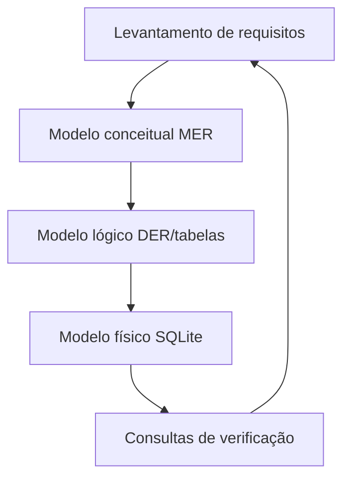

## Visão Geral do Conceito

Esta sessão consolida o **ciclo completo** visto na disciplina — levantamento de requisitos, modelo conceitual, modelo lógico, modelo físico e adendo de consultas — usando um **caso de cinema** como fio condutor. O professor retoma o material da etapa 4, corrige pendências de publicação de ficheiros e percorre o diagrama para mostrar como decisões de negócio viram tabelas e, depois, **perguntas SQL**.

> **Regra:** a lição reconstrói a transcrição; onde o áudio é conversacional ou há lacuna explícita, isso é assinalado em vez de inventar requisitos do domínio.

## Modelo Mental

Trate o diagrama como **contrato visual** entre negócio e implementação: cada entidade responde a um substantivo estável; cada relacionamento carrega verbo + cardinalidade; cada consulta no fim valida se o modelo aguenta as perguntas prometidas.



## Mecânica Central

- **Requisitos** documentam regras (ex.: cinema, filme, sessão, gênero) que alimentam o MER.
- **MER** identifica entidades, atributos e relacionamentos, inclusive **N:N** com entidade associativa.
- **DER / mapeamento** traduz cardinalidade em chaves estrangeiras: o lado **N** recebe a chave do **1** quando apropriado.
- **Agregação** aparece quando um relacionamento precisa ser tratado como entidade participante de outros vínculos (conceito citado na aula para leitura fina do diagrama).
- **Consultas** fecham o ciclo: perguntas como cinemas por gênero exigem que gênero exista no modelo.

## Uso Prático

Ao revisar um modelo pronto (ex.: cinema), faça três perguntas rápidas antes de escrever SQL:

1. **Onde está o evento?** (sessão com data/hora vs filme genérico.)
2. **Onde está a ponte N:N?** (filme–gênero, ator–filme, etc.)
3. **Qual chave viaja para o filho?** Confirme no diagrama antes de codificar `JOIN`.

## Erros Comuns

- Tratar planilha ou protótipo como **fonte única da verdade** sem atualizar o MER.
- Ignorar que **gênero** pode ser classificação opcional: ausência no modelo bloqueia consultas que o enunciado pede.
- Confundir **DER** com MER sem passar pelo mapeamento de FKs.

## Visão Geral de Debugging

Quando uma `SELECT` não encontra linhas esperadas, percorra o caminho inverso: a coluna existe na tabela certa? A FK aponta para a entidade que o diagrama marca como dona do fato?

## Principais Pontos

- Ciclo requisitos → físico → consultas é o produto da disciplina, não só desenho estático.
- Cardinalidade manda na colocação de chaves.
- Caso cinema serve como laboratório de leitura cruzada MER/SQL.

## Preparação para Prática

Abra o **SQLite Studio** com o script da etapa e o diagrama lado a lado; ao montar uma consulta nova, descreva em uma frase qual pergunta de negócio ela testa.

## Laboratório de Prática

### Easy — Identificar dono da chave em 1:N

Explique qual tabela deve receber `cinema_id` num relacionamento **cinema → sessão** (um cinema, muitas sessões).

```sql
-- Esboço: complete os tipos e a FK coerente com 1:N cinema -> sessao
CREATE TABLE cinema (
  id INTEGER PRIMARY KEY,
  nome TEXT NOT NULL
);

CREATE TABLE sessao (
  id INTEGER PRIMARY KEY,
  -- TODO: adicionar cinema_id NOT NULL + FK
  data_hora TEXT NOT NULL,
  filme_id INTEGER NOT NULL
);
```

Critérios:

- FK na tabela do lado **N**.
- Tipos compatíveis com a PK referenciada.

### Medium — Tabela de ponte N:N

Dado filme e gênero em N:N, escreva o DDL da tabela de associação.

```sql
CREATE TABLE filme (
  id INTEGER PRIMARY KEY,
  titulo TEXT NOT NULL
);

CREATE TABLE genero (
  id INTEGER PRIMARY KEY,
  nome TEXT NOT NULL UNIQUE
);

-- TODO: CREATE TABLE filme_genero (...)
```

Critérios:

- Chave composta ou surrogate coerente.
- Dupla FK com `ON DELETE` explícito (justifique a escolha num comentário).

### Hard — Consulta de negócio

Escreva uma consulta que liste **cinemas** que exibem filmes de um **gênero** informado (parâmetro em comentário).

```sql
-- :genero = 'Terror' (exemplo)
-- TODO: JOINs necessários partindo de cinema até genero
```

Critérios:

- Não assume colunas inexistentes.
- Usa a ponte N:N se o modelo exigir.

<!-- CONCEPT_EXTRACTION
concepts:
  - ciclo de modelagem
  - MER
  - DER
  - cardinalidade
  - relacionamento N para N
  - agregação
  - SQLite Studio
skills:
  - Ler diagrama entidade-relacionamento
  - Mapear MER para chaves físicas
  - Formular consultas alinhadas ao modelo
examples:
  - caso-cinema-sessao-data
  - ponte-filme-genero
  - consulta-cinemas-por-genero
-->

<!-- EXERCISES_JSON
[
  {
    "id": "revisao-etapas-mer-der-cinema-sql-fk-1n",
    "slug": "revisao-etapas-mer-der-cinema-sql-fk-1n",
    "difficulty": "easy",
    "title": "Chave estrangeira em relacionamento 1:N",
    "discipline": "sql-modelagem-relacional",
    "editorLanguage": "sql",
    "tags": ["sql", "modelagem", "fk"],
    "summary": "Completar sessao com cinema_id e FK coerente com o diagrama."
  },
  {
    "id": "revisao-etapas-mer-der-cinema-sql-ponte-nn",
    "slug": "revisao-etapas-mer-der-cinema-sql-ponte-nn",
    "difficulty": "medium",
    "title": "Tabela de associação N:N",
    "discipline": "sql-modelagem-relacional",
    "editorLanguage": "sql",
    "tags": ["sql", "modelagem", "nn"],
    "summary": "Modelar filme_genero com PK e FKs corretas."
  },
  {
    "id": "revisao-etapas-mer-der-cinema-sql-consulta-genero",
    "slug": "revisao-etapas-mer-der-cinema-sql-consulta-genero",
    "difficulty": "hard",
    "title": "Cinemas por gênero",
    "discipline": "sql-modelagem-relacional",
    "editorLanguage": "sql",
    "tags": ["sql", "join", "negocio"],
    "summary": "SELECT com JOINs do cinema até gênero com filtro parametrizável."
  }
]
-->

<!-- SOURCE_CONTEXT
source: downloads/SQL_e_Modelagem_Relacional/Aula_07_-_12052026.vtt
source_sha256: bde8a7808a14e53eb70684721ce961ffdea1dbcd451e06ee72c9f22986c9d7ad
context_choice: "Pasta plana da disciplina; apenas o .vtt da sessão 07 (12-05-2026) — não há subpasta por aula; documentos SQL no manifesto são genéricos da disciplina e não amarrados a esta data."
notes:
  - Abertura com falhas técnicas na aula anterior; foco pedagógico na revisão de etapas e leitura do modelo cinema.
-->
