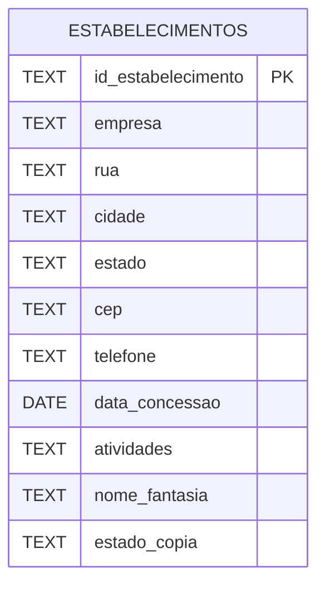
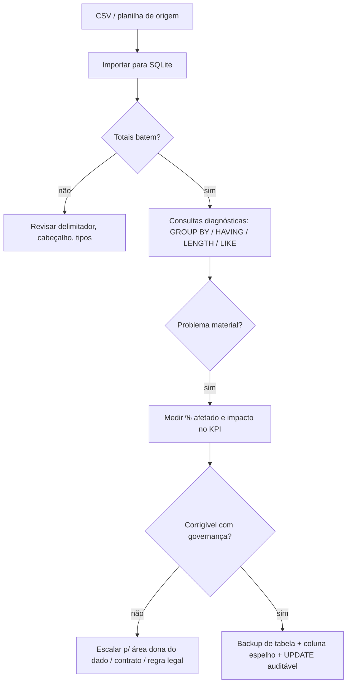

## Visão Geral do Conceito

Esta etapa trata de **inspecionar e modificar dados** quando o objetivo não é apenas “rodar um <mark style="background-color: #242424; padding: 2px 4px; border-radius: 3px; color: inherit;">`SELECT`</mark>”, mas garantir que o que você soma, conta e filtra **representa o negócio**. Em bases reais (CSV de fiscalização, cadastros operacionais, extratos de clientes), os problemas mais caros aparecem antes da modelagem perfeita: **valores ausentes**, **texto que parece vazio**, **conversões que cortam zeros à esquerda**, **duplicidades aparentes por variação ortográfica** e **tipos/colunas definidos sem olhar para a distribuição do dado**.

> **Regra:** Tratar dado sujo não começa por “apagar o que incomoda”. Começa por **medir o problema**, **provar o sintoma com SQL** e só então **mudar com trilha de auditoria** (backup e colunas espelho).

O roteiro da aula conecta três planos: (1) entender o que é dado sujo e de onde vem; (2) carregar um CSV no SQLite pelo SQLiteStudio e validar contagem; (3) executar consultas diagnósticas; (4) preparar alterações com <mark style="background-color: #242424; padding: 2px 4px; border-radius: 3px; color: inherit;">`CREATE TABLE ... AS SELECT`</mark>, <mark style="background-color: #242424; padding: 2px 4px; border-radius: 3px; color: inherit;">`ALTER TABLE`</mark> e <mark style="background-color: #242424; padding: 2px 4px; border-radius: 3px; color: inherit;">`UPDATE`</mark>. Contextos complementares discutidos na mesma sessão (caso **cinema** e sensibilidade a caixa em buscas) reforçam o mesmo princípio: **pequenas diferenças de string e de formato viram grandes diferenças de KPI**.

## Modelo Mental

Pense no fluxo como uma **esteira de qualidade**:

1. **Ingestão** (planilha/CSV → tabela): aqui nascem perdas silenciosas (Excel pode reinterpretar números como texto, datas e CEP).
2. **Evidência** (SQL exploratório): você não “acha” o problema; você **publica** o problema em uma consulta reproduzível.
3. **Governança** (decisão humana): há cenários em que metade da base está problemática — aí a pergunta deixa de ser técnica (“como limpar?”) e vira de produto/risco (“ainda dá para usar isso?”).
4. **Correção segura** (backup + espelho + atualização): toda transformação irreversível exige **cópia** para comparar antes/depois.

Em paralelo, lembre-se da distinção que a própria prática mostrou: **<mark style="background-color: #242424; padding: 2px 4px; border-radius: 3px; color: inherit;">`NULL`</mark> real** versus **string vazia que parece vazio na grade**. O segundo caso frequentemente exige truques de exibição/concatenação (como envolver o valor com delimitadores via <mark style="background-color: #242424; padding: 2px 4px; border-radius: 3px; color: inherit;">`CHAR(39)`</mark> no SQLite) para enxergar o “nada” com clareza.

## Mecânica Central

### O que caracteriza dado sujo (na prática)

Três famílias recorrentes na discussão:

- **Erro de valor ou de digitação**: inclui caracteres “invisíveis” (atalhos, bytes estranhos) que quebram join e agrupamento.
- **Ausência**: <mark style="background-color: #242424; padding: 2px 4px; border-radius: 3px; color: inherit;">`NULL`</mark> ou texto vazio; ambos mudam filtros e contagens.
- **Organização ruim do arquivo**: colunas multivaloradas no CSV, padronização fraca, ou perda de zeros à esquerda na exportação.

### Origens típicas de corrupção na migração

- **Conversão de tipo** (texto ↔ data ↔ número): mudança de ferramenta pode alterar formato (dia/mês/ano vs mês/dia/ano) e exigir pipeline próprio (staging + normalização), especialmente quando o destino não oferece o mesmo arsenal de funções de formato de um Oracle/SQL Server.
- **Tipo/tamanho de coluna destino menor que a origem**: pode truncar <mark style="background-color: #242424; padding: 2px 4px; border-radius: 3px; color: inherit;">`VARCHAR`</mark> sem você perceber até somar “metades” de informação em relatórios.

### Padrão de ingestão no SQLiteStudio

1. Criar banco (`.db`) e **modelar a tabela** coerente com o CSV (tipos <mark style="background-color: #242424; padding: 2px 4px; border-radius: 3px; color: inherit;">`TEXT`</mark> vs <mark style="background-color: #242424; padding: 2px 4px; border-radius: 3px; color: inherit;">`DATE`</mark>).
2. **Importar** via menu de importação, marcando **primeira linha como cabeçalho** e delimitador **vírgula**.
3. Conferir integridade operacional com <mark style="background-color: #242424; padding: 2px 4px; border-radius: 3px; color: inherit;">`SELECT COUNT(*)`</mark> comparado ao volume esperado no arquivo.

### Consultas diagnósticas que você deve dominar

- **Duplicidade por chave de negócio composta** (ex.: mesma empresa + endereço): <mark style="background-color: #242424; padding: 2px 4px; border-radius: 3px; color: inherit;">`GROUP BY`</mark> + <mark style="background-color: #242424; padding: 2px 4px; border-radius: 3px; color: inherit;">`COUNT(*)`</mark> + <mark style="background-color: #242424; padding: 2px 4px; border-radius: 3px; color: inherit;">`HAVING COUNT(*) > 1`</mark>.
- **Distribuição por UF**: agregação simples com ordenação para inspeção humana.
- **Falsa ausência**: <mark style="background-color: #242424; padding: 2px 4px; border-radius: 3px; color: inherit;">`WHERE estado IS NULL`</mark> pode não casar com string vazia; às vezes `''` só aparece quando você força delimitação visual na seleção.
- **Variação de nome** (<mark style="background-color: #242424; padding: 2px 4px; border-radius: 3px; color: inherit;">`LIKE '%Armor%'`</mark>): descobre múltiplas grafias que inflam contagens de “empresas distintas”.
- **Comprimento de CEP** (<mark style="background-color: #242424; padding: 2px 4px; border-radius: 3px; color: inherit;">`LENGTH(cep)`</mark>):histograma de tamanhos detecta perda de zeros ou normalizações incorretas.

### Protocolo de alteração mostrado na aula

1. **Backup físico em tabela**: duplicar a relação com <mark style="background-color: #242424; padding: 2px 4px; border-radius: 3px; color: inherit;">`CREATE TABLE estabelecimentos_backup AS SELECT * FROM estabelecimentos;`</mark> (semântica equivalente à ideia de “tabela igual”).
2. **Coluna espelho**: <mark style="background-color: #242424; padding: 2px 4px; border-radius: 3px; color: inherit;">`ALTER TABLE estabelecimentos ADD COLUMN estado_copia TEXT;`</mark>
3. **Preencher espelho**: <mark style="background-color: #242424; padding: 2px 4px; border-radius: 3px; color: inherit;">`UPDATE estabelecimentos SET estado_copia = estado;`</mark>
4. **Verificação**: buscar divergências <mark style="background-color: #242424; padding: 2px 4px; border-radius: 3px; color: inherit;">`WHERE estado <> estado_copia`</mark> (esperado zero logo após o espelhamento) e, depois das correções planejadas, reavaliar.

O diagrama abaixo resume o alvo de modelagem **mínimo** da tabela trabalhada (ajuste nomes de colunas conforme o seu script; na aula houve tradução de cabeçalhos para português mantendo conteúdo em inglês).



Fluxo mental da inspeção → decisão:



### Nota sobre o caso cinema (continuidade pedagógica)

Na mesma sessão, o professor revisitou o **modelo cinema** com chaves compostas em <mark style="background-color: #242424; padding: 2px 4px; border-radius: 3px; color: inherit;">`PASSA`</mark> e <mark style="background-color: #242424; padding: 2px 4px; border-radius: 3px; color: inherit;">`SESSAO`</mark>, ordem de <mark style="background-color: #242424; padding: 2px 4px; border-radius: 3px; color: inherit;">`INSERT`</mark> respeitando <mark style="background-color: #242424; padding: 2px 4px; border-radius: 3px; color: inherit;">`FOREIGN KEY`</mark>, e consultas com **joins** que somam público por município. O ponto reaproveitável aqui é universal: **`WHERE municipio = 'Rio de Janeiro'`** pode falhar se você trocar a caixa — no SQLite isso pode anular resultados; em outros SGBDs o padrão pode diferir. Sempre **documente collation e normalize entradas** em camadas ETL quando o relatório for crítico.

> **Regra:** Se o KPI financeiro depende da contagem correta de pessoas, contratos ou ligações, tratar nome/ID “quase iguais” não é detalhe — é risco de **subfaturamento** ou de **decisão errada**.

## Uso Prático

### 1) Duplicatas aparentes por endereço + empresa

```sql
SELECT
  empresa,
  rua,
  cidade,
  estado,
  COUNT(*) AS qtd
FROM estabelecimentos
GROUP BY empresa, rua, cidade, estado
HAVING COUNT(*) > 1
ORDER BY empresa, rua, cidade, estado;
```

### 2) “Estado nulo” vs string vazia

Primeiro teste direto:

```sql
SELECT id_estabelecimento, empresa, cidade, cep
FROM estabelecimentos
WHERE estado IS NULL;
```

Se voltar vazio, mas a grade “parece” sem UF, selecione com delimitadores (padrão SQLite com <mark style="background-color: #242424; padding: 2px 4px; border-radius: 3px; color: inherit;">`CHAR(39)`</mark> como apóstrofo):

```sql
SELECT
  estado,
  CHAR(39) || estado || CHAR(39) AS estado_delimitado,
  COUNT(*) AS qtd
FROM estabelecimentos
GROUP BY estado
ORDER BY estado;
```

Depois filtre explicitamente string vazia:

```sql
SELECT id_estabelecimento, empresa, cidade, estado, cep
FROM estabelecimentos
WHERE estado = '';
```

### 3) Variações de nome com LIKE

```sql
SELECT empresa, COUNT(*) AS qtd
FROM estabelecimentos
WHERE empresa LIKE '%Armor%'
GROUP BY empresa
ORDER BY empresa;
```

### 4) Histograma de tamanho de CEP

```sql
SELECT LENGTH(cep) AS len_cep, COUNT(*) AS qtd
FROM estabelecimentos
GROUP BY LENGTH(cep)
ORDER BY len_cep;
```

### 5) Backup + coluna espelho + update

```sql
CREATE TABLE estabelecimentos_backup AS
SELECT * FROM estabelecimentos;

ALTER TABLE estabelecimentos ADD COLUMN estado_copia TEXT;

UPDATE estabelecimentos
SET estado_copia = estado;

SELECT COUNT(*) FROM estabelecimentos;
SELECT COUNT(*) FROM estabelecimentos_backup;
```

### 6) Exemplo de junção (cinema): sensibilidade de string + agregação

```sql
SELECT SUM(se.publico) AS publico_total
FROM sessao AS se
JOIN passa AS pa
  ON pa.CodigoCinema = se.CodigoCinema
 AND pa.CodigoFilme = se.CodigoFilme
JOIN cinema AS ci
  ON ci.CodigoCinema = pa.CodigoCinema
WHERE ci.Municipio = 'Rio de Janeiro';
```

Ajuste literais conforme o dado real — **copiar/colar errado a caixa muda o resultado**.

<details>
<summary>Colaterais de planilha (Excel) que confundem auditoria</summary>

Abrir CSV no Excel antes de importar pode alterar representação (datas, números com zeros à esquerda). Quando o objetivo é provar o arquivo “como veio”, prefira encadeamento: arquivo bruto → SQLite com opções explícitas de tipo, ou staging dedicada.
</details>

## Erros Comuns

- **Confundir <mark style="background-color: #242424; padding: 2px 4px; border-radius: 3px; color: inherit;">`NULL`</mark> com string vazia** e concluir “não há problema” porque o <mark style="background-color: #242424; padding: 2px 4px; border-radius: 3px; color: inherit;">`IS NULL`</mark> não encontrou nada.
- **Usar <mark style="background-color: #242424; padding: 2px 4px; border-radius: 3px; color: inherit;">`=`</mark> onde precisava de <mark style="background-color: #242424; padding: 2px 4px; border-radius: 3px; color: inherit;">`LIKE`</mark>** em nomes ruidosos — ou o inverso, sem escapar curingas quando necessário.
- **Julgar CEP só pelo valor “bonito” na grade** sem histograma de <mark style="background-color: #242424; padding: 2px 4px; border-radius: 3px; color: inherit;">`LENGTH`</mark>.
- **Atualizar colunas sem backup** e perder a possibilidade de provar regressão.
- **Copiar <mark style="background-color: #242424; padding: 2px 4px; border-radius: 3px; color: inherit;">`CREATE TABLE`</mark> de PDF/Word** e importar caracteres invisíveis; por isso ambientes profissionais preferem `.sql`/`.txt` limpos.
- **Presumir comportamento de caixa/collation** do seu ambiente de produção com base no SQLite local — sempre valide.

## Visão Geral de Debugging

Quando um total “não bate”, execute este roteiro:

1. **Congele a pergunta**: qual contagem exata deveria ser e contra qual chave de negócio?
2. **Valide ingestão**: <mark style="background-color: #242424; padding: 2px 4px; border-radius: 3px; color: inherit;">`COUNT(*)`</mark> na tabela chegada vs fonte; amostre 10 linhas “suspeitas” com <mark style="background-color: #242424; padding: 2px 4px; border-radius: 3px; color: inherit;">`ORDER BY RANDOM() LIMIT 10`</mark> (SQLite).
3. **Separe sintomas**: duplicidade (endereço), ortografia (LIKE), formato (LENGTH), nulidade (IS NULL/'').
4. **Isole o filtro**: remova <mark style="background-color: #242424; padding: 2px 4px; border-radius: 3px; color: inherit;">`JOIN`</mark> até a contagem voltar — reintroduza join a join para achar perda por chave.
5. **Somente depois** disso aplique mudanças estruturais com backup e uma coluna espelho para comparar antes/depois.

Se o sintoma for sistêmico (milhares de registros com padrão quebrado), pare: **reabra o arquivo original**, fale com o **produtor do dado** e avalie se o esforço de correção destrói o valor da análise — cenário discutido explicitamente na aula com exemplos reais de faturamento.

## Principais Pontos

- **Dado sujo** custa caro porque muda totais silenciosamente; trate qualidade como parte do desenho da consulta.
- **Evidência reproduzível** (<mark style="background-color: #242424; padding: 2px 4px; border-radius: 3px; color: inherit;">`GROUP BY`</mark>/<mark style="background-color: #242424; padding: 2px 4px; border-radius: 3px; color: inherit;">`HAVING`</mark>/<mark style="background-color: #242424; padding: 2px 4px; border-radius: 3px; color: inherit;">`LENGTH`</mark>/<mark style="background-color: #242424; padding: 2px 4px; border-radius: 3px; color: inherit;">`LIKE`</mark>) vem antes de UPDATE em produção.
- **NULL ≠ ''**; a interface gráfica pode esconder o problema — force delimitadores na seleção quando necessário.
- **Backup de tabela + coluna espelho** é o mínimo para UPDATE auditável em base que ainda está em exploração.
- **Collation e caixa** importam: teste sempre com amostras reais, não com suposições de “case insensitive”.
- **Ordem de carga** com <mark style="background-color: #242424; padding: 2px 4px; border-radius: 3px; color: inherit;">`FOREIGN KEY`</mark> é obrigatória (caso cinema); violação aparece como erro de inserção, não como “dado sumiu”.

## Preparação para Prática

Antes do laboratório, você deve ser capaz de:

- Importar um CSV para SQLite validando cabeçalho e delimitadores.
- Explicar por que um <mark style="background-color: #242424; padding: 2px 4px; border-radius: 3px; color: inherit;">`HAVING COUNT(*) > 1`</mark> revela duplicidade composta.
- Escrever consultas que discriminam **tamanhos de CEP** e **variações de razão social** com <mark style="background-color: #242424; padding: 2px 4px; border-radius: 3px; color: inherit;">`LIKE`</mark>.
- Montar o tripé **backup / espelho / update** e validar ausência de divergência imediata entre original e cópia.

## Laboratório de Prática

Todos os trechos abaixo são **SQLite**. Substitua nomes de tabela/colunas se o seu script local divergir, mas preserve a lógica.

### Easy — Duplicidade operacional

**Enunciado.** Você recebeu um CSV de estabelecimentos importado para a tabela <mark style="background-color: #242424; padding: 2px 4px; border-radius: 3px; color: inherit;">`estabelecimentos`</mark>. Antes de qualquer limpeza, prove com SQL se há mais de um registro para a **mesma combinação** de empresa, rua, cidade e estado.

```sql
-- TODO: completar o HAVING para manter apenas grupos com mais de 1 linha
SELECT
  empresa,
  rua,
  cidade,
  estado,
  COUNT(*) AS qtd
FROM estabelecimentos
GROUP BY empresa, rua, cidade, estado
HAVING 1 = 1
ORDER BY qtd DESC, empresa;
```

### Medium — Diagnóstico de CEP “curto”

**Enunciado.** Produza um ranking de UFs com quantos registros têm <mark style="background-color: #242424; padding: 2px 4px; border-radius: 3px; color: inherit;">`LENGTH(cep) < 5`</mark>. Isso alerta sobre perda de zeros à esquerda ou sujeira de exportação.

```sql
-- TODO: trocar o placeholder do WHERE para filtrar CEP com menos de 5 caracteres
SELECT
  estado,
  COUNT(*) AS qtd_suspeita
FROM estabelecimentos
WHERE 1 = 1
GROUP BY estado
ORDER BY qtd_suspeita DESC, estado;
```

### Hard — Correção assistida com governança mínima

**Enunciado.** Implemente o padrão **backup + estado_copia + update de espelhamento**. Depois, escreva a consulta que **deveria** retornar zero linha logo após o espelhamento (comparação de divergência). Não destrua o backup.

```sql
-- Passo 1: backup (TODO: confirmar nome do backup exigido pelo seu time)
-- TODO: criar tabela estabelecimentos_lab_backup copiando todos os registros

-- Passo 2: coluna espelho
-- TODO: ALTER TABLE para adicionar estado_copia TEXT

-- Passo 3: espelhamento
-- TODO: UPDATE que define estado_copia = estado para todas as linhas

-- Passo 4: verificação pós-espelhamento (deve retornar 0 linhas)
SELECT id_estabelecimento, empresa, estado, estado_copia
FROM estabelecimentos
WHERE 1 = 0;
```

Para o passo 4, a intenção pedagógica é substituir `1 = 0` por uma condição real do tipo <mark style="background-color: #242424; padding: 2px 4px; border-radius: 3px; color: inherit;">`estado IS NOT estado_copia`</mark> **ou** comparação segura com <mark style="background-color: #242424; padding: 2px 4px; border-radius: 3px; color: inherit;">`IFNULL`</mark> conforme a política do seu dataset — o boilerplate inicia **sem retorno** para não quebrar a execução antes do aluno completar.

<!-- CONCEPT_EXTRACTION
concepts:
  - dados sujos
  - qualidade e governança de dados
  - importação CSV (SQLiteStudio)
  - GROUP BY e HAVING
  - LIKE vs igualdade exata
  - NULL vs string vazia
  - LENGTH para validação de formato
  - backup de tabela e coluna espelho
  - UPDATE auditável
skills:
  - Diagnosticar duplicidades compostas com agregação
  - Detectar perda de zeros e formatos incorretos em CEP
  - Inspecionar valores “vazios” com técnicas de delimitação
  - Preparar correções com backup e coluna auxiliar
  - Interpretar impacto de collation/caixa em filtros de texto
examples:
  - dup-endereco-estabelecimentos
  - histograma-length-cep
  - like-variacao-armor
  - backup-estado-copia-update
-->

<!-- EXERCISES_JSON
[
  {
    "id": "lab-dup-estabelecimentos",
    "slug": "lab-dup-estabelecimentos",
    "difficulty": "easy",
    "title": "Detectar duplicidade por endereço + empresa",
    "discipline": "sql-e-modelagem-relacional",
    "editorLanguage": "sql",
    "tags": ["sqlite", "group-by", "having", "qualidade-de-dados"],
    "summary": "Completar HAVING para listar grupos com mais de um registro para a mesma combinação empresa/endereço."
  },
  {
    "id": "lab-cep-curto-por-uf",
    "slug": "lab-cep-curto-por-uf",
    "difficulty": "medium",
    "title": "UFs com CEP suspeito (LENGTH < 5)",
    "discipline": "sql-e-modelagem-relacional",
    "editorLanguage": "sql",
    "tags": ["sqlite", "length", "cep", "aggregação"],
    "summary": "Filtrar e agregar registros com CEP curto, sinalizando possível perda de zeros à esquerda."
  },
  {
    "id": "lab-backup-estado-copia",
    "slug": "lab-backup-estado-copia",
    "difficulty": "hard",
    "title": "Backup, coluna espelho e verificação pós-UPDATE",
    "discipline": "sql-e-modelagem-relacional",
    "editorLanguage": "sql",
    "tags": ["sqlite", "alter-table", "update", "auditoria"],
    "summary": "Reproduzir backup de tabela, criar estado_copia, espelhar valores e validar divergências."
  }
]
-->

```json
LESSONS_JSON_HINT
{
  "discipline": "sql-e-modelagem-relacional",
  "slug": "aula-08-inspecionar-modificar-dados",
  "title": "Inspecionar e modificar dados sujos: diagnóstico em SQLite",
  "order": 8,
  "file": "content/sql-e-modelagem-relacional/aula-08-inspecionar-modificar-dados.md"
}
```
