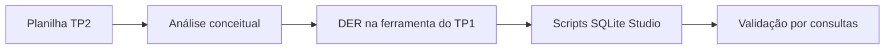

## Visão Geral do Conceito

A **etapa 5** volta ao **SQLite Studio** para amarrar teoria e mão na massa: o professor confirma que o **TP2** exige interpretar a planilha e retratar **modelo conceitual e lógico** na ferramenta já adotada no TP1, com texto explicando pontos discutíveis do desenho. Há ainda discussão sobre **bases legadas** e o problema central do **dado** ao evoluir esquemas.

> **Regra:** trechos muito situacionais do chat foram omitidos; o núcleo técnico (etapa 5 + TP2 + SQLite) está preservado.

## Modelo Mental



## Mecânica Central

- **TP2**: entregar modelo na ferramenta do TP1; comentar decisões sob o diagrama/transcrição do modelo, não apenas colar a planilha.
- **SQLite Studio**: janela de comandos, importação/estrutura e conferência visual alinhada ao DER mostrado em aula.
- **Legado vs novo modelo**: quando existe banco antigo, o desafio frequentemente está na **qualidade e significado** dos dados, não só na sintaxe `CREATE`.
- **Encerramento da etapa 5**: na transição da aula, a etapa 6 fica agendada para a semana seguinte (anúncio de calendário na gravação).

## Uso Prático

Antes de exportar o TP2:

1. Liste **entidades** diretamente das colunas repetidas ou multivaloradas.
2. Desenhe **relacionamentos** com cardinalidade legível.
3. Só então sincronize com SQLite: cada FK deve ter justificativa de leitura no DER.

## Erros Comuns

- Normalizar a planilha mentalmente mas **não documentar** o raciocínio pedido no enunciado.
- Tratar Excel como **BD** em vez de insumo de análise.
- Pular a checagem SQL deixando o modelo sem prova de perguntas de negócio.

## Visão Geral de Debugging

Se o SQLite importa tipos estranhos (`TEXT` onde haveria número), volte ao modelo lógico: o erro pode ser **tipo de domínio** escolhido errado, não só configuração da ferramenta.

## Principais Pontos

- Etapa 5 fecha o ciclo prático com SQLite Studio.
- TP2 = modelo + explicação, alinhado ao TP1.
- Migração/legado lembra que **semântica** dos dados importa tanto quanto o diagrama.

## Preparação para Prática

Tenha o **roteiro da etapa 5** e o **TP2** abertos; marque três diferenças entre a planilha bruta e o seu DER final para usar na justificativa escrita.

## Laboratório de Prática

### Easy — Comentário de intenção no script

Explique em comentário SQL (até 4 linhas) por que `sessao.cinema_id` deve existir mesmo que a planilha original não tenha uma coluna com esse nome.

```sql
-- TODO: comentário explicando o papel de cinema_id
SELECT 1;
```

Critérios:

- Mencionar MER/DER e tradução para FK.

### Medium — Script de verificação de FK

Complete o script para impedir sessão sem cinema válido.

```sql
PRAGMA foreign_keys = ON;

CREATE TABLE cinema (
  id INTEGER PRIMARY KEY,
  nome TEXT NOT NULL
);

CREATE TABLE sessao (
  id INTEGER PRIMARY KEY,
  cinema_id INTEGER NOT NULL,
  inicio TEXT NOT NULL,
  -- TODO: FOREIGN KEY (cinema_id) REFERENCES ...
);

-- TODO: INSERT inválido de teste + comentário do erro esperado
```

Critérios:

- `PRAGMA foreign_keys` comentado se usar engine sem suporte; caso contrário mantido.
- INSERT que falha por FK quando aplicável.

### Hard — Plano de migração mínimo

Liste 5 passos (bullet) para levar dados legados de uma tabela monolítica `LEGADO_CLIENTE` para o modelo normalizado `cliente` + `cliente_telefone`, incluindo validação final.

```sql
-- Esboço opcional: não há schema fixo na fonte
-- TODO: outline em comentários SQL ou texto curto acima
```

Critérios:

- Mencionar deduplicação, chaves surrogate, checagem de órfãos.

<!-- CONCEPT_EXTRACTION
concepts:
  - etapa 5
  - SQLite Studio
  - TP2
  - modelo conceitual
  - modelo lógico
  - legado de dados
  - migração
skills:
  - Explicar entregáveis do TP2
  - Sincronizar DER com scripts SQLite
  - Planejar saneamento de dados legados
examples:
  - tp2-planilha-para-der
  - sqlite-studio-validacao
  - legado-para-modelo-novo
-->

<!-- EXERCISES_JSON
[
  {
    "id": "etapa-5-sqlite-studio-tp2-der-comentario-fk",
    "slug": "etapa-5-sqlite-studio-tp2-der-comentario-fk",
    "difficulty": "easy",
    "title": "Comentário SQL sobre cinema_id",
    "discipline": "sql-modelagem-relacional",
    "editorLanguage": "sql",
    "tags": ["tp2", "fk", "documentacao"],
    "summary": "Comentário curto justificando FK com base no DER."
  },
  {
    "id": "etapa-5-sqlite-studio-tp2-der-fk-sessao",
    "slug": "etapa-5-sqlite-studio-tp2-der-fk-sessao",
    "difficulty": "medium",
    "title": "FK e PRAGMA em SQLite",
    "discipline": "sql-modelagem-relacional",
    "editorLanguage": "sql",
    "tags": ["sqlite", "fk", "pragma"],
    "summary": "Completar FKs e demonstrar INSERT inválido."
  },
  {
    "id": "etapa-5-sqlite-studio-tp2-der-migracao",
    "slug": "etapa-5-sqlite-studio-tp2-der-migracao",
    "difficulty": "hard",
    "title": "Plano de migração legado → normalizado",
    "discipline": "sql-modelagem-relacional",
    "editorLanguage": "sql",
    "tags": ["migracao", "normalizacao"],
    "summary": "Cinco passos com validação e deduplicação."
  }
]
-->

<!-- SOURCE_CONTEXT
source: downloads/SQL_e_Modelagem_Relacional/Aula_08_-_14052026.vtt
source_sha256: 999594e1c50b0d7f246db0270079cab4fd3aa34be15198618de38665a6c96ccb
context_choice: "Pasta plana da disciplina; apenas o .vtt da sessão 08 (14-05-2026) — mesma convenção da aula 07; interações de chat incorporadas só quando reforçam o briefing do TP2."
notes:
  - Aula encerra a etapa 5; anúncio de etapa 6 na semana seguinte conforme transcrição.
-->
