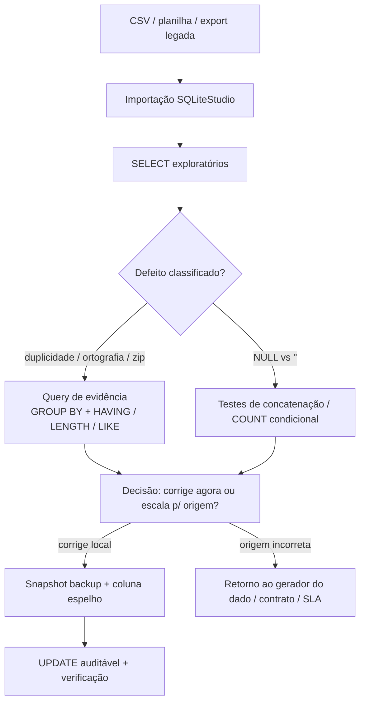
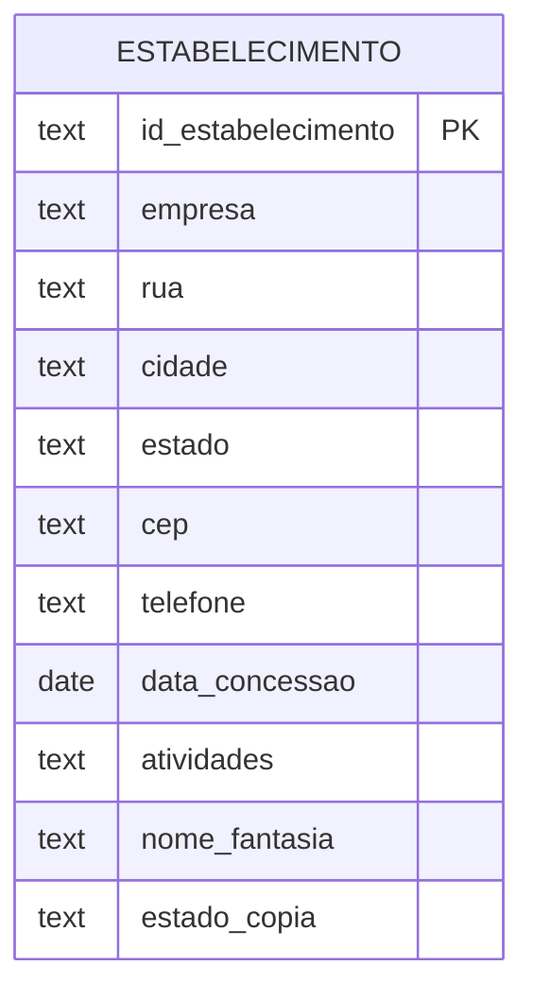

## Visão Geral do Conceito

Quando um sistema depende de dados vindos de arquivos, planilhas ou integrações legadas, o gargalo raramente é “saber SQL”: é **confiar no dado** que chegou. Nesta etapa, o foco não é apenas carregar um <mark style="background-color: #242424; padding: 2px 4px; border-radius: 3px; color: inherit;">`CSV`</mark> no <mark style="background-color: #242424; padding: 2px 4px; border-radius: 3px; color: inherit;">`SQLite`</mark> via <mark style="background-color: #242424; padding: 2px 4px; border-radius: 3px; color: inherit;">`SQLiteStudio`</mark>, mas **inspecionar** sinais de **dados sujos** (valores incorretos, ausentes, organização ruim) e preparar o terreno para **modificações seguras** com <mark style="background-color: #242424; padding: 2px 4px; border-radius: 3px; color: inherit;">`UPDATE`</mark>, sem destruir evidência do original.

> **Regra:** antes de “consertar”, você precisa de um **modelo de auditoria**: o que foi medido, com qual query, e qual evidência justifica a correção.

## Modelo Mental

Pense no processo como um **laudo de engenharia de dados**:

1. **Ingestão** traz o dado para dentro do <mark style="background-color: #242424; padding: 2px 4px; border-radius: 3px; color: inherit;">`SGBD`</mark> (no caso, SQLite), mas não valida negócio.
2. **Perfilamento** transforma suspeitas em **contagens** e **distribuições** (por tamanho de string, por estado, por empresa).
3. **Classificação do defeito** separa: <mark style="background-color: #242424; padding: 2px 4px; border-radius: 3px; color: inherit;">`NULL`</mark> real vs string “vazia que parece nula”, duplicação endereço+empresa, ortografia inconsistente, perda por conversão.
4. **Governança da mudança**: copiar para backup, criar coluna espelho, só então atualizar — especialmente quando a correção pode ser contestada pelo fornecedor do dado.

Na prática, queries de exploração são o seu “multímetro”: elas mostram **onde o dinheiro some** (KPI baixo, faturamento subcontado) antes de virar dashboard.

## Mecânica Central

### Dados sujos: triângulo de problemas

Três famílias aparecem com frequência no material discutido:

- **Erro factual/técnico**: digitação, caracteres invisíveis (combinações de teclas), dados copiados de <mark style="background-color: #242424; padding: 2px 4px; border-radius: 3px; color: inherit;">`PDF`</mark>/<mark style="background-color: #242424; padding: 2px 4px; border-radius: 3px; color: inherit;">`Word`</mark> com lixo de formatação.
- **Valor ausente** no sentido de negócio: pode ser <mark style="background-color: #242424; padding: 2px 4px; border-radius: 3px; color: inherit;">`NULL`</mark> *ou* string vazia `''` — e isso muda o resultado de agregações e filtros.
- **Organização ruim**: granularidade errada, colunas “multiparte”, exportações que normalizaram números como texto sem zeros à esquerda.

### Conversões e tipos: onde a informação evaporiza

Dois mecanismos clássicos:

- **Texto → data/número** com formato ambíguo (dia/mês/ano vs mês/dia/ano): erros de carga ou necessidade de etapa de *staging*.
- **Truncamento** ao definir tipo/tamanho menor no destino (ex.: “cabe” no <mark style="background-color: #242424; padding: 2px 4px; border-radius: 3px; color: inherit;">`VARCHAR`</mark> curto, mas você perde cauda do texto).

### Inspeção com SQL (o kit do laboratório)

- **Duplicidade lógica por chave composta “de negócio”**: agregar por combinação de colunas (ex.: empresa + logradouro + cidade + estado) e usar <mark style="background-color: #242424; padding: 2px 4px; border-radius: 3px; color: inherit;">`HAVING COUNT(*) > 1`</mark>.
- **Distribuição por dimensão**: `GROUP BY estado` para medir volume por unidade federativa equivalente.
- **Padrões de texto**: <mark style="background-color: #242424; padding: 2px 4px; border-radius: 3px; color: inherit;">`LIKE '%Armor%'`</mark> acha variantes; <mark style="background-color: #242424; padding: 2px 4px; border-radius: 3px; color: inherit;">`=`</mark> exige igualdade literal completa.
- **Comprimento como sensor**: <mark style="background-color: #242424; padding: 2px 4px; border-radius: 3px; color: inherit;">`LENGTH(cepanormalizado)`</mark> agrupado revela larguras “impossíveis” para o padrão esperado.
- **Disambiguar vazio vs aparentemente vazio**: concatenar delimitador visível com <mark style="background-color: #242424; padding: 2px 4px; border-radius: 3px; color: inherit;">`||`</mark> e um marcador (ex.: apóstrofo) para enxergar strings vazias que parecem nulas na interface.

### Modificação estruturada (sem “sumir com o original”)

Fluxo mínimo defendido em aula:

1. `CREATE TABLE ... AS SELECT * FROM ...` (backup com snapshot).
2. <mark style="background-color: #242424; padding: 2px 4px; border-radius: 3px; color: inherit;">`ALTER TABLE ... ADD COLUMN`</mark> para criar coluna espelho (ex.: `estado_copia`).
3. <mark style="background-color: #242424; padding: 2px 4px; border-radius: 3px; color: inherit;">`UPDATE t SET estado_copia = estado`</mark> para popular inicialmente.
4. Só depois, corrigir `estado` (ou `estado_copia`, dependendo da estratégia) com critério documentado e validado por `SELECT` contraprova.

### Sensibilidade a caixa e collation (efeito colateral de ambiente)

Em <mark style="background-color: #242424; padding: 2px 4px; border-radius: 3px; color: inherit;">`SQLite`</mark> e <mark style="background-color: #242424; padding: 2px 4px; border-radius: 3px; color: inherit;">`Oracle`</mark> (configuração típica discutida), `'Rio de Janeiro' <> 'RIO DE JANEIRO'`. Já no <mark style="background-color: #242424; padding: 2px 4px; border-radius: 3px; color: inherit;">`SQL Server`</mark> o padrão frequentemente ignora caixa em muitos collations — **o mesmo SQL “mental” pode mentir** se você trocar de motor sem perceber.





## Uso Prático

### Importar mantendo cabeçalho e separador

Ao importar <mark style="background-color: #242424; padding: 2px 4px; border-radius: 3px; color: inherit;">`Estabelecimentos.csv`</mark>, marque **primeira linha como nomes de colunas** e separador **vírgula**. Valide o total de linhas com:

```sql
SELECT COUNT(*) AS n
FROM estabelecimentos;
```

### Achar duplicidades “de endereço + empresa”

```sql
SELECT
  empresa,
  rua,
  cidade,
  estado,
  COUNT(*) AS vezes
FROM estabelecimentos
GROUP BY empresa, rua, cidade, estado
HAVING COUNT(*) > 1
ORDER BY empresa, rua, cidade, estado;
```

### Contar empresas por estado

```sql
SELECT estado, COUNT(*) AS qtd_estabelecimentos
FROM estabelecimentos
GROUP BY estado
ORDER BY estado;
```

### Detectar variantes ortográficas (ex.: “Armor …”)

```sql
SELECT empresa, COUNT(*) AS vezes
FROM estabelecimentos
WHERE empresa LIKE '%Armor%'
GROUP BY empresa
ORDER BY empresa;
```

### ZIP com larguras suspeitas

```sql
SELECT LENGTH(cep) AS largura, COUNT(*) AS qtd
FROM estabelecimentos
GROUP BY LENGTH(cep)
ORDER BY largura;
```

### Padrão “coluna espelho” antes da correção de `estado`

```sql
CREATE TABLE estabelecimentos_backup AS
SELECT * FROM estabelecimentos;

ALTER TABLE estabelecimentos ADD COLUMN estado_copia TEXT;

UPDATE estabelecimentos
SET estado_copia = estado;
```

## Erros Comuns

- **Confundir `NULL` com string vazia**: um pode aparecer “em branco” na UI; só teste de predicado ou concatenação discrimina com segurança.
- **`WHERE estado = ''` não achar nada e concluir “não há problema”** quando o defeito é outro tipo de ausência (espaços, caracteres de controle, coluna errada no material).
- **Usar `=` quando o negócio exige similaridade**: empresas duplicadas com grafia diferente somem de relatórios de contagem.
- **Confiar no Excel como “fonte soberana”**: abrir <mark style="background-color: #242424; padding: 2px 4px; border-radius: 3px; color: inherit;">`CSV`</mark> pode já alterar tipos (datas/números) antes do banco ver o arquivo “original”.
- **Atualizar sem backup** em base contestável: cliente pode acusar manipulação; você perde linha do tempo para auditoria.
- **Generalizar causa de comprimento menor**: zeros à esquerda são fortes candidatos, mas remoção de pontuação (CPF/CNPJ) ou separadores também muda <mark style="background-color: #242424; padding: 2px 4px; border-radius: 3px; color: inherit;">`LENGTH`</mark>.

## Visão Geral de Debugging

Quando um total “não bate”, percorra esta ordem:

1. **Contagem bruta e duplicidade** (`COUNT(*)`, padrões de chave de negócio com <mark style="background-color: #242424; padding: 2px 4px; border-radius: 3px; color: inherit (`('GROUP BY'`)</mark> + <mark style="background-color: #242424; padding: 2px 4px; border-radius: 3px; color: inherit;">`HAVING`</mark>).
2. **Filtro que “some” com o dataset**: teste o literal exato retornado por `SELECT DISTINCT`.
3. **Collation/caixa/acentos**: compare com `=` e variações; se necessário, normalize em camada de ETL (fora do escopo desta lição, mas anote a lacuna operacional).
4. **Comprimento e caracteres invisíveis**: `LENGTH`, `hex()` (se disponível no fluxo) e export minimal para editor hexadecimal em casos extremos.
5. **Fonte**: se metade do universo está comprometida, reavalie utilidade analítica e responsabilização contratual (cenário real discutido: KPI de pessoas/faturamento).

<details>
<summary>Checklist rápido antes de dar UPDATE em massa</summary>

Você gravou *query* e *resultado* que provam o problema? Existe `SELECT` contraprova comparando coluna original e espelho? O backup cobre exatamente o estado pré-correção? Se qualquer resposta for não, pare.
</details>

## Principais Pontos

- Dados sujos não são “exceção bonita”; costumam ser **estruturais** em integrações reais.
- `GROUP BY` + `HAVING` transforma suspeita de duplicidade em **lista auditável**.
- `LIKE` com `%` acha **substrings**; `=` exige **igualdade total** — escolha errada muda KPI.
- `LENGTH` em código postal/IDs formatados é alarme de **perda de zeros** ou **normalização indevida**.
- Fluxo seguro: **importar → medir → backup → espelho → atualizar → verificar**.
- Collation muda com motor; não assuma que “maiúscula é igual”.

## Preparação para Prática

Você deve sair desta lição capaz de: (1) carregar um <mark style="background-color: #242424; padding: 2px 4px; border-radius: 3px; color: inherit;">`CSV`</mark> no SQLite com opções corretas; (2) escrever consultas que detectam duplicidade ortográfica/estrutural; (3) separar `NULL` vs `''` pragmaticamente; (4) aplicar padrão backup + coluna cópia antes de corrigir campos sensíveis; (5) articular quando o problema **não** é SQL, mas governança com origem do dado.

**Não coberto no material desta aula (explícito):** <mark style="background-color: #242424; padding: 2px 4px; border-radius: 3px; color: inherit;">`TRIGGER`</mark>s (pergunta discente respondida como fora do bloco introdutório), e um catálogo completo de funções de normalização por collation em todos os SGBDs.

## Laboratório de Prática

### Easy — Contagem por estado com defesa mínima de qualidade

Você recebeu uma tabela `estabelecimentos(estado TEXT, ...)` já carregada. Alguns registros podem ter `estado` nulo ou string vazia. Complete a consulta para listar apenas estados “informados” (nem `NULL` nem `''`), ordenados.

```sql
-- TODO: ajustar o WHERE para ignorar NULL e string vazia
SELECT estado, COUNT(*) AS qtd
FROM estabelecimentos
WHERE 1 = 1
GROUP BY estado
ORDER BY estado;
```

### Medium — Duplicidades de “mesma empresa no mesmo endereço”

Com base nas colunas `empresa, rua, cidade, estado`, liste combinações com mais de uma linha (possível duplicidade importada).

```sql
-- TODO: escrever o HAVING correto para manter grupos com COUNT(*) > 1
SELECT empresa, rua, cidade, estado, COUNT(*) AS vezes
FROM estabelecimentos
GROUP BY empresa, rua, cidade, estado
-- HAVING ...
ORDER BY vezes DESC, empresa;
```

### Hard — Auditoria de CEP com largura esperada e evidência amostral

Suponha CEP americano com **5 dígitos** quando completo. (a) Agregue por `LENGTH(cep)`. (b) Liste amostras onde `LENGTH(cep) < 5`. (c) Explique no comentário qual correção seria candidata (sem executá-la ainda).

```sql
-- (a) TODO: completar GROUP BY/ORDER BY por largura
SELECT LENGTH(cep) AS largura, COUNT(*) AS qtd
FROM estabelecimentos
GROUP BY LENGTH(cep)
ORDER BY largura;

-- (b) TODO: selecionar colunas úteis para auditoria (empresa, cidade, estado, cep)
SELECT empresa, cidade, estado, cep, LENGTH(cep) AS largura
FROM estabelecimentos
WHERE 1 = 1 -- substitua por predicado de largura
ORDER BY estado, cep
LIMIT 50;

-- (c) TODO: comente em SQL a hipótese mais provável e 1 alternativa
-- ...
```

<!-- CONCEPT_EXTRACTION
concepts:
  - dados sujos e perfilamento
  - GROUP BY e HAVING
  - LIKE vs igualdade exata
  - LENGTH como sensor de formatação
  - NULL vs string vazia
  - backup e coluna espelho antes de UPDATE
  - importação CSV no SQLiteStudio
skills:
  - Explorar CSV importado com consultas agregadas
  - Detectar duplicidades lógicas por chave composta de negócio
  - Caçar variações ortográficas com LIKE
  - Criar evidência de truncamento/perda de zeros em IDs formatados
  - Aplicar padrão snapshot + coluna cópia + UPDATE auditável
examples:
  - group-by-duplicidade-endereco
  - like-variantes-empresa
  - length-distribuicao-cep
  - backup-update-estado-copia
-->

<!-- EXERCISES_JSON
[
  {
    "id": "inspecionar-modificar-dados-sqlite-etapa-5-easy-contagem-estado",
    "slug": "inspecionar-modificar-dados-sqlite-etapa-5-easy-contagem-estado",
    "difficulty": "easy",
    "title": "Contar estabelecimentos por estado ignorando ausências triviais",
    "discipline": "sql-modelagem-relacional",
    "editorLanguage": "sql",
    "tags": ["sqlite", "group-by", "qualidade-de-dados", "where"],
    "summary": "Completar filtros para excluir NULL e string vazia antes de agregar por estado."
  },
  {
    "id": "inspecionar-modificar-dados-sqlite-etapa-5-medium-duplicidade-endereco",
    "slug": "inspecionar-modificar-dados-sqlite-etapa-5-medium-duplicidade-endereco",
    "difficulty": "medium",
    "title": "Detectar duplicidade por empresa+endereco com HAVING",
    "discipline": "sql-modelagem-relacional",
    "editorLanguage": "sql",
    "tags": ["sqlite", "group-by", "having", "deduplicacao"],
    "summary": "Usar agregação para listar chaves repetidas com COUNT(*) > 1."
  },
  {
    "id": "inspecionar-modificar-dados-sqlite-etapa-5-hard-auditoria-cep",
    "slug": "inspecionar-modificar-dados-sqlite-etapa-5-hard-auditoria-cep",
    "difficulty": "hard",
    "title": "Auditar CEP por largura e coletar evidência",
    "discipline": "sql-modelagem-relacional",
    "editorLanguage": "sql",
    "tags": ["sqlite", "length", "cep", "data-quality"],
    "summary": "Distribuir comprimentos de CEP e amostrar registros suspeitos sem aplicar correção."
  }
]
-->

```LESSONS_JSON_HINT
{
  "discipline": "sql-modelagem-relacional",
  "slug": "inspecionar-modificar-dados-sqlite-etapa-5",
  "title": "Inspecionar e modificar dados no SQLite: dados sujos, perfilamento e preparação para correção",
  "order": 8,
  "file": "content/sql-modelagem-relacional/inspecionar-modificar-dados-sqlite-etapa-5.md"
}
```
