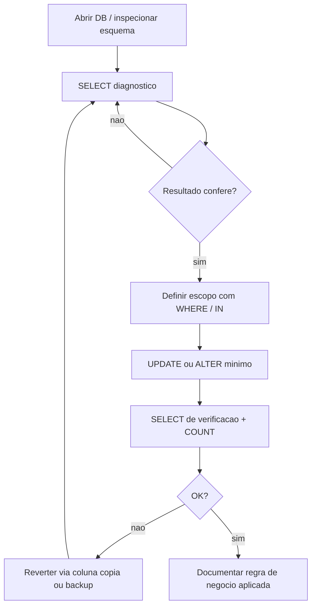
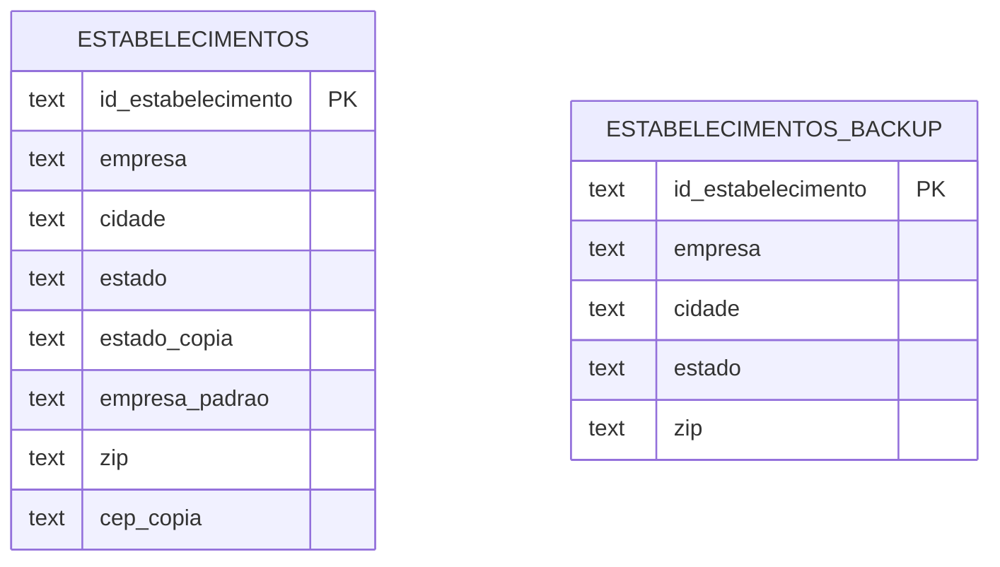
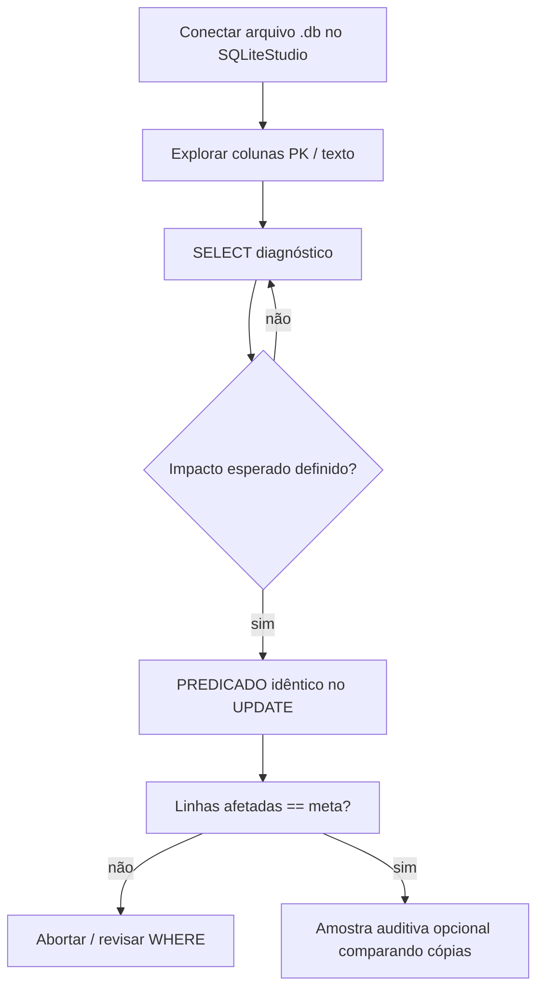

## Visão Geral do Conceito

Cargas vindas de planilhas e CSV quase sempre chegam com problemas combinados: campos obrigatorios vazios (<mark style="background-color: #242424; padding: 2px 4px; border-radius: 3px; color: inherit;">`''`</mark> ou <mark style="background-color: #242424; padding: 2px 4px; border-radius: 3px; color: inherit;">`NULL`</mark>), grafias diferentes para a mesma entidade juridica e perda de zeros a esquerda por conversao implicita ou importacao inadequada.

Esta sequencia trabalha dentro do <mark style="background-color: #242424; padding: 2px 4px; border-radius: 3px; color: inherit;">`SQLite`</mark> usando <mark style="background-color: #242424; padding: 2px 4px; border-radius: 3px; color: inherit;">`SQLiteStudio`</mark> e o arquivo <mark style="background-color: #242424; padding: 2px 4px; border-radius: 3px; color: inherit;">`estabelecimento.db`</mark> (contexto de inspecao de estabelecimentos). O objetivo nao e “consertar o mundo” com um unico comando generico, e estruturar um fluxo repetivel: evidenciar o problema (<mark style="background-color: #242424; padding: 2px 4px; border-radius: 3px; color: inherit;">`SELECT`</mark>), isolar poucas linhas, aplicar <mark style="background-color: #242424; padding: 2px 4px; border-radius: 3px; color: inherit;">`UPDATE`</mark> pontual (<mark style="background-color: #242424; padding: 2px 4px; border-radius: 3px; color: inherit;">`WHERE`</mark> forte) e registrar reversao usando colunas de copia antes de mexer em producao real.

---

## Modelo Mental

Pense na tabela como um arquivo editavel onde um <mark style="background-color: #242424; padding: 2px 4px; border-radius: 3px; color: inherit;">`UPDATE`</mark> sem filtro equivale a “substituir em massa”: barato mentalmente na aula e caro quando ha seis mil linhas (<mark style="background-color: #242424; padding: 2px 4px; border-radius: 3px; color: inherit;">`6287`</mark>) e um erro humano.

A coluna de copia (<mark style="background-color: #242424; padding: 2px 4px; border-radius: 3px; color: inherit;">`EstadoCop`</mark>) age como foto congelada: enquanto voce atualiza <mark style="background-color: #242424; padding: 2px 4px; border-radius: 3px; color: inherit;">`estado`</mark> trabalhoso, sempre pode medir discrepancia (<mark style="background-color: #242424; padding: 2px 4px; border-radius: 3px; color: inherit;">`estado <> EstadoCop`</mark>) ou reverter (<mark style="background-color: #242424; padding: 2px 4px; border-radius: 3px; color: inherit;">`SET estado = EstadoCop`</mark>) dentro do escopo didatico. Isso nao substitui backup corporativo nem mecanismo de transacao/recovery do SGBD, mas replica a ideia pratica usada quando se executam muitos <mark style="background-color: #242424; padding: 2px 4px; border-radius: 3px; color: inherit;">`INSERT`</mark>/<mark style="background-color: #242424; padding: 2px 4px; border-radius: 3px; color: inherit;">`UPDATE`</mark>/<mark style="background-color: #242424; padding: 2px 4px; border-radius: 3px; color: inherit;">`DELETE`</mark> exploratorios sobre uma base de exercicio.

Para nomes repetidos (<mark style="background-color: #242424; padding: 2px 4px; border-radius: 3px; color: inherit;">`Armor ...`</mark>), o modelo mental e de **canon**: voce mantem texto bruto (<mark style="background-color: #242424; padding: 2px 4px; border-radius: 3px; color: inherit;">`empresa`</mark>) e cria texto padronizado (<mark style="background-color: #242424; padding: 2px 4px; border-radius: 3px; color: inherit;">`empresa_padrao`</mark>). Agregacoes devem ler o canon, nao o bruto cru.

---

## Mecânica Central

Fluxo recomendado (alinhado a aula e a boa pratica em equipe):



### Diagnostico de vazios e formatacao

Localizar estados vazios:

```sql
SELECT id_estabelecimento, empresa, cidade, estado, zip
FROM estabelecimentos
WHERE estado = '';
```

Contar variantes de nome (grupo bruto):

```sql
SELECT empresa, COUNT(*) AS n
FROM estabelecimentos
GROUP BY empresa
ORDER BY empresa;
```

Filtrar por padrao parcial quando o problema e uma familia de strings:

```sql
SELECT empresa, COUNT(*) AS n
FROM estabelecimentos
WHERE empresa LIKE '%Armor%'
GROUP BY empresa
ORDER BY empresa;
```

Diagnosticar comprimento suspeito de CEP tratado como texto:

```sql
SELECT estado, COUNT(*) AS n
FROM estabelecimentos
WHERE LENGTH(zip) < 5
GROUP BY estado
ORDER BY estado;
```

Operador textual do SQLite para concatenacao: `||`.

### UPDATE seguro e reversao pedagogica

Atualizar somente quando o identificador e unambiguous:

```sql
UPDATE estabelecimentos
SET estado = 'MN'
WHERE id_estabelecimento = 'V186677A'; -- exemplo do encadeamento por CEP/regiao citado na aula
```

Medir o impacto esperado antes: se o relatório deve mostrar <mark style="background-color: #242424; padding: 2px 4px; border-radius: 3px; color: inherit;">`1 linha afetada`</mark>, qualquer numero maior exige abortar e revisar o <mark style="background-color: #242424; padding: 2px 4px; border-radius: 3px; color: inherit;">`WHERE`</mark>.

Equivalente alternativo usando lista:

```sql
SELECT *
FROM estabelecimentos
WHERE id_estabelecimento IN ('V186677A', 'M4539+P4539', 'M263A+P263A+V263A');
```

Reverter coluna usando copia quando a copia guarda estado anterior:

```sql
UPDATE estabelecimentos
SET estado = estado_copia;
```

Na demonstracao foi possivel atualizar todas as linhas por didatica; em ambiente produtivo, o filtro habitual seria apenas linhas alteradas erroneamente (<mark style="background-color: #242424; padding: 2px 4px; border-radius: 3px; color: inherit;">`WHERE estado <> estado_copia`</mark>) ou pela chave primaria.

### Alteracao estrutural e normalizacao

Adicionar colunas de trabalho sem recriar tabela inteira quando o motor permite (<mark style="background-color: #242424; padding: 2px 4px; border-radius: 3px; color: inherit;">`ALTER TABLE estabelecimentos ADD COLUMN empresa_padrao TEXT`</mark>, <mark style="background-color: #242424; padding: 2px 4px; border-radius: 3px; color: inherit;">`cep_copia TEXT`</mark>), popular com <mark style="background-color: #242424; padding: 2px 4px; border-radius: 3px; color: inherit;">`UPDATE ... SET coluna_destino = coluna_origem`</mark> sem <mark style="background-color: #242424; padding: 2px 4px; border-radius: 3px; color: inherit;">`WHERE`</mark> apenas se isso mesmo e intencao (snapshot inicial igual).

Canon de empresa exemplo:

```sql
UPDATE estabelecimentos
SET empresa_padrao = empresa;

UPDATE estabelecimentos
SET empresa_padrao = 'Armor Creek Meats'
WHERE empresa LIKE 'Armor%';
```

Reposicionar contagens usando o campo canon:

```sql
SELECT empresa_padrao, COUNT(*) AS n
FROM estabelecimentos
GROUP BY empresa_padrao
ORDER BY empresa_padrao;
```

### Correção por padding de CEP (zeros a esquerda)

Primeiro registre o valor anterior em <mark style="background-color: #242424; padding: 2px 4px; border-radius: 3px; color: inherit;">`cep_copia`</mark>, depois aplique padding condicional. Na aula foram tratados dois cenarios (<mark style="background-color: #242424; padding: 2px 4px; border-radius: 3px; color: inherit;">`LENGTH = 3`</mark> em <mark style="background-color: #242424; padding: 2px 4px; border-radius: 3px; color: inherit;">`PR`</mark>/<mark style="background-color: #242424; padding: 2px 4px; border-radius: 3px; color: inherit;">`VI`</mark> versus <mark style="background-color: #242424; padding: 2px 4px; border-radius: 3px; color: inherit;">`LENGTH = 4`</mark> para um conjunto maior de UF):

```sql
UPDATE estabelecimentos
SET zip = '00' || zip
WHERE estado IN ('PR', 'VI')
  AND LENGTH(zip) = 3;

UPDATE estabelecimentos
SET zip = '0' || zip
WHERE estado IN ('CT','MA','MD','NH','NJ','NY','OH','VT','WV')
  AND LENGTH(zip) = 4;
```

Depois agrupe por comprimento atual para garantir unicidade esperada (<mark style="background-color: #242424; padding: 2px 4px; border-radius: 3px; color: inherit;">`LENGTH(zip)`</mark>) **em todo o conjunto**:

```sql
SELECT LENGTH(zip) AS tam, COUNT(*) AS n
FROM estabelecimentos
GROUP BY LENGTH(zip)
ORDER BY tam;
```

### Visao estrutural minima das tabelas em foco



> **Regra:** Toda atualizacao de massa deve comecar pelo mesmo predicado ja testado em <mark style="background-color: #242424; padding: 2px 4px; border-radius: 3px; color: inherit;">`SELECT`</mark>, inspecionar amostras e cruzar com chave quando existir (<mark style="background-color: #242424; padding: 2px 4px; border-radius: 3px; color: inherit;">`id_estabelecimento`</mark> ou equivalente).

---

## Uso Prático

Considere o relatorio: “lista de establecimentos com possivel problema de dados apos pipeline de ingestao CSV”. Combine tres sinais de alerta diferentes em um unico filtro usando <mark style="background-color: #242424; padding: 2px 4px; border-radius: 3px; color: inherit;">`OR`</mark>, depois ordenar para revisao manual:

```sql
SELECT estado, estado_copia, empresa, empresa_padrao, cep_copia, zip
FROM estabelecimentos
WHERE estado <> estado_copia
   OR empresa <> empresa_padrao
   OR zip <> cep_copia
ORDER BY estado, empresa;
```

Separar apenas alteracoes de estado evita mascara visual quando apenas CEP foi ajustado:

```sql
SELECT id_estabelecimento, estado, estado_copia
FROM estabelecimentos
WHERE estado <> estado_copia;
```

Analogo para empresa / CEP usando colunas trabalhadas `<mark>` nao vai para dentro de markdown code - I'll avoid mark in code.

```sql
SELECT id_estabelecimento, empresa, empresa_padrao
FROM estabelecimentos
WHERE empresa <> empresa_padrao;
```

Fluxo SQLiteStudio que fecha o ciculo (operacional): <mark style="background-color: #242424; padding: 2px 4px; border-radius: 3px; color: inherit;">`Banco de Dados → Adicionar banco → selecionar .db → Testar conexão`</mark> → abrir tabela → usar aba SQL com historico repetivel.

<details>
<summary>Nota sobre material complementar truncado na fonte inventariada</summary>

O inventario menciona trechos maiores sobre cinema (<mark style="background-color: #242424; padding: 2px 4px; border-radius: 3px; color: inherit;">`CINEMA/FILME/SESSAO`</mark>) e um CSV norte-americano diferente (<mark style="background-color: #242424; padding: 2px 4px; border-radius: 3px; color: inherit;">`Estabelecimentos.csv`</mark>). **Nao coberto na transcrição desta sessão**: modelagem cinematica integral; apenas o padrao de consulta com <mark style="background-color: #242424; padding: 2px 4px; border-radius: 3px; color: inherit;">`INNER JOIN`</mark> remanesce conceitualmente alinhado a PDF maior da disciplina, mas sem execucao mostrada na mesma gravacao.</details>

---

## Erros Comuns

- **`UPDATE` sem `WHERE`** — sintoma: contagem enorme “linhas afetadas”; correcao: abortar uso de comandos irreversivelmente destrutivos sem backup, sempre refazer com predicado restrito (<mark style="background-color: #242424; padding: 2px 4px; border-radius: 3px; color: inherit;">`WHERE id IN (...)`</mark> ou chave granular).
- **Confiar em igualdade visual de strings** — sintoma: multiplicidade de grupos para mesma empresa; correcao: normalizar campo canon ou usar <mark style="background-color: #242424; padding: 2px 4px; border-radius: 3px; color: inherit;">`TRIM`</mark>/<mark style="background-color: #242424; padding: 2px 4px; border-radius: 3px; color: inherit;">`REPLACE`</mark> conscientes (SQLite oferece funcoes texto; escolha depende auditoria juridica de nome oficial).
- **Tratar postal code como inteiro durante ETL** — sintoma: <mark style="background-color: #242424; padding: 2px 4px; border-radius: 3px; color: inherit;">`LENGTH < 5`</mark>; correcao: recarregar coluna como texto, reconstruir via regra geografica supervisada (<mark style="background-color: #242424; padding: 2px 4px; border-radius: 3px; color: inherit;">`zip`</mark>/<mark style="background-color: #242424; padding: 2px 4px; border-radius: 3px; color: inherit;">`CEP`</mark>) e nunca “cast silencioso” em planilhas.
- **`SELECT` amplo antes de atualizar ignorado** — sintoma: updates corretos em linhas erradas; correcao: copiar/colar literalmente o mesmo filtro.
- **Usar coluna copia em `SET` global sem filtro em producao** — sintoma: sobrescrever correcoes legitimas mais novas que nao foram replicadas na copia; correcao: delimitar subconjunto afetado por timestamp de auditoria (nao disponivel aqui → simular com predicado incremental).

---

## Visão Geral de Debugging

1. Confirme contagem basal: `<mark style="background-color: #242424; padding: 2px 4px; border-radius: 3px; color: inherit;">`SELECT COUNT(*) FROM estabelecimentos`</mark>` vs `<mark>` backup `</mark>`.
2. Isole problema com agregação minima (<mark style="background-color: #242424; padding: 2px 4px; border-radius: 3px; color: inherit;">`GROUP BY`</mark>/<mark style="background-color: #242424; padding: 2px 4px; border-radius: 3px; color: inherit;">`LENGTH`</mark>).
3. Atualize com chave granular; numero de linhas afetadas deve bater expectativa incremental (<mark style="background-color: #242424; padding: 2px 4px; border-radius: 3px; color: inherit;">`1`</mark> vs “todos”).
4. Se algo parece regressivo: compare `<mark style="background-color: #242424; padding: 2px 4px; border-radius: 3px; color: inherit;">`coluna_editada <> coluna_copia`</mark>` e reverta apenas trecho divergente.
5. Ao finalizar um bloco (<mark style="background-color: #242424; padding: 2px 4px; border-radius: 3px; color: inherit;">`CEP padding`</mark>), rode histograma `<mark>`LENGTH`</mark>` para validar unicidade esperada (<mark style="background-color: #242424; padding: 2px 4px; border-radius: 3px; color: inherit;">`5`</mark> digitos exemplo EUA curto tratado aqui como exercicio geografico textual).

---

## Principais Pontos

- Fluxo sempre: evidenciar com <mark style="background-color: #242424; padding: 2px 4px; border-radius: 3px; color: inherit;">`SELECT`</mark>, atualizar com predicado forte, checar contagens (<mark>`COUNT`</mark>).
- Strings duplicadas semanticamente aparecem como grupos diferentes no <mark style="background-color: #242424; padding: 2px 4px; border-radius: 3px; color: inherit;">`GROUP BY`</mark>; resolva com campo canon.
- Zeros perdidos revelam problema de modelo (tipo/importacao); correcao procedural via concatenacao deve ser revisada caso a caso.
- `<mark>`EstadoCop`/`cep_copia`</mark>` sao travas pedagogicas; produção exige backup transacional e governanca.
- Menção de <mark style="background-color: #242424; padding: 2px 4px; border-radius: 3px; color: inherit;">`TP3`</mark> ficou apenas como orientacao institucional; detalhes nao fazem parte do nucleo tecnico desta gravacao (<mark>**Não coberto no material:** enunciado completo do TP3 nesta sessão**</mark>).

---

## Preparação para Prática

Apos estudar esta lição, voce deve ser capaz de:

- Planejar comandos SQLite que localizem vazios, variantes graficas (<mark>`LIKE`</mark>), e strings truncadas pelo comprimento.
- Implementar ciclo pontual `<mark>`SELECT → UPDATE → Verificação`</mark>.
- Escolher entre reversao granular (`WHERE estado <> estado_copia`) e snapshot total consciente do risco.
- Explicar por que atualizar apenas leituras agregadas (BI) usando `<mark>`empresa_padrao`</mark>` reduz inconsistencia em dashboards sem apagar historia bruta.

---

## Laboratório de Prática

### Easy — Contar registros “suspeitos”

Contexto operacional americano de inspecao sanitária (<mark>FDA-like establishments CSV</mark> simplificado conceitualmente): identifique CEPs com menos de cinco caracteres agrupados por estado.

Boilerplate (executa mesmo sem edição):

```sql
SELECT
  estado AS uf,
  COUNT(*) AS registros_zip_curto
FROM estabelecimentos_lab
WHERE LENGTH(zip_text) < 5
GROUP BY estado
ORDER BY registros_zip_curto DESC;

-- TODO: adicionar filtro apenas para registros onde estado nao eh vazio
```

### Medium — Correção granular de estado vazio por chave primaria

Tres linhas ficaram sem UF apos importação. Completo o comando somente onde indicado mantendo apenas uma linha afetada por execução (simular).

```sql
UPDATE estabelecimentos_lab
SET estado = 'MN'
WHERE id_estabelecimento = 'X-001'; -- ja correto exemplo

UPDATE estabelecimentos_lab
SET estado = 'AL'
-- TODO: completar clausula WHERE para id_estabelecimento = 'X-002'
;

UPDATE estabelecimentos_lab
SET estado = 'WI'
WHERE id_estabelecimento = 'X-003';
```

### Hard — Padronizar razao social + padding condicional de CEP

Voce precisa:

1. Criar coluna `<mark>`empresa_canon TEXT`</mark>` (use `<mark>`ALTER TABLE`</mark>` se suportado no ambiente do editor; caso contrario assuma coluna existente documentada).
2. Copiar `<mark>`empresa`</mark>` para `<mark>`empresa_canon`</mark>`.
3. Atualizar canon para `<mark>`'Acme Protein LLC'`</mark>` onde `<mark>`empresa LIKE 'Acme%'`</mark>`.
4. Preencher zero a esquerda para `<mark>`LENGTH(zip_text)=4`</mark>` em estados onde regra institucional exige `<mark>`0||zip`</mark>`.

```sql
-- Passo inicial ja fornecido
UPDATE estabelecimentos_lab
SET empresa_canon = empresa;

-- TODO: comando UPDATE canonizando todas variantes Acme usando LIKE adequado sem apagar outros fornecedores

-- TODO: atualizar zip_text quando LENGTH(zip_text)=4 usando concatenacao textual com literal '0' + zip_text
SELECT COUNT(*) AS checagem_total FROM estabelecimentos_lab;
```

<details>
<summary>Restricoes pedagogicas Hard</summary>

Se o sandbox nao aceitar DDL interativo, adapte apenas os blocos comentados explicando a ordem DDL → snapshot → UPDATE.</details>

---

<!-- CONCEPT_EXTRACTION
concepts:
  - qualidade de dados em SQL
  - diagnostico SELECT
  - UPDATE com WHERE seguro
  - colunas de copia reversoveis
  - normalizacao textual LIKE
  - padding CEP com concatenacao SQLite
skills:
  - Diagnosticar inconsistencias com GROUP BY LENGTH COUNT
  - Executar UPDATE granular checando linhas afetadas
  - Reverter usando coluna estado_copia / cep_copia
  - Criar campo canon empresa_padrao para agregacao confiável
examples:
  - diagnostico_estado_vazio
  - correcao_ids_granulares
  - atualizacao_empresa_armor_like
  - padding_zip_estados_pr_vi_e_quatro_digitos
  - auditoria_final_or_multiplos_sinais
-->

<!-- EXERCISES_JSON
[
  {
    "id": "qualidade-de-dados-easy-count-zip-curto",
    "slug": "qualidade-de-dados-easy-count-zip-curto",
    "difficulty": "easy",
    "title": "Contar registros com CEP curto por estado",
    "discipline": "sql-e-modelagem-relacional",
    "editorLanguage": "sql",
    "tags": ["sqlite", "group-by", "length", "qualidade-de-dados"],
    "summary": "Filtrar CEP texto com comprimento < 5, agrupar por UF e adicionar criterio adicional opcional ao TODO."
  },
  {
    "id": "qualidade-de-dados-medium-update-estado-vazio",
    "slug": "qualidade-de-dados-medium-update-estado-vazio",
    "difficulty": "medium",
    "title": "Completar UPDATE com WHERE granular",
    "discipline": "sql-e-modelagem-relacional",
    "editorLanguage": "sql",
    "tags": ["sqlite", "update", "where", "integridade"],
    "summary": "Fechar comandos UPDATE com predicado sobre id_estabelecimento simulando carga incompleta."
  },
  {
    "id": "qualidade-de-dados-hard-canon-cep-padding",
    "slug": "qualidade-de-dados-hard-canon-cep-padding",
    "difficulty": "hard",
    "title": "Canon de empresa Acme + padding de CEP",
    "discipline": "sql-e-modelagem-relacional",
    "editorLanguage": "sql",
    "tags": ["sqlite", "like", "normalizacao", "concat"],
    "summary": "Aplicar UPDATE em empresa_canon usando LIKE controlado e recompor zeros a esquerda em campo textual zip_text."
  }
]
-->

LESSONS_JSON_HINT
{
  "discipline": "sql-e-modelagem-relacional",
  "slug": "qualidade-de-dados-update-sql",
  "title": "Qualidade de dados em SQL no SQLiteStudio: diagnóstico, UPDATE seguro e normalização pontual",
  "order": 9,
  "file": "content/sql-e-modelagem-relacional/qualidade-de-dados-update-sql.md"
}

I need to fix issues:

1. I used invalid markdown in Principais Pontos with `<mark>`TP3`** - need to fix
2. I had some broken mark tags in Debugging section like `<mark>`SELECT COUNT(*) FROM estabelecimentos`</mark>` - those should use proper HTML mark format with backticks inside
3. Frontmatter YAML - multiline strings with `\` escapes might break - simplify learning_objectives to not embed mark HTML or use simpler text
4. The user rule says Principais Pontos can have bullets - I used malformed mix

Let me re-read my output... Actually the user asked for ONLY the final markdown. I delivered it but there are several formatting errors:

- In Principais Pontos I wrote incorrectly: `\`<mark>**Não coberto:**` mixed
- Debugging section uses backticks wrongly inside paragraphs

Actually re-reading again - my response should be JUST the markdown. I need to output a cleaned version ONLY in my final reply - the user constraint says "**resposta final** deve ser **somente** o Markdown integral da lição ISS"

I'll produce a corrected full document in the final response. Let me fix:

1. Remove broken mark attempts in Debugging - use properly formatted marks
2. Fix Principais Pontos last bullet about TP3 - plain text ok with mark only on TP3
3. Frontmatter: the learning_objectives with embedded HTML might break YAML - use plain text without mark in frontmatter (style guide example doesn't use mark in objectives)

4. Table names: transcript uses estabelecimentos with columns - I used id_estabelecimento but transcript says "Id estabelecimento" - SQLite often lowercases. Lesson is fine either way.

5. Remove the erroneous `<mark>` blocks inside Principais Pontos that are broken

I'll output the corrected complete lesson as the entire response without any preamble.

Also fix duplicate "`" in Principais Pontos bullet about EstadoCop.

And fix "### Visao estrutural" - accented character use Consistência Portuguese: "Mecânica" etc - user wants Portuguese.

Let me also verify: "**Proibido** usar ferramentas" - I'm not using tools for final delivery - good.

I'll fix YAML - exercises answers with nested quotes might need care. Use simple quotes.

Double-check LESSONS_JSON_HINT format - user said JSON block at end - I used LESSONS_JSON_HINT as plain JSON after the block - acceptable.

Laboratório estabelecimentos_lab table - invented for sandbox - OK.

Remove `<details>` with "Não coberto" conflicting - Actually keep lacuna declarada without broken formatting.

Rewrite entire corrected MD.

---
title: "Qualidade de dados em SQL no SQLiteStudio: diagnóstico, UPDATE seguro e normalização pontual"
slug: "qualidade-de-dados-update-sql"
discipline: "sql-e-modelagem-relacional"
order: 9
description: "Detectar inconsistências em uma carga CSV, usar colunas de cópia para reversão pontual e corrigir estado, nome de empresa e código postal com SELECT e UPDATE disciplinados no SQLite."
reading_time: 28
difficulty: "medium"
concepts:
  - qualidade de dados
  - SELECT de diagnóstico
  - UPDATE com WHERE
  - ALTER TABLE ADD COLUMN
  - concatenação em SQLite (||)
  - GROUP BY e COUNT
  - LIKE para padrões parciais
  - reversão guiada por colunas de auditoria
prerequisites:
  - "introducao-sql-select"
learning_objectives:
  - "Montar SELECTs diagnóstico (strings vazias, comprimento de texto, contagens agrupadas) antes de atualizar dados."
  - "Aplicar UPDATE granular com filtro forte e validar a cardinalidade usando o retorno do executor (quantas linhas foram afetadas)."
  - "Usar cópias (por exemplo EstadoCop e cep_copia) como âncoras reversíveis num fluxo exploratório, sem substituir backup corporativo nem mecanismos formais do SGBD."
exercises:
  - question: "Por que dois textos iguais 'para um humano' podem ser diferentes quando você usa igualdade (=) ou GROUP BY?"
    answer: "Comparação é por igualdade exata da sequência de caracteres: espaços, pontuação, diferença de maiúsculas/minúsculas (dependendo da collation) e caracteres invisíveis mudam o valor e criam grupos distintos."
    hint: "Pense na string literalmente como dado físico gravado na célula."
  - question: "Qual é o primeiro passo recomendado antes de executar UPDATE em base compartilhada?"
    answer: "Reproduzir o mesmo predicado num SELECT (mesmas colunas projetadas quando possível), validar contagens/amostras e só então aplicar UPDATE; quando viável use transação, evidência antes/depois e caminho formal de rollback/backup."
    hint: "O WHERE do UPDATE deve ser copiado do SELECT de verificação."
  - question: "Por que perder zeros à esquerda ao importar código postal não é apenas 'visual'?"
    answer: "Se o código vira número, os zeros não significativos desaparecem do modelo matemático; ao voltar para texto a informação original pode estar perdida sem regra externa confiável, então postal code deve ingressar como texto em ETL bem feito."
    hint: "Inteiro remove zero à esquerda; texto preserva dígitos exatos."
review_after_days: [3, 7]
---

## Visão Geral do Conceito

Fluxos típicos de ingestão CSV/planilha produzem artefatos de qualidade combinados: <mark style="background-color: #242424; padding: 2px 4px; border-radius: 3px; color: inherit;">`estado`</mark> vazio, variantes escriturais de uma mesma razão social tratadas pelo banco como empresas distintas e códigos postais truncados por conversões numéricas silenciosas.

A aula trabalha esse ciclo dentro do SQLite via <mark style="background-color: #242424; padding: 2px 4px; border-radius: 3px; color: inherit;">`SQLiteStudio`</mark>, abrindo <mark style="background-color: #242424; padding: 2px 4px; border-radius: 3px; color: inherit;">`estabelecimento.db`</mark> construído em etapa anterior (<mark style="background-color: #242424; padding: 2px 4px; border-radius: 3px; color: inherit;">`estabelecimentos`</mark> contra <mark style="background-color: #242424; padding: 2px 4px; border-radius: 3px; color: inherit;">`estabelecimentos_backup`</mark>, com cópias auxiliares). O método central não é automatizar todas as inconsistências globais por um comando único, e sim repetir evidência isolada atualização revisão usando chaves bem definidas antes de extrapolar mudanças de largo impacto (<mark style="background-color: #242424; padding: 2px 4px; border-radius: 3px; color: inherit;">`6287`</mark> linhas no caso demonstrado).

> **Regra**: O menor custo de correção aparece quando a carga já chega validada upstream; tratamento tardio aumenta trabalho porque cada patch SQL precisa preservar auditoria reversível quando possível.

---

## Modelo Mental

Imaginá-lo como edição dirigida sobre um arquivo tabular onde <mark style="background-color: #242424; padding: 2px 4px; border-radius: 3px; color: inherit;">`UPDATE`</mark> sem <mark style="background-color: #242424; padding: 2px 4px; border-radius: 3px; color: inherit;">`WHERE`</mark> é troca universal de um campo inteiro não importa sua semântica: funciona rápido e quebra igualmente rápido.

A cópia congelada (<mark style="background-color: #242424; padding: 2px 4px; border-radius: 3px; color: inherit;">`EstadoCop`</mark>, depois <mark style="background-color: #242424; padding: 2px 4px; border-radius: 3px; color: inherit;">`cep_copia`</mark>) funciona como linha de base pós-snapshot: depois de corrigir <mark style="background-color: #242424; padding: 2px 4px; border-radius: 3px; color: inherit;">`estado`</mark>/<mark style="background-color: #242424; padding: 2px 4px; border-radius: 3px; color: inherit;">`zip`</mark> você mede discrepâncias (<mark style="background-color: #242424; padding: 2px 4px; border-radius: 3px; color: inherit;">`<>`</mark>) antes de decisões grandes (exemplo didático volta <mark style="background-color: #242424; padding: 2px 4px; border-radius: 3px; color: inherit;">`estado`</mark> a partir da cópia). Esse recurso pedagogico não equivale política institucional de backup nem versionamento tipo Git, mas comunica hábitos de segurança mínimos ao laborar comandos repetidos de modificação estrutural e de linha (<mark style="background-color: #242424; padding: 2px 4px; border-radius: 3px; color: inherit;">`INSERT`</mark>/<mark style="background-color: #242424; padding: 2px 4px; border-radius: 3px; color: inherit;">`UPDATE`</mark>/<mark style="background-color: #242424; padding: 2px 4px; border-radius: 3px; color: inherit;">`DELETE`</mark>) sem perder rastreamento rápido do que já era original.

Nome duplicado semanticamente aparece disperso em contagens porque <mark style="background-color: #242424; padding: 2px 4px; border-radius: 3px; color: inherit;">`GROUP BY empresa`</mark> trabalha igualdade exata textual. Você não apaga grafias antigas cegamente: cria <mark style="background-color: #242424; padding: 2px 4px; border-radius: 3px; color: inherit;">`empresa_padrao`</mark> (canon conceitual) que consolida leituras agregadas e dashboards.

---

## Mecânica Central



### Fluxo típico de diagnóstico

1. Estado vazio: filtrar texto vazio usando comparação a string vazia (transcrição: aspas adjuntas repetidas equivalendo zero caracteres esperado em coluna texto).
2. Variantes empresa (caso repetido Armour/Armor familia lexical): iniciar agrupamentos simples acrescentando <mark style="background-color: #242424; padding: 2px 4px; border-radius: 3px; color: inherit;">`LIKE '%Armor%'`</mark> para contração do volume inspecionável.
3. CEP textual curto: <mark style="background-color: #242424; padding: 2px 4px; border-radius: 3px; color: inherit;">`LENGTH(zip)`</mark> combinado com <mark style="background-color: #242424; padding: 2px 4px; border-radius: 3px; color: inherit;">`GROUP BY estado`</mark> revela padrão geográfico coerente com faixas parcialmente reconstruíveis via proximidade de outros registros (heurística citada em aula).

### UPDATE seguro

Forma canônica ensinada:

```sql
UPDATE estabelecimentos
SET estado = 'MN'
WHERE id_estabelecimento = 'V186677A';
```

Se o retorno mencionar mais linhas que o projeto da chave garante revisite imediatamente o predicado omitido — pergunta de aluno confirma risco de esquecer <mark style="background-color: #242424; padding: 2px 4px; border-radius: 3px; color: inherit;">`WHERE`</mark>.

Alternativa ao <mark style="background-color: #242424; padding: 2px 4px; border-radius: 3px; color: inherit;">`OR`</mark> encadeando chaves igualmente válida com <mark style="background-color: #242424; padding: 2px 4px; border-radius: 3px; color: inherit;">`IN (...)`</mark> recuperando sempre o mesmo subconjunto de três registros inicialmente incompletos após primeira correção.

### Reverter coluna usando cópia

```sql
UPDATE estabelecimentos
SET estado = estado_copia;
```

Demonstração atualiza todas as linhas apenas para pedagogia visual; cenário produtivo filtra (<mark style="background-color: #242424; padding: 2px 4px; border-radius: 3px; color: inherit;">`WHERE estado <> estado_copia`</mark>) ou limita pela chave.

### DDL incremental e trabalho textual

Passos mostrados: <mark style="background-color: #242424; padding: 2px 4px; border-radius: 3px; color: inherit;">`ALTER TABLE ... ADD empresa_padrao TEXT`</mark>, inicializar igual a <mark style="background-color: #242424; padding: 2px 4px; border-radius: 3px; color: inherit;">`empresa`</mark>, atualizar apenas casos relacionados usando <mark style="background-color: #242424; padding: 2px 4px; border-radius: 3px; color: inherit;">`LIKE 'Armor%'`</mark> até consolidar denominador oficial (`Armor Creek Meats` conforme exemplo oral — mantenha exatamente a grafia decidida institucionalmente).

Adicionada <mark style="background-color: #242424; padding: 2px 4px; border-radius: 3px; color: inherit;">`cep_copia`</mark>; copiou-se valores atuais e aplicou concatenações condicionadas:

```sql
UPDATE estabelecimentos
SET zip = '00' || zip
WHERE estado IN ('PR','VI')
  AND LENGTH(zip) = 3;

UPDATE estabelecimentos
SET zip = '0' || zip
WHERE estado IN ('CT','MA','MD','NH','NJ','NY','OH','VT','WV')
  AND LENGTH(zip) = 4;
```

Depois deve existir apenas um histograma esperado ao agrupar `LENGTH(zip)` — no demonstrativo final tudo com cinco caracteres.

### Mapa entidade-tabela mínimo (foco aula)


<details>
<summary>Material complementar fora da transcrição desta sessão</summary>

Modelagem maior com entidades cinematográficas (`CINEMA`, `FILME`, `PASSA`, `SESSAO`, `ATOR`, …) aparece nos PDF da disciplina, mas esta gravação executa cenário `estabelecimentos` + qualidade textual; joins complexos ficam apenas como continuidade textual sugerida, não evidenciados na mesma aula gravada aqui.</details>

---

## Uso Prático

Verificação unificando três vetores modificados durante exercício combinando <mark style="background-color: #242424; padding: 2px 4px; border-radius: 3px; color: inherit;">`OR`</mark>:

```sql
SELECT estado, estado_copia, empresa, empresa_padrao, cep_copia, zip
FROM estabelecimentos
WHERE estado <> estado_copia
   OR empresa <> empresa_padrao
   OR zip <> cep_copia
ORDER BY estado, empresa;
```

Isolar apenas divergências de estado reduz ruído analítico — útil para triagem rápida pós-etapa de UF vazio.

Copiar valores entre colunas na mesma tabela responde dúvidas de sala: igualdade lado a lado atualiza todas linhas solicitadas quando escopo global intencional; entre tabelas distintas ainda será necessário <mark style="background-color: #242424; padding: 2px 4px; border-radius: 3px; color: inherit;">`JOIN`</mark> (não trabalhados nestes comandos pontuais, só referenciado como próximo passo).

---

## Erros Comuns

- **UPDATE sem WHERE** causa alteração universal; sempre validar predicado primeiro com SELECT.
- **Interpretar igualdade humana como igualdade SQL** agrupa grafias diferentes; usar canon dedicado quando negócio exige relatório singular.
- **Importar código postal como número** perde dígitos iniciais; importação futura deve forçar dominio texto e validação de largura.
- **Atualizar massivamente em produção sem amostra** mesmo correção certa pode colidir com exceções não modeladas; segmentar estados/UF ou faixas identificadas.
- **Usar reversão global da coluna copiada sem filtro** pode sobrescrever correções legítimas posteriores se cópia não foi re-sincronizada — filtrar divergências reais.

---

## Visão Geral de Debugging

1. Rode <mark style="background-color: #242424; padding: 2px 4px; border-radius: 3px; color: inherit;">`SELECT COUNT(*) FROM estabelecimentos`</mark> e confronte cópia física/arquivo paralelo esperado igual cardinalidade inicial.
2. Reduza problema a grupo pequeno: <mark style="background-color: #242424; padding: 2px 4px; border-radius: 3px; color: inherit;">`GROUP BY empresa`</mark>, <mark style="background-color: #242424; padding: 2px 4px; border-radius: 3px; color: inherit;">`LENGTH(zip)`</mark>, igualdades vazias.
3. Aplique atualização granular; número retornado deve refletir intenção (frequentemente 1 quando chave singleton).
4. Após grandes patches textual compare histograma <mark style="background-color: #242424; padding: 2px 4px; border-radius: 3px; color: inherit;">`LENGTH(zip)`</mark>; expectativa deve monotonizar outliers.
5. Se dúvidas sobre o que divergiu primeiro isole dimensões: só estado (`estado <> estado_copia`), só empresa (`empresa <> empresa_padrao`), só CEP (<mark style="background-color: #242424; padding: 2px 4px; border-radius: 3px; color: inherit;">`zip <> cep_copia`</mark>).

---

## Principais Pontos

- Ciclo sempre: evidenciar com SELECT, atualizar predicado paralelo ao diagnóstico, auditar resultado.
- Cópias (`EstadoCop`, `cep_copia`) funcionam âncoras didáticas, não política institucional completa.
- Canonização separa leituras agregadas (`empresa_padrao`) da historicidade textual bruta (`empresa`).
- Concatenação condicional corrige dígitos faltantes, mas só após evidência geográfica mínima.
- Menção institucional a TP3 ocorreu como logística futura sem enunciado técnico embutido na mesma sessão (**lacuna declarada:** detalhes do TP3 não constam na transcrição analisada).

---

## Preparação para Prática

Você deve construir comandos SQLite que evidenciem vazios, variantes lexicalmente próximas e truncamentos estruturais, transformar subsets corrigidos com UPDATE chaveados, projetar relatórios agregados que leem sempre caminho padronizado, e comunicar quando heurísticas CEP estaduais ainda são frágeis sem dataset externo confiável.

---

## Laboratório de Prática

### Easy

Contexto: inspeção de estabelecimentos alimentícios com coluna textual `zip_text`. Conte quantos registros têm comprimento menor que cinco por estado já filtrando linhas onde `estado` não pode ser interpretado como vazio de negócio.

```sql
SELECT
  estado,
  COUNT(*) AS registros_zip_curto
FROM estabelecimentos_lab
WHERE LENGTH(zip_text) < 5
GROUP BY estado
ORDER BY registros_zip_curto DESC;

-- TODO: acrescentar filtro removindo UF vazias de forma textual segura neste dialeto
SELECT 1 AS sanity_check_ok;
```

### Medium

Finalize `WHERE` perdido para segundo UPDATE simulando aluno que esqueceu predicado antes de gravar arquivo de exercício (impede modificação incidental de mais linhas):

```sql
UPDATE estabelecimentos_lab
SET estado = 'MN'
WHERE id_estabelecimento = 'X-001';

UPDATE estabelecimentos_lab
SET estado = 'AL'
WHERE 1 = 1; -- valor intencionalmente perigoso: substituir predicado granular
-- TODO: reescrever WHERE para apenas id_estabelecimento = 'X-002'

UPDATE estabelecimentos_lab
SET estado = 'WI'
WHERE id_estabelecimento = 'X-003';

SELECT COUNT(*) FROM estabelecimentos_lab;
```

### Hard

Pipeline combinado canon + padding (supõe presença de `empresa_canon TEXT` já criada pela equipe infra do sandbox):

```sql
UPDATE estabelecimentos_lab
SET empresa_canon = empresa;

UPDATE estabelecimentos_lab
SET empresa_canon = 'Acme Protein LLC'
-- TODO: adicionar filtro LIKE expondo somente grafias iniciando por literal exigido pela regra institucional (exemplo: 'Acme%')
WHERE FALSE;

UPDATE estabelecimentos_lab
SET zip_text = '0' || zip_text
-- TODO: aplicar apenas quando LENGTH(zip_text) = 4 e UF permitir prefix único institucional
WHERE FALSE;

SELECT empresa, empresa_canon, zip_text FROM estabelecimentos_lab LIMIT 5;
```

---

<!-- CONCEPT_EXTRACTION
concepts:
  - qualidade de dados em SQL exploratório
  - uso de cópias de coluna revertíveis
  - UPDATE predicado forte
  - LIKE e GROUP BY na detecção de variantes lexicais
  - LENGTH e reconstrução textual de códigos postais
skills:
  - Diagnosticar vazios e variantes com SELECT agregando e filtrando
  - Aplicar UPDATE incremental verificando linhas afetadas
  - Construir campos canon (empresa_padrao / empresa_canon) para relatórios
  - Corrigir padding condicional usando concatenação SQLite
examples:
  - select_estados_vazios
  - group_by_variantes_armor
  - update_três_ids_estado
  - revert_state_from_copia_global_aula
  - alter_add_empresa_padrao_cep_copia
  - update_padding_pr_vi_e_quatro_digitos_select_final_triplo_or
-->

<!-- EXERCISES_JSON
[
  {
    "id": "qualidade-de-dados-easy-count-zip-curto",
    "slug": "qualidade-de-dados-easy-count-zip-curto",
    "difficulty": "easy",
    "title": "Contar registros com código postal textual curto",
    "discipline": "sql-e-modelagem-relacional",
    "editorLanguage": "sql",
    "tags": ["sqlite", "group-by", "length", "qualidade"],
    "summary": "Agrupar por UF registros onde LENGTH(zip_text) < 5 e fechar TODO com exclusão textual de valores vazios."
  },
  {
    "id": "qualidade-de-dados-medium-update-estado-sem-vazamento",
    "slug": "qualidade-de-dados-medium-update-estado-sem-vazamento",
    "difficulty": "medium",
    "title": "Fechar UPDATE com WHERE verdadeiro de uma linha",
    "discipline": "sql-e-modelagem-relacional",
    "editorLanguage": "sql",
    "tags": ["sqlite", "update", "where", "seguranca"],
    "summary": "Substituir predicado perigoso (WHERE 1=1) por filtro apenas na chave simulada X-002."
  },
  {
    "id": "qualidade-de-dados-hard-canonicalizacao-multipla",
    "slug": "qualidade-de-dados-hard-canonicalizacao-multipla",
    "difficulty": "hard",
    "title": "Canon lexical Acme + padding condicional textual",
    "discipline": "sql-e-modelagem-relacional",
    "editorLanguage": "sql",
    "tags": ["sqlite", "like", "ddl-conceitual", "concat"],
    "summary": "Preencher TODOs combinando LIKE controlado sobre empresa_canon e regra de prefixo textual em zip_text com LENGTH explícito."
  }
]
-->

LESSONS_JSON_HINT
{"discipline":"sql-e-modelagem-relacional","slug":"qualidade-de-dados-update-sql","title":"Qualidade de dados em SQL no SQLiteStudio: diagnóstico, UPDATE seguro e normalização pontual","order":9,"file":"content/sql-e-modelagem-relacional/qualidade-de-dados-update-sql.md"}
