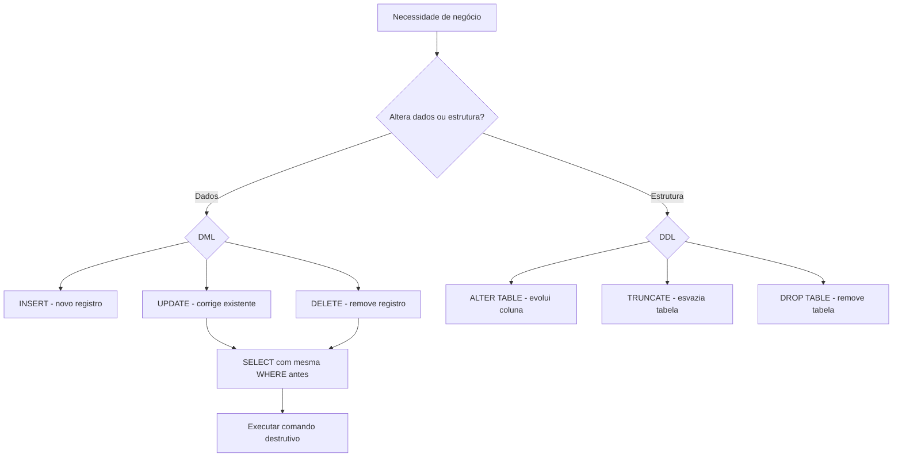
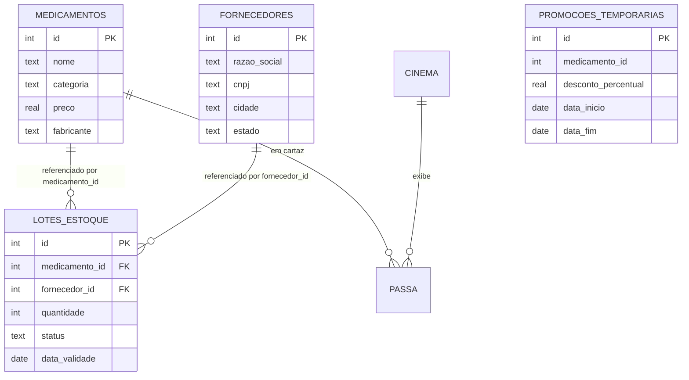
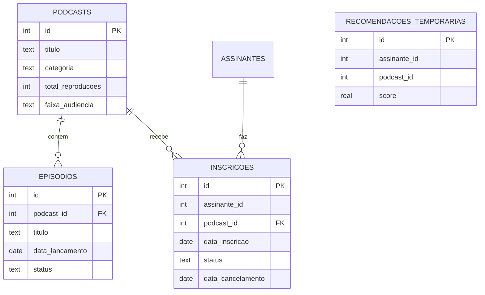
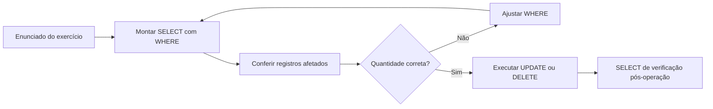

## Visão Geral do Conceito

Até aqui na trilha de SQL e Modelagem Relacional, o foco principal foi **ler** dados com <mark style="background-color: #242424; padding: 2px 4px; border-radius: 3px; color: inherit;">`SELECT`</mark>. Em produção, porém, bancos operacionais (OLTP) existem para **manter** dados corretos ao longo do tempo: cadastrar novos registros, corrigir erros, aplicar reajustes em massa e evoluir a estrutura quando regras de negócio mudam.

Essa lição cobre o ciclo completo de **manipulação de dados** (DML) e **definição de estrutura** (DDL) em cenários reais — uma rede de farmácias (Sistema A) e uma plataforma de podcasts (Sistema B), como no TP3 da disciplina. O ambiente de execução é o **Deep Note** com **DuckDB**, não SQLite: sintaxe de datas e funções como <mark style="background-color: #242424; padding: 2px 4px; border-radius: 3px; color: inherit;">`CURRENT_DATE`</mark> e <mark style="background-color: #242424; padding: 2px 4px; border-radius: 3px; color: inherit;">`INTERVAL`</mark> devem ser consultadas para DuckDB especificamente.

> **Regra:** Toda operação que altera ou remove dados deve ser precedida de um <mark style="background-color: #242424; padding: 2px 4px; border-radius: 3px; color: inherit;">`SELECT`</mark> equivalente com a mesma cláusula <mark style="background-color: #242424; padding: 2px 4px; border-radius: 3px; color: inherit;">`WHERE`</mark>.

---

## Modelo Mental

Pense no banco de dados como um **armazém com prateleiras rotuladas** (tabelas) e caixas identificadas (registros):

- **INSERT** coloca caixas novas na prateleira — respeitando regras de endereçamento (chaves primárias e estrangeiras).
- **UPDATE** troca o conteúdo de caixas existentes — sem mover a caixa de lugar, apenas alterando campos.
- **DELETE** retira caixas específicas — irreversível na maioria dos ambientes de produção.
- **ALTER TABLE** reforma a prateleira (nova coluna, novo tipo) sem destruir a prateleira inteira.
- **TRUNCATE** esvazia a prateleira, mas a prateleira continua lá — pronta para receber nova carga.
- **DROP TABLE** demole a prateleira — estrutura e dados somem do catálogo.

Quando uma caixa filha referencia uma caixa mãe que não existe, o SGBD **bloqueia** a operação. Esse mecanismo é a **integridade referencial** via <mark style="background-color: #242424; padding: 2px 4px; border-radius: 3px; color: inherit;">`FOREIGN KEY`</mark>.



---

## Mecânica Central

### DML — Data Manipulation Language

| Comando | Função | Cuidado principal |
|---------|--------|-------------------|
| <mark style="background-color: #242424; padding: 2px 4px; border-radius: 3px; color: inherit;">`INSERT INTO`</mark> | Insere um ou vários registros | FKs devem apontar para PKs existentes; IDs auto-incrementados podem ser omitidos |
| <mark style="background-color: #242424; padding: 2px 4px; border-radius: 3px; color: inherit;">`UPDATE`</mark> | Modifica colunas de registros existentes | Sem <mark style="background-color: #242424; padding: 2px 4px; border-radius: 3px; color: inherit;">`WHERE`</mark>, altera **toda** a tabela |
| <mark style="background-color: #242424; padding: 2px 4px; border-radius: 3px; color: inherit;">`DELETE`</mark> | Remove registros | Irreversível; sempre filtrar com precisão |

#### INSERT — registro único, múltiplos registros e colunas omitidas

Quando o identificador é **gerenciado automaticamente** pelo banco, você lista apenas as colunas que possui valor:

```sql
INSERT INTO medicamentos (nome, categoria, preco, fabricante)
VALUES ('Analgésico LabVida 500mg', 'Analgésico', 12.90, 'LabVida');
```

Um único comando pode inserir **vários registros** delimitados por tuplas entre parênteses:

```sql
INSERT INTO episodios (podcast_id, titulo, data_lancamento, status)
VALUES
  (12, 'Ep. 01 — Introdução', '2026-05-20', 'rascunho'),
  (12, 'Ep. 02 — Biodiversidade', '2026-05-21', 'rascunho'),
  (12, 'Ep. 03 — Conservação', '2026-05-22', 'rascunho'),
  (12, 'Ep. 04 — Encerramento', '2026-05-23', 'rascunho');
```

#### UPDATE — reajuste relativo e condições compostas

Reajuste de **5 unidades monetárias** sobre o valor atual (não confundir com 5%):

```sql
UPDATE medicamentos
SET preco = preco + 5
WHERE categoria = 'Genérico';
```

Atualização de status com múltiplas condições (lotes vencidos ainda ativos):

```sql
UPDATE lotes_estoque
SET status = 'vencido'
WHERE status = 'ativo'
  AND data_validade < CURRENT_DATE;
```

Lotes com status <mark style="background-color: #242424; padding: 2px 4px; border-radius: 3px; color: inherit;">`'recolhido'`</mark> ou <mark style="background-color: #242424; padding: 2px 4px; border-radius: 3px; color: inherit;">`'devolvido'`</mark> **não** entram no filtro, mesmo que a validade tenha passado.

#### DELETE — remoção cirúrgica

Remover fornecedor duplicado sem afetar o original:

```sql
DELETE FROM fornecedores
WHERE id = 17;
```

O registro de <mark style="background-color: #242424; padding: 2px 4px; border-radius: 3px; color: inherit;">`id = 17`</mark> (Distribuição Pharma Ltda duplicata) pode ser removido com segurança porque não está vinculado a nenhum lote; o registro de <mark style="background-color: #242424; padding: 2px 4px; border-radius: 3px; color: inherit;">`id = 1`</mark> permanece intacto.

### DDL — Data Definition Language

| Comando | Efeito | Quando usar |
|---------|--------|-------------|
| <mark style="background-color: #242424; padding: 2px 4px; border-radius: 3px; color: inherit;">`ALTER TABLE ... ADD COLUMN`</mark> | Adiciona coluna à tabela existente | Evolução incremental (ex.: `data_validade`) |
| <mark style="background-color: #242424; padding: 2px 4px; border-radius: 3px; color: inherit;">`CREATE TABLE`</mark> | Cria nova tabela | Reestruturação ou nova entidade |
| <mark style="background-color: #242424; padding: 2px 4px; border-radius: 3px; color: inherit;">`TRUNCATE TABLE`</mark> | Remove todos os registros; mantém estrutura | Limpar tabela auxiliar para novo ciclo |
| <mark style="background-color: #242424; padding: 2px 4px; border-radius: 3px; color: inherit;">`DROP TABLE`</mark> | Remove tabela inteira | Descontinuação definitiva de funcionalidade |

Coluna opcional (lotes antigos serão preenchidos depois):

```sql
ALTER TABLE lotes_estoque
ADD COLUMN data_validade DATE;
```

> **Regra:** Adicionar coluna **não** altera os dados das colunas existentes; registros antigos ficam com <mark style="background-color: #242424; padding: 2px 4px; border-radius: 3px; color: inherit;">`NULL`</mark> na nova coluna até serem atualizados.

### TRUNCATE vs DELETE vs DROP — mesma tabela, objetivos diferentes

| Cenário | Comando | Motivo |
|---------|---------|--------|
| Campanha mensal acabou; próxima campanha reutilizará a tabela | <mark style="background-color: #242424; padding: 2px 4px; border-radius: 3px; color: inherit;">`TRUNCATE TABLE promocoes_temporarias`</mark> | Esvazia dados; estrutura permanece para o job inserir novamente |
| Programa de promoções encerrado definitivamente | <mark style="background-color: #242424; padding: 2px 4px; border-radius: 3px; color: inherit;">`DROP TABLE promocoes_temporarias`</mark> | Tabela não tem mais função; manter estrutura vazia é poluição |

Usar <mark style="background-color: #242424; padding: 2px 4px; border-radius: 3px; color: inherit;">`DROP`</mark> no cenário de esvaziamento semanal **destruiria** a estrutura e o job da semana seguinte falharia ao tentar inserir.

### Reestruturação de tabela — CREATE + INSERT SELECT

Quando é preciso adicionar coluna **obrigatória** e migrar dados:

```sql
CREATE TABLE medicamentos_v2 (
    id INTEGER PRIMARY KEY,
    nome TEXT NOT NULL,
    categoria TEXT,
    preco REAL,
    fabricante TEXT,
    principio_ativo TEXT NOT NULL
);

INSERT INTO medicamentos_v2 (id, nome, categoria, preco, fabricante, principio_ativo)
SELECT id, nome, categoria, preco, fabricante, 'a definir'
FROM medicamentos;
```

A expressão <mark style="background-color: #242424; padding: 2px 4px; border-radius: 3px; color: inherit;">`'a definir'`</mark> no <mark style="background-color: #242424; padding: 2px 4px; border-radius: 3px; color: inherit;">`SELECT`</mark> funciona como **valor constante** para todos os registros migrados — equivalente ao conceito de literal em linguagens de programação.

### CASE em UPDATE — classificação em massa

Preencher <mark style="background-color: #242424; padding: 2px 4px; border-radius: 3px; color: inherit;">`faixa_audiencia`</mark> conforme <mark style="background-color: #242424; padding: 2px 4px; border-radius: 3px; color: inherit;">`total_reproducoes`</mark>:

```sql
UPDATE podcasts
SET faixa_audiencia = CASE
    WHEN total_reproducoes < 1000 THEN 'nicho'
    WHEN total_reproducoes BETWEEN 1000 AND 49999 THEN 'medio'
    WHEN total_reproducoes >= 50000 THEN 'popular'
END;
```

O <mark style="background-color: #242424; padding: 2px 4px; border-radius: 3px; color: inherit;">`CASE`</mark> em <mark style="background-color: #242424; padding: 2px 4px; border-radius: 3px; color: inherit;">`SELECT`</mark> serve para **visualizar** a lógica; em <mark style="background-color: #242424; padding: 2px 4px; border-radius: 3px; color: inherit;">`UPDATE`</mark>, ele **persiste** o valor na coluna.

### DuckDB — datas e intervalos

```sql
SELECT CURRENT_DATE;
-- Retorna data corrente (atenção a fuso horário no Deep Note)

-- Data de cancelamento anterior a 2 anos atrás:
WHERE data_cancelamento < CURRENT_DATE - INTERVAL '2 years'

-- Filtrar por mês no formato AAAA-MM:
WHERE strftime(data_cancelamento, '%Y-%m') IN ('2025-01', '2025-02', '2025-03')
```

### Modelo relacional dos dois sistemas do TP3





> **Nota do material:** A coluna <mark style="background-color: #242424; padding: 2px 4px; border-radius: 3px; color: inherit;">`medicamento_id`</mark> em <mark style="background-color: #242424; padding: 2px 4px; border-radius: 3px; color: inherit;">`promocoes_temporarias`</mark> **não** foi declarada como <mark style="background-color: #242424; padding: 2px 4px; border-radius: 3px; color: inherit;">`FOREIGN KEY`</mark> no script de setup, embora a nomenclatura indique referência à tabela <mark style="background-color: #242424; padding: 2px 4px; border-radius: 3px; color: inherit;">`medicamentos`</mark>. Os exercícios do TP3 operam **uma tabela por vez**, sem <mark style="background-color: #242424; padding: 2px 4px; border-radius: 3px; color: inherit;">`JOIN`</mark>.

### Diagnóstico de erro de Foreign Key

Quando o setup falha ao popular <mark style="background-color: #242424; padding: 2px 4px; border-radius: 3px; color: inherit;">`lotes_estoque`</mark>:

1. Identifique quais colunas são FK (<mark style="background-color: #242424; padding: 2px 4px; border-radius: 3px; color: inherit;">`medicamento_id`</mark>, <mark style="background-color: #242424; padding: 2px 4px; border-radius: 3px; color: inherit;">`fornecedor_id`</mark>).
2. Compare valores na tabela **filha** com PKs na tabela **mãe**.
3. Se <mark style="background-color: #242424; padding: 2px 4px; border-radius: 3px; color: inherit;">`medicamento_id`</mark> contém 11 e 12, mas <mark style="background-color: #242424; padding: 2px 4px; border-radius: 3px; color: inherit;">`medicamentos`</mark> só vai até 10, comente ou remova as linhas inválidas no <mark style="background-color: #242424; padding: 2px 4px; border-radius: 3px; color: inherit;">`INSERT`</mark>.

```sql
-- Comentário SQL: linhas inválidas desativadas
-- (11, 3, 5, 120, 'ativo', '2024-08-01'),
-- (12, 1, 8,  90, 'ativo', '2025-03-15');
```

---

## Uso Prático

### Fluxo profissional: SELECT antes de UPDATE



Exemplo — lotes vencidos ainda ativos:

```sql
-- Passo 1: verificar ANTES
SELECT id, medicamento_id, status, data_validade
FROM lotes_estoque
WHERE status = 'ativo'
  AND data_validade < CURRENT_DATE;

-- Passo 2: executar UPDATE
UPDATE lotes_estoque
SET status = 'vencido'
WHERE status = 'ativo'
  AND data_validade < CURRENT_DATE;

-- Passo 3: confirmar DEPOIS
SELECT id, status, data_validade
FROM lotes_estoque
WHERE status = 'vencido';
```

### Auditoria antes de DELETE em massa

Política de retenção — **contar** antes de remover:

```sql
-- Comando 1: registrar quantidade para auditoria
SELECT COUNT(*) AS total_a_remover
FROM inscricoes
WHERE status = 'cancelada'
  AND data_cancelamento < CURRENT_DATE - INTERVAL '2 years';

-- Comando 2: remover exatamente o mesmo conjunto
DELETE FROM inscricoes
WHERE status = 'cancelada'
  AND data_cancelamento < CURRENT_DATE - INTERVAL '2 years';
```

Ambos os comandos devem usar **critérios idênticos** para que a contagem corresponda à remoção.

### Publicação automática de rascunhos vencidos

Episódios em <mark style="background-color: #242424; padding: 2px 4px; border-radius: 3px; color: inherit;">`'rascunho'`</mark> cuja <mark style="background-color: #242424; padding: 2px 4px; border-radius: 3px; color: inherit;">`data_lancamento`</mark> já chegou (incluindo hoje) passam para <mark style="background-color: #242424; padding: 2px 4px; border-radius: 3px; color: inherit;">`'publicado'`</mark>:

```sql
UPDATE episodios
SET status = 'publicado'
WHERE status = 'rascunho'
  AND data_lancamento <= CURRENT_DATE;
```

Episódios com data **futura** ou status diferente de <mark style="background-color: #242424; padding: 2px 4px; border-radius: 3px; color: inherit;">`'rascunho'`</mark> permanecem inalterados.

### Deep Note — boas práticas de execução

1. **Duplicar** o notebook (botão Duplicate) antes de começar.
2. Executar **apenas** a célula de setup do sistema correspondente — não o "Run All" que pode encavalhar Sistema A e B.
3. Cada exercício fica em um **bloco** separado; apenas o último comando de um bloco pode exibir saída visível, mas todos são validados.
4. Ao reiniciar o estado, reexecute o bloco de setup daquele sistema.

---

## Erros Comuns

**UPDATE/DELETE sem WHERE ou com filtro impreciso:** Altera ou remove registros além do desejado. Sintoma: contagem de linhas afetadas muito maior que o esperado. Correção: sempre montar o <mark style="background-color: #242424; padding: 2px 4px; border-radius: 3px; color: inherit;">`SELECT`</mark> equivalente primeiro.

**Confundir TRUNCATE com DROP:** No exercício de limpeza semanal, usar <mark style="background-color: #242424; padding: 2px 4px; border-radius: 3px; color: inherit;">`DROP`</mark> destrói a estrutura; o job da próxima semana falha. No exercício de descontinuação, usar <mark style="background-color: #242424; padding: 2px 4px; border-radius: 3px; color: inherit;">`TRUNCATE`</mark> deixa tabela órfã no catálogo.

**Erro de FK no INSERT de setup:** Valores de <mark style="background-color: #242424; padding: 2px 4px; border-radius: 3px; color: inherit;">`medicamento_id`</mark> na tabela filha não existem na mãe. Correção: comentar linhas inválidas com <mark style="background-color: #242424; padding: 2px 4px; border-radius: 3px; color: inherit;">`--`</mark> no SQL.

**Incluir coluna auto-incrementada no INSERT:** Quando o enunciado diz que o identificador é gerenciado automaticamente, **não** liste a coluna <mark style="background-color: #242424; padding: 2px 4px; border-radius: 3px; color: inherit;">`id`</mark> no <mark style="background-color: #242424; padding: 2px 4px; border-radius: 3px; color: inherit;">`INSERT`</mark>.

**Reajuste de preço interpretado como percentual:** "Reajustar em cinco" significa <mark style="background-color: #242424; padding: 2px 4px; border-radius: 3px; color: inherit;">`preco + 5`</mark>, não <mark style="background-color: #242424; padding: 2px 4px; border-radius: 3px; color: inherit;">`preco * 1.05`</mark>.

**Comparar datas com formato errado:** Em DuckDB, use <mark style="background-color: #242424; padding: 2px 4px; border-radius: 3px; color: inherit;">`CURRENT_DATE`</mark> e literais no formato <mark style="background-color: #242424; padding: 2px 4px; border-radius: 3px; color: inherit;">`'YYYY-MM-DD'`</mark>. Datas no setup podem estar como <mark style="background-color: #242424; padding: 2px 4px; border-radius: 3px; color: inherit;">`'2024-08-01'`</mark> (ano-mês-dia).

**Executar Run All no Deep Note:** Encavala dados do Sistema A com Sistema B, causando conflitos de nomes de tabela (ex.: tentar consultar <mark style="background-color: #242424; padding: 2px 4px; border-radius: 3px; color: inherit;">`recomendacoes_temporarias`</mark> e obter resultado de <mark style="background-color: #242424; padding: 2px 4px; border-radius: 3px; color: inherit;">`promocoes_temporarias`</mark>).

**Usar sintaxe SQLite para consultar DuckDB:** Comandos de intervalo e formatação de data podem diferir; sempre especifique "DuckDB" ao buscar documentação ou usar IA.

---

## Visão Geral de Debugging

Quando uma operação SQL falha ou produz resultado inesperado, siga esta ordem:

1. **Leia a mensagem de erro completa** — erros de FK indicam violação de integridade referencial; "table does not exist" sugere setup não executado ou tabela dropada.
2. **Confirme o setup** — reexecute o bloco de setup **do sistema correto** (A ou B).
3. **Isole a tabela** — <mark style="background-color: #242424; padding: 2px 4px; border-radius: 3px; color: inherit;">`SELECT * FROM nome_tabela LIMIT 10`</mark> para inspecionar estado atual.
4. **Para FK:** exporte ou visualize tabela mãe e filha lado a lado (planilha ou múltiplos SELECT) e compare conjuntos de IDs.
5. **Para UPDATE/DELETE:** execute o SELECT com a mesma WHERE e conte linhas (<mark style="background-color: #242424; padding: 2px 4px; border-radius: 3px; color: inherit;">`COUNT(*)`</mark>).
6. **Para datas:** execute <mark style="background-color: #242424; padding: 2px 4px; border-radius: 3px; color: inherit;">`SELECT CURRENT_DATE`</mark> isoladamente para confirmar a referência temporal do ambiente.

<details>
<summary>Ver checklist de depuração no setup com erro de FK</summary>

- [ ] Identificar tabelas sem FK (mães): `medicamentos`, `fornecedores`
- [ ] Identificar tabelas com FK (filhas): `lotes_estoque`
- [ ] Listar valores distintos de `medicamento_id` em `lotes_estoque`
- [ ] Listar PKs existentes em `medicamentos`
- [ ] Encontrar IDs presentes na filha mas ausentes na mãe
- [ ] Comentar ou corrigir linhas inválidas no INSERT do setup
- [ ] Reexecutar apenas o bloco de setup

</details>

---

## Principais Pontos

- DML (<mark style="background-color: #242424; padding: 2px 4px; border-radius: 3px; color: inherit;">`INSERT`</mark>, <mark style="background-color: #242424; padding: 2px 4px; border-radius: 3px; color: inherit;">`UPDATE`</mark>, <mark style="background-color: #242424; padding: 2px 4px; border-radius: 3px; color: inherit;">`DELETE`</mark>) altera **dados**; DDL (<mark style="background-color: #242424; padding: 2px 4px; border-radius: 3px; color: inherit;">`ALTER`</mark>, <mark style="background-color: #242424; padding: 2px 4px; border-radius: 3px; color: inherit;">`CREATE`</mark>, <mark style="background-color: #242424; padding: 2px 4px; border-radius: 3px; color: inherit;">`TRUNCATE`</mark>, <mark style="background-color: #242424; padding: 2px 4px; border-radius: 3px; color: inherit;">`DROP`</mark>) altera **estrutura** ou esvazia/remove tabelas.
- Sempre valide com <mark style="background-color: #242424; padding: 2px 4px; border-radius: 3px; color: inherit;">`SELECT`</mark> antes de <mark style="background-color: #242424; padding: 2px 4px; border-radius: 3px; color: inherit;">`UPDATE`</mark> ou <mark style="background-color: #242424; padding: 2px 4px; border-radius: 3px; color: inherit;">`DELETE`</mark>.
- <mark style="background-color: #242424; padding: 2px 4px; border-radius: 3px; color: inherit;">`TRUNCATE`</mark> mantém estrutura; <mark style="background-color: #242424; padding: 2px 4px; border-radius: 3px; color: inherit;">`DROP TABLE`</mark> remove tudo.
- FK exige que valores na filha existam na mãe — diagnostique comparando conjuntos de IDs.
- DuckDB no Deep Note usa <mark style="background-color: #242424; padding: 2px 4px; border-radius: 3px; color: inherit;">`CURRENT_DATE`</mark>, <mark style="background-color: #242424; padding: 2px 4px; border-radius: 3px; color: inherit;">`INTERVAL`</mark> e <mark style="background-color: #242424; padding: 2px 4px; border-radius: 3px; color: inherit;">`strftime`</mark> — não assuma sintaxe SQLite.
- Um <mark style="background-color: #242424; padding: 2px 4px; border-radius: 3px; color: inherit;">`INSERT`</mark> pode carregar múltiplas tuplas; IDs auto-gerados podem ser omitidos.
- <mark style="background-color: #242424; padding: 2px 4px; border-radius: 3px; color: inherit;">`CASE`</mark> em <mark style="background-color: #242424; padding: 2px 4px; border-radius: 3px; color: inherit;">`UPDATE`</mark> aplica regras de classificação em uma única instrução.
- Migração entre tabelas: <mark style="background-color: #242424; padding: 2px 4px; border-radius: 3px; color: inherit;">`INSERT INTO ... SELECT ...`</mark> com literal constante para colunas novas.

---

## Preparação para Prática

Após esta lição, você deve conseguir:

- Cadastrar registros individuais e em lote com <mark style="background-color: #242424; padding: 2px 4px; border-radius: 3px; color: inherit;">`INSERT INTO`</mark>, omitindo colunas auto-gerenciadas quando solicitado.
- Remover duplicatas e registros obsoletos com <mark style="background-color: #242424; padding: 2px 4px; border-radius: 3px; color: inherit;">`DELETE`</mark> e filtros precisos.
- Evoluir esquema com <mark style="background-color: #242424; padding: 2px 4px; border-radius: 3px; color: inherit;">`ALTER TABLE ADD COLUMN`</mark> e reestruturação via <mark style="background-color: #242424; padding: 2px 4px; border-radius: 3px; color: inherit;">`CREATE TABLE`</mark> + migração.
- Aplicar reajustes e mudanças de status em massa com <mark style="background-color: #242424; padding: 2px 4px; border-radius: 3px; color: inherit;">`UPDATE`</mark> e condições compostas envolvendo datas.
- Escolher corretamente entre <mark style="background-color: #242424; padding: 2px 4px; border-radius: 3px; color: inherit;">`TRUNCATE`</mark> e <mark style="background-color: #242424; padding: 2px 4px; border-radius: 3px; color: inherit;">`DROP TABLE`</mark> conforme o ciclo de vida da funcionalidade.
- Diagnosticar erros de FK no setup e corrigir scripts de carga.
- Executar rotinas compostas (contagem + remoção, múltiplos comandos em sequência) documentadas com comentários SQL.

---

## Laboratório de Prática

### Easy — Cadastrar medicamento omitindo ID auto-gerado

A farmácia VidaPlus credenciou o laboratório LabVida e precisa incluir um novo analgésico no catálogo. O identificador é gerenciado automaticamente pelo banco.

Complete o `INSERT` para a tabela `medicamentos` com os valores fornecidos, **sem** informar a coluna `id`:

```sql
-- TODO: completar INSERT omitindo coluna id auto-gerada
INSERT INTO medicamentos (nome, categoria, preco, fabricante)
VALUES ('Analgésico LabVida 500mg', 'Analgésico', 12.90, 'LabVida');

-- Verificação (não alterar)
SELECT nome, categoria, preco, fabricante
FROM medicamentos
WHERE fabricante = 'LabVida';
```

---

### Medium — Atualizar status de lotes vencidos

Existem lotes cuja validade já passou, mas que continuam marcados como `'ativo'`. Altere **apenas** esses lotes para `'vencido'`. Lotes com status `'recolhido'` ou `'devolvido'` não devem ser alterados, mesmo vencidos.

```sql
-- TODO: SELECT de verificação antes do UPDATE (mesma lógica de filtro)
SELECT id, status, data_validade
FROM lotes_estoque
WHERE status = 'ativo'
  AND data_validade < CURRENT_DATE;

-- TODO: completar UPDATE com filtro de status e comparação de data
UPDATE lotes_estoque
SET status = 'vencido'
WHERE status = 'ativo'
  AND data_validade < CURRENT_DATE;

-- Verificação pós-operação
SELECT id, status, data_validade
FROM lotes_estoque
WHERE status = 'vencido';
```

---

### Hard — Classificação de podcasts com CASE e limpeza de inscrições antigas

**Parte 1:** Preencha a coluna `faixa_audiencia` da tabela `podcasts` conforme as regras:
- `< 1000` reproduções → `'nicho'`
- `1000` a `49999` → `'medio'`
- `>= 50000` → `'popular'`

**Parte 2:** Antes de remover inscrições canceladas há mais de 2 anos, registre a quantidade em uma consulta com coluna alias `total_a_remover`; em seguida, execute o `DELETE` com os **mesmos** critérios.

```sql
-- TODO: UPDATE com CASE para classificar faixa_audiencia
UPDATE podcasts
SET faixa_audiencia = CASE
    WHEN total_reproducoes < 1000 THEN 'nicho'
    WHEN total_reproducoes BETWEEN 1000 AND 49999 THEN 'medio'
    WHEN total_reproducoes >= 50000 THEN 'popular'
END;

-- TODO: consulta de auditoria com alias total_a_remover
SELECT COUNT(*) AS total_a_remover
FROM inscricoes
WHERE status = 'cancelada'
  AND data_cancelamento < CURRENT_DATE - INTERVAL '2 years';

-- TODO: DELETE com mesmos critérios da consulta acima
DELETE FROM inscricoes
WHERE status = 'cancelada'
  AND data_cancelamento < CURRENT_DATE - INTERVAL '2 years';

-- Verificação
SELECT faixa_audiencia, COUNT(*) AS qtd
FROM podcasts
GROUP BY faixa_audiencia;
```

---

<!-- CONCEPT_EXTRACTION
concepts:
  - INSERT
  - UPDATE
  - DELETE
  - ALTER TABLE
  - TRUNCATE TABLE
  - DROP TABLE
  - integridade referencial
  - FOREIGN KEY
  - CURRENT_DATE
  - INTERVAL
  - CASE em UPDATE
  - INSERT SELECT
  - DuckDB
  - DML vs DDL
skills:
  - Executar INSERT simples e em lote omitindo colunas auto-geradas
  - Validar operação destrutiva com SELECT equivalente antes de UPDATE ou DELETE
  - Diagnosticar violação de FK comparando tabela mãe e filha
  - Evoluir esquema com ALTER TABLE e migração CREATE + INSERT SELECT
  - Diferenciar TRUNCATE e DROP TABLE conforme ciclo de vida da funcionalidade
  - Aplicar CASE em UPDATE para classificação em massa
  - Usar CURRENT_DATE e INTERVAL para filtros temporais no DuckDB
  - Executar rotina de auditoria com COUNT antes de DELETE em massa
examples:
  - insert-medicamento-sem-id
  - update-lotes-vencidos-current-date
  - truncate-vs-drop-promocoes
  - migracao-medicamentos-v2
  - case-faixa-audiencia-podcasts
  - debug-fk-lotes-estoque
-->

<!-- EXERCISES_JSON
[
  {
    "id": "insert-medicamento-omitindo-id",
    "slug": "insert-medicamento-omitindo-id",
    "difficulty": "easy",
    "title": "Cadastrar medicamento omitindo ID",
    "discipline": "sql-modelagem-relacional",
    "editorLanguage": "sql",
    "tags": ["sql", "insert", "dml", "farmacia"],
    "summary": "Completar INSERT INTO medicamentos sem informar coluna id auto-gerada."
  },
  {
    "id": "update-lotes-vencidos",
    "slug": "update-lotes-vencidos",
    "difficulty": "medium",
    "title": "Atualizar status de lotes vencidos",
    "discipline": "sql-modelagem-relacional",
    "editorLanguage": "sql",
    "tags": ["sql", "update", "current_date", "where"],
    "summary": "SELECT de verificação e UPDATE para marcar lotes ativos vencidos como vencido usando CURRENT_DATE."
  },
  {
    "id": "case-e-retencao-inscricoes",
    "slug": "case-e-retencao-inscricoes",
    "difficulty": "hard",
    "title": "CASE em podcasts e retenção de inscrições",
    "discipline": "sql-modelagem-relacional",
    "editorLanguage": "sql",
    "tags": ["sql", "case", "update", "delete", "interval", "auditoria"],
    "summary": "Classificar faixa_audiencia com CASE, contar inscrições elegíveis e DELETE com critérios idênticos."
  }
]
-->

LESSONS_JSON_HINT
```json
{
  "discipline": "sql-modelagem-relacional",
  "slug": "manipulacao-dados-sql-ddl",
  "title": "Manipulação de Dados e Evolução de Estruturas em SQL",
  "order": 10,
  "file": "content/sql-modelagem-relacional/manipulacao-dados-sql-ddl.md"
}
```
