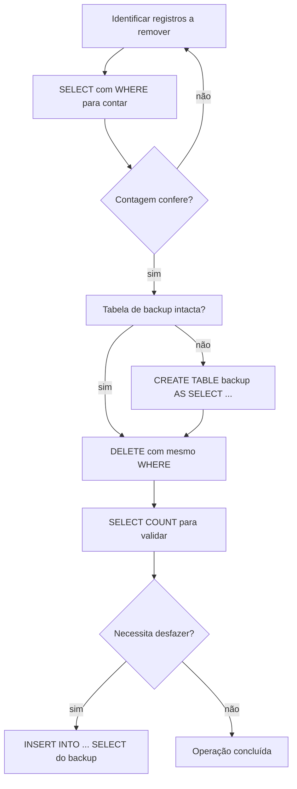
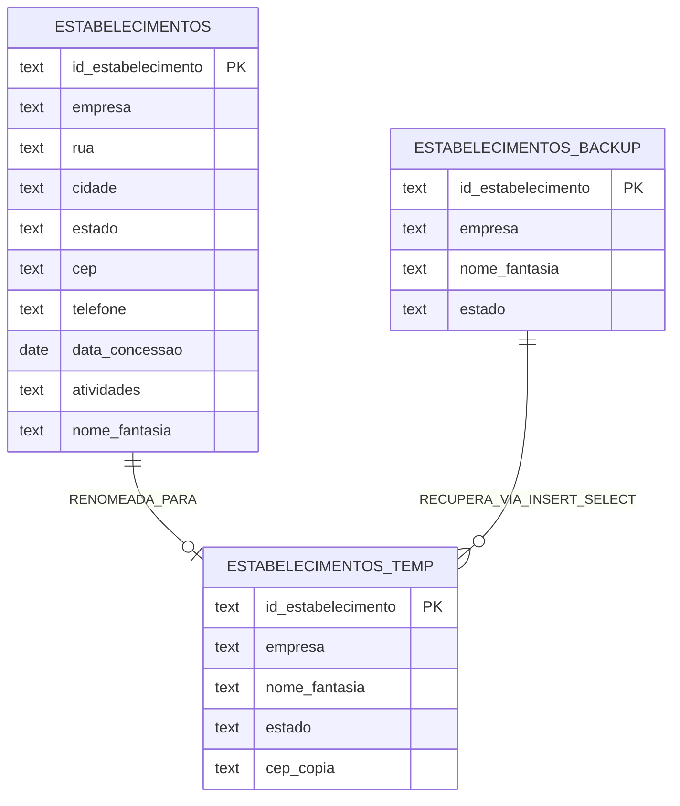

## Visão Geral do Conceito

Manipular dados em produção exige saber **o que apagar**, **como apagar** e **como desfazer** quando algo sai do planejado. Nesta lição, o foco sai da inspeção e correção de dados sujos — tema da etapa anterior — e entra nas operações que **removem** linhas, **esvaziam** tabelas ou **alteram** a estrutura do banco.

O cenário continua o dataset de estabelecimentos de inspeção sanitária (`estabelecimentos`), já carregado no SQLite via `estabelecimento.db`. A pergunta de negócio muda: após corrigir CEPs, estados e nomes de empresas, quais registros devem ser removidos? Como garantir que a exclusão não comprometa análises futuras? E quando o problema não é o dado, mas a própria coluna ou tabela?

> **Regra:** Antes de qualquer operação destrutiva em ambiente real, confirme com os envolvidos, faça backup e execute um <mark style="background-color: #242424; padding: 2px 4px; border-radius: 3px; color: inherit;">`SELECT`</mark> com o mesmo filtro do <mark style="background-color: #242424; padding: 2px 4px; border-radius: 3px; color: inherit;">`DELETE`</mark>.

## Modelo Mental

Pense no banco de dados como um armário com gavetas (tabelas) e objetos dentro (linhas):

| Operação | O que some | O que permanece |
|----------|-----------|-----------------|
| <mark style="background-color: #242424; padding: 2px 4px; border-radius: 3px; color: inherit;">`DELETE`</mark> com <mark style="background-color: #242424; padding: 2px 4px; border-radius: 3px; color: inherit;">`WHERE`</mark> | Linhas que atendem ao filtro | Tabela, colunas, demais linhas |
| <mark style="background-color: #242424; padding: 2px 4px; border-radius: 3px; color: inherit;">`DELETE`</mark> sem <mark style="background-color: #242424; padding: 2px 4px; border-radius: 3px; color: inherit;">`WHERE`</mark> | Todas as linhas | Estrutura vazia da tabela |
| <mark style="background-color: #242424; padding: 2px 4px; border-radius: 3px; color: inherit;">`DROP TABLE`</mark> | Tabela inteira (estrutura + dados) | Nada — o objeto deixa de existir |
| Exclusão lógica (<mark style="background-color: #242424; padding: 2px 4px; border-radius: 3px; color: inherit;">`UPDATE`</mark>) | Visibilidade na aplicação | Registro físico no banco |

A recuperação de um <mark style="background-color: #242424; padding: 2px 4px; border-radius: 3px; color: inherit;">`DELETE`</mark> no SQLite **não depende do SGBD reverter automaticamente**: depende de você ter criado uma cópia antes. Por isso a tabela `estabelecimentos_backup` funciona como rede de segurança — não como recurso nativo de rollback.



## Mecânica Central

### DML versus DDL

SQL divide comandos por finalidade:

- **DML** (<mark style="background-color: #242424; padding: 2px 4px; border-radius: 3px; color: inherit;">`INSERT`</mark>, <mark style="background-color: #242424; padding: 2px 4px; border-radius: 3px; color: inherit;">`UPDATE`</mark>, <mark style="background-color: #242424; padding: 2px 4px; border-radius: 3px; color: inherit;">`DELETE`</mark>) — manipula **dados** dentro de tabelas existentes.
- **DDL** (<mark style="background-color: #242424; padding: 2px 4px; border-radius: 3px; color: inherit;">`CREATE`</mark>, <mark style="background-color: #242424; padding: 2px 4px; border-radius: 3px; color: inherit;">`ALTER`</mark>, <mark style="background-color: #242424; padding: 2px 4px; border-radius: 3px; color: inherit;">`DROP`</mark>) — define ou remove **estrutura** (tabelas, colunas, constraints).

<mark style="background-color: #242424; padding: 2px 4px; border-radius: 3px; color: inherit;">`DELETE`</mark> atua somente sobre linhas. <mark style="background-color: #242424; padding: 2px 4px; border-radius: 3px; color: inherit;">`DROP TABLE`</mark> remove o objeto completo — ao dropar, os dados somem automaticamente junto com a estrutura.

### Exclusão física com DELETE

O padrão seguro segue três passos:

1. **Conferir** com <mark style="background-color: #242424; padding: 2px 4px; border-radius: 3px; color: inherit;">`SELECT COUNT(*)`</mark> (ou <mark style="background-color: #242424; padding: 2px 4px; border-radius: 3px; color: inherit;">`SELECT *`</mark>) usando o filtro desejado.
2. **Executar** <mark style="background-color: #242424; padding: 2px 4px; border-radius: 3px; color: inherit;">`DELETE`</mark> com a **mesma** cláusula <mark style="background-color: #242424; padding: 2px 4px; border-radius: 3px; color: inherit;">`WHERE`</mark>.
3. **Validar** a contagem final e a aritmética: `total_antes - linhas_apagadas = total_depois`.

No dataset da aula, registros dos estados `AS`, `GU`, `MP`, `PR` e `VI` totalizavam **105 linhas**. Após o <mark style="background-color: #242424; padding: 2px 4px; border-radius: 3px; color: inherit;">`DELETE`</mark>, a tabela passou de 6.287 para 6.182 registros — exatamente 105 a menos.

### Exclusão lógica (soft delete)

Em sistemas reais, muitas aplicações **não** executam <mark style="background-color: #242424; padding: 2px 4px; border-radius: 3px; color: inherit;">`DELETE`</mark>. Em vez disso, atualizam uma coluna de status — por exemplo, `ativa` com valor `'V'` (verdadeiro) ou `'F'` (falso). A aplicação filtra `WHERE ativa = 'V'` e o registro "apagado" continua consultável por administradores ou auditoria.

Vantagem: histórico preservado. Desvantagem: tabelas crescem e toda consulta precisa do filtro de ativo.

### Backup com CREATE TABLE AS SELECT (CTAS)

Antes de apagar, crie uma cópia:

```sql
CREATE TABLE estabelecimentos_backup_2 AS
SELECT *
FROM estabelecimentos_backup;
```

O <mark style="background-color: #242424; padding: 2px 4px; border-radius: 3px; color: inherit;">`CREATE TABLE ... AS SELECT`</mark> copia **estrutura inferida e todos os dados** de uma só vez — mais rápido que declarar colunas manualmente. A tabela de backup deve permanecer **intocada** enquanto você experimenta na cópia de trabalho.

### TRUNCATE no SQLite

Em Oracle, SQL Server ou PostgreSQL, <mark style="background-color: #242424; padding: 2px 4px; border-radius: 3px; color: inherit;">`TRUNCATE TABLE`</mark> esvazia a tabela de forma otimizada. **SQLite não possui <mark style="background-color: #242424; padding: 2px 4px; border-radius: 3px; color: inherit;">`TRUNCATE`</mark> em nenhuma versão.** Para esvaziar uma tabela no SQLite:

```sql
DELETE FROM estabelecimentos_backup_2;
```

O efeito é o mesmo (zero linhas), mas o mecanismo interno difere dos SGBDs que suportam truncate.

### Recuperação após DELETE

Com a estrutura ainda existente e a tabela vazia, reinsira a partir do backup:

```sql
INSERT INTO estabelecimentos_backup_2
SELECT *
FROM estabelecimentos_backup;
```

Não use <mark style="background-color: #242424; padding: 2px 4px; border-radius: 3px; color: inherit;">`CREATE TABLE`</mark> se a tabela já existe — use <mark style="background-color: #242424; padding: 2px 4px; border-radius: 3px; color: inherit;">`INSERT INTO ... SELECT`</mark>.

### ALTER TABLE — mudanças estruturais sem perder dados

| Comando | Efeito |
|---------|--------|
| <mark style="background-color: #242424; padding: 2px 4px; border-radius: 3px; color: inherit;">`ALTER TABLE ... DROP COLUMN`</mark> | Remove coluna |
| <mark style="background-color: #242424; padding: 2px 4px; border-radius: 3px; color: inherit;">`ALTER TABLE ... ADD COLUMN`</mark> | Adiciona coluna (valores existentes ficam NULL na nova coluna) |
| <mark style="background-color: #242424; padding: 2px 4px; border-radius: 3px; color: inherit;">`ALTER TABLE ... RENAME TO`</mark> | Renomeia a tabela |

Exemplo de renomeação:

```sql
ALTER TABLE estabelecimentos_backup
RENAME TO estabelecimentos_temp;
```

O primeiro argumento é o nome **atual**; o segundo é o nome **futuro**.

### Restrições de integridade (constraints)

No editor de tabelas do SQLiteStudio (ou na DDL), cada coluna pode receber:

| Constraint | Função |
|------------|--------|
| <mark style="background-color: #242424; padding: 2px 4px; border-radius: 3px; color: inherit;">`PRIMARY KEY`</mark> | Identifica unicamente cada linha; pode ser composta por mais de uma coluna |
| <mark style="background-color: #242424; padding: 2px 4px; border-radius: 3px; color: inherit;">`FOREIGN KEY`</mark> | Valor na tabela filha deve existir na tabela mãe referenciada |
| <mark style="background-color: #242424; padding: 2px 4px; border-radius: 3px; color: inherit;">`UNIQUE`</mark> | Proíbe repetição de valor (ex.: CPF em tabela de clientes) |
| <mark style="background-color: #242424; padding: 2px 4px; border-radius: 3px; color: inherit;">`CHECK`</mark> | Aceita apenas valores de um conjunto — ex.: `estado IN ('CE', 'MT')` |
| <mark style="background-color: #242424; padding: 2px 4px; border-radius: 3px; color: inherit;">`NOT NULL`</mark> | Coluna obrigatória em todo <mark style="background-color: #242424; padding: 2px 4px; border-radius: 3px; color: inherit;">`INSERT`</mark> |
| <mark style="background-color: #242424; padding: 2px 4px; border-radius: 3px; color: inherit;">`DEFAULT`</mark> | Valor assumido quando a coluna não é informada — ex.: `'MG'` para maioria dos clientes mineiros |



### NULL versus string vazia — armadilha crítica

Na tabela `estabelecimentos_temp`, a coluna `nome_fantasia` apresentava **4.400 registros** com aparência de "vazio" na interface, mas:

```sql
-- Retorna 0 — nenhum NULL verdadeiro
SELECT COUNT(*)
FROM estabelecimentos_temp
WHERE nome_fantasia IS NULL;

-- Retorna 4.400 — strings vazias, não NULL
SELECT COUNT(*)
FROM estabelecimentos_temp
WHERE nome_fantasia = '';
```

| Condição | Captura |
|----------|---------|
| <mark style="background-color: #242424; padding: 2px 4px; border-radius: 3px; color: inherit;">`IS NULL`</mark> | Valor **ausente/desconhecido** |
| <mark style="background-color: #242424; padding: 2px 4px; border-radius: 3px; color: inherit;">`= ''`</mark> | String com **zero caracteres** (foi preenchida, mas vazia) |
| <mark style="background-color: #242424; padding: 2px 4px; border-radius: 3px; color: inherit;">`IS NOT NULL`</mark> | Qualquer valor presente, **incluindo** `''` |

A soma confirma: 4.400 (`= ''`) + 1.887 (`<> ''`) = 6.287 registros totais.

> **Regra:** Em limpeza de dados, trate <mark style="background-color: #242424; padding: 2px 4px; border-radius: 3px; color: inherit;">`NULL`</mark> e <mark style="background-color: #242424; padding: 2px 4px; border-radius: 3px; color: inherit;">`''`</mark> como categorias distintas. Relatórios e exclusões que ignoram essa diferença produzem contagens erradas.

## Uso Prático

### Fluxo completo: apagar estados problemáticos com segurança

```sql
-- 1. Criar cópia de trabalho
CREATE TABLE estabelecimentos_backup_2 AS
SELECT * FROM estabelecimentos_backup;

-- 2. Conferir o que será removido
SELECT estado, COUNT(*) AS total
FROM estabelecimentos_backup_2
WHERE estado IN ('AS', 'GU', 'MP', 'PR', 'VI')
GROUP BY estado
ORDER BY estado;
-- Resultado: AS=1, GU=14, MP=4, PR=84, VI=2 → 105 linhas

-- 3. DELETE com o mesmo filtro
DELETE FROM estabelecimentos_backup_2
WHERE estado IN ('AS', 'GU', 'MP', 'PR', 'VI');
-- SQLite reporta: 105 linhas afetadas

-- 4. Validar
SELECT COUNT(*) FROM estabelecimentos_backup_2;
-- Esperado: 6182 (6287 - 105)
```

### Demonstração do perigo: DELETE sem WHERE

```sql
DELETE FROM estabelecimentos_backup_2;
-- Apaga TODAS as 6182 linhas; estrutura permanece

SELECT COUNT(*) FROM estabelecimentos_backup_2;
-- Retorna 0
```

Recuperação a partir do backup original intacto:

```sql
INSERT INTO estabelecimentos_backup_2
SELECT * FROM estabelecimentos_backup;
-- Restaura 6287 linhas
```

### DROP versus DELETE — quando usar cada um

```sql
-- Esvaziar mantendo estrutura (SQLite)
DELETE FROM estabelecimentos_backup_2;

-- Remover objeto por completo
DROP TABLE estabelecimentos_backup_2;
-- Tabela some do painel lateral do SQLiteStudio

SELECT COUNT(*) FROM estabelecimentos_backup_2;
-- ERRO: tabela não existe
```

### Recriar tabela do zero após DROP

```sql
DROP TABLE estabelecimentos_backup;

CREATE TABLE estabelecimentos_backup AS
SELECT * FROM estabelecimentos;
-- Nova tabela com 6287 registros
```

### Limpar nome_fantasia vazio para análise de DBA

```sql
-- Quantos registros sem nome fantasia utilizável?
SELECT COUNT(*) AS sem_nome_util
FROM estabelecimentos_temp
WHERE nome_fantasia = '' OR nome_fantasia IS NULL;

-- Listar IDs afetados (string vazia)
SELECT id_estabelecimento, nome_fantasia
FROM estabelecimentos_temp
WHERE nome_fantasia = '';
```

### Consultar documentação do SGBD para rollback

Quando precisar saber se um DELETE é reversível:

1. Identifique o SGBD **e a versão** (ex.: SQLite 3.45, Oracle 19c).
2. Consulte a documentação oficial — busque por "rollback", "transaction", "flashback".
3. No SQLite, transações não confirmadas podem usar <mark style="background-color: #242424; padding: 2px 4px; border-radius: 3px; color: inherit;">`ROLLBACK`</mark> apenas **dentro da mesma sessão** antes do <mark style="background-color: #242424; padding: 2px 4px; border-radius: 3px; color: inherit;">`COMMIT`</mark>. Após commit, a recuperação depende de backup externo.

## Erros Comuns

**DELETE sem WHERE em produção:** Um <mark style="background-color: #242424; padding: 2px 4px; border-radius: 3px; color: inherit;">`DELETE FROM tabela`</mark> sem filtro apaga todas as linhas instantaneamente. Sintoma: contagem cai para zero. Correção: restaurar via <mark style="background-color: #242424; padding: 2px 4px; border-radius: 3px; color: inherit;">`INSERT INTO ... SELECT`</mark> do backup — se ele existir.

**Confundir DROP com DELETE:** <mark style="background-color: #242424; padding: 2px 4px; border-radius: 3px; color: inherit;">`DROP TABLE`</mark> elimina estrutura e dados; não basta reinserir — é preciso recriar a tabela com <mark style="background-color: #242424; padding: 2px 4px; border-radius: 3px; color: inherit;">`CREATE TABLE`</mark> antes do <mark style="background-color: #242424; padding: 2px 4px; border-radius: 3px; color: inherit;">`INSERT`</mark>.

**Assumir rollback automático no SQLite:** Após executar e confirmar o <mark style="background-color: #242424; padding: 2px 4px; border-radius: 3px; color: inherit;">`DELETE`</mark>, o SQLite não "desfaz" sozinho. Sem tabela de backup, os dados foram perdidos.

**Usar TRUNCATE no SQLite:** O comando gera erro de sintaxe. Use <mark style="background-color: #242424; padding: 2px 4px; border-radius: 3px; color: inherit;">`DELETE FROM tabela`</mark> sem <mark style="background-color: #242424; padding: 2px 4px; border-radius: 3px; color: inherit;">`WHERE`</mark>.

**Filtrar NULL quando o problema é string vazia:** <mark style="background-color: #242424; padding: 2px 4px; border-radius: 3px; color: inherit;">`WHERE nome_fantasia IS NULL`</mark> retorna zero linhas quando os registros contêm `''`. Use <mark style="background-color: #242424; padding: 2px 4px; border-radius: 3px; color: inherit;">`= ''`</mark> ou normalize com <mark style="background-color: #242424; padding: 2px 4px; border-radius: 3px; color: inherit;">`UPDATE`</mark>.

**CREATE TABLE em tabela existente:** Após <mark style="background-color: #242424; padding: 2px 4px; border-radius: 3px; color: inherit;">`DELETE`</mark> esvaziar a tabela, ela ainda existe. Tentar <mark style="background-color: #242424; padding: 2px 4px; border-radius: 3px; color: inherit;">`CREATE TABLE`</mark> com o mesmo nome falha. Use <mark style="background-color: #242424; padding: 2px 4px; border-radius: 3px; color: inherit;">`INSERT INTO`</mark>.

**Pular o SELECT de conferência:** Executar <mark style="background-color: #242424; padding: 2px 4px; border-radius: 3px; color: inherit;">`DELETE`</mark> direto sem validar a contagem. Risco: apagar centenas ou milhares de linhas a mais por erro de digitação no <mark style="background-color: #242424; padding: 2px 4px; border-radius: 3px; color: inherit;">`WHERE`</mark>.

## Visão Geral de Debugging

Quando uma operação de exclusão ou alteração estrutural surpreende:

1. **Congele ações destrutivas.** Não execute mais <mark style="background-color: #242424; padding: 2px 4px; border-radius: 3px; color: inherit;">`DELETE`</mark> ou <mark style="background-color: #242424; padding: 2px 4px; border-radius: 3px; color: inherit;">`DROP`</mark> até entender o estado atual.
2. **Verifique se a tabela ainda existe.** <mark style="background-color: #242424; padding: 2px 4px; border-radius: 3px; color: inherit;">`SELECT COUNT(*) FROM nome_tabela`</mark> — se der erro "no such table", houve <mark style="background-color: #242424; padding: 2px 4px; border-radius: 3px; color: inherit;">`DROP`</mark>.
3. **Compare contagens.** `COUNT(*)` atual versus backup versus diferença esperada.
4. **Revise o filtro.** Copie a cláusula <mark style="background-color: #242424; padding: 2px 4px; border-radius: 3px; color: inherit;">`WHERE`</mark> para um <mark style="background-color: #242424; padding: 2px 4px; border-radius: 3px; color: inherit;">`SELECT`</mark> e inspecione amostras com <mark style="background-color: #242424; padding: 2px 4px; border-radius: 3px; color: inherit;">`LIMIT 20`</mark>.
5. **Cheque NULL vs vazio.** Se a contagem "não bate", teste separadamente <mark style="background-color: #242424; padding: 2px 4px; border-radius: 3px; color: inherit;">`IS NULL`</mark>, <mark style="background-color: #242424; padding: 2px 4px; border-radius: 3px; color: inherit;">`= ''`</mark> e <mark style="background-color: #242424; padding: 2px 4px; border-radius: 3px; color: inherit;">`TRIM(coluna) = ''`</mark>.
6. **Busque backup.** Liste tabelas no SQLiteStudio; procure sufixos `_backup`, `_temp` ou cópias CTAS.
7. **Consulte documentação do SGBD** com versão exata para saber opções de recuperação.

<details>
<summary>Ver checklist rápido pós-DELETE acidental</summary>

```sql
-- A tabela existe?
SELECT COUNT(*) FROM estabelecimentos_backup_2;

-- Existe backup intacto?
SELECT COUNT(*) FROM estabelecimentos_backup;

-- Se estrutura existe mas está vazia e backup OK:
INSERT INTO estabelecimentos_backup_2
SELECT * FROM estabelecimentos_backup;

-- Se tabela foi dropada:
CREATE TABLE estabelecimentos_backup_2 AS
SELECT * FROM estabelecimentos_backup;
```

</details>

## Principais Pontos

- <mark style="background-color: #242424; padding: 2px 4px; border-radius: 3px; color: inherit;">`DELETE`</mark> remove dados; <mark style="background-color: #242424; padding: 2px 4px; border-radius: 3px; color: inherit;">`DROP`</mark> remove estrutura e dados.
- Sempre execute <mark style="background-color: #242424; padding: 2px 4px; border-radius: 3px; color: inherit;">`SELECT`</mark> com o mesmo <mark style="background-color: #242424; padding: 2px 4px; border-radius: 3px; color: inherit;">`WHERE`</mark> antes do <mark style="background-color: #242424; padding: 2px 4px; border-radius: 3px; color: inherit;">`DELETE`</mark>.
- Mantenha tabela de backup intacta (<mark style="background-color: #242424; padding: 2px 4px; border-radius: 3px; color: inherit;">`CREATE TABLE AS SELECT`</mark>) antes de operações arriscadas.
- SQLite não tem <mark style="background-color: #242424; padding: 2px 4px; border-radius: 3px; color: inherit;">`TRUNCATE`</mark>; use <mark style="background-color: #242424; padding: 2px 4px; border-radius: 3px; color: inherit;">`DELETE`</mark> sem <mark style="background-color: #242424; padding: 2px 4px; border-radius: 3px; color: inherit;">`WHERE`</mark> para esvaziar.
- Recuperação no SQLite = <mark style="background-color: #242424; padding: 2px 4px; border-radius: 3px; color: inherit;">`INSERT INTO ... SELECT`</mark> do backup, não rollback automático.
- Exclusão lógica preserva o registro; exclusão física (<mark style="background-color: #242424; padding: 2px 4px; border-radius: 3px; color: inherit;">`DELETE`</mark>) remove a linha.
- <mark style="background-color: #242424; padding: 2px 4px; border-radius: 3px; color: inherit;">`ALTER TABLE RENAME TO`</mark> muda o nome; <mark style="background-color: #242424; padding: 2px 4px; border-radius: 3px; color: inherit;">`DROP/ADD COLUMN`</mark> altera colunas.
- <mark style="background-color: #242424; padding: 2px 4px; border-radius: 3px; color: inherit;">`NULL`</mark> ≠ <mark style="background-color: #242424; padding: 2px 4px; border-radius: 3px; color: inherit;">`''`</mark>: filtros e limpezas devem tratar ambos explicitamente.

## Preparação para Prática

Ao concluir esta lição, você deve conseguir:

- Criar cópia de segurança com CTAS e validar que a contagem de registros é idêntica à original.
- Executar o ciclo SELECT → DELETE → validação aritmética de linhas afetadas.
- Recuperar dados deletados via <mark style="background-color: #242424; padding: 2px 4px; border-radius: 3px; color: inherit;">`INSERT INTO ... SELECT`</mark>.
- Diferenciar quando usar <mark style="background-color: #242424; padding: 2px 4px; border-radius: 3px; color: inherit;">`DELETE`</mark>, <mark style="background-color: #242424; padding: 2px 4px; border-radius: 3px; color: inherit;">`DROP`</mark> e <mark style="background-color: #242424; padding: 2px 4px; border-radius: 3px; color: inherit;">`ALTER TABLE`</mark>.
- Escrever consultas que separam registros com <mark style="background-color: #242424; padding: 2px 4px; border-radius: 3px; color: inherit;">`NULL`</mark> de registros com string vazia em colunas de texto.
- Explicar por que <mark style="background-color: #242424; padding: 2px 4px; border-radius: 3px; color: inherit;">`TRUNCATE`</mark> falha no SQLite e qual alternativa usar.

## Laboratório de Prática

Contexto: você é analista de dados em um projeto de saneamento do cadastro de estabelecimentos de inspeção sanitária (USDA). O banco `estabelecimento.db` contém a tabela `estabelecimentos` com 6.287 registros e uma tabela `estabelecimentos_backup` idêntica, criada na etapa anterior.

### Easy — Conferir antes de apagar

Antes de remover estabelecimentos de estados com dados inconsistentes, escreva a consulta que conta quantos registros serão afetados para os estados `'AS'`, `'GU'`, `'MP'`, `'PR'` e `'VI'`.

```sql
-- Tabela de referência (já existe no banco):
-- estabelecimentos_backup_2 (cópia de trabalho)

-- TODO: escrever SELECT COUNT(*) que retorna o total de registros
--       dos 5 estados listados a partir de estabelecimentos_backup_2
SELECT COUNT(*) AS total_a_remover
FROM estabelecimentos_backup_2
WHERE estado IN ('AS', 'GU', 'MP', 'PR', 'VI'); -- substitua pelo seu filtro correto se necessário

-- Resultado esperado para validação: 105
SELECT 105 AS resultado_esperado;
```

### Medium — DELETE seguro com validação

Com a contagem confirmada em 105 registros, execute o <mark style="background-color: #242424; padding: 2px 4px; border-radius: 3px; color: inherit;">`DELETE`</mark> e em seguida valide que a tabela ficou com 6.182 registros.

```sql
-- TODO: completar o DELETE com a mesma cláusula WHERE do exercício Easy
DELETE FROM estabelecimentos_backup_2
WHERE estado IN ('AS', 'GU', 'MP', 'PR', 'VI');

-- TODO: escrever SELECT COUNT(*) para confirmar total pós-exclusão
SELECT COUNT(*) AS total_apos_delete
FROM estabelecimentos_backup_2;

-- Validação aritmética (deve retornar 6182)
SELECT 6287 - 105 AS total_esperado;
```

### Hard — NULL versus string vazia em nome_fantasia

A equipe de negócio precisa de um relatório separando estabelecimentos **sem nome fantasia preenchido** (string vazia) dos que possuem nome. A coluna `nome_fantasia` tem 4.400 registros com `''` e nenhum com <mark style="background-color: #242424; padding: 2px 4px; border-radius: 3px; color: inherit;">`NULL`</mark>.

```sql
-- Tabela: estabelecimentos_temp (renomeada a partir de estabelecimentos_backup)

-- TODO: contar registros com nome_fantasia igual a string vazia (não use IS NULL)
SELECT COUNT(*) AS com_string_vazia
FROM estabelecimentos_temp
WHERE nome_fantasia = '';

-- TODO: contar registros com nome_fantasia preenchido (diferente de string vazia)
SELECT COUNT(*) AS com_nome_preenchido
FROM estabelecimentos_temp
WHERE nome_fantasia <> '';

-- TODO: verificar que a soma das duas contagens acima é 6287
SELECT
    (SELECT COUNT(*) FROM estabelecimentos_temp WHERE nome_fantasia = '') +
    (SELECT COUNT(*) FROM estabelecimentos_temp WHERE nome_fantasia <> '')
    AS soma_total;
```

<!-- CONCEPT_EXTRACTION
concepts:
  - DELETE
  - DROP TABLE
  - DML e DDL
  - CREATE TABLE AS SELECT
  - exclusão lógica
  - INSERT INTO SELECT
  - ALTER TABLE
  - PRIMARY KEY
  - FOREIGN KEY
  - UNIQUE
  - CHECK
  - NOT NULL
  - DEFAULT
  - NULL vs string vazia
  - TRUNCATE no SQLite
skills:
  - Executar SELECT de conferência antes de DELETE com o mesmo WHERE
  - Criar backup de tabela com CREATE TABLE AS SELECT
  - Recuperar dados deletados via INSERT INTO ... SELECT
  - Diferenciar exclusão física, lógica e DROP de estrutura
  - Aplicar ALTER TABLE para renomear tabelas e modificar colunas
  - Filtrar NULL e string vazia com condições distintas
  - Validar operações destrutivas por contagem aritmética de linhas
examples:
  - delete-estados-problematicos-com-backup
  - recuperacao-insert-select-apos-delete-sem-where
  - null-vs-string-vazia-nome-fantasia
  - alter-table-rename-drop-add-column
-->

<!-- EXERCISES_JSON
[
  {
    "id": "conferir-count-antes-delete",
    "slug": "conferir-count-antes-delete",
    "difficulty": "easy",
    "title": "Conferir contagem antes do DELETE",
    "discipline": "sql-e-modelagem-relacional",
    "editorLanguage": "sql",
    "tags": ["sql", "delete", "select", "where", "validacao"],
    "summary": "Escrever SELECT COUNT(*) para os estados AS, GU, MP, PR e VI antes de qualquer exclusão."
  },
  {
    "id": "delete-seguro-com-validacao",
    "slug": "delete-seguro-com-validacao",
    "difficulty": "medium",
    "title": "DELETE seguro com validação pós-exclusão",
    "discipline": "sql-e-modelagem-relacional",
    "editorLanguage": "sql",
    "tags": ["sql", "delete", "backup", "validacao", "dml"],
    "summary": "Executar DELETE com WHERE para 5 estados e confirmar que a tabela ficou com 6182 registros."
  },
  {
    "id": "null-vs-string-vazia-nome-fantasia",
    "slug": "null-vs-string-vazia-nome-fantasia",
    "difficulty": "hard",
    "title": "Distinguir NULL de string vazia em nome_fantasia",
    "discipline": "sql-e-modelagem-relacional",
    "editorLanguage": "sql",
    "tags": ["sql", "null", "string-vazia", "where", "limpeza-dados"],
    "summary": "Contar separadamente registros com nome_fantasia = '' e <> '', validando soma 6287."
  }
]
-->

```json
{
  "discipline": "sql-e-modelagem-relacional",
  "slug": "exclusao-dados-backup-alter-table",
  "title": "Exclusão de Dados, Backup e Alteração de Estrutura",
  "order": 11,
  "file": "content/sql-e-modelagem-relacional/exclusao-dados-backup-alter-table.md"
}
```
