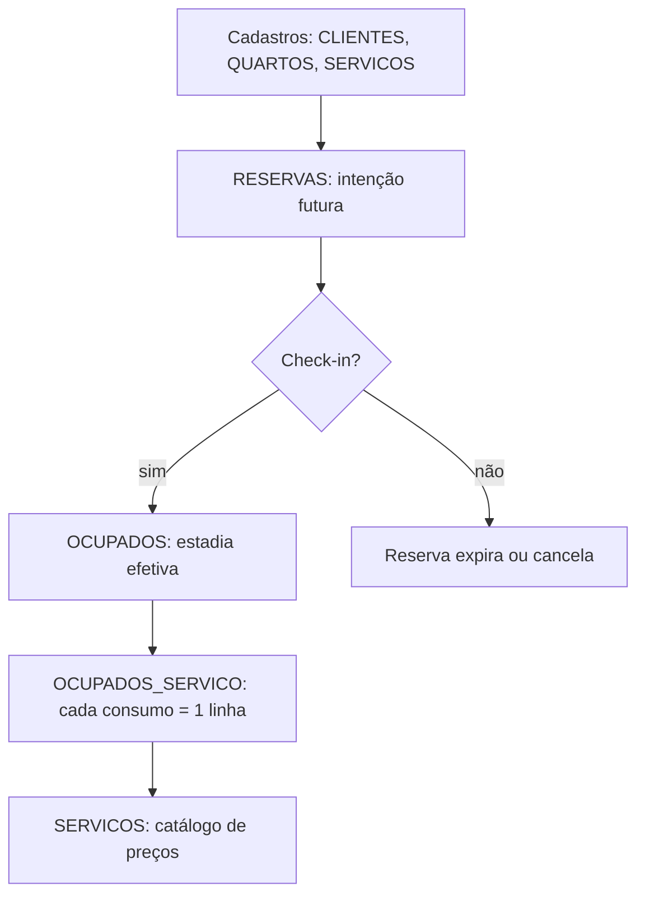
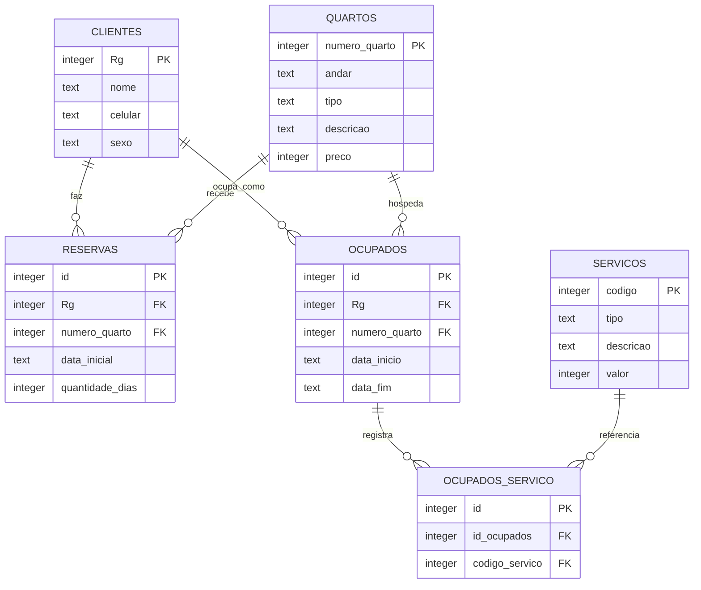

## Visão Geral do Conceito

Modelar um **sistema de hotel** exige ir além de cadastros estáticos (clientes, quartos, catálogo de serviços). O negócio precisa registrar **eventos ao longo do tempo**: reservas futuras, estadias em andamento e consumo cobrável de serviços.

> **Problema central:** um enunciado de negócio mistura cadastro, intenção (reserva) e fato consumado (ocupação + serviços). Sem separar esses conceitos em tabelas distintas, o banco perde integridade e as consultas de faturamento ficam ambíguas.

Esta lição reconstrói o modelo construído colaborativamente na aula — tema **Hotel** — desde a leitura do enunciado até o diagrama relacional pronto para implementação em SQLite ou outro SGBD relacional.

## Modelo Mental

Pense no hotel como uma linha do tempo por quarto:

1. **Cadastro** — quem é o cliente, quais quartos existem, quais servios podem ser cobrados.
2. **Reserva** — Maria escolhe o quarto 101 para entrar em 28/05/2026 e ficar **3 dias**. Ainda não está no hotel; é compromisso futuro.
3. **Ocupação** — no sábado Maria faz check-in. Agora existe registro com **data/hora de entrada e saída reais**.
4. **Consumo** — enquanto o quarto está **ocupado**, cada pedido (frigobar, lavanderia) gera **uma linha** na ligação entre ocupação e serviço.

A distinção **reservado ≠ ocupado** não é detalhe de implementação: é regra de negócio. Um cliente pode ter reservado e nunca comparecido; ainda assim permanece cadastrado se já fez reserva alguma vez.



## Mecânica Central

### Entidades identificadas no enunciado

| Entidade | Papel | Identificador |
|----------|-------|---------------|
| Cliente | Hóspede ou responsável pelo cadastro | <mark style="background-color: #242424; padding: 2px 4px; border-radius: 3px; color: inherit;">`Rg`</mark> (PK) |
| Quarto | Unidade física hospedável | <mark style="background-color: #242424; padding: 2px 4px; border-radius: 3px; color: inherit;">`numero_quarto`</mark> (PK) |
| Reserva | Compromisso futuro de uso do quarto | <mark style="background-color: #242424; padding: 2px 4px; border-radius: 3px; color: inherit;">`id`</mark> (PK surrogate) |
| Ocupado | Estadia em curso ou encerrada | <mark style="background-color: #242424; padding: 2px 4px; border-radius: 3px; color: inherit;">`id`</mark> (PK surrogate) |
| Serviço | Item cobrável (frigobar, lavanderia…) | <mark style="background-color: #242424; padding: 2px 4px; border-radius: 3px; color: inherit;">`codigo`</mark> (PK) |
| Ocupados_Servico | Registro de consumo na estadia | <mark style="background-color: #242424; padding: 2px 4px; border-radius: 3px; color: inherit;">`id`</mark> (PK) |

### Diagrama entidade-relacionamento (modelo final)



### Atributos por tabela

**CLIENTES** — cadastro mínimo exigido pelo enunciado:

- <mark style="background-color: #242424; padding: 2px 4px; border-radius: 3px; color: inherit;">`Rg`</mark> (PK): identificador do hóspede.
- <mark style="background-color: #242424; padding: 2px 4px; border-radius: 3px; color: inherit;">`nome`</mark>, <mark style="background-color: #242424; padding: 2px 4px; border-radius: 3px; color: inherit;">`celular`</mark> (adaptação prática em relação a “telefone”), <mark style="background-color: #242424; padding: 2px 4px; border-radius: 3px; color: inherit;">`sexo`</mark> (campo biológico conforme enunciado).

**QUARTOS**:

- <mark style="background-color: #242424; padding: 2px 4px; border-radius: 3px; color: inherit;">`numero_quarto`</mark> (PK): ex. 101, 102, 201 — identifica unicamente a unidade no prédio.
- <mark style="background-color: #242424; padding: 2px 4px; border-radius: 3px; color: inherit;">`andar`</mark>: pode ser inteiro ou texto se houver “cobertura” — decisão de domínio importa na modelagem.
- <mark style="background-color: #242424; padding: 2px 4px; border-radius: 3px; color: inherit;">`tipo`</mark>, <mark style="background-color: #242424; padding: 2px 4px; border-radius: 3px; color: inherit;">`descricao`</mark>, <mark style="background-color: #242424; padding: 2px 4px; border-radius: 3px; color: inherit;">`preco`</mark>.

**RESERVAS** — traduz *“reservar para uma determinada data por certa quantidade de dias”*:

- FK <mark style="background-color: #242424; padding: 2px 4px; border-radius: 3px; color: inherit;">`Rg`</mark> → CLIENTES (1 cliente : N reservas).
- FK <mark style="background-color: #242424; padding: 2px 4px; border-radius: 3px; color: inherit;">`numero_quarto`</mark> → QUARTOS.
- <mark style="background-color: #242424; padding: 2px 4px; border-radius: 3px; color: inherit;">`data_inicial`</mark> + <mark style="background-color: #242424; padding: 2px 4px; border-radius: 3px; color: inherit;">`quantidade_dias`</mark> (não a data final explícita no enunciado).

**OCUPADOS** — traduz *“quartos já ocupados: data e hora de entrada e saída”*:

- Mesmas FKs de cliente e quarto.
- <mark style="background-color: #242424; padding: 2px 4px; border-radius: 3px; color: inherit;">`data_inicio`</mark> e <mark style="background-color: #242424; padding: 2px 4px; border-radius: 3px; color: inherit;">`data_fim`</mark> (timestamps ou texto, conforme SGBD).

**SERVICOS** — catálogo:

- <mark style="background-color: #242424; padding: 2px 4px; border-radius: 3px; color: inherit;">`codigo`</mark>, <mark style="background-color: #242424; padding: 2px 4px; border-radius: 3px; color: inherit;">`tipo`</mark>, <mark style="background-color: #242424; padding: 2px 4px; border-radius: 3px; color: inherit;">`descricao`</mark>, <mark style="background-color: #242424; padding: 2px 4px; border-radius: 3px; color: inherit;">`valor`</mark>.

**OCUPADOS_SERVICO** — resolve N:N:

- Cada consumo = **uma linha** (mesmo serviço repetido gera linhas distintas).
- FK <mark style="background-color: #242424; padding: 2px 4px; border-radius: 3px; color: inherit;">`id_ocupados`</mark> → OCUPADOS.
- FK <mark style="background-color: #242424; padding: 2px 4px; border-radius: 3px; color: inherit;">`codigo_servico`</mark> → SERVICOS.

> **Regra:** serviços só são cobrados quando vinculados a uma **ocupação**, não a uma reserva.

### Cardinalidades essenciais

| Relacionamento | Cardinalidade | Interpretação |
|----------------|---------------|---------------|
| Cliente → Reserva | 1:N | Maria pode reservar dez vezes em anos diferentes. |
| Quarto → Reserva | 1:N | O quarto 101 recebe reservas em datas distintas (nunca duas no mesmo instante — regra operacional). |
| Cliente → Ocupado | 1:N | Cada estadia gera registro próprio. |
| Ocupado ↔ Serviço | N:N | Vários consumos; catálogo reutilizado. |

### Boas práticas de nomenclatura

- Evitar acentuação em nomes de tabelas/colunas (compatibilidade entre ferramentas e SGBDs).
- Repetir o **mesmo nome** da coluna referenciada nas FKs (<mark style="background-color: #242424; padding: 2px 4px; border-radius: 3px; color: inherit;">`numero_quarto`</mark> em QUARTOS e RESERVAS) — reduz erro em JOINs.
- Alternativa profissional: <mark style="background-color: #242424; padding: 2px 4px; border-radius: 3px; color: inherit;">`id_cliente`</mark> como FK quando a PK da mãe é <mark style="background-color: #242424; padding: 2px 4px; border-radius: 3px; color: inherit;">`id`</mark> — ambas válidas; consistência importa mais que o estilo isolado.

### Ferramenta: DB Designer

A aula utilizou [DB Designer](https://erd.dbdesigner.net/) para construir o diagrama visualmente, definir PKs/FKs e exportar DDL. Limitações observadas:

- Plano gratuito com restrição de tabelas por projeto.
- **Bug de tradução:** interface em português pode traduzir <mark style="background-color: #242424; padding: 2px 4px; border-radius: 3px; color: inherit;">`Id`</mark> incorretamente e quebrar referências — solução: usar interface em inglês ao configurar FKs.

**Não coberto na mesma aula (continuação prevista):** `CREATE TABLE`, carga com `INSERT` e consultas `SELECT` sobre o modelo — serão implementados na sequência da trilha.

## Uso Prático

### DDL alinhada ao modelo (SQLite)

```sql
CREATE TABLE CLIENTES (
    Rg INTEGER PRIMARY KEY,
    nome TEXT NOT NULL,
    celular TEXT,
    sexo TEXT
);

CREATE TABLE QUARTOS (
    numero_quarto INTEGER PRIMARY KEY,
    andar TEXT,
    tipo TEXT,
    descricao TEXT,
    preco INTEGER
);

CREATE TABLE SERVICOS (
    codigo INTEGER PRIMARY KEY,
    tipo TEXT,
    descricao TEXT,
    valor INTEGER
);

CREATE TABLE RESERVAS (
    id INTEGER PRIMARY KEY,
    Rg INTEGER NOT NULL,
    numero_quarto INTEGER NOT NULL,
    data_inicial TEXT NOT NULL,
    quantidade_dias INTEGER NOT NULL,
    FOREIGN KEY (Rg) REFERENCES CLIENTES (Rg),
    FOREIGN KEY (numero_quarto) REFERENCES QUARTOS (numero_quarto)
);

CREATE TABLE OCUPADOS (
    id INTEGER PRIMARY KEY,
    Rg INTEGER NOT NULL,
    numero_quarto INTEGER NOT NULL,
    data_inicio TEXT NOT NULL,
    data_fim TEXT,
    FOREIGN KEY (Rg) REFERENCES CLIENTES (Rg),
    FOREIGN KEY (numero_quarto) REFERENCES QUARTOS (numero_quarto)
);

CREATE TABLE OCUPADOS_SERVICO (
    id INTEGER PRIMARY KEY,
    id_ocupados INTEGER NOT NULL,
    codigo_servico INTEGER NOT NULL,
    FOREIGN KEY (id_ocupados) REFERENCES OCUPADOS (id),
    FOREIGN KEY (codigo_servico) REFERENCES SERVICOS (codigo)
);
```

### Exemplo de fluxo operacional

```sql
-- 1. Cadastro base
INSERT INTO CLIENTES (Rg, nome, celular, sexo)
VALUES (1001, 'Maria Silva', '21999990000', 'F');

INSERT INTO QUARTOS (numero_quarto, andar, tipo, descricao, preco)
VALUES (101, '1', 'standard', 'Duplo com ar', 250);

-- 2. Reserva: entrada 28/05/2026, 3 diárias
INSERT INTO RESERVAS (id, Rg, numero_quarto, data_inicial, quantidade_dias)
VALUES (1, 1001, 101, '28/05/2026', 3);

-- 3. Check-in → nova linha em OCUPADOS (não altera RESERVAS)
INSERT INTO OCUPADOS (id, Rg, numero_quarto, data_inicio, data_fim)
VALUES (1, 1001, 101, '28/05/2026 14:00', NULL);

-- 4. Dois consumos de frigobar na mesma estadia = duas linhas
INSERT INTO SERVICOS (codigo, tipo, descricao, valor)
VALUES (10, 'frigobar', 'Batata chips', 10);

INSERT INTO OCUPADOS_SERVICO (id, id_ocupados, codigo_servico)
VALUES (1, 1, 10), (2, 1, 10);
```

### Consulta de faturamento por estadia

```sql
SELECT
    o.id AS ocupacao_id,
    c.nome,
    q.numero_quarto,
    s.descricao AS servico,
    s.valor
FROM OCUPADOS o
INNER JOIN CLIENTES c ON c.Rg = o.Rg
INNER JOIN QUARTOS q ON q.numero_quarto = o.numero_quarto
INNER JOIN OCUPADOS_SERVICO os ON os.id_ocupados = o.id
INNER JOIN SERVICOS s ON s.codigo = os.codigo_servico
WHERE o.id = 1;
```

### Extensões de negócio discutidas (modelo enriquecido)

Cenários reais de turismo/hotelaria — **não exigidos pelo enunciado simples**, mas relevantes para evolução do modelo:

- Reserva feita por terceiro (pai reserva para filho) → separar **cliente titular** vs **hóspede**.
- Meia diária / check-out e novo check-in no mesmo dia → múltiplas ocupações ou granularidade por hora.
- Quantidade de adultos por reserva → coluna ou tabela dependente.
- Status único (livre/reservado/ocupado) **substitui** reserva+ocupado apenas em modelos simplificados; o enunciado da aula exige **registros diferenciados**.

## Erros Comuns

**Armazenar múltiplos serviços em uma coluna (`'frigobar,lavanderia,room service'`)**  
Viola a 1FN. Consultas dependem de <mark style="background-color: #242424; padding: 2px 4px; border-radius: 3px; color: inherit;">`LIKE '%frigobar%'`</mark>, que com curinga à esquerda **ignora índices** e força varredura linha a linha — inaceitável em bases grandes.

**Unificar RESERVAS e OCUPADOS com coluna `status`**  
Quando o enunciado pede explicitamente registros diferenciados, unificar obscurece datas (quantidade de dias vs entrada/saída reais) e complica auditoria de no-show.

**FK apontando serviço diretamente para RESERVAS**  
Serviços são cobrados na estadia efetiva; vincular à reserva cobraria quem nunca fez check-in.

**Confundir 1:N com 1:1 na mesma linha de reserva**  
Uma reserva liga **um** Rg, **um** quarto, **uma** data inicial e **uma** quantidade de dias naquele registro — não significa que o cliente só pode reservar uma vez na vida.

**Nomenclatura inconsistente nas FKs**  
Referenciar `numero_quarto` na ferramenta visual como coluna genérica `Id` traduzida erroneamente impede criar a FK — verificar idioma da interface e nomes explícitos.

**Usar `andar` como INTEGER quando o domínio inclui valores não numéricos**  
“Cobertura”, “térreo” ou “mezanino” exigem TEXT ou tabela de domínio.

## Visão Geral de Debugging

Ao validar o modelo ou a DDL:

1. **Desenhe o caminho da pergunta de negócio** — “quanto faturamos de frigobar no quarto 101?” exige cadeia OCUPADOS → OCUPADOS_SERVICO → SERVICOS, não RESERVAS.
2. **Conte FKs órfãs** — tente `INSERT` de reserva com `Rg` inexistente; o SGBD deve rejeitar.
3. **Simule repetição** — dois consumos iguais devem ser duas linhas em OCUPADOS_SERVICO, não concatenação.
4. **Verifique cardinalidade invertida** — se “muitos” estiver do lado errado no diagrama, o JOIN retorna produto cartesiano ou conjunto vazio.
5. **No DB Designer** — se FK não referencia, alterne idioma para inglês e confira se o nome da coluna PK está explícito (`id_ocupados`, não rótulo traduzido).

<details>
<summary>Ver diagnóstico: consulta de serviços retorna vazio</summary>

Causa frequente: dados inseridos em RESERVAS mas consumo registrado sem linha em OCUPADOS, ou `id_ocupados` na tabela de junção aponta para ocupação inexistente. Confira:

```sql
SELECT * FROM OCUPADOS WHERE id = 1;
SELECT * FROM OCUPADOS_SERVICO WHERE id_ocupados = 1;
```

</details>

## Principais Pontos

- Hotel exige separar **cadastro**, **reserva** (futuro) e **ocupação** (presente/passado efetivo).
- RESERVAS usa `data_inicial` + `quantidade_dias`; OCUPADOS usa `data_inicio` + `data_fim`.
- Serviços consumidos modelam-se N:N via **OCUPADOS_SERVICO** — um consumo por linha.
- Cliente 1:N reservas e 1:N ocupações; repetir FK com mesmo nome reduz erro.
- Coluna multivalorada quebra 1FN e prejudica performance em consultas.
- Modelo da aula é **pedagógico**; hotel real exige regras adicionais (titular, no-show, meia diária).
- Próximo passo da trilha: materializar tabelas, popular dados e praticar `SELECT`.

## Preparação para Prática

Antes do laboratório, você deve conseguir:

- Ler um enunciado e listar entidades antes de abrir qualquer ferramenta.
- Justificar por que OCUPADOS_SERVICO existe em vez de coluna multivalorada.
- Escrever DDL com PKs e FKs coerentes para as seis tabelas do hotel.
- Montar JOIN de faturamento partindo de OCUPADOS, não de RESERVAS.
- Identificar quando o enunciado força tabelas separadas vs quando um `status` bastaria.

## Laboratório de Prática

### Easy — Cadastro de quartos

Crie a tabela de quartos e insira dois registros. Complete os `INSERT` faltantes.

```sql
-- TODO: completar CREATE TABLE conforme modelo da lição
CREATE TABLE QUARTOS (
    numero_quarto INTEGER PRIMARY KEY,
    andar TEXT,
    tipo TEXT,
    descricao TEXT,
    preco INTEGER
);

INSERT INTO QUARTOS (numero_quarto, andar, tipo, descricao, preco)
VALUES (101, '1', 'standard', 'Duplo', 250);

-- TODO: inserir quarto 102, andar '1', tipo 'luxo', descricao 'Suite', preco 450
```

### Medium — Reserva com integridade referencial

Partindo de clientes e quartos já existentes, crie RESERVAS e insira uma reserva válida.

```sql
CREATE TABLE CLIENTES (
    Rg INTEGER PRIMARY KEY,
    nome TEXT NOT NULL,
    celular TEXT,
    sexo TEXT
);

CREATE TABLE QUARTOS (
    numero_quarto INTEGER PRIMARY KEY,
    andar TEXT,
    tipo TEXT,
    descricao TEXT,
    preco INTEGER
);

INSERT INTO CLIENTES VALUES (2001, 'Joao Pereira', '11988887777', 'M');
INSERT INTO QUARTOS VALUES (201, '2', 'standard', 'Casal', 300);

-- TODO: criar tabela RESERVAS com FKs para CLIENTES(Rg) e QUARTOS(numero_quarto)
-- TODO: inserir reserva id=1, Rg=2001, quarto 201, data_inicial '15/06/2026', quantidade_dias 2
```

### Hard — Consumo N:N e total a cobrar

Implemente ocupação, catálogo, tabela de junção e consulta agregada.

```sql
-- Esquema base (execute como está)
CREATE TABLE CLIENTES (Rg INTEGER PRIMARY KEY, nome TEXT);
CREATE TABLE QUARTOS (numero_quarto INTEGER PRIMARY KEY, tipo TEXT);
CREATE TABLE SERVICOS (codigo INTEGER PRIMARY KEY, descricao TEXT, valor INTEGER);
CREATE TABLE OCUPADOS (
    id INTEGER PRIMARY KEY,
    Rg INTEGER,
    numero_quarto INTEGER,
    data_inicio TEXT,
    FOREIGN KEY (Rg) REFERENCES CLIENTES (Rg),
    FOREIGN KEY (numero_quarto) REFERENCES QUARTOS (numero_quarto)
);

INSERT INTO CLIENTES VALUES (3001, 'Ana Costa');
INSERT INTO QUARTOS VALUES (101, 'standard');
INSERT INTO SERVICOS VALUES (1, 'Agua mineral', 5);
INSERT INTO SERVICOS VALUES (2, 'Lavanderia', 40);
INSERT INTO OCUPADOS VALUES (1, 3001, 101, '01/06/2026 15:00');

-- TODO: criar OCUPADOS_SERVICO com FKs para OCUPADOS(id) e SERVICOS(codigo)
-- TODO: registrar dois consumos na ocupacao 1: servico 1 (duas vezes) e servico 2 (uma vez)
-- TODO: escrever SELECT que retorne total_a_cobrar (soma dos valores) para ocupacao id = 1
```

<!-- CONCEPT_EXTRACTION
concepts:
  - modelagem entidade-relacionamento
  - reserva versus ocupação
  - chave primária
  - chave estrangeira
  - cardinalidade 1:N
  - cardinalidade N:N
  - tabela de junção
  - primeira forma normal
  - DB Designer
skills:
  - Extrair entidades e atributos a partir de enunciado de negócio
  - Diferenciar reserva futura de ocupação efetiva no modelo relacional
  - Modelar relacionamento N:N com tabela associativa
  - Aplicar nomenclatura consistente em chaves estrangeiras
  - Escrever DDL SQLite com integridade referencial
  - Montar JOINs para faturamento de serviços por estadia
examples:
  - ddl-hotel-seis-tabelas
  - fluxo-reserva-checkin-consumo
  - consulta-faturamento-ocupados-servico
-->

<!-- EXERCISES_JSON
[
  {
    "id": "hotel-quartos-insert",
    "slug": "hotel-quartos-insert",
    "difficulty": "easy",
    "title": "Cadastro de quartos do hotel",
    "discipline": "sql-e-modelagem-relacional",
    "editorLanguage": "sql",
    "tags": ["sql", "ddl", "insert", "modelagem"],
    "summary": "Completar CREATE TABLE QUARTOS e inserir segundo quarto conforme modelo da lição."
  },
  {
    "id": "hotel-reservas-fk",
    "slug": "hotel-reservas-fk",
    "difficulty": "medium",
    "title": "Reserva com chaves estrangeiras",
    "discipline": "sql-e-modelagem-relacional",
    "editorLanguage": "sql",
    "tags": ["sql", "fk", "reservas", "integridade"],
    "summary": "Criar tabela RESERVAS com FKs e inserir reserva válida vinculada a cliente e quarto."
  },
  {
    "id": "hotel-ocupados-servico-nn",
    "slug": "hotel-ocupados-servico-nn",
    "difficulty": "hard",
    "title": "Consumo N:N e total a cobrar",
    "discipline": "sql-e-modelagem-relacional",
    "editorLanguage": "sql",
    "tags": ["sql", "join", "agregacao", "tabela-juncao"],
    "summary": "Implementar OCUPADOS_SERVICO, registrar consumos repetidos e calcular total da estadia."
  }
]
-->

LESSONS_JSON_HINT
{
  "discipline": "sql-e-modelagem-relacional",
  "slug": "modelagem-hotel-reservas-ocupacao-servicos",
  "title": "Modelagem relacional: sistema de hotel (reservas, ocupação e serviços)",
  "order": 12,
  "file": "content/sql-e-modelagem-relacional/modelagem-hotel-reservas-ocupacao-servicos.md"
}
