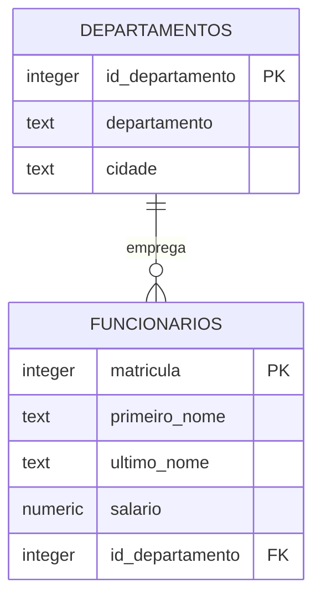
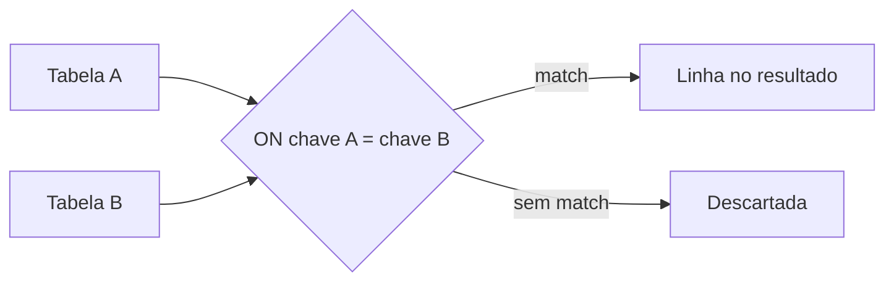

## Visão Geral do Conceito

Relacionamentos modelados no MER só geram valor quando consultas **cruzam tabelas**. O modelo relacional resolve redundância separando assuntos (`departamentos`, `funcionários`, `sessões`, `cinemas`), mas relatórios reais quase sempre precisam de colunas de mais de uma tabela ao mesmo tempo.

<mark style="background-color: #242424; padding: 2px 4px; border-radius: 3px; color: inherit;">`JOIN`</mark> é o mecanismo SQL que materializa esse vínculo: a **chave primária** da tabela mãe conversa com a **chave estrangeira** da tabela filha. Sem dominar joins, você consegue listar tabelas isoladas, mas não monta dashboards de RH, público de cinema, matrículas por distrito ou qualquer visão integrada típica de ADS.

> **Regra:** Toda consulta multi-tabela deve deixar explícito **qual coluna de qual tabela** participa da ligação. Ambiguidade (`id` existe em duas tabelas) é erro de modelagem de consulta, não “detalhe do banco”.

---

## Modelo Mental

Imagine duas planilhas relacionadas por um código comum:

| Matrícula | Nome   | Id_departamento |
|-----------|--------|-----------------|
| 101       | Julia  | 1               |
| 102       | Arthur | 2               |

| Id_departamento | Departamento | Cidade  |
|-----------------|--------------|---------|
| 1               | Taxas        | Atlanta |
| 2               | TI           | Boston  |

O join não “copia” uma planilha dentro da outra. Ele **combina linhas compatíveis** segundo uma regra de igualdade entre colunas. O tipo de join define **o que acontece quando não há par**:

- **INNER:** só linhas com match nos dois lados.
- **LEFT:** todas da esquerda + match à direita (ou <mark style="background-color: #242424; padding: 2px 4px; border-radius: 3px; color: inherit;">`NULL`</mark> se não houver).
- **FULL OUTER:** tudo dos dois lados, preenchendo lacunas com <mark style="background-color: #242424; padding: 2px 4px; border-radius: 3px; color: inherit;">`NULL`</mark>.



Na prática de desenvolvimento, pense em três perguntas antes de escrever SQL:

1. Qual tabela traz o **fato principal** (funcionário, sessão, matrícula)?
2. Quais tabelas trazem **atributos descritivos** (departamento, cinema, escola)?
3. Registros **sem correspondência** devem aparecer ou ser descartados?

A resposta à terceira pergunta escolhe o tipo de join.

---

## Mecânica Central

### Chave estrangeira na criação da tabela

O vínculo lógico nasce no <mark style="background-color: #242424; padding: 2px 4px; border-radius: 3px; color: inherit;">`CREATE TABLE`</mark>, quando a coluna filha referencia a mãe:

```sql
CREATE TABLE departamentos (
    id_departamento INTEGER PRIMARY KEY,
    departamento    TEXT NOT NULL,
    cidade          TEXT NOT NULL,
    CONSTRAINT pk_departamentos PRIMARY KEY (id_departamento),
    CONSTRAINT uq_depto_cidade UNIQUE (departamento, cidade)
);

CREATE TABLE funcionarios (
    matricula       INTEGER PRIMARY KEY,
    primeiro_nome   TEXT,
    ultimo_nome     TEXT,
    salario         NUMERIC(10, 2),
    id_departamento INTEGER,
    CONSTRAINT pk_funcionarios PRIMARY KEY (matricula),
    FOREIGN KEY (id_departamento)
        REFERENCES departamentos (id_departamento)
);
```

<mark style="background-color: #242424; padding: 2px 4px; border-radius: 3px; color: inherit;">`CONSTRAINT`</mark> (restrição) pode nomear <mark style="background-color: #242424; padding: 2px 4px; border-radius: 3px; color: inherit;">`PRIMARY KEY`</mark>, <mark style="background-color: #242424; padding: 2px 4px; border-radius: 3px; color: inherit;">`FOREIGN KEY`</mark>, <mark style="background-color: #242424; padding: 2px 4px; border-radius: 3px; color: inherit;">`UNIQUE`</mark> ou <mark style="background-color: #242424; padding: 2px 4px; border-radius: 3px; color: inherit;">`NOT NULL`</mark>. Restrições também podem ser adicionadas depois com <mark style="background-color: #242424; padding: 2px 4px; border-radius: 3px; color: inherit;">`ALTER TABLE`</mark> — cuidado: dados já existentes podem impedir a criação da restrição.

### INNER JOIN (ligação interna)

<mark style="background-color: #242424; padding: 2px 4px; border-radius: 3px; color: inherit;">`INNER JOIN`</mark> e <mark style="background-color: #242424; padding: 2px 4px; border-radius: 3px; color: inherit;">`JOIN`</mark> (sem qualificador) têm a **mesma semântica**: retornam apenas linhas com correspondência nas duas tabelas.

```sql
SELECT *
FROM funcionarios
JOIN departamentos
  ON funcionarios.id_departamento = departamentos.id_departamento
ORDER BY funcionarios.id_departamento;
```

Forma explícita recomendada em bases legadas e novas:

```sql
SELECT f.matricula,
       f.primeiro_nome,
       f.ultimo_nome,
       f.salario,
       d.departamento,
       d.cidade
FROM funcionarios AS f
INNER JOIN departamentos AS d
  ON f.id_departamento = d.id_departamento
ORDER BY f.primeiro_nome;
```

**Sintaxe antiga (vírgula + WHERE):** ainda aparece em sistemas antigos:

```sql
SELECT *
FROM funcionarios, departamentos
WHERE funcionarios.id_departamento = departamentos.id_departamento;
```

Funciona, mas mistura filtro de join com filtros de negócio no mesmo <mark style="background-color: #242424; padding: 2px 4px; border-radius: 3px; color: inherit;">`WHERE`</mark>, reduzindo legibilidade. Prefira <mark style="background-color: #242424; padding: 2px 4px; border-radius: 3px; color: inherit;">`INNER JOIN ... ON`</mark>.

### Fluxo lógico do INNER JOIN



### JOIN com colunas homônimas: USING

Quando **o nome da coluna de ligação é idêntico** nas duas tabelas:

```sql
SELECT *
FROM distrito_2020
JOIN distrito_2035 USING (id)
ORDER BY id;
```

<mark style="background-color: #242424; padding: 2px 4px; border-radius: 3px; color: inherit;">`USING (id)`</mark> equivale a <mark style="background-color: #242424; padding: 2px 4px; border-radius: 3px; color: inherit;">`ON distrito_2020.id = distrito_2035.id`</mark> e exibe a coluna de ligação **uma única vez**. Em produção, muitos times preferem <mark style="background-color: #242424; padding: 2px 4px; border-radius: 3px; color: inherit;">`ON`</mark> com prefixo de tabela para evitar comportamento inesperado se nomes mudarem.

### LEFT JOIN e RIGHT JOIN

<mark style="background-color: #242424; padding: 2px 4px; border-radius: 3px; color: inherit;">`LEFT JOIN`</mark> mantém **todas** as linhas da tabela à esquerda e preenche com <mark style="background-color: #242424; padding: 2px 4px; border-radius: 3px; color: inherit;">`NULL`</mark> quando não há par à direita.

```sql
SELECT *
FROM distrito_2020 AS d20
LEFT JOIN distrito_2035 AS d35
  ON d20.id = d35.id
ORDER BY d20.id;
```

Se `id = 5` existe só em `distrito_2020`, as colunas de `distrito_2035` aparecem como <mark style="background-color: #242424; padding: 2px 4px; border-radius: 3px; color: inherit;">`NULL`</mark>.

<mark style="background-color: #242424; padding: 2px 4px; border-radius: 3px; color: inherit;">`RIGHT JOIN`</mark> é o espelho: preserva a tabela à **direita**. Na prática, <mark style="background-color: #242424; padding: 2px 4px; border-radius: 3px; color: inherit;">`LEFT JOIN`</mark> domina relatórios porque a ordem das tabelas pode ser trocada para obter o mesmo efeito de um <mark style="background-color: #242424; padding: 2px 4px; border-radius: 3px; color: inherit;">`RIGHT JOIN`</mark>.

**Padrão “somente à esquerda”:** filtrar linhas da direita ausentes:

```sql
SELECT d20.id, d20.escola_2020
FROM distrito_2020 AS d20
LEFT JOIN distrito_2035 AS d35 ON d20.id = d35.id
WHERE d35.id IS NULL;
```

Retorna registros que **não** possuem correspondência na outra tabela — útil para auditoria de divergência entre bases.

### FULL OUTER JOIN

<mark style="background-color: #242424; padding: 2px 4px; border-radius: 3px; color: inherit;">`FULL OUTER JOIN`</mark> une matches **e** sobras dos dois lados. No exemplo de distritos escolares:

- `id` 1, 2, 6: presentes nas duas tabelas.
- `id` 5: só à esquerda (<mark style="background-color: #242424; padding: 2px 4px; border-radius: 3px; color: inherit;">`NULL`</mark> à direita).
- `id` 3, 4: só à direita (<mark style="background-color: #242424; padding: 2px 4px; border-radius: 3px; color: inherit;">`NULL`</mark> à esquerda).

```sql
SELECT *
FROM distrito_2020 AS d20
FULL OUTER JOIN distrito_2035 AS d35
  ON d20.id = d35.id
ORDER BY COALESCE(d20.id, d35.id);
```

### CROSS JOIN

<mark style="background-color: #242424; padding: 2px 4px; border-radius: 3px; color: inherit;">`CROSS JOIN`</mark> produz o **produto cartesiano**: cada linha de A com cada linha de B. Quatro registros × cinco registros = **vinte** combinações. Não há condição <mark style="background-color: #242424; padding: 2px 4px; border-radius: 3px; color: inherit;">`ON`</mark>. Uso raro no dia a dia; aparece em geradores de combinações ou, por engano, quando falta a cláusula de ligação.

### Join de três ou mais tabelas

Encadeie joins pela cadeia de chaves:

```sql
SELECT d20.id,
       d20.escola_2020,
       en.inscricao,
       gr.notas
FROM distrito_2020 AS d20
JOIN distrito_2020_inscricao AS en
  ON d20.id = en.id
JOIN distrito_2020_notas AS gr
  ON d20.id = gr.id
ORDER BY d20.id;
```

Cada novo join amplia o resultado **desde que** a chave de ligação exista em todas as etapas — o mesmo princípio usado no case de cinemas (`SESSAO` → `PASSA` → `CINEMA`) para apurar público por município ou por nome fantasia.

### Apelidos (aliases)

**Tabelas:**

```sql
FROM distrito_2020 AS d20
LEFT JOIN distrito_2035 AS d35 ON d20.id = d35.id
```

**Colunas no SELECT:**

```sql
SELECT d20.id AS d20_id,
       d20.escola_2020 AS "Distrito 2020 School"
```

Aspas duplas permitem rótulos com espaços no cabeçalho exportado para BI/planilha.

### Operações de conjunto: UNION, INTERSECT, EXCEPT

Quando o objetivo é **combinar resultados de consultas compatíveis** (mesmo número e tipos de colunas), use operadores de conjunto:

| Operador | Efeito |
|----------|--------|
| <mark style="background-color: #242424; padding: 2px 4px; border-radius: 3px; color: inherit;">`UNION`</mark> | União **sem** duplicatas |
| <mark style="background-color: #242424; padding: 2px 4px; border-radius: 3px; color: inherit;">`UNION ALL`</mark> | União **com** duplicatas |
| <mark style="background-color: #242424; padding: 2px 4px; border-radius: 3px; color: inherit;">`INTERSECT`</mark> | Apenas linhas presentes **nas duas** consultas |
| <mark style="background-color: #242424; padding: 2px 4px; border-radius: 3px; color: inherit;">`EXCEPT`</mark> | Linhas da primeira consulta **ausentes** na segunda |

```sql
-- Valores em comum (equivalente conceitual ao INNER JOIN neste cenário)
SELECT id, escola_2020 AS escola FROM distrito_2020
INTERSECT
SELECT id, escola_2035 AS escola FROM distrito_2035;

-- Só em distrito_2020
SELECT id, escola_2020 FROM distrito_2020
EXCEPT
SELECT id, escola_2035 FROM distrito_2035;
```

<mark style="background-color: #242424; padding: 2px 4px; border-radius: 3px; color: inherit;">`EXCEPT`</mark> é **direcional**: a tabela “de cima” manda. Inverta a ordem para ver sobras da outra base.

**UNION com coluna de origem:**

```sql
SELECT id, escola_2020 AS escola, 2020 AS ano
FROM distrito_2020
UNION ALL
SELECT id, escola_2035, 2035
FROM distrito_2035
ORDER BY escola, ano;
```

Útil para consolidar históricos de diferentes anos em um único dataset analítico.

### Uso no dia a dia (prioridade)

1. <mark style="background-color: #242424; padding: 2px 4px; border-radius: 3px; color: inherit;">`INNER JOIN`</mark> — relatórios onde só interessam registros **completos** (funcionário com departamento válido, sessão ligada a cinema e filme).
2. <mark style="background-color: #242424; padding: 2px 4px; border-radius: 3px; color: inherit;">`LEFT JOIN`</mark> — preservar o lado principal e detectar faltantes (funcionários sem departamento, escolas só em um censo).
3. <mark style="background-color: #242424; padding: 2px 4px; border-radius: 3px; color: inherit;">`FULL OUTER JOIN`</mark> — reconciliação entre duas fontes.
4. <mark style="background-color: #242424; padding: 2px 4px; border-radius: 3px; color: inherit;">`CROSS JOIN`</mark> — evite salvo necessidade explícita.

---

## Uso Prático

### RH: funcionários com departamento e cidade

Base `ligacao_tabelas.db` (SQLiteStudio), após carga de `departamentos` e `funcionarios`:

```sql
SELECT f.primeiro_nome,
       f.ultimo_nome,
       f.salario,
       d.departamento,
       d.cidade
FROM funcionarios f
INNER JOIN departamentos d
  ON f.id_departamento = d.id_departamento
WHERE d.cidade = 'Boston'
ORDER BY f.salario DESC;
```

Relatório típico de folha regional: junta filho (funcionário) com mãe (departamento) e filtra negócio.

### Cinemas: público por município (case do material)

Modelo já usado na disciplina — três tabelas encadeadas:

```sql
SELECT SUM(se.publico) AS publico_total
FROM sessao se
INNER JOIN passa pa
  ON pa.codigo_cinema = se.codigo_cinema
 AND pa.codigo_filme  = se.codigo_filme
INNER JOIN cinema ci
  ON ci.codigo_cinema = pa.codigo_cinema
WHERE ci.municipio = 'Rio de Janeiro'
  AND se.data_sessao BETWEEN '2007-05-29' AND '2007-05-29';
```

Observe: strings de município são **case-sensitive** nos dados de exemplo; `'RIO DE JANEIRO'` não encontra `'Rio de Janeiro'`.

### Distritos escolares: comparar censos

```sql
SELECT d20.id,
       d20.escola_2020,
       d35.escola_2035
FROM distrito_2020 d20
FULL OUTER JOIN distrito_2035 d35
  ON d20.id = d35.id
ORDER BY COALESCE(d20.id, d35.id);
```

Exportação para planilha de migração escolar: identifica escolas persistentes, novas e encerradas.

### Três tabelas: escola + inscrição + notas

```sql
SELECT d.id,
       d.escola_2020,
       i.inscricao,
       n.notas
FROM distrito_2020 d
JOIN distrito_2020_inscricao i ON d.id = i.id
JOIN distrito_2020_notas n     ON d.id = n.id
WHERE i.inscricao > 100
ORDER BY d.id;
```

Padrão repetível em ADS: entidade central + tabelas satélite de métricas.

---

## Erros Comuns

**Esquecer o prefixo da tabela em colunas ambíguas**

Sintoma: `ambiguous column name: id`.  
Causa: `SELECT id` com `id` nas duas tabelas.  
Correção: `SELECT d20.id` ou apelido de tabela.

**Confundir JOIN implícito com filtro de negócio**

Sintoma: produto cartesiano gigante (milhões de linhas).  
Causa: `FROM a, b` sem condição de ligação no <mark style="background-color: #242424; padding: 2px 4px; border-radius: 3px; color: inherit;">`WHERE`</mark>.  
Correção: sempre validar cardinalidade; use <mark style="background-color: #242424; padding: 2px 4px; border-radius: 3px; color: inherit;">`INNER JOIN ... ON`</mark>.

**Achar que LEFT JOIN “traz tudo sempre”**

Sintoma: funcionário some do relatório.  
Causa: filtro `WHERE d.departamento = 'TI'` transforma outer join em inner de fato.  
Correção: mova condição da tabela opcional para `ON` ou use subconsulta.

**Interpretar NULL como zero**

Sintoma: somatórios incorretos após outer join.  
Causa: <mark style="background-color: #242424; padding: 2px 4px; border-radius: 3px; color: inherit;">`NULL`</mark> em agregação não conta como 0.  
Correção: `COALESCE(coluna, 0)` apenas quando a regra de negócio permitir.

**UNION com colunas incompatíveis**

Sintoma: erro de tipos ou ordem de colunas.  
Causa: número ou tipos diferentes entre os SELECTs.  
Correção: alinhe projeções explicitamente com aliases.

**EXCEPT na ordem errada**

Sintoma: “sobras” invertidas entre bases.  
Correção: lembre que a primeira consulta define o minuendo.

**Adicionar FOREIGN KEY em dados sujos**

Sintoma: `ALTER TABLE` falha ao validar registros órfãos.  
Correção: limpe órfãos (`id_departamento` inexistente) antes da restrição.

---

## Visão Geral de Debugging

1. **Isole cada tabela:** `SELECT COUNT(*)` e amostra (`LIMIT 5`) em cada uma.
2. **Teste o join pairwise:** junte só duas tabelas antes de encadear a terceira.
3. **Conte matches:** compare `COUNT(*)` do inner join com contagem da tabela filha — divergência indica órfãos.
4. **Inspecione órfãos:**

```sql
SELECT f.*
FROM funcionarios f
LEFT JOIN departamentos d ON f.id_departamento = d.id_departamento
WHERE d.id_departamento IS NULL;
```

5. **Replique com INNER:** se inner retorna menos linhas que esperado, o problema está na chave ou nos dados, não no SELECT final.
6. **Verifique strings:** municípios, nomes fantasia e horários exigem correspondência exata nos dados de carga.
7. **Cross join acidental:** se o resultado explode, confira se falta <mark style="background-color: #242424; padding: 2px 4px; border-radius: 3px; color: inherit;">`ON`</mark> ou se vírgula no <mark style="background-color: #242424; padding: 2px 4px; border-radius: 3px; color: inherit;">`FROM`</mark> substitui join explícito sem condição.

<details>
<summary>Ver checklist rápido para SQLiteStudio</summary>

- Banco correto selecionado (erro “banco indefinido ou inválido” costuma ser conexão errada).
- Comando terminado com `;` ao copiar trechos parciais.
- Se schema corrompeu após cliques acidentais, remova da visão e reconecte ao arquivo `.db` — o arquivo físico permanece no disco.
- Selecione o comando inteiro ou use F9 com cursor no final do statement.

</details>

---

## Principais Pontos

- Join materializa relacionamentos PK/FK definidos na modelagem.
- <mark style="background-color: #242424; padding: 2px 4px; border-radius: 3px; color: inherit;">`JOIN`</mark> = <mark style="background-color: #242424; padding: 2px 4px; border-radius: 3px; color: inherit;">`INNER JOIN`</mark>: somente correspondências mútuas.
- <mark style="background-color: #242424; padding: 2px 4px; border-radius: 3px; color: inherit;">`LEFT JOIN`</mark> preserva a esquerda; lacunas viram <mark style="background-color: #242424; padding: 2px 4px; border-radius: 3px; color: inherit;">`NULL`</mark>.
- <mark style="background-color: #242424; padding: 2px 4px; border-radius: 3px; color: inherit;">`FULL OUTER JOIN`</mark> mostra sobras dos dois lados.
- <mark style="background-color: #242424; padding: 2px 4px; border-radius: 3px; color: inherit;">`CROSS JOIN`</mark> multiplica linhas; use com intenção.
- Prefixe colunas (`tabela.coluna`) para evitar ambiguidade.
- Apelidos encurtam SQL e deixam exports legíveis.
- <mark style="background-color: #242424; padding: 2px 4px; border-radius: 3px; color: inherit;">`UNION`</mark>/<mark style="background-color: #242424; padding: 2px 4px; border-radius: 3px; color: inherit;">`INTERSECT`</mark>/<mark style="background-color: #242424; padding: 2px 4px; border-radius: 3px; color: inherit;">`EXCEPT`</mark> operam sobre **conjuntos de linhas**, alternativa pontual aos joins.

---

## Preparação para Prática

Ao concluir esta lição, você deve conseguir:

- Montar consultas RH juntando `funcionarios` e `departamentos` com o join adequado ao relatório.
- Comparar dois censos escolares com INNER, LEFT e FULL OUTER JOIN interpretando <mark style="background-color: #242424; padding: 2px 4px; border-radius: 3px; color: inherit;">`NULL`</mark>.
- Encadear três tabelas pela mesma chave (`id`).
- Usar `UNION ALL` com coluna de ano/origem para consolidar bases históricas.
- Identificar órfãos e divergências com LEFT JOIN + `IS NULL` ou `EXCEPT`.
- Escolher entre join e operador de conjunto conforme a pergunta de negócio.

---

## Laboratório de Prática

Contexto: você mantém o banco `ligacao_tabelas.db` usado na etapa 8 — tabelas `departamentos`, `funcionarios`, `distrito_2020`, `distrito_2035`, `distrito_2020_inscricao` e `distrito_2020_notas`, já populadas conforme a aula.

### Easy — Listar funcionários com departamento

Monte a consulta que retorna **matrícula**, **primeiro_nome**, **último_nome**, **departamento** e **cidade**, apenas para funcionários com departamento válido, ordenados por `primeiro_nome`.

```sql
-- TODO: completar o tipo de JOIN entre funcionarios e departamentos
SELECT f.matricula,
       f.primeiro_nome,
       f.ultimo_nome,
       d.departamento,
       d.cidade
FROM funcionarios f
-- TODO: adicionar JOIN departamentos d ON ...
ORDER BY f.primeiro_nome;
```

### Medium — Escolas só no censo 2020

Retorne `id` e `escola_2020` das escolas presentes em `distrito_2020` **sem** correspondência em `distrito_2035` (use LEFT JOIN e filtro em coluna da direita nula).

```sql
SELECT d20.id,
       d20.escola_2020
FROM distrito_2020 d20
-- TODO: LEFT JOIN distrito_2035 d35 ON ...
-- TODO: WHERE condição para ausência na tabela da direita
ORDER BY d20.id;
```

### Hard — Painel consolidado por escola e ano

Gere um relatório unificado com colunas `id`, `nome_escola` e `ano`, combinando:

- todas as escolas de `distrito_2020` com `ano = 2020`;
- todas as escolas de `distrito_2035` com `ano = 2035`;

Use `UNION ALL`, projeções alinhadas e ordene por `nome_escola`, depois `ano`. Em seguida, numa segunda consulta no mesmo exercício, calcule quantas escolas aparecem **nos dois anos** (mesmo `id`) usando `INTERSECT` apenas sobre a coluna `id`.

```sql
-- Parte 1: consolidação histórica
-- TODO: primeiro SELECT com alias nome_escola e ano 2020
-- TODO: UNION ALL
-- TODO: segundo SELECT com ano 2035
-- ORDER BY nome_escola, ano;

-- Parte 2: ids presentes nos dois censos
-- TODO: INTERSECT entre SELECT id FROM distrito_2020 e SELECT id FROM distrito_2035
SELECT 0 AS placeholder_id;
```

<!-- CONCEPT_EXTRACTION
concepts:
  - INNER JOIN
  - LEFT JOIN
  - FULL OUTER JOIN
  - CROSS JOIN
  - chave estrangeira
  - UNION UNION ALL
  - INTERSECT
  - EXCEPT
  - apelidos SQL
skills:
  - Ligar tabelas mãe e filha via PRIMARY KEY e FOREIGN KEY em consultas
  - Escolher o tipo de JOIN conforme regra de inclusão de registros órfãos
  - Encadear joins em três ou mais tabelas sem ambiguidade de colunas
  - Consolidar resultsets com UNION ALL e identificar interseções com INTERSECT
  - Detectar registros exclusivos de uma base com EXCEPT ou LEFT JOIN IS NULL
examples:
  - funcionarios-departamentos-inner-join
  - distrito-left-join-censo-comparativo
  - cinema-publico-municipio-multi-join
  - union-all-anos-escolares
-->

<!-- EXERCISES_JSON
[
  {
    "id": "joins-funcionarios-departamentos-easy",
    "slug": "joins-funcionarios-departamentos-easy",
    "difficulty": "easy",
    "title": "Funcionários com departamento (INNER JOIN)",
    "discipline": "sql-e-modelagem-relacional",
    "editorLanguage": "sql",
    "tags": ["sql", "inner-join", "rh", "chave-estrangeira"],
    "summary": "Completar INNER JOIN entre funcionarios e departamentos listando cidade e departamento."
  },
  {
    "id": "joins-distrito-orfaos-left-medium",
    "slug": "joins-distrito-orfaos-left-medium",
    "difficulty": "medium",
    "title": "Escolas exclusivas do censo 2020",
    "discipline": "sql-e-modelagem-relacional",
    "editorLanguage": "sql",
    "tags": ["sql", "left-join", "null", "anti-join"],
    "summary": "Usar LEFT JOIN e filtro IS NULL para achar registros sem par na segunda tabela."
  },
  {
    "id": "joins-union-intersect-hard",
    "slug": "joins-union-intersect-hard",
    "difficulty": "hard",
    "title": "Consolidar censos e interseção de ids",
    "discipline": "sql-e-modelagem-relacional",
    "editorLanguage": "sql",
    "tags": ["sql", "union-all", "intersect", "relatorio-historico"],
    "summary": "Montar UNION ALL com coluna de ano e INTERSECT para ids comuns entre dois censos escolares."
  }
]
-->

```json
LESSONS_JSON_HINT
{
  "discipline": "sql-e-modelagem-relacional",
  "slug": "joins-e-ligacao-de-tabelas",
  "title": "JOINs e ligação entre tabelas",
  "order": 13,
  "file": "content/sql-e-modelagem-relacional/joins-e-ligacao-de-tabelas.md"
}
```
