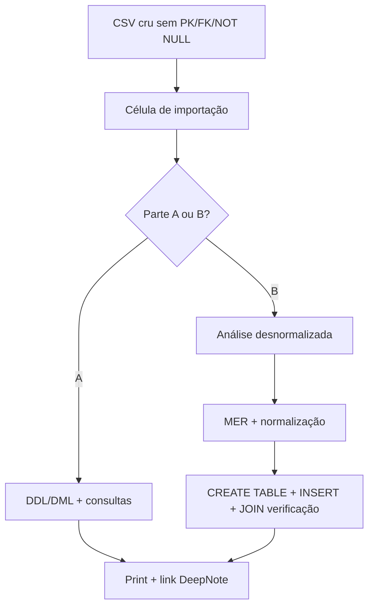
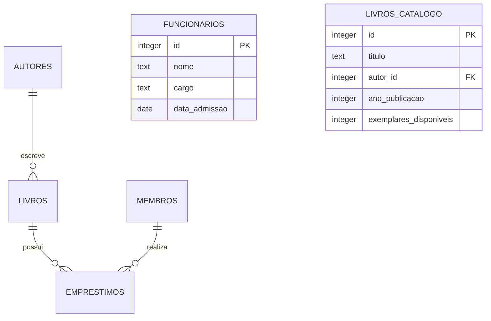
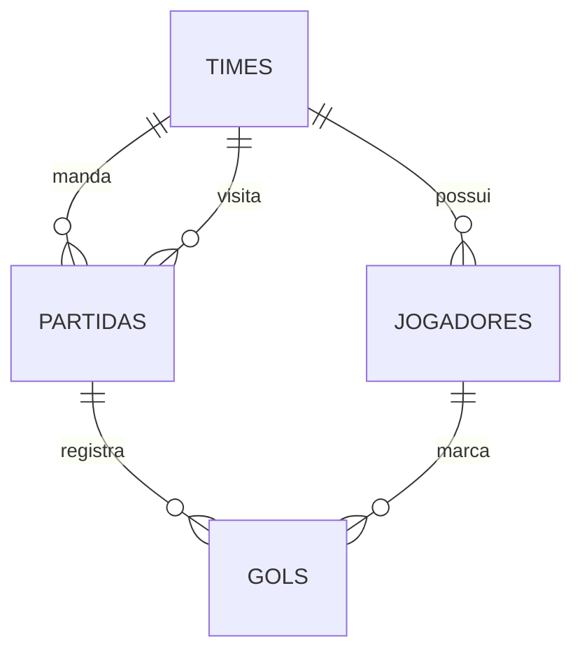
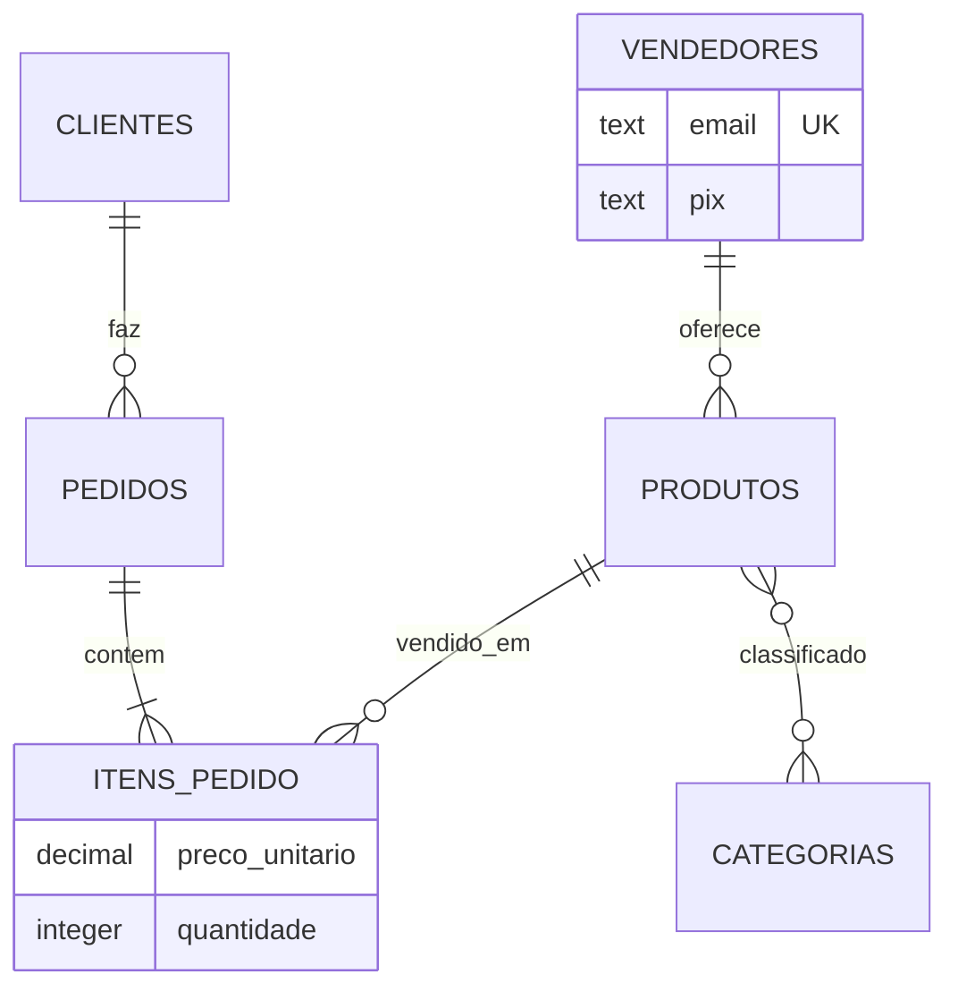
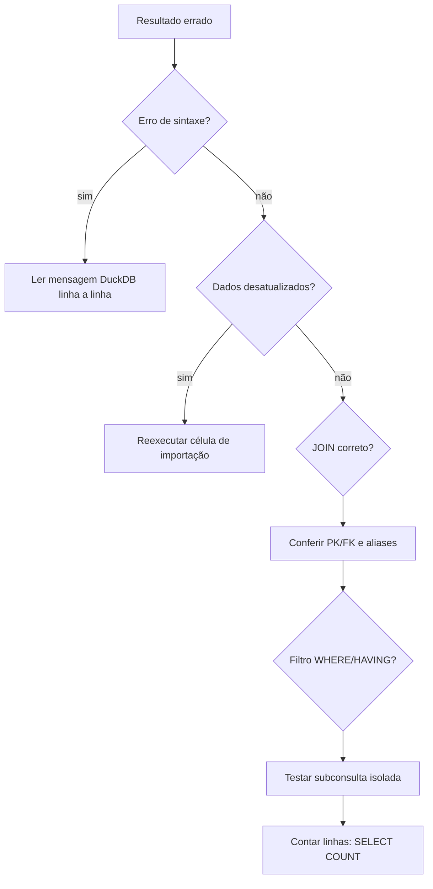

## Visão Geral do Conceito

O **Assessment (AT)** da disciplina consolida tudo que você praticou nos TPs: não é uma prova de decoreba de sintaxe, e sim uma simulação de trabalho real — receber dados **crus** (raw), transformá-los em esquema confiável e responder perguntas de negócio com SQL.

A avaliação roda **inteiramente no DeepNote**, usando blocos SQL nativos sobre **DuckDB** (não SQLite). Isso importa na hora de executar: funções como leitura de CSV seguem a API do DuckDB.

O AT divide-se em duas partes:

| Parte | Foco | Quantidade |
|-------|------|------------|
| **A** | DDL, DML, JOINs e agregações sobre dois bancos importados de CSV | 12 exercícios |
| **B** | Modelagem relacional, normalização e implementação física de um marketplace | 4 exercícios (13–16) |

> **Regra:** Cada exercício deve ser tratado como se partisse do estado **recém importado**. Se um exercício anterior alterou tabelas, reexecute a célula de importação do banco correspondente antes de continuar.

A entrega combina o **link do DeepNote duplicado** (sua cópia) com **prints em PDF** mostrando comando e resultado de cada questão — enunciado/comando visível e saída abaixo.

---

## Modelo Mental

Pense no AT como um pipeline de engenharia de dados em três camadas:



**Camada 1 — Dado bruto:** tabelas criadas por importação, tipos inferidos, sem integridade referencial. É o cenário típico quando você extrai um dump de produção ou recebe planilha de outra área.

**Camada 2 — Transformação:** você projeta restrições (`PRIMARY KEY`, `FOREIGN KEY`, `NOT NULL`, `UNIQUE`), migra dados ou corrige registros. Exercícios 1, 2 e 5–6 da biblioteca seguem esse padrão.

**Camada 3 — Pergunta de negócio:** consultas com `JOIN`, filtros, agregações e ordenação. A pergunta sempre vem antes da SQL — identifique entidades envolvidas, cardinalidade e colunas de saída.

Na **Parte B**, a planilha desnormalizada `pedidos_planilha` é o oposto: uma única tabela guarda cliente, vendedor, produto, preço, quantidade e categorias múltiplas numa célula. Seu trabalho é **decompor** essa bagunça em relações que respeitem as regras de negócio e as formas normais.

---

## Mecânica Central

### Ambiente: DeepNote + DuckDB

Ao duplicar o notebook no DeepNote, você obtém sua cópia editável. Blocos SQL executam em sequência; **apenas o resultado do último comando** aparece visualmente, embora todos tenham sido executados.

Os dados **não** vêm de scripts `CREATE TABLE` prontos com integridade — vêm de **CSV**. A importação usa padrão semelhante a:

```sql
CREATE OR REPLACE TABLE autores AS
SELECT * FROM read_csv_auto('autores.csv');
```

Algumas tabelas do banco biblioteca recebem tratamento extra (por exemplo, `autores` com `PRIMARY KEY` explícita e `INSERT` a partir do CSV). As demais (`livros`, `membros`, `emprestimos`) chegam **sem restrições**.

### Formato de datas

Todos os filtros temporais usam **datas fixas** no formato:

<mark style="background-color: #242424; padding: 2px 4px; border-radius: 3px; color: inherit;">`AAAA-MM-DD`</mark>

Exemplo da base biblioteca: inscrição de membro `2023-01-15` (ano com quatro dígitos, mês e dia com dois).

Em `emprestimos`, **célula vazia em `data_devolucao_real`** representa empréstimo **não devolvido** — semanticamente equivalente a <mark style="background-color: #242424; padding: 2px 4px; border-radius: 3px; color: inherit;">`NULL`</mark>.

### Banco 1 — Biblioteca municipal

Diagrama simplificado das relações usadas nos exercícios 1–6:



**Exercício 1 — Funcionários desde o início:** criar `funcionarios` já modelada (`PRIMARY KEY`, `NOT NULL` onde exigido), inserir quatro registros e `SELECT *` ordenado por `data_admissao`.

**Exercício 2 — Migrar livros:** `livros` do CSV não tem PK nem FK. Criar `livros_catalogo` com `autor_id` referenciando `autores(id)` e copiar dados com `INSERT INTO ... SELECT`.

**Exercício 3 — Listagem do acervo:** uma query com <mark style="background-color: #242424; padding: 2px 4px; border-radius: 3px; color: inherit;">`INNER JOIN`</mark> entre `livros` e `autores`; retornar título, nome do autor, ano; ordenar por nome do autor ASC e ano ASC (mais antigo primeiro).

**Exercício 4 — Antijoin:** livros **nunca** emprestados exigem <mark style="background-color: #242424; padding: 2px 4px; border-radius: 3px; color: inherit;">`LEFT JOIN`</mark> entre `livros` e `emprestimos`, mantendo linhas **sem** correspondência. Filtre com `emprestimos.livro_id IS NULL` (ou critério equivalente).

**Exercício 5 — Gênero e aquisições:** `ALTER TABLE` adicionando coluna `genero`; `UPDATE ... WHERE` para três títulos; `INSERT` de dois livros novos; `SELECT` apenas livros com gênero preenchido (excluir `NULL`).

**Exercício 6 — Multas em aberto:** um único `UPDATE` multiplicando `valor_multa` por `1.5` onde `data_devolucao_real IS NULL` **e** `valor_multa > 0`; depois `SELECT` com a **mesma** cláusula `WHERE`.

### Banco 2 — Liga de futebol (exercícios 7–12)

Antes dos exercícios 7–12, execute a célula de importação do **banco 2** (`times`, `jogadores`, `partidas`, `gols`).



**Exercício 7 — Relatório de gols:** `JOIN` entre `gols`, `jogadores`, `partidas` e **três aliases** da tabela `times` (time do jogador, mandante, visitante). Ordenar por data da partida e minuto do gol.

**Exercício 8 — Artilharia completa:** incluir **todos** os 12 jogadores, mesmo com zero gols. Use <mark style="background-color: #242424; padding: 2px 4px; border-radius: 3px; color: inherit;">`LEFT JOIN`</mark> + <mark style="background-color: #242424; padding: 2px 4px; border-radius: 3px; color: inherit;">`COUNT`</mark> ou <mark style="background-color: #242424; padding: 2px 4px; border-radius: 3px; color: inherit;">`COALESCE`</mark> — funções de agregação padrão ignoram `NULL` e podem omitir jogadores sem gols se o join estiver errado.

**Exercício 9 — Duplas de companheiros:** <mark style="background-color: #242424; padding: 2px 4px; border-radius: 3px; color: inherit;">`self-join`</mark> em `jogadores` para pares do mesmo time; evitar duplicatas (Mário+Alexandre e Alexandre+Mário) e autopares (Alexandre+Alexandre). <mark style="background-color: #242424; padding: 2px 4px; border-radius: 3px; color: inherit;">`CASE`</mark> ou comparação de IDs ajuda a canonicalizar pares.

**Exercício 10 — Saldo de gols:** cada time joga como mandante e visitante. Some gols a favor e contra com <mark style="background-color: #242424; padding: 2px 4px; border-radius: 3px; color: inherit;">`CASE`</mark> dentro de <mark style="background-color: #242424; padding: 2px 4px; border-radius: 3px; color: inherit;">`SUM`</mark>; saldo = gols pró − gols contra; ordenar saldo decrescente.

**Exercício 11 — Query defeituosa:** identificar erros na SQL fornecida (join errado, `GROUP BY` incompleto, `HAVING` incorreto, alias ausente), corrigir e documentar cada defeito em comentários `--` no início. Resultado: jogadores com **mais de um** gol, ordenados do maior para o menor.

**Exercício 12 — Nova rodada:** `INSERT` em `partidas` (id 11) e três gols em `gols`; query de confirmação com `JOIN` filtrando `partida_id = 11`.

### Parte B — Marketplace artesanal (exercícios 13–16)

Cenário: startup controla pedidos numa planilha desnormalizada; dados duplicados, categorias múltiplas numa célula, consultas difíceis.

**Regras de negócio → decisões de modelagem:**

| Regra | Implicação |
|-------|------------|
| Cliente faz N pedidos; cada pedido pertence a 1 cliente | 1:N entre cliente e pedido |
| Pedido pode ter itens de vendedores diferentes | Item de pedido referencia vendedor/produto; pedido agrega itens heterogêneos |
| Produto pertence a um único vendedor | N:1 produto → vendedor; sem produto compartilhado |
| Produto em N categorias | N:N produto ↔ categoria (tabela associativa) |
| Cada vendedor tem PIX exclusivo | Atributo ou entidade conta vinculada 1:1 ao vendedor |
| E-mail de cliente e vendedor identifica unicamente | `UNIQUE` em e-mails |
| Preço muda no tempo; pedido guarda preço da compra | `preco_unitario` na linha do item de pedido, não só em produto |
| Categorias padronizadas | Tabela `categorias`; valores repetidos na planilha aparecem **uma vez** |

Modelo relacional alvo (conceitual):



**Exercício 13:** texto (~10 linhas) sobre por que modelo relacional resolve a planilha; listar entidades, atributos e justificativas.

**Exercício 14:** diagrama textual de relacionamentos com cardinalidades (1:1 vendedor–conta, 1:N vendedor–produto, etc.) e onde registrar preço no momento da compra.

**Exercício 15:** violações concretas da planilha em **1FN** (múltiplos valores em `categorias`), **2FN** (dependência parcial de chave composta fictícia da planilha) e **3FN** (dependência transitiva, ex.: cidade derivada só de e-mail do cliente).

**Exercício 16:** `CREATE TABLE` com tipos, PK, FK, `UNIQUE`, `NOT NULL`; ordem de criação — tabelas **sem** FK primeiro; `INSERT` reproduzindo os seis registros normalizados; query final com `JOIN` provando que nenhuma informação foi perdida (categorias múltiplas geram **mais linhas** que a planilha original — ex.: vaso azul → decoração **e** cerâmica em linhas separadas).

---

## Uso Prático

### Estratégia de execução no DeepNote

1. Duplicar o notebook (botão de duplicate) para criar **sua** versão.
2. Executar importação do banco 1; resolver exercícios 1–6.
3. Executar importação do banco 2; resolver exercícios 7–12.
4. Carregar `pedidos_planilha`; responder 13–15 em células de texto; implementar SQL em 16.
5. Capturar print de **cada** questão: comando visível + resultado.

### Exemplo — migração livros → livros_catalogo (ex. 2)

```sql
CREATE TABLE livros_catalogo (
    id INTEGER PRIMARY KEY,
    titulo TEXT NOT NULL,
    autor_id INTEGER NOT NULL,
    ano_publicacao INTEGER,
    exemplares_disponiveis INTEGER,
    FOREIGN KEY (autor_id) REFERENCES autores(id)
);

INSERT INTO livros_catalogo (id, titulo, autor_id, ano_publicacao, exemplares_disponiveis)
SELECT id, titulo, autor_id, ano_publicacao, exemplares_disponiveis
FROM livros;
```

### Exemplo — antijoin livros nunca emprestados (ex. 4)

```sql
SELECT l.titulo, a.nome AS nome_autor
FROM livros l
INNER JOIN autores a ON a.id = l.autor_id
LEFT JOIN emprestimos e ON e.livro_id = l.id
WHERE e.livro_id IS NULL;
```

### Exemplo — três vezes a tabela times (ex. 7)

```sql
SELECT
    j.nome AS jogador,
    tj.nome AS time_jogador,
    tm.nome AS mandante,
    tv.nome AS visitante,
    g.minuto
FROM gols g
INNER JOIN jogadores j ON j.id = g.jogador_id
INNER JOIN times tj ON tj.id = j.time_id
INNER JOIN partidas p ON p.id = g.partida_id
INNER JOIN times tm ON tm.id = p.time_mandante_id
INNER JOIN times tv ON tv.id = p.time_visitante_id
ORDER BY p.data, g.minuto;
```

### Dica do professor: planilha auxiliar

Monte no Excel (ou similar) **duas abas**: uma com os dados da biblioteca (autores, livros, membros, empréstimos) e outra com times/jogadores/partidas/gols. Separe colunas, marque PK/FK — isso acelera montagem de JOINs e validação da Parte B.

### IA generativa e integridade acadêmica

O AT proíbe usar IA generativa **para resolver o trabalho**. Estudar com IA **antes** e executar **sozinho** no notebook é o fluxo permitido. A correção será feita pelo professor, com expectativa de prints e link.

**Sobre auto incremento:** ignore `AUTO_INCREMENT`; insira IDs conforme CSV e enunciado.

---

## Erros Comuns

**Esquecer de reimportar após DML destrutivo.** Exercício 5 altera `livros`; exercício 6 assume empréstimos intactos. Se resultados parecerem estranhos, reexecute a célula de importação do banco correto.

**Confundir DuckDB com SQLite.** Funções de leitura de arquivo e alguns tipos diferem. Siga o notebook e teste no ambiente do DeepNote, não assuma comportamento do SQLiteStudio das aulas práticas.

**INNER JOIN onde LEFT JOIN é obrigatório.** Exercícios 4 e 8 exigem preservar linhas da tabela “principal” sem match. INNER JOIN elimina exatamente os registros que a pergunta pede.

**Filtro de data com formato errado.** `'29/05/2007'` pode falhar se a coluna estiver em ISO. Use o formato exigido pelo enunciado: `'2007-05-29'`.

**Agregação que omite zeros.** `COUNT(g.id)` após INNER JOIN em gols exclui quem nunca marcou. LEFT JOIN desde jogadores corrige isso.

**Self-join sem eliminar duplicatas.** Comparar `j1.id < j2.id` (ou `CASE` nos nomes) evita pares repetidos e autopares.

**Saldo de gols só como mandante.** Times também aparecem como visitantes; omitir metade distorce gols pró e contra.

**Parte B: preço só em produto.** Viola regra 7 — histórico de preço na compra exige coluna na linha do item.

**Ordem errada de CREATE TABLE.** FK referencia tabela ainda inexistente → erro. Crie `clientes`, `vendedores`, `categorias`, `produtos`, depois `pedidos`, `itens_pedido`, tabelas N:N.

**Comparar linhas da query final 1:1 com planilha.** Categorias normalizadas **multiplicam** linhas em relação à coluna concatenada — isso é esperado e correto.

---

## Visão Geral de Debugging

Quando uma query falha ou retorna conjunto inesperado, percorra este checklist:



1. **Reproduzibilidade:** reimporte e rode só a query problemática.
2. **Cardinalidade:** desenhe o join no papel — quantas linhas espera?
3. **NULL:** em empréstimos abertos e antijoins, `IS NULL` / `IS NOT NULL` são centrais.
4. **Agregação:** verifique `GROUP BY` com todas as colunas não agregadas do SELECT.
5. **Query quebrada (ex. 11):** compare SELECT original vs corrigido linha a linha; anote cada defeito em comentário SQL antes da versão final.
6. **Parte B:** após INSERT, conte registros por tabela e compare somas (quantidades, preços × qty) com a planilha fonte.

<details>
<summary>Ver sintoma típico: multa não atualizada</summary>

Se o `UPDATE` de multas retornou zero linhas, confira se `data_devolucao_real` está realmente vazia/NULL nos empréstimos em aberto e se `valor_multa > 0`. String vazia não é o mesmo que NULL em todos os motores — inspecione com `SELECT * FROM emprestimos WHERE data_devolucao_real IS NULL`.
</details>

---

## Principais Pontos

- O AT simula **dados CSV crus** → esquema modelado → **consultas de negócio**; Parte B adiciona **projeto completo** de banco.
- Ambiente: **DeepNote + DuckDB**; célula de importação = **reset** do estado inicial.
- Datas no formato <mark style="background-color: #242424; padding: 2px 4px; border-radius: 3px; color: inherit;">`AAAA-MM-DD`</mark>; devolução vazia = empréstimo em aberto.
- Parte A banco 1: DDL rigoroso, migração, JOIN, antijoin, DML com `WHERE`.
- Parte A banco 2: joins múltiplos, aliases, agregação com zeros, self-join, saldo com `CASE`/`SUM`, debug de SQL, INSERT transacional.
- Parte B: regras de negócio → entidades; normalização **1FN/2FN/3FN** com colunas concretas da planilha; implementação com PK/FK/UNIQUE/NOT NULL e JOIN de verificação.
- Entrega: link DeepNote + PDF com prints (comando + resultado); prazo estendido — confirme data no Infnet Online.

---

## Preparação para Prática

Antes do Laboratório, você deve conseguir:

1. Criar tabela com `PRIMARY KEY`, `NOT NULL` e `FOREIGN KEY` e migrar dados com `INSERT ... SELECT`.
2. Escrever `INNER JOIN` e `LEFT JOIN` explicando qual tabela preserva linhas extras.
3. Combinar `UPDATE`/`INSERT` com `WHERE` seletivo e validar com `SELECT` espelhado.
4. Usar três aliases da mesma tabela num único SELECT.
5. Montar agregação com `LEFT JOIN` que inclua contagem zero.
6. Identificar entidades N:N e registrar preço histórico fora da tabela de produto.

Revise também [[joins-consultas-relacionais]] e [[normalizacao-modelagem]] se disponíveis na trilha.

---

## Laboratório de Prática

### Easy — Cadastro formal de funcionários da biblioteca

A biblioteca decidiu registrar funcionários numa tabela modelada corretamente desde o início (cenário do exercício 1 do AT).

Complete o DDL e a consulta final:

```sql
-- TODO: definir PRIMARY KEY em id e NOT NULL onde o enunciado exigir
CREATE TABLE funcionarios (
    id INTEGER,
    nome TEXT,
    cargo TEXT,
    data_admissao DATE
);

-- TODO: inserir os quatro funcionários indicados no enunciado do AT
-- (substitua pelos valores reais do notebook)

-- TODO: retornar todas as colunas ordenadas por data_admissao ascendente
SELECT * FROM funcionarios
-- ORDER BY ...
;
```

### Medium — Livros nunca emprestados (antijoin)

Identifique títulos e autores de livros que **nunca** apareceram em `emprestimos`. Use obrigatoriamente `LEFT JOIN`:

```sql
SELECT
    l.titulo,
    a.nome AS autor
FROM livros l
INNER JOIN autores a ON a.id = l.autor_id
-- TODO: completar LEFT JOIN com emprestimos
-- TODO: filtrar apenas livros sem empréstimo correspondente
;
```

### Hard — Saldo de gols por time (liga)

Calcule gols pró, gols contra e saldo para cada time, considerando jogos como mandante **e** visitante. Esqueleto inicial:

```sql
SELECT
    t.nome AS time_nome,
    SUM(
        CASE
            -- TODO: gols a favor quando t.id = partida.time_mandante_id
            ELSE 0
        END
    ) AS gols_pro,
    SUM(
        CASE
            -- TODO: gols contra (gols sofridos)
            ELSE 0
        END
    ) AS gols_contra
FROM times t
-- TODO: JOIN adequado com partidas (time pode ser mandante OU visitante)
-- TODO: GROUP BY e calcular saldo = gols_pro - gols_contra
-- TODO: ORDER BY saldo DESC
;
```

---

<!-- CONCEPT_EXTRACTION
concepts:
  - Assessment AT DeepNote
  - importação CSV DuckDB
  - DDL PRIMARY KEY FOREIGN KEY
  - INNER JOIN LEFT JOIN antijoin
  - agregação CASE SUM COALESCE
  - self-join
  - normalização 1FN 2FN 3FN
  - modelagem marketplace
skills:
  - Executar pipeline de importação e reset de banco no DeepNote
  - Modelar tabela com restrições e migrar dados de CSV desnormalizado
  - Aplicar LEFT JOIN para antijoin e inclusão de zeros em agregações
  - Montar consulta com múltiplos aliases da mesma tabela
  - Corrigir query SQL defeituosa documentando erros em comentários
  - Derivar esquema normalizado a partir de regras de negócio
  - Implementar CREATE TABLE ordenado por dependências de FK
examples:
  - migracao-livros-catalogo
  - antijoin-livros-emprestimos
  - relatorio-gols-tres-aliases-times
  - saldo-gols-mandante-visitante
  - marketplace-pedidos-normalizado
-->

<!-- EXERCISES_JSON
[
  {
    "id": "at-funcionarios-ddl",
    "slug": "at-funcionarios-ddl",
    "difficulty": "easy",
    "title": "Cadastro de funcionários com PK e NOT NULL",
    "discipline": "sql-e-modelagem-relacional",
    "editorLanguage": "sql",
    "tags": ["sql", "ddl", "primary-key", "assessment"],
    "summary": "Completar CREATE TABLE funcionarios, INSERT dos registros e SELECT ordenado por data_admissao."
  },
  {
    "id": "at-livros-antijoin",
    "slug": "at-livros-antijoin",
    "difficulty": "medium",
    "title": "Livros nunca emprestados com LEFT JOIN",
    "discipline": "sql-e-modelagem-relacional",
    "editorLanguage": "sql",
    "tags": ["sql", "left-join", "antijoin", "biblioteca"],
    "summary": "Completar LEFT JOIN e filtro IS NULL para listar livros sem empréstimos."
  },
  {
    "id": "at-saldo-gols-times",
    "slug": "at-saldo-gols-times",
    "difficulty": "hard",
    "title": "Saldo de gols mandante e visitante",
    "discipline": "sql-e-modelagem-relacional",
    "editorLanguage": "sql",
    "tags": ["sql", "agregacao", "case", "join", "futebol"],
    "summary": "Calcular gols pró, contra e saldo por time usando CASE/SUM e jogos nos dois papéis."
  }
]
-->

LESSONS_JSON_HINT
```json
{
  "discipline": "sql-e-modelagem-relacional",
  "slug": "assessment-at-guia-execucao",
  "title": "Assessment (AT): ambiente, Parte A e modelagem da Parte B",
  "order": 14,
  "file": "content/sql-e-modelagem-relacional/assessment-at-guia-execucao.md"
}
```
