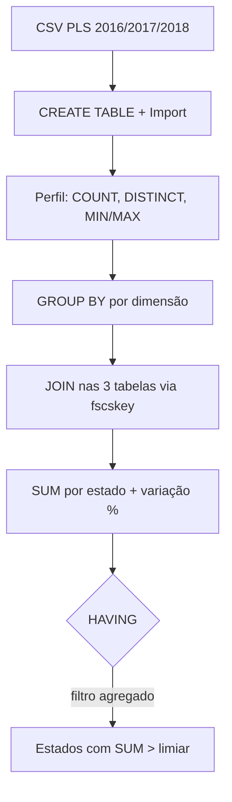
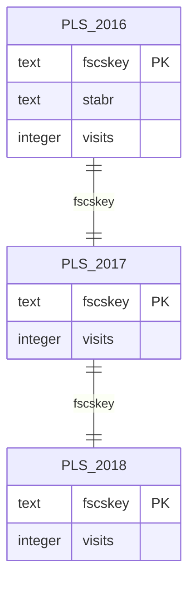

## Visão Geral do Conceito

Relatórios de negócio raramente precisam de linhas brutas: precisam de **resumos** — quantos registros existem, totais por estado, tendências entre anos. As funções de agregação e a cláusula <mark style="background-color: #242424; padding: 2px 4px; border-radius: 3px; color: inherit;">`GROUP BY`</mark> transformam milhares de linhas em métricas legíveis para dashboards e decisões.

Esta lição reconstrói a **Etapa 9** da disciplina (capítulo 9 de *Practical SQL*, 2ª ed.), usando dados reais de bibliotecas públicas dos EUA (PLS FY2016–2018). O cenário conecta SQL diretamente a **Business Intelligence (BI)**: comparar o mesmo indicador (`visits`) ao longo de anos para identificar tendências.

> **Problema central:** dados históricos ficam em tabelas separadas por ano. Para responder “como mudaram as visitas por estado entre 2016 e 2018?”, é preciso **agregar** cada tabela, **unir** pela chave da agência e **calcular** variações — tudo em uma consulta.

---

## Modelo Mental

Pense em três planilhas idênticas (2016, 2017, 2018), cada uma com ~9.200 bibliotecas. Cada linha é uma agência; cada coluna é um atributo (`stabr` = estado, `visits` = visitantes anuais).

O fluxo analítico segue quatro etapas:

1. **Carregar** — criar tabelas e importar CSVs.
2. **Perfilhar** — `COUNT`, `DISTINCT`, `MIN`/`MAX` para entender qualidade e duplicatas.
3. **Agrupar** — `GROUP BY` colapsa linhas em grupos (ex.: um grupo por estado).
4. **Cruzar anos** — `JOIN` pelas três tabelas na mesma chave (`fscskey`) e comparar somas.



---

## Mecânica Central

### Ambiente e carga de dados

No SQLiteStudio, crie o banco `ligacao_tabelas_group_sum.db` e três tabelas com estrutura idêntica:

```sql
CREATE TABLE pls_fy2016_libraries (
    stabr   text NOT NULL,
    fscskey text CONSTRAINT fscskey_2016_pkey PRIMARY KEY,
    libid   text NOT NULL,
    libname text NOT NULL,
    address text NOT NULL,
    city    text NOT NULL,
    zip     text NOT NULL,
    phone   text NOT NULL,
    visits  integer NOT NULL,
    longitude text NOT NULL,
    latitude  text NOT NULL
);
```

Repita para `pls_fy2017_libraries` e `pls_fy2018_libraries` (ajuste o nome da constraint da PK).

Importe os CSVs via **Tools → Import**, configurando:

- **First line represents CSV column names**
- **Field separator:** `;` (ponto e vírgula — não vírgula)
- Encoding: System

Valores esperados após importação: ~9.252 (2016), ~9.245 (2017), ~9.261 (2018) registros.

### Funções de agregação essenciais

| Função | Papel | Exemplo no material |
|--------|-------|---------------------|
| <mark style="background-color: #242424; padding: 2px 4px; border-radius: 3px; color: inherit;">`COUNT(*)`</mark> | Conta linhas | Total de bibliotecas por ano |
| <mark style="background-color: #242424; padding: 2px 4px; border-radius: 3px; color: inherit;">`COUNT(coluna)`</mark> | Conta valores não nulos | `COUNT(phone)` — aqui igual a `COUNT(*)` porque `phone` é NOT NULL |
| <mark style="background-color: #242424; padding: 2px 4px; border-radius: 3px; color: inherit;">`COUNT(DISTINCT col)`</mark> | Conta valores únicos | `libname` tem duplicatas: 9.252 linhas vs ~8.456 nomes distintos |
| <mark style="background-color: #242424; padding: 2px 4px; border-radius: 3px; color: inherit;">`MAX` / `MIN`</mark> | Extremos | `visits`: máx ~17M; mín **-3** (sentinel) |
| <mark style="background-color: #242424; padding: 2px 4px; border-radius: 3px; color: inherit;">`SUM`</mark> | Soma do grupo | Total de visitas por ano ou por estado |

> **Sentinels em `visits`:** `-1` = não resposta; `-3` = não aplicável (biblioteca fechada temporária ou permanentemente). Sempre filtre `WHERE visits >= 0` antes de somar.

### GROUP BY

<mark style="background-color: #242424; padding: 2px 4px; border-radius: 3px; color: inherit;">`GROUP BY`</mark> agrupa linhas com valores iguais nas colunas listadas. Colunas no `SELECT` que não estão no `GROUP BY` devem estar dentro de funções de agregação.

**Listar estados únicos** (comportamento similar a `DISTINCT`):

```sql
SELECT stabr
FROM pls_fy2016_libraries
GROUP BY stabr
ORDER BY stabr;
-- Resultado: 53 estados em 2016; 54 em 2017; 55 em 2018
```

**Bibliotecas por estado** (agregação com contagem):

```sql
SELECT stabr, COUNT(*) AS total
FROM pls_fy2016_libraries
GROUP BY stabr
ORDER BY COUNT(*) DESC;
-- NY: 756; IL: 626; TX: 559...
```

**Grupos compostos** (cidade + estado):

```sql
SELECT city, stabr
FROM pls_fy2016_libraries
GROUP BY city, stabr
ORDER BY city, stabr;
```

### JOIN multi-ano + agregação

Unir as três tabelas pela chave primária `fscskey` (identificador único da agência):



```sql
SELECT SUM(pls16.visits) AS visits_2016,
       SUM(pls17.visits) AS visits_2017,
       SUM(pls18.visits) AS visits_2018
FROM pls_fy2018_libraries pls18
JOIN pls_fy2017_libraries pls17 ON pls18.fscskey = pls17.fscskey
JOIN pls_fy2016_libraries pls16 ON pls18.fscskey = pls16.fscskey
WHERE pls18.visits >= 0
  AND pls17.visits >= 0
  AND pls16.visits >= 0;
```

> **Regra:** <mark style="background-color: #242424; padding: 2px 4px; border-radius: 3px; color: inherit;">`JOIN`</mark> sem qualificador é <mark style="background-color: #242424; padding: 2px 4px; border-radius: 3px; color: inherit;">`INNER JOIN`</mark> — só agências presentes nos três anos entram no resultado.

### Variação percentual: CAST e ROUND

Para comparar anos por estado:

```sql
SELECT pls18.stabr,
       SUM(pls16.visits) AS visits_2016,
       SUM(pls17.visits) AS visits_2017,
       SUM(pls18.visits) AS visits_2018,
       ROUND(
         CAST(SUM(pls18.visits) - SUM(pls17.visits) AS float)
         / CAST(SUM(pls17.visits) AS float) * 100, 1
       ) AS chg_2018_17,
       ROUND(
         CAST(SUM(pls17.visits) - SUM(pls16.visits) AS float)
         / CAST(SUM(pls16.visits) AS float) * 100, 1
       ) AS chg_2017_16
FROM pls_fy2018_libraries pls18
JOIN pls_fy2017_libraries pls17 ON pls18.fscskey = pls17.fscskey
JOIN pls_fy2016_libraries pls16 ON pls18.fscskey = pls16.fscskey
WHERE pls18.visits >= 0
  AND pls17.visits >= 0
  AND pls16.visits >= 0
GROUP BY pls18.stabr
ORDER BY chg_2018_17 DESC;
```

<mark style="background-color: #242424; padding: 2px 4px; border-radius: 3px; color: inherit;">`CAST(... AS float)`</mark> garante divisão real (não inteira). <mark style="background-color: #242424; padding: 2px 4px; border-radius: 3px; color: inherit;">`ROUND(..., 1)`</mark> arredonda para uma casa decimal.

### HAVING — filtro sobre grupos

<mark style="background-color: #242424; padding: 2px 4px; border-radius: 3px; color: inherit;">`WHERE`</mark> filtra **antes** do agrupamento (linha a linha). <mark style="background-color: #242424; padding: 2px 4px; border-radius: 3px; color: inherit;">`HAVING`</mark> filtra **depois** — sobre o resultado do `GROUP BY`.

```sql
-- Mesma consulta anterior, mas só estados com mais de 50 milhões de visitas em 2018
...
GROUP BY pls18.stabr
HAVING SUM(pls18.visits) > 50000000
ORDER BY chg_2018_17 DESC;
-- Reduz de ~53 estados para 6
```

---

## Uso Prático

### Relatório de tendência para BI

Um analista de dados em ADS recebe três exports anuais de um sistema legado. O pipeline típico:

1. Normalizar estrutura (`CREATE TABLE` idêntica por ano).
2. Validar carga (`SELECT COUNT(*)` vs linhas importadas).
3. Detectar dados sujos (`MIN(visits)` revela sentinels).
4. Publicar métrica de negócio (`SUM` por estado com `GROUP BY`).
5. Enriquecer com comparativo (`JOIN` + cálculo de `%` de mudança).

### Soma segura por ano isolado

```sql
SELECT SUM(visits) AS visits_2016
FROM pls_fy2016_libraries
WHERE visits >= 0;
-- ~1,35 bilhão em 2016; queda progressiva em 2017 e 2018
```

### Servidor vs cliente no SQLite

No SQLiteStudio local, o arquivo `.db` é simultaneamente **servidor** (armazena dados) e o estúdio é o **cliente** (executa comandos). Essa distinção importa quando migrar para PostgreSQL ou MySQL, onde servidor e cliente são processos separados.

---

## Erros Comuns

**Esquecer filtro de sentinels antes de SUM:** somar `visits` sem `WHERE visits >= 0` inclui -1 e -3, distorcendo totais nacionais.

**Confundir WHERE com HAVING:** `WHERE SUM(visits) > 50000000` gera erro de sintaxe — agregações não vão no `WHERE`.

**GROUP BY incompleto:** `SELECT stabr, city, COUNT(*)` sem agrupar `city` quando ambas aparecem no `SELECT` viola regra SQL (SQLite pode aceitar comportamento legado; outros SGBDs rejeitam).

**JOIN por coluna errada:** usar `libname` em vez de `fscskey` liga bibliotecas homônimas incorretamente.

**Import CSV com separador errado:** usar vírgula em arquivo delimitado por `;` desloca todas as colunas.

**COUNT(*) vs COUNT(DISTINCT):** assumir que são iguais ignora duplicatas de nome — a diferença (9.252 − 8.456 = 796) são registros com `libname` repetido.

---

## Visão Geral de Debugging

1. **Contagem não bate com import:** execute `SELECT COUNT(*)` imediatamente após import; compare com mensagem do SQLiteStudio.
2. **SUM absurdo:** verifique `MIN(visits)` e aplique `WHERE visits >= 0`.
3. **JOIN retorna poucas linhas:** `INNER JOIN` exige match nos três anos — agências novas ou encerradas somem.
4. **Divisão inteira em percentual:** sem `CAST AS float`, resultado pode ser 0.
5. **HAVING não filtra:** confirme que a condição usa função agregada (`SUM`, `COUNT`), não coluna bruta do grupo.

<details>
<summary>Ver checklist de validação pós-carga</summary>

```sql
SELECT COUNT(*) FROM pls_fy2016_libraries;
SELECT COUNT(phone) FROM pls_fy2016_libraries;
SELECT COUNT(DISTINCT libname) FROM pls_fy2016_libraries;
SELECT MAX(visits), MIN(visits) FROM pls_fy2016_libraries;
```

Se `COUNT(*)` = `COUNT(phone)` e `COUNT(DISTINCT libname)` < `COUNT(*)`, os dados estão coerentes com o material da aula.
</details>

---

## Principais Pontos

- Agregações transformam linhas em métricas; `GROUP BY` define a granularidade do relatório.
- `COUNT(DISTINCT)` revela duplicatas que `COUNT(*)` esconde.
- Sentinels negativos em colunas numéricas exigem filtro explícito antes de somar.
- `JOIN` + `GROUP BY` + funções agregadas permitem análise multi-ano em uma consulta.
- `HAVING` filtra grupos; `WHERE` filtra linhas — ordem de execução importa.
- `CAST` e `ROUND` são necessários para percentuais legíveis em SQL.
- Comparar anos é prática central de BI; a unidade temporal depende do negócio.

---

## Preparação para Prática

Após esta lição, você deve conseguir:

- Importar CSV delimitado por `;` no SQLiteStudio.
- Escrever consultas com `GROUP BY` e `ORDER BY` em métricas agregadas.
- Montar `JOIN` entre três tabelas com apelidos (`pls16`, `pls17`, `pls18`).
- Aplicar `HAVING` para filtrar grupos por limiar de negócio.
- Interpretar variação percentual entre períodos no contexto do AT da disciplina.

---

## Laboratório de Prática

### Easy — Contagem e duplicatas

Dado o banco `ligacao_tabelas_group_sum.db` com a tabela `pls_fy2018_libraries` já carregada:

```sql
-- Conte o total de bibliotecas em 2018
SELECT COUNT(*) AS total_bibliotecas
FROM pls_fy2018_libraries;

-- TODO: contar quantos nomes distintos (libname) existem em 2018
SELECT COUNT(DISTINCT libname) AS nomes_unicos
FROM pls_fy2018_libraries;
```

### Medium — Agências por estado

```sql
-- Liste estado e quantidade de bibliotecas, do maior para o menor
SELECT stabr,
       COUNT(*) AS qtd_bibliotecas
FROM pls_fy2017_libraries
-- TODO: completar agrupamento e ordenação
GROUP BY stabr
ORDER BY qtd_bibliotecas DESC;
```

### Hard — Estados de alto volume com HAVING

```sql
-- Estados com soma de visitas >= 0 em 2018 superior a 10 milhões
SELECT stabr,
       SUM(visits) AS total_visitas
FROM pls_fy2018_libraries
WHERE visits >= 0
GROUP BY stabr
-- TODO: filtrar apenas grupos com total_visitas > 10000000
HAVING SUM(visits) > 10000000
ORDER BY total_visitas DESC;
```

---

<!-- CONCEPT_EXTRACTION
concepts:
  - COUNT e COUNT DISTINCT
  - SUM MAX MIN
  - GROUP BY
  - HAVING
  - JOIN multi-tabela
  - CAST e ROUND
  - análise temporal BI
  - importação CSV
skills:
  - Perfilhar tabelas com funções de agregação
  - Agrupar dados por dimensões de negócio
  - Filtrar grupos com HAVING
  - Unir tabelas anuais e calcular variação percentual
  - Importar CSV com separador ponto-e-vírgula no SQLiteStudio
examples:
  - pls-bibliotecas-count-distinct
  - group-by-estado-bibliotecas
  - join-tres-anos-variacao-percentual
  - having-estados-alto-volume
-->

<!-- EXERCISES_JSON
[
  {
    "id": "pls-count-distinct-libname",
    "slug": "pls-count-distinct-libname",
    "difficulty": "easy",
    "title": "COUNT e COUNT DISTINCT em bibliotecas",
    "discipline": "sql-e-modelagem-relacional",
    "editorLanguage": "sql",
    "tags": ["sql", "count", "distinct", "agregacao"],
    "summary": "Completar consulta COUNT(DISTINCT libname) para detectar nomes duplicados no dataset PLS 2018."
  },
  {
    "id": "group-by-estado-bibliotecas",
    "slug": "group-by-estado-bibliotecas",
    "difficulty": "medium",
    "title": "Bibliotecas por estado com GROUP BY",
    "discipline": "sql-e-modelagem-relacional",
    "editorLanguage": "sql",
    "tags": ["sql", "group-by", "order-by"],
    "summary": "Agrupar bibliotecas por estado e ordenar por quantidade decrescente."
  },
  {
    "id": "having-estados-alto-volume",
    "slug": "having-estados-alto-volume",
    "difficulty": "hard",
    "title": "Filtrar estados com HAVING",
    "discipline": "sql-e-modelagem-relacional",
    "editorLanguage": "sql",
    "tags": ["sql", "having", "sum", "group-by"],
    "summary": "Listar estados cujo total de visitas em 2018 supera 10 milhões usando HAVING."
  }
]
-->
