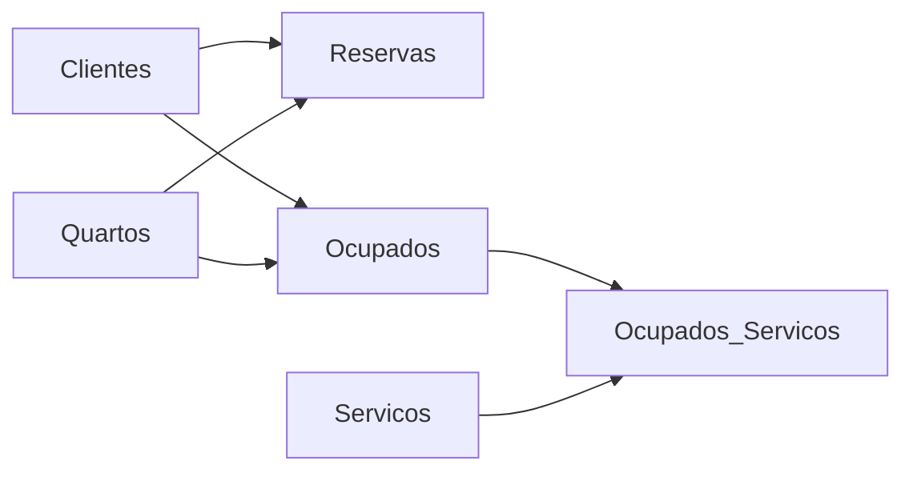
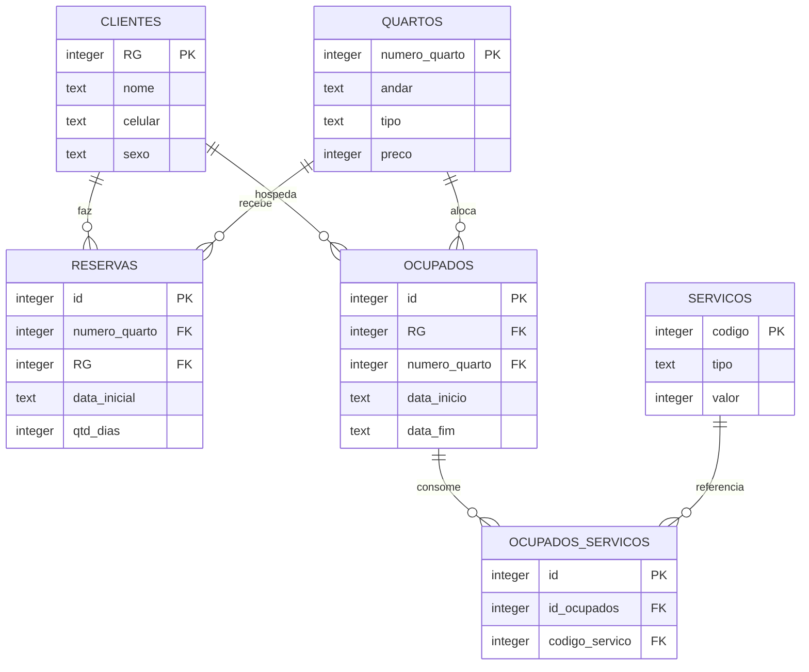

## Visão Geral do Conceito

Modelar entidades no diagrama é o primeiro passo; **implementar** no SGBD é o que torna o sistema utilizável. Esta lição materializa o modelo Hotel construído colaborativamente nas aulas anteriores: seis tabelas, chaves primárias e estrangeiras, dados de exemplo e consultas que cruzam reservas com ocupação efetiva.

O arquivo `Material-Hotel.txt` (disponibilizado no Infinite Campus) contém o script completo para `hotel.db`. A aula prática demonstra a ordem de execução, a lógica de contagem de diárias e o comportamento do <mark style="background-color: #242424; padding: 2px 4px; border-radius: 3px; color: inherit;">`INNER JOIN`</mark> quando reserva e ocupação divergem.

> **Problema central:** um hotel precisa saber quem **reservou** (futuro) e quem **ocupou** (presente/passado). Misturar os dois estados impede consultas como “quem reservou mas não compareceu?” — exatamente o caso do João neste dataset.

**Não coberto no material da Aula 17:** a sessão do dia 09/06/2026 foi dedicada a **monitoria** — dúvidas sobre o AT, esclarecimento sobre uso da tabela `livros` vs `livros_catalogo`, e tempo livre para entregas de outras disciplinas. Não há conteúdo técnico SQL novo na Aula 17.

---

## Modelo Mental

O banco `hotel.db` organiza o fluxo operacional:



1. **Cadastro** — clientes, quartos e catálogo de serviços existem independentemente.
2. **Reserva** — cliente escolhe quarto, data inicial e quantidade de dias (compromisso futuro).
3. **Ocupação** — após check-in, registro com data_inicio e data_fim reais.
4. **Consumo** — cada serviço usado na estadia gera uma linha em `Ocupados_Servicos`.



---

## Mecânica Central

### Ordem de criação das tabelas

Tabelas **sem chave estrangeira** vêm primeiro:

| Ordem | Tabela | Motivo |
|-------|--------|--------|
| 1 | `Clientes` | Referenciada por Reservas e Ocupados |
| 2 | `Servicos` | Referenciada por Ocupados_Servicos |
| 3 | `Quartos` | Referenciada por Reservas e Ocupados |
| 4 | `Reservas` | FK → Clientes, Quartos |
| 5 | `Ocupados` | FK → Clientes, Quartos |
| 6 | `Ocupados_Servicos` | FK → Ocupados, Servicos (N:N) |

### DDL das tabelas base

```sql
CREATE TABLE Clientes (
    RG      integer,
    nome    text,
    celular text,
    sexo    text,
    CONSTRAINT pk_clientes PRIMARY KEY (RG)
);

CREATE TABLE Servicos (
    codigo    integer,
    tipo      text,
    descricao text,
    valor     integer,
    CONSTRAINT pk_servicos PRIMARY KEY (codigo)
);

CREATE TABLE Quartos (
    numero_quarto integer,
    andar         text,
    tipo          text,
    descricao     text,
    preco         integer,
    CONSTRAINT pk_quartos PRIMARY KEY (numero_quarto)
);
```

### Tabelas com relacionamentos

```sql
CREATE TABLE Reservas (
    id            integer,
    numero_quarto integer REFERENCES Quartos (numero_quarto),
    data_inicial  text,
    qtd_dias      integer,
    RG            integer REFERENCES Clientes (RG),
    CONSTRAINT pk_reservas PRIMARY KEY (id)
);

CREATE TABLE Ocupados (
    id            integer,
    RG            integer REFERENCES Clientes (RG),
    numero_quarto integer REFERENCES Quartos (numero_quarto),
    data_inicio   text,
    data_fim      text,
    CONSTRAINT pk_ocupados PRIMARY KEY (id)
);

CREATE TABLE Ocupados_Servicos (
    id             integer,
    id_ocupados    integer REFERENCES Ocupados (id),
    codigo_servico integer REFERENCES Servicos (codigo),
    CONSTRAINT pk_ocupados_servicos PRIMARY KEY (id)
);
```

> **Atenção:** `qtd_dias` em Reservas deve ser <mark style="background-color: #242424; padding: 2px 4px; border-radius: 3px; color: inherit;">`integer`</mark>, não `text`.

### Lógica de datas na ocupação

Maria (RG 1) reservou quarto 101 a partir de `01-jan-2026` por 3 dias. Na ocupação efetiva:

- `data_inicio`: `01-jan-2026` (dia do check-in)
- `data_fim`: `04-jan-2026` (o dia 02, 03 e 04 contam como dias de estadia após o primeiro dia)

A contagem de diárias na reserva usa `qtd_dias`; na ocupação, as datas reais de entrada e saída substituem a estimativa.

### Dados carregados (resumo)

| Tabela | Registros | Destaque |
|--------|-----------|----------|
| Clientes | 6 | 3F + 3M |
| Servicos | 10 | Limpeza, Alimentação, Consumo |
| Quartos | 12 | Andares 1–3; Simples, Luxo, Extra luxo |
| Reservas | 6 | Uma por cliente cadastrado com reserva |
| Ocupados | 3 | Apenas RG 1, 3 e 4 — **João (2) reservou mas não ocupou** |
| Ocupados_Servicos | 12 | Ocupação 1: 5 serviços; Ocupação 2: 3; Ocupação 3: 4 |

### INNER JOIN — reserva da Maria

```sql
SELECT *
FROM Clientes C
INNER JOIN Reservas R ON C.RG = R.RG
WHERE C.RG = 1;
```

Equivalente filtrando por nome:

```sql
SELECT *
FROM Clientes C
INNER JOIN Reservas R ON C.RG = R.RG
WHERE C.nome = 'Maria';
```

### INNER JOIN — ocupação da Maria

```sql
SELECT *
FROM Clientes C
INNER JOIN Ocupados O ON C.RG = O.RG
WHERE C.nome = 'Maria';
```

### Caso João: reserva sem ocupação

```sql
-- João (RG 2) aparece aqui:
SELECT * FROM Clientes C
INNER JOIN Reservas R ON C.RG = R.RG
WHERE C.RG = 2;

-- Mas NÃO aparece aqui (INNER JOIN sem match em Ocupados):
SELECT * FROM Clientes C
INNER JOIN Ocupados O ON C.RG = O.RG
WHERE C.RG = 2;
-- Resultado vazio
```

> **Regra:** <mark style="background-color: #242424; padding: 2px 4px; border-radius: 3px; color: inherit;">`INNER JOIN`</mark> retorna apenas linhas com correspondência **nas duas** tabelas. Para listar quem reservou sem ocupar, use <mark style="background-color: #242424; padding: 2px 4px; border-radius: 3px; color: inherit;">`LEFT JOIN`</mark> (coberto em [[joins-e-ligacao-de-tabelas]]).

---

## Uso Prático

### Montar o banco do zero no SQLiteStudio

1. **Database → Add a database** → nome `hotel.db`
2. Executar `CREATE TABLE` na ordem das dependências
3. Executar `INSERT` de cada tabela
4. Validar com `SELECT * FROM tabela` para cada uma das seis tabelas

### Consulta de faturamento de serviços por hóspede

Base para relatórios futuros (combina quatro tabelas):

```sql
SELECT C.nome,
       S.descricao,
       S.valor
FROM Clientes C
INNER JOIN Ocupados O ON C.RG = O.RG
INNER JOIN Ocupados_Servicos OS ON O.id = OS.id_ocupados
INNER JOIN Servicos S ON OS.codigo_servico = S.codigo
WHERE C.nome = 'Maria';
```

### Extensão do modelo

O professor reforça que o modelo é **aberto**: você pode adicionar colunas (ex.: `email`, `status_reserva`) ou registros extras. Em sistemas reais de hotelaria, surgem tabelas adicionais (pagamentos, funcionários, manutenção).

---

## Erros Comuns

**Criar Reservas antes de Clientes:** `FOREIGN KEY` falha porque a tabela referenciada não existe.

**Confundir `id_ocupados` com `RG`:** em `Ocupados_Servicos`, a FK aponta para `Ocupados.id` (identificador da estadia), não para o documento do cliente.

**Tipo errado em `qtd_dias`:** definir como `text` impede operações aritméticas e comparações numéricas.

**Esperar INNER JOIN mostrar João em Ocupados:** reserva ≠ ocupação; o join interno exclui quem não fez check-in.

**Constraint PK duplicada em Ocupados_Servicos:** o material original nomeia a constraint `pk_ocupados` — em produção, use nome único (`pk_ocupados_servicos`) para evitar conflito.

**Inserir FK inexistente:** referenciar `codigo_servico = 99` sem registro em `Servicos` viola integridade referencial.

---

## Visão Geral de Debugging

1. **Tabela vazia após INSERT:** verifique ponto-e-vírgula no final de cada comando e se o `INSERT` foi executado (não só o `CREATE`).
2. **JOIN retorna vazio:** confirme que o valor da FK existe na tabela pai (`SELECT * FROM Ocupados WHERE RG = 2`).
3. **Colunas com nomes ambíguos:** qualifique com apelido (`C.RG`, `O.RG`) quando ambas as tabelas têm coluna homônima.
4. **Dados inconsistentes entre papel e banco:** monte rascunho no papel ou planilha antes de inserir — o professor enfatiza visualizar valores antes do `INSERT`.
5. **Serviços não batem com ocupação:** verifique `id_ocupados` na junção contra `Ocupados.id`, não contra `RG`.

<details>
<summary>Ver script de verificação rápida</summary>

```sql
SELECT 'Clientes' AS tabela, COUNT(*) AS n FROM Clientes
UNION ALL SELECT 'Servicos', COUNT(*) FROM Servicos
UNION ALL SELECT 'Quartos', COUNT(*) FROM Quartos
UNION ALL SELECT 'Reservas', COUNT(*) FROM Reservas
UNION ALL SELECT 'Ocupados', COUNT(*) FROM Ocupados
UNION ALL SELECT 'Ocupados_Servicos', COUNT(*) FROM Ocupados_Servicos;
-- Esperado: 6, 10, 12, 6, 3, 12
```
</details>

---

## Principais Pontos

- Implementação segue ordem de dependência: tabelas pai antes das filhas.
- Reserva registra intenção; Ocupados registra estadia efetiva com datas reais.
- `Ocupados_Servicos` resolve N:N entre estadia e catálogo de serviços.
- `INNER JOIN` só retorna pares com match — ideal para “quem de fato se hospedou”.
- Filtrar por `RG` ou `nome` no `WHERE` após o join restringe o resultado ao hóspede desejado.
- Validar com `SELECT *` em cada tabela antes de consultas complexas.
- Aula 17 foi monitoria do AT, sem conteúdo SQL adicional.

---

## Preparação para Prática

Você deve ser capaz de:

- Recriar `hotel.db` a partir do `Material-Hotel.txt`.
- Explicar por que apenas 3 dos 6 clientes com reserva aparecem em `Ocupados`.
- Escrever join Clientes ↔ Reservas ↔ Ocupados com filtro por nome.
- Identificar FKs corretas na tabela de junção de serviços.
- Aplicar esses padrões no AT da disciplina (Parte A com consultas; Parte B com modelagem).

---

## Laboratório de Prática

### Easy — Listar hóspedes e reservas

```sql
-- Liste nome do cliente e número do quarto reservado
SELECT C.nome,
       R.numero_quarto
FROM Clientes C
INNER JOIN Reservas R ON C.RG = R.RG;
-- TODO: filtrar apenas reservas do quarto 201
-- WHERE R.numero_quarto = 201
```

### Medium — Quem ocupou o hotel?

```sql
-- Clientes que efetivamente ocuparam (check-in realizado)
SELECT C.nome,
       O.numero_quarto,
       O.data_inicio,
       O.data_fim
FROM Clientes C
INNER JOIN Ocupados O ON C.RG = O.RG
-- TODO: ordenar por data de início
ORDER BY O.data_inicio;
```

### Hard — Consumo de serviços por ocupação

```sql
-- Total de valor consumido por cada ocupação (soma dos serviços)
SELECT O.id AS id_ocupacao,
       C.nome,
       SUM(S.valor) AS total_servicos
FROM Ocupados O
INNER JOIN Clientes C ON O.RG = C.RG
INNER JOIN Ocupados_Servicos OS ON O.id = OS.id_ocupados
INNER JOIN Servicos S ON OS.codigo_servico = S.codigo
-- TODO: agrupar por ocupação e nome do cliente
GROUP BY O.id, C.nome
ORDER BY total_servicos DESC;
```

---

<!-- CONCEPT_EXTRACTION
concepts:
  - CREATE TABLE com FOREIGN KEY
  - ordem de dependência DDL
  - reserva versus ocupação
  - tabela de junção N:N
  - INNER JOIN na prática
skills:
  - Implementar modelo relacional completo em SQLite
  - Carregar dados de exemplo com INSERT
  - Cruzar tabelas Clientes Reservas Ocupados com JOIN
  - Diagnosticar ausência de match em INNER JOIN
  - Calcular totais de serviços com GROUP BY
examples:
  - hotel-create-tables-ordem
  - join-maria-reserva-ocupacao
  - joao-reserva-sem-ocupacao
  - faturamento-servicos-por-hospede
-->

<!-- EXERCISES_JSON
[
  {
    "id": "hotel-join-reservas-quarto",
    "slug": "hotel-join-reservas-quarto",
    "difficulty": "easy",
    "title": "JOIN Clientes e Reservas com filtro",
    "discipline": "sql-e-modelagem-relacional",
    "editorLanguage": "sql",
    "tags": ["sql", "inner-join", "where", "hotel"],
    "summary": "Listar clientes e quartos reservados, filtrando por número de quarto."
  },
  {
    "id": "hotel-ocupados-ordenacao",
    "slug": "hotel-ocupados-ordenacao",
    "difficulty": "medium",
    "title": "Hóspedes que ocuparam o hotel",
    "discipline": "sql-e-modelagem-relacional",
    "editorLanguage": "sql",
    "tags": ["sql", "inner-join", "order-by", "hotel"],
    "summary": "Consultar clientes com check-in efetivo e ordenar por data de início."
  },
  {
    "id": "hotel-total-servicos-group-by",
    "slug": "hotel-total-servicos-group-by",
    "difficulty": "hard",
    "title": "Total de serviços por ocupação",
    "discipline": "sql-e-modelagem-relacional",
    "editorLanguage": "sql",
    "tags": ["sql", "join", "group-by", "sum", "hotel"],
    "summary": "Somar valor dos serviços consumidos por cada ocupação usando JOIN e GROUP BY."
  }
]
-->
