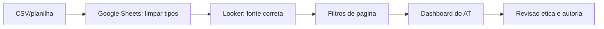

## Visão Geral do Conceito

Esta sessão foi uma monitoria: não introduz uma sequência nova como as aulas anteriores, mas resolve problemas recorrentes do <mark style="background-color: #242424; padding: 2px 4px; border-radius: 3px; color: inherit;">`AT`</mark> no <mark style="background-color: #242424; padding: 2px 4px; border-radius: 3px; color: inherit;">`Looker Studio`</mark>. O foco didático é transformar dúvidas operacionais em checklist de qualidade.

> **Regra:** esta lição foi reconstruída a partir da transcrição da aula e dos materiais disponíveis no repositório; quando a fonte não cobre um detalhe, isso é declarado como lacuna em vez de ser tratado como fato.

## Modelo Mental

A entrega final depende menos de decorar recurso e mais de auditar o pipeline: fonte correta, tipos coerentes, filtros funcionais e gráficos que respondem ao objetivo.



## Mecânica Central

- Fonte duplicada no Looker pode apontar gráfico para dado errado.
- Campo de data como texto quebra filtros temporais.
- <mark style="background-color: #242424; padding: 2px 4px; border-radius: 3px; color: inherit;">`PARSE_DATE`</mark> pode ajudar, mas limpar no Sheets tende a simplificar.
- OLAP aparece como visão analítica extra, não como núcleo da disciplina.

## Uso Prático

Antes de entregar o dashboard da academia, abra cada página, confira a fonte de dados, teste o filtro de data e valide se números principais batem com a planilha.

## Erros Comuns

- Conectar duas fontes com nomes parecidos e editar a errada.
- Usar campo de texto como data.
- Copiar solução de IA sem entender.
- Inserir conteúdo Oracle/OLAP no AT sem relação com o enunciado.

## Visão Geral de Debugging

Quando um filtro de data falhar, confira o tipo do campo na origem, depois no Looker, e só então revise o componente visual.

## Principais Pontos

- Monitoria resolveu riscos do AT.
- Tipo de data precisa estar correto.
- Fonte de dados duplicada causa erro silencioso.
- IA exige autoria e validação.


## Preparação para Prática

Abra seu projeto do AT e aplique uma auditoria objetiva antes de mexer em aparência.

## Laboratório de Prática
### Easy — Auditar fonte no Looker
Complete o checklist de auditoria antes de entregar o AT.
```markdown
# Auditoria Looker

- [ ] TODO: conferir fonte ativa
- [ ] TODO: verificar campo de data
- [ ] TODO: testar filtro da pagina
- [ ] TODO: validar metricas principais
```
Critérios:
- Checar fonte e campo de data.
- Incluir teste visual.
- Registrar correção feita.

### Medium — Planejar índice SQL
Complete os índices para uma consulta de relatório.
```sql
-- Consulta alvo
SELECT p.id, c.nome
FROM pedido p
LEFT JOIN cliente c ON c.id = p.cliente_id
WHERE p.status = 'aberto';

-- TODO: criar índice para o filtro de status
-- TODO: avaliar índice para FK cliente_id
```
Critérios:
- Indexar coluna usada em filtro seletivo.
- Avaliar FK usada em JOIN.
- Explicar custo de escrita.

### Hard — Plano final do AT
Monte um plano de validação final para o AT.
```markdown
# Plano final do AT

## Pendências
- TODO

## Validações
- TODO

## Riscos
- TODO
```
Critérios:
- Separar pendência de risco.
- Incluir validação com dado real.
- Priorizar o que impacta nota/entrega.


<!-- CONCEPT_EXTRACTION
concepts:
  - monitoria AT
  - Looker Studio
  - fonte de dados
  - campo de data
  - Google Sheets
  - OLAP
  - ética acadêmica
skills:
  - Auditar fontes no Looker
  - Corrigir tipos de data
  - Validar filtros de página
  - Aplicar ética no AT
examples:
  - at-academia-parse-date
  - fonte-duplicada-looker
  - olap-visao-extra
-->

<!-- EXERCISES_JSON
[
  {
    "id": "monitoria-at-looker-fontes-datas-olap-auditar-looker",
    "slug": "monitoria-at-looker-fontes-datas-olap-auditar-looker",
    "difficulty": "easy",
    "title": "Auditar fonte no Looker",
    "discipline": "visualizacao-sql",
    "editorLanguage": "markdown",
    "tags": [
      "looker",
      "dados",
      "at"
    ],
    "summary": "Criar checklist para validar fonte de dados e tipo de data no Looker Studio."
  },
  {
    "id": "monitoria-at-looker-fontes-datas-olap-consulta-indices",
    "slug": "monitoria-at-looker-fontes-datas-olap-consulta-indices",
    "difficulty": "medium",
    "title": "Planejar índice SQL",
    "discipline": "visualizacao-sql",
    "editorLanguage": "sql",
    "tags": [
      "sql",
      "indices",
      "performance"
    ],
    "summary": "Escolher coluna candidata a índice com base em WHERE e JOIN."
  },
  {
    "id": "monitoria-at-looker-fontes-datas-olap-plano-at",
    "slug": "monitoria-at-looker-fontes-datas-olap-plano-at",
    "difficulty": "hard",
    "title": "Plano final do AT",
    "discipline": "visualizacao-sql",
    "editorLanguage": "markdown",
    "tags": [
      "at",
      "looker",
      "sql"
    ],
    "summary": "Planejar ajustes finais do AT com riscos e validações."
  }
]
-->

<!-- SOURCE_CONTEXT
canonical_memory: MEMORIES.md
source: downloads/Introducao_a_Visualizacao_de_Dados_e_SQL/Aula_18_-_31032026.md
source_sha256: 5c50c2695cd880b2f9c2ea668251b24e69588b87a789f01ab39a60f0f85d01dd
source: downloads/Introducao_a_Visualizacao_de_Dados_e_SQL/Aula_18_-_31032026.vtt
source_sha256: c6d58e4816a04f5f42e1eff9dd97f80d8537c0e25059ec708ef8fd6379a6d442
notes:
  - Sessão de monitoria, não aula nova linear.
  - Sem documento específico da aula no manifest.
-->
