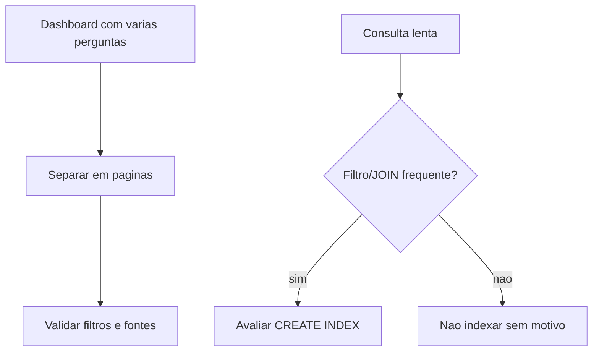

## Visão Geral do Conceito

A aula 19 também é monitoria. Ela fecha dúvidas de <mark style="background-color: #242424; padding: 2px 4px; border-radius: 3px; color: inherit;">`Looker Studio`</mark> para o AT e traz uma conversa prática sobre <mark style="background-color: #242424; padding: 2px 4px; border-radius: 3px; color: inherit;">`índices SQL`</mark> em contexto de trabalho com Oracle. A lição separa o que é essencial ao AT do que é aprofundamento profissional.

> **Regra:** esta lição foi reconstruída a partir da transcrição da aula e dos materiais disponíveis no repositório; quando a fonte não cobre um detalhe, isso é declarado como lacuna em vez de ser tratado como fato.

## Modelo Mental

Páginas organizam a narrativa do dashboard; índices organizam o caminho de busca do banco. Ambos existem para reduzir esforço de leitura, mas exigem projeto consciente.



## Mecânica Central

- Páginas no Looker segmentam análises sem misturar todos os gráficos.
- <mark style="background-color: #242424; padding: 2px 4px; border-radius: 3px; color: inherit;">`CREATE INDEX`</mark> ajuda buscas seletivas e JOINs frequentes.
- FK usada em JOIN pode se beneficiar de índice conforme volume.
- <mark style="background-color: #242424; padding: 2px 4px; border-radius: 3px; color: inherit;">`LEFT JOIN`</mark> preserva linhas da tabela à esquerda, mas ainda pode custar caro.
- Trechos de Oracle/PL/SQL são extras, não requisito central do AT.

## Uso Prático

No AT, use páginas para separar visão geral, métricas por categoria e detalhes. Em SQL profissional, avalie índices nas colunas de filtro e relacionamento antes de otimizar por tentativa.

## Erros Comuns

- Colocar todos os gráficos em uma página.
- Criar índice em toda coluna sem medir uso.
- Ignorar custo de escrita.
- Confundir recurso extra de Oracle com obrigação da disciplina.

## Visão Geral de Debugging

Para dashboard confuso, revise a pergunta de cada página. Para query lenta, veja WHERE, JOIN e volume antes de criar índice.

## Principais Pontos

- Páginas dão narrativa ao dashboard.
- Índices aceleram leitura seletiva.
- Índices custam em escrita.
- Monitoria deve virar checklist final.


## Preparação para Prática

Liste as perguntas do seu AT e transforme cada grupo em página ou seção; depois revise queries de apoio com foco em filtros e joins.

## Laboratório de Prática
### Easy — Auditar fonte no Looker
Complete o checklist de auditoria antes de entregar o AT.
```markdown
# Auditoria Looker

- [ ] TODO: conferir fonte ativa
- [ ] TODO: verificar campo de data
- [ ] TODO: testar filtro da pagina
- [ ] TODO: validar metricas principais
```
Critérios:
- Checar fonte e campo de data.
- Incluir teste visual.
- Registrar correção feita.

### Medium — Planejar índice SQL
Complete os índices para uma consulta de relatório.
```sql
-- Consulta alvo
SELECT p.id, c.nome
FROM pedido p
LEFT JOIN cliente c ON c.id = p.cliente_id
WHERE p.status = 'aberto';

-- TODO: criar índice para o filtro de status
-- TODO: avaliar índice para FK cliente_id
```
Critérios:
- Indexar coluna usada em filtro seletivo.
- Avaliar FK usada em JOIN.
- Explicar custo de escrita.

### Hard — Plano final do AT
Monte um plano de validação final para o AT.
```markdown
# Plano final do AT

## Pendências
- TODO

## Validações
- TODO

## Riscos
- TODO
```
Critérios:
- Separar pendência de risco.
- Incluir validação com dado real.
- Priorizar o que impacta nota/entrega.


<!-- CONCEPT_EXTRACTION
concepts:
  - Looker Studio
  - páginas
  - AT
  - índices SQL
  - JOIN
  - LEFT JOIN
  - CREATE INDEX
  - PL/SQL
skills:
  - Organizar dashboards em páginas
  - Planejar índices SQL
  - Avaliar custo de performance
  - Revisar AT tecnicamente
examples:
  - looker-paginas-at
  - create-index-fk
  - group-by-join-produtividade
-->

<!-- EXERCISES_JSON
[
  {
    "id": "monitoria-looker-paginas-at-indices-sql-auditar-looker",
    "slug": "monitoria-looker-paginas-at-indices-sql-auditar-looker",
    "difficulty": "easy",
    "title": "Auditar fonte no Looker",
    "discipline": "visualizacao-sql",
    "editorLanguage": "markdown",
    "tags": [
      "looker",
      "dados",
      "at"
    ],
    "summary": "Criar checklist para validar fonte de dados e tipo de data no Looker Studio."
  },
  {
    "id": "monitoria-looker-paginas-at-indices-sql-consulta-indices",
    "slug": "monitoria-looker-paginas-at-indices-sql-consulta-indices",
    "difficulty": "medium",
    "title": "Planejar índice SQL",
    "discipline": "visualizacao-sql",
    "editorLanguage": "sql",
    "tags": [
      "sql",
      "indices",
      "performance"
    ],
    "summary": "Escolher coluna candidata a índice com base em WHERE e JOIN."
  },
  {
    "id": "monitoria-looker-paginas-at-indices-sql-plano-at",
    "slug": "monitoria-looker-paginas-at-indices-sql-plano-at",
    "difficulty": "hard",
    "title": "Plano final do AT",
    "discipline": "visualizacao-sql",
    "editorLanguage": "markdown",
    "tags": [
      "at",
      "looker",
      "sql"
    ],
    "summary": "Planejar ajustes finais do AT com riscos e validações."
  }
]
-->

<!-- SOURCE_CONTEXT
canonical_memory: MEMORIES.md
source: downloads/Introducao_a_Visualizacao_de_Dados_e_SQL/Aula_19_-_02042026.md
source_sha256: 7fa929d89ec94bdbcec170be45d7a2d6ca14f267efa5b3a2fbc63f9f90c288c3
source: downloads/Introducao_a_Visualizacao_de_Dados_e_SQL/Aula_19_-_02042026.vtt
source_sha256: 1ada56456ea0960930b55e696b5aff15ae6fc0ef20c802da1d8c246b08c5eb56
notes:
  - Sessão de monitoria, não aula nova linear.
  - Inclui conteúdo Oracle/PL-SQL como extra contextual.
-->
