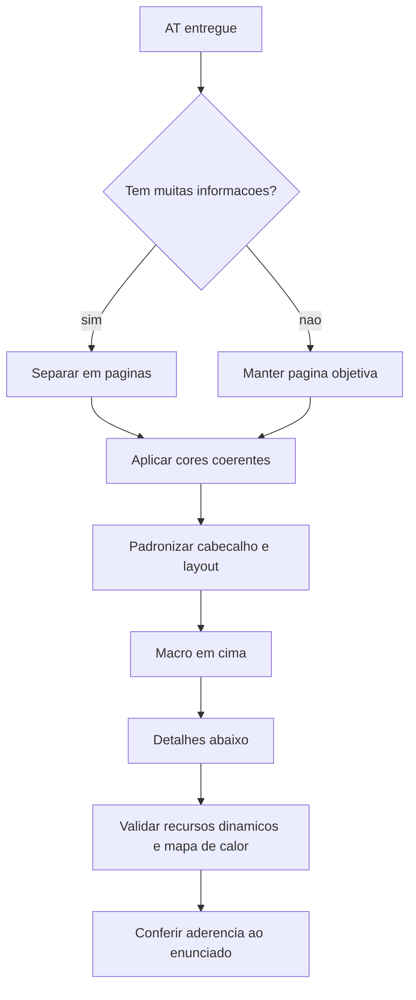

## Visão Geral do Conceito

Esta aula foi uma monitoria de fechamento do primeiro trimestre. O professor deixou claro que não haveria matéria nova: o objetivo era tirar dúvidas, começar a corrigir os <mark style="background-color: #242424; padding: 2px 4px; border-radius: 3px; color: inherit;">`ATs`</mark> entregues e orientar estudantes que quisessem mostrar seus dashboards.

O trecho tecnicamente mais relevante é a avaliação de um dashboard do <mark style="background-color: #242424; padding: 2px 4px; border-radius: 3px; color: inherit;">`AT`</mark>. A conversa menciona páginas, cores vinculadas à empresa ou local de trabalho, cabeçalho padronizado, informações macro no topo, informações detalhadas abaixo, recursos dinâmicos e mapa de calor.

> **Lacuna declarada:** a transcrição não mostra a tela compartilhada nem o enunciado completo do AT. Por isso, esta lição ensina o checklist de revisão verbalizado na monitoria, não uma reprodução visual do dashboard apresentado.

## Modelo Mental

Pense no dashboard como uma apresentação analítica. Cada página precisa responder a uma parte da pergunta, manter identidade visual comum e conduzir a leitura do geral para o específico.

Um dashboard bem organizado não é apenas "bonito". Ele reduz esforço cognitivo: o leitor reconhece padrão, encontra indicadores principais e depois consulta detalhes.



## Mecânica Central

Na monitoria, a avaliação do dashboard aparece como uma sequência de critérios práticos:

- **Páginas:** quando há muitas informações, distribuir a análise em páginas ajuda a não sobrecarregar uma única tela.
- **Cores vinculadas ao contexto:** o professor recomenda usar cores relacionadas à empresa ou ao lugar de trabalho quando isso fizer sentido.
- **Coerência visual:** páginas diferentes devem manter cabeçalho, padrão de cores e organização consistentes.
- **Hierarquia macro/detalhe:** informações mais gerais devem aparecer acima; detalhes ficam abaixo para aprofundamento.
- **Recursos analíticos:** o dashboard mostrado incluía procedimentos dinâmicos e mapa de calor, ambos elogiados como parte do aprendizado com a ferramenta.
- **Correção formal:** o professor separa feedback geral da correção oficial; ainda seria necessário verificar se o trabalho atendia ao que foi pedido.

Essa mecânica é útil para dashboards no <mark style="background-color: #242424; padding: 2px 4px; border-radius: 3px; color: inherit;">`Looker Studio`</mark>, mas a fonte não detalha menus, fórmulas ou configuração interna da ferramenta nesta sessão.

## Uso Prático

Antes de entregar ou revisar um dashboard de AT, aplique uma revisão em duas camadas: leitura visual e aderência ao pedido.

### Checklist de revisão visual

```markdown
# Revisao visual do dashboard

- [ ] O dashboard tem paginas quando ha muitas informacoes.
- [ ] As cores seguem uma identidade coerente.
- [ ] O cabecalho se repete de forma padronizada.
- [ ] Cada pagina mostra informacoes macro antes dos detalhes.
- [ ] Recursos dinamicos foram testados.
- [ ] Mapas de calor, quando usados, ajudam a leitura e nao decoram a tela sem funcao.
```

### Checklist de aderência ao AT

```markdown
# Revisao do enunciado

- [ ] Todos os itens pedidos no AT aparecem no dashboard.
- [ ] Cada pagina tem uma finalidade clara.
- [ ] Os graficos respondem perguntas do trabalho.
- [ ] O resultado final foi conferido contra a planilha/fonte usada.
- [ ] Pendencias foram registradas antes da entrega.
```

> **Regra prática:** elogio visual não encerra a revisão. A entrega só fica segura quando o dashboard também cumpre o enunciado.

## Erros Comuns

- **Colocar muitas informações em uma única página:** deixa a leitura pesada e dificulta encontrar o indicador principal.
- **Usar cores sem coerência:** cada página parece um projeto diferente, mesmo quando faz parte do mesmo relatório.
- **Misturar macro e detalhe sem ordem:** o leitor encontra detalhes antes de entender o contexto geral.
- **Confundir feedback informal com nota:** o professor pode elogiar organização e ainda precisar conferir critérios formais.
- **Ignorar pré-requisitos de entrega:** a transcrição reforça que havia relação entre entrega de <mark style="background-color: #242424; padding: 2px 4px; border-radius: 3px; color: inherit;">`TP1`</mark>, <mark style="background-color: #242424; padding: 2px 4px; border-radius: 3px; color: inherit;">`TP2`</mark>, <mark style="background-color: #242424; padding: 2px 4px; border-radius: 3px; color: inherit;">`TP3`</mark> e correção do AT.

## Visão Geral de Debugging

Quando o dashboard parece "confuso", investigue a estrutura antes de trocar gráfico ou cor.

1. **Verifique a quantidade de informação:** se há muitos blocos, separe por páginas.
2. **Confira padrão visual:** cabeçalho, cores e posição dos componentes devem se repetir.
3. **Teste a ordem de leitura:** o topo comunica a visão macro? A parte inferior aprofunda?
4. **Revise recursos dinâmicos:** filtros, interações e mapas de calor precisam funcionar e fazer sentido.
5. **Volte ao enunciado:** marque item por item o que foi pedido e onde aparece no dashboard.

Se a transcrição não mostra o erro visual exato, a prática segura é registrar hipóteses de revisão em checklist, aplicar uma mudança por vez e comparar antes/depois.

## Principais Pontos

- A aula 20 foi monitoria, não introdução de matéria nova.
- O feedback central foi sobre qualidade de dashboard do AT.
- Páginas ajudam quando há muitas informações.
- Cores, cabeçalho e layout devem manter coerência.
- Informações macro vêm antes de detalhes.
- A correção formal depende de atender ao enunciado, não apenas de aparência.

## Preparação para Prática

Ao final desta lição, você deve conseguir:

- transformar feedback verbal sobre dashboard em checklist objetivo;
- revisar uma página de relatório separando estética, organização e aderência ao enunciado;
- justificar por que um dashboard multipágina precisa de padrão visual;
- declarar lacunas quando a fonte não mostra a tela ou os dados.

## Laboratório de Prática

### Easy — Checklist visual do dashboard

Monte um checklist para revisar um dashboard do AT antes da entrega.

```markdown
# Checklist visual do AT

## Identidade
- [ ] TODO: registrar cores principais usadas
- [ ] TODO: explicar se as cores combinam com empresa/local/tema

## Padrao
- [ ] TODO: verificar cabecalho em todas as paginas
- [ ] TODO: verificar alinhamento dos blocos principais

## Leitura
- [ ] TODO: identificar informacoes macro
- [ ] TODO: identificar informacoes detalhadas
```

Critérios:

- Separar identidade, padrão e leitura.
- Incluir pelo menos uma verificação por página.
- Não avaliar nota; avaliar preparo para revisão.

### Medium — Planejar páginas macro e detalhe

Desenhe a estrutura de páginas para um dashboard com muitas informações.

```markdown
# Plano de paginas do dashboard

## Pagina 1 - Visao geral
- Indicador macro: TODO
- Grafico principal: TODO
- Filtro ou recurso dinamico: TODO

## Pagina 2 - Detalhamento
- Pergunta respondida: TODO
- Quebra por categoria: TODO
- Detalhe abaixo da visao macro: TODO

## Pagina 3 - Analise visual
- Uso de mapa de calor: TODO
- Motivo para usar mapa de calor: TODO
- Risco de leitura confusa: TODO
```

Critérios:

- Cada página deve ter finalidade explícita.
- A visão geral deve vir antes do detalhamento.
- O mapa de calor precisa ter função analítica.

### Hard — Parecer preliminar de revisão

Escreva um parecer curto separando elogio visual, pendência técnica e lacuna de fonte.

```markdown
# Parecer preliminar do dashboard

## Pontos fortes observados
- TODO

## Pendencias antes da entrega
- TODO

## Conferencia contra enunciado
- TODO

## Lacunas
- TODO: declarar o que nao foi possivel validar sem ver a tela/dados
```

Critérios:

- Não transformar elogio visual em aprovação final.
- Citar pelo menos uma pendência verificável.
- Declarar uma lacuna objetiva.

<!-- CONCEPT_EXTRACTION
concepts:
  - monitoria AT
  - Looker Studio
  - dashboard multipágina
  - identidade visual
  - hierarquia de informação
  - mapa de calor
  - critérios de correção
skills:
  - Revisar dashboards multipágina
  - Organizar informações macro e detalhadas
  - Avaliar coerência visual em páginas
  - Separar feedback visual de correção formal
  - Declarar lacunas quando a fonte não mostra a tela
examples:
  - checklist-visual-at
  - plano-paginas-dashboard
  - parecer-preliminar-dashboard
-->

<!-- EXERCISES_JSON
[
  {
    "id": "monitoria-revisao-visual-at-boas-praticas-dashboard-checklist-visual",
    "slug": "monitoria-revisao-visual-at-boas-praticas-dashboard-checklist-visual",
    "difficulty": "easy",
    "title": "Checklist visual do dashboard",
    "discipline": "visualizacao-sql",
    "editorLanguage": "markdown",
    "tags": [
      "looker",
      "dashboard",
      "at"
    ],
    "summary": "Criar um checklist para revisar identidade, padrão e leitura de um dashboard do AT."
  },
  {
    "id": "monitoria-revisao-visual-at-boas-praticas-dashboard-planejar-paginas",
    "slug": "monitoria-revisao-visual-at-boas-praticas-dashboard-planejar-paginas",
    "difficulty": "medium",
    "title": "Planejar páginas macro e detalhe",
    "discipline": "visualizacao-sql",
    "editorLanguage": "markdown",
    "tags": [
      "looker",
      "paginas",
      "hierarquia"
    ],
    "summary": "Estruturar páginas de dashboard separando visão geral, detalhamento e análise visual."
  },
  {
    "id": "monitoria-revisao-visual-at-boas-praticas-dashboard-parecer-preliminar",
    "slug": "monitoria-revisao-visual-at-boas-praticas-dashboard-parecer-preliminar",
    "difficulty": "hard",
    "title": "Parecer preliminar de revisão",
    "discipline": "visualizacao-sql",
    "editorLanguage": "markdown",
    "tags": [
      "at",
      "revisao",
      "criterios"
    ],
    "summary": "Escrever um parecer separando elogio visual, pendência técnica e lacuna de validação."
  }
]
-->

<!-- INTEGRATION_METADATA
discipline: visualizacao-sql
slug: monitoria-revisao-visual-at-boas-praticas-dashboard
title: Monitoria: revisão visual do AT e boas práticas de dashboard
order: 20
file: visualizacao-sql/aula-20-monitoria-revisao-visual-at-boas-praticas-dashboard.md
search_excerpt: Monitoria sobre revisão de dashboard do AT no Looker Studio, com páginas, padrão visual, hierarquia macro/detalhe, mapa de calor e critérios de correção.
-->

<!-- SOURCE_CONTEXT
source: downloads/Introducao_a_Visualizacao_de_Dados_e_SQL/Aula_20_-_07042026.vtt
source_sha256: 80f869ecbcf74a4b19fa81708cc82e4c0c5b7729589b4dbfe33c5f795f1ea855
source: downloads/Introducao_a_Visualizacao_de_Dados_e_SQL/Aula_20_-_07042026.md
source_sha256: 563bfaa79262d2e7c01ec09777632276b00b9d0352f783608b01c4e959accba7
context_justification: Wrapper usado apenas para metadados da sessão; conteúdo pedagógico ancorado na transcrição VTT, especialmente no feedback sobre dashboard do AT.
notes:
  - Sessão de monitoria, sem matéria nova formal.
  - Tela compartilhada não está disponível na fonte; detalhes visuais foram reconstruídos somente a partir do feedback verbal.
-->
