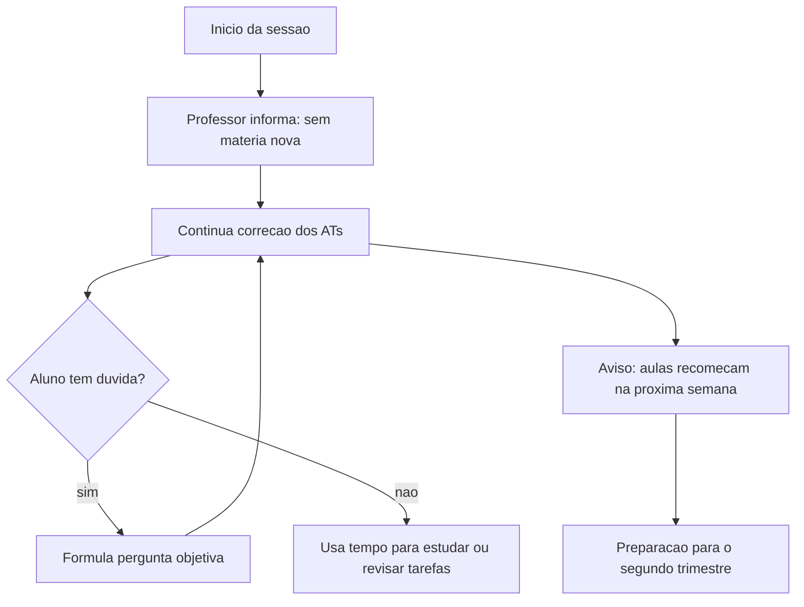

## Visão Geral do Conceito

A aula 21 foi uma sessão de monitoria e correção. Logo no início, o professor afirma que não passaria matéria nova e que ficaria focado em continuar a correção dos <mark style="background-color: #242424; padding: 2px 4px; border-radius: 3px; color: inherit;">`ATs`</mark>.

O conteúdo técnico registrado na transcrição é mínimo. Há saudações, períodos longos sem fala, reforço de que dúvidas poderiam ser feitas, uma explicação de que as aulas da disciplina recomeçariam na semana seguinte e a indicação de entrada no segundo trimestre do bloco.

> **Lacuna declarada:** a fonte não traz consulta <mark style="background-color: #242424; padding: 2px 4px; border-radius: 3px; color: inherit;">`SQL`</mark>, configuração de <mark style="background-color: #242424; padding: 2px 4px; border-radius: 3px; color: inherit;">`Looker Studio`</mark>, modelo de dados ou demonstração técnica. Esta lição, portanto, ensina como tratar uma monitoria de correção como checkpoint de trabalho, não como aula conceitual nova.

## Modelo Mental

Uma monitoria de correção funciona como uma sala de plantão. O professor mantém o foco na avaliação, mas deixa um canal aberto para dúvidas pontuais.

Para o estudante, o valor da sessão não está em copiar conteúdo novo. Está em organizar pendências, formular perguntas objetivas e se preparar para o próximo ciclo da disciplina.



## Mecânica Central

Esta aula tem uma mecânica diferente de uma aula técnica:

- O professor declara explicitamente que não haverá matéria nova.
- A atividade principal é a continuidade da correção dos ATs.
- Estudantes são autorizados a perguntar, mas a sessão não se organiza em exposição de conteúdo.
- A transcrição registra longos intervalos sem explicação técnica.
- Um estudante pergunta sobre a semana; a resposta indica que as aulas da disciplina recomeçariam na semana seguinte, já no segundo trimestre.
- Ao final, o professor reforça que a aula já havia acabado e que estava corrigindo o AT.

Em termos de pipeline de estudo, isso significa que a aula 21 deve ser tratada como checkpoint de fechamento, não como fonte para novos comandos, gráficos ou consultas.

## Uso Prático

Use uma monitoria desse tipo para criar um registro de acompanhamento. O objetivo é sair com clareza sobre o estado do seu AT e sobre o que precisa ser revisado antes do próximo trimestre.

```markdown
# Registro de monitoria do AT

## Estado atual
- AT entregue? TODO
- Pendencias percebidas pelo grupo: TODO
- Duvidas que ainda precisam de resposta: TODO

## Perguntas para monitoria
1. TODO: escrever pergunta objetiva
2. TODO: escrever pergunta objetiva

## Transicao de trimestre
- O que revisar antes da proxima semana: TODO
- O que ficou sem cobertura tecnica nesta sessao: TODO
```

Esse registro evita um erro comum: transformar silêncio de monitoria em sensação de "não há nada a fazer". Mesmo quando não há conteúdo novo, ainda existe trabalho de revisão, organização e preparação.

## Erros Comuns

- **Inventar conteúdo técnico não presente na fonte:** a transcrição não ensina comandos de <mark style="background-color: #242424; padding: 2px 4px; border-radius: 3px; color: inherit;">`SQL`</mark> nem passos de Looker nesta sessão.
- **Confundir monitoria com aula expositiva:** o professor estava disponível para dúvidas, mas o foco era corrigir ATs.
- **Perder a chance de perguntar:** se a dúvida existe, ela precisa ser formulada de forma curta e verificável.
- **Não registrar pendências:** sem registro, o estudante chega ao próximo trimestre sem saber o que revisar.
- **Assumir que a semana sem matéria nova encerra o estudo:** a fonte indica continuidade na semana seguinte.

## Visão Geral de Debugging

Quando uma transcrição de aula parece "vazia", depure a fonte antes de produzir material:

1. **Confirme a intenção da sessão:** há afirmação explícita de "não vou passar matéria".
2. **Procure trechos técnicos reais:** nesta fonte, eles não aparecem.
3. **Separe administrativo de conceitual:** correção de AT e calendário são contexto, não conteúdo de SQL.
4. **Declare lacunas:** registre que não há demonstração técnica em vez de preencher com suposições.
5. **Transforme o que existe em prática útil:** organização de dúvidas, pendências e preparação para o próximo trimestre.

Para o estudante, o debugging equivalente é revisar o próprio AT: se algo não está claro, escreva a dúvida em uma frase, indique onde está o problema e leve para a monitoria.

## Principais Pontos

- A aula 21 não apresentou matéria nova.
- O professor usou a sessão para continuar a correção dos ATs.
- Havia abertura para dúvidas pontuais.
- As aulas da disciplina recomeçariam na semana seguinte.
- A entrada no segundo trimestre foi mencionada como próximo ciclo.
- Não há base na fonte para ensinar novo SQL ou novo Looker nesta aula.

## Preparação para Prática

Antes de seguir para a próxima aula técnica, prepare:

- uma lista curta de dúvidas pendentes do AT;
- um registro do que já foi entregue;
- um checklist do que precisa ser revisado;
- uma anotação explícita de lacunas da aula 21 para não confundir ausência de conteúdo com conteúdo implícito.

## Laboratório de Prática

### Easy — Registro de status do AT

Preencha um registro simples do estado do seu trabalho.

```markdown
# Status do AT

## Entrega
- [ ] TODO: confirmar se o AT foi entregue
- [ ] TODO: registrar data ou evidencia da entrega

## Revisao
- [ ] TODO: listar uma parte do AT que precisa ser conferida
- [ ] TODO: listar uma duvida objetiva para monitoria

## Proximo passo
- TODO: definir uma acao antes da proxima semana
```

Critérios:

- Registrar status sem criar conteúdo técnico novo.
- Escrever pelo menos uma dúvida em formato verificável.
- Definir uma ação concreta.

### Medium — Pergunta objetiva de monitoria

Transforme uma dúvida vaga em pergunta útil para uma sessão de correção.

```markdown
# Pergunta de monitoria

## Duvida vaga
TODO: escrever a duvida como ela apareceu inicialmente

## Contexto
TODO: indicar pagina, grafico, fonte ou etapa do AT relacionada

## Pergunta objetiva
TODO: escrever uma pergunta que possa ser respondida em ate 2 minutos

## Evidencia
TODO: indicar print, trecho, valor ou item do enunciado que justifica a pergunta
```

Critérios:

- A pergunta precisa caber em uma fala curta.
- O contexto deve apontar onde o problema aparece.
- Não misturar várias dúvidas em uma pergunta só.

### Hard — Plano de transição para o segundo trimestre

Monte um plano de fechamento do primeiro trimestre e preparação para o próximo ciclo.

```markdown
# Plano de transicao

## Fechamento do AT
- Pendencia 1: TODO
- Pendencia 2: TODO

## Revisao da disciplina
- Conceito a revisar: TODO
- Aula ou material relacionado: TODO

## Lacunas desta sessao
- Conteudo tecnico nao coberto: TODO
- Como evitar inferencia indevida: TODO

## Preparacao para proxima semana
- Acao 1: TODO
- Acao 2: TODO
```

Critérios:

- Separar pendência do AT de revisão da disciplina.
- Declarar explicitamente que esta sessão não trouxe novo conteúdo técnico.
- Definir preparação para a próxima semana.

<!-- CONCEPT_EXTRACTION
concepts:
  - monitoria AT
  - correção do AT
  - triagem de dúvidas
  - segundo trimestre
  - registro de pendências
  - lacuna técnica declarada
skills:
  - Registrar pendências de entrega
  - Formular perguntas objetivas de monitoria
  - Diferenciar contexto administrativo de conteúdo técnico
  - Declarar lacunas de fonte
  - Planejar transição de trimestre
examples:
  - registro-status-at
  - pergunta-objetiva-monitoria
  - plano-transicao-segundo-trimestre
-->

<!-- EXERCISES_JSON
[
  {
    "id": "monitoria-correcao-at-transicao-segundo-trimestre-status-at",
    "slug": "monitoria-correcao-at-transicao-segundo-trimestre-status-at",
    "difficulty": "easy",
    "title": "Registro de status do AT",
    "discipline": "visualizacao-sql",
    "editorLanguage": "markdown",
    "tags": [
      "at",
      "monitoria",
      "organizacao"
    ],
    "summary": "Preencher um registro simples de entrega, revisão e próximo passo do AT."
  },
  {
    "id": "monitoria-correcao-at-transicao-segundo-trimestre-pergunta-monitoria",
    "slug": "monitoria-correcao-at-transicao-segundo-trimestre-pergunta-monitoria",
    "difficulty": "medium",
    "title": "Pergunta objetiva de monitoria",
    "discipline": "visualizacao-sql",
    "editorLanguage": "markdown",
    "tags": [
      "monitoria",
      "duvidas",
      "at"
    ],
    "summary": "Transformar uma dúvida vaga sobre o AT em pergunta objetiva para monitoria."
  },
  {
    "id": "monitoria-correcao-at-transicao-segundo-trimestre-plano-transicao",
    "slug": "monitoria-correcao-at-transicao-segundo-trimestre-plano-transicao",
    "difficulty": "hard",
    "title": "Plano de transição para o segundo trimestre",
    "discipline": "visualizacao-sql",
    "editorLanguage": "markdown",
    "tags": [
      "planejamento",
      "segundo-trimestre",
      "lacunas"
    ],
    "summary": "Criar plano de fechamento do AT, declaração de lacunas e preparação para a próxima semana."
  }
]
-->

<!-- INTEGRATION_METADATA
discipline: visualizacao-sql
slug: monitoria-correcao-at-transicao-segundo-trimestre
title: Monitoria: correção do AT e transição para o segundo trimestre
order: 21
file: visualizacao-sql/aula-21-monitoria-correcao-at-transicao-segundo-trimestre.md
search_excerpt: Monitoria de correção dos ATs sem matéria nova, com triagem de dúvidas, registro de pendências e preparação para o segundo trimestre.
-->

<!-- SOURCE_CONTEXT
source: downloads/Introducao_a_Visualizacao_de_Dados_e_SQL/Aula_21_-_09042026.vtt
source_sha256: 6f2120c5988c9255c699f98f68bda093e3b608dea9cfd3be986ddc0d23e0b3b9
source: downloads/Introducao_a_Visualizacao_de_Dados_e_SQL/Aula_21_-_09042026.md
source_sha256: ea9618312fceeaf6d7d926dd59c860f6569685a61a88493c0169ebf0330b583b
context_justification: Wrapper usado apenas para metadados da sessão; conteúdo pedagógico limitado ao que a transcrição registra sobre monitoria, correção dos ATs e início do segundo trimestre.
notes:
  - Sessão com longos intervalos sem fala e sem demonstração técnica.
  - Não há base textual para acrescentar novo conteúdo de SQL ou Looker nesta aula.
-->
